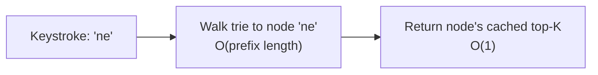
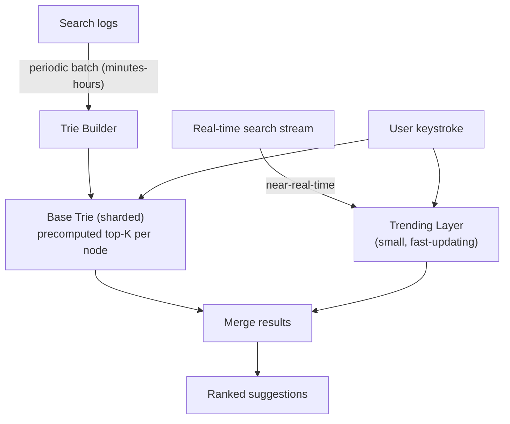

# Design Search Autocomplete / Typeahead

> [!abstract] How to read this chapter
> Built phase by phase around one precise insight — the performance unlock is **precomputing top-K per trie node**, not the trie itself — which is the same "shift cost to the less time-sensitive operation" principle as News Feed's fan-out-on-write. Each phase adds one idea, exposes the next bottleneck, and fixes it.

> [!question] The interview question
> "Design a search autocomplete system — as a user types into a search box, show ranked suggestions in real time."

---

## Requirements

**Functional**
- Given a partial query **prefix**, return top-K ranked suggestions quickly.
- Rank by **popularity/relevance**, not alphabetically.
- Reflect **emerging trends**, not just historical popularity.

**Non-functional**

| Requirement | Why it matters here specifically |
|---|---|
| **Extremely low latency** | Must feel instant while typing — sub-100ms, arguably the tightest latency bar in this book. |
| **Very high QPS** | Every keystroke can trigger a request — a 3–5× multiple of completed-search volume. |
| **Fast trend surfacing** | A breaking-news related search shouldn't take hours to appear. |

---

## Phase 00 — Capacity math you can defend

| Quantity | Derivation | Result |
|---|---|---|
| Searches/day | global | ~1B/day |
| Autocomplete requests | ~3–5× per keystroke (post-debounce) | several billion/day → tens of thousands QPS sustained |

> [!example] In plain words
> An extremely high-throughput, latency-critical **read** path — the tightest latency requirement of any case study here. Every design choice must make the read cheap; anything expensive gets pushed off the read path.

---

## Phase 01 — The naive version: `LIKE 'prefix%'`

*Start with the SQL prefix-match so its cost names the fix.*

For each typed prefix, query a DB with `WHERE term LIKE 'prefix%'` against a table of historical search terms. Breaks: even indexed, a prefix-match at this QPS and latency bar is too slow, and it doesn't inherently return **ranked** top results without extra per-request sorting.

| 🔴 Bottleneck | 🟢 Next fix |
|---|---|
| A per-keystroke DB prefix scan + sort can't hit sub-100ms at tens of thousands of QPS. | A trie with precomputed top-K per node (Phase 2). |

> [!example] Layman
> Re-alphabetizing and re-ranking a dictionary from scratch every time someone types a letter. Instead, pre-write the best three completions on a sticky note attached to each partial word.

---

## Phase 02 — Trie with precomputed top-K per node

*Reach the prefix in `O(prefix length)`, then return an already-ready list in `O(1)`.*

Each node represents one character; a path from root spells out a prefix. Critically, each node **caches its own top-K most popular completions**, computed ahead of time — a lookup walks to the node, then returns the ready list instantly.

> [!tip] The actual performance unlock — say this precisely
> It's not "a trie is fast" — a trie alone still needs to find the best completions under a prefix, which naively means examining every completion beneath that node. The real unlock is **precomputing and caching top-K per node ahead of time**, moving the expensive ranking **off the read path** onto a periodic offline job. This is the exact principle as [[HLD/06 - Design Twitter - News Feed/Design Twitter - News Feed|News Feed's fan-out-on-write]] — make the frequent, latency-critical operation cheap by shifting cost onto the rarer, less time-sensitive one — reapplied to a different problem.

**Trie construction is a periodic offline job**, not real-time — search logs are aggregated every few minutes to hours and the per-node top-K lists rebuilt or incrementally updated. This introduces a deliberate, accepted **staleness window** — a brand-new trending term takes minutes to propagate.

| 🔴 Bottleneck | 🟢 Next fix |
|---|---|
| A full trie over billions of queries is enormous for one machine, and the staleness window misses breaking news. | Memory footprint, sharding, and a trending layer (Phase 3). |

---

## Phase 03 — Deep dive: memory, sharding, and closing the staleness gap

**Memory footprint at scale.** A full trie over billions of distinct queries can be enormous. Mitigations: **prune** rarely-searched terms below a minimum frequency threshold, and **shard the trie** (by first character or first few characters) across servers — no single machine holds the whole vocabulary.

**Real-time trending spikes.** A purely periodic-rebuild trie misses breaking news for the whole staleness window. The fix: a **separate, small, fast-updating "trending" layer** (a lightweight near-real-time structure updated via a stream processor) **merged with the base trie's suggestions at query time.** Fresh signal without updating the entire massive trie in real time — a hybrid, not all-or-nothing.

| 🔴 Bottleneck | 🟢 Next fix |
|---|---|
| Individual pieces handled — assemble the query path. | Final architecture (Phase 4). |

---

## Phase 04 — The final combined architecture

The query path merges the periodically-rebuilt **base trie** (sharded, precomputed top-K per node) with the **near-real-time trending layer** at request time, both under a sub-100ms budget — the diagram above *is* the final architecture.

**Four principles to close with:**
1. The unlock is precomputed top-K per node, not the trie — expensive ranking lives on an offline job, not the read path.
2. Same principle as fan-out-on-write: make the frequent operation cheap by pushing cost to the rare one.
3. Prune low-frequency terms and shard the trie by prefix — no one machine holds the whole vocabulary.
4. A small fast-updating trending layer merged at query time closes the staleness gap without real-time-updating the whole trie.

---

## Interviewer follow-ups, answered

> [!quote]- "Keep suggestions fresh without constantly rebuilding the whole trie?"
> The trending-layer hybrid — a small, fast-updating structure merged with the base trie at query time, rather than updating the entire trie in real time.

> [!quote]- "Personalize suggestions per user?"
> Blend the global popularity ranking with the user's own recent search history as an additional ranking signal on top of the base suggestion set — a real feature, beyond core scope but a natural extension.

> [!quote]- "Trie too large for one machine's memory?"
> Shard by prefix (first character or first few characters) across servers.

> [!quote]- "Prevent offensive or inappropriate suggestions?"
> A genuine production concern — autocomplete can surface harmful content pulled from raw search logs. A blocklist filter at trie-construction or query time is the standard mitigation, not something to leave unaddressed.

---

## Production experience

> [!info] What to monitor
> **Autocomplete latency percentiles** specifically — more critical here than almost any other case study, since latency *is* the product. Trie rebuild duration/freshness (how stale is the serving trie right now). Suggestion click-through rate — a product-quality signal on ranking effectiveness, not just system health. Trending-layer update lag.

---

## Cheat sheet — if you remember nothing else

1. The unlock is precomputed top-K per trie node — not the trie itself — moving ranking off the read path.
2. Same idea as fan-out-on-write: shift cost from the frequent read to a rare offline rebuild.
3. Read = walk to node `O(prefix)` then return cached list `O(1)`; build = periodic offline job with an accepted staleness window.
4. Prune low-frequency terms, shard the trie by prefix; sub-100ms is the whole game.
5. Merge a small near-real-time trending layer at query time to surface breaking trends; blocklist-filter offensive suggestions.

---
*Related: [[00 - Start Here/How This Handbook Works|Book Map]] · [[HLD/06 - Design Twitter - News Feed/Design Twitter - News Feed|Design Twitter / News Feed]]*
