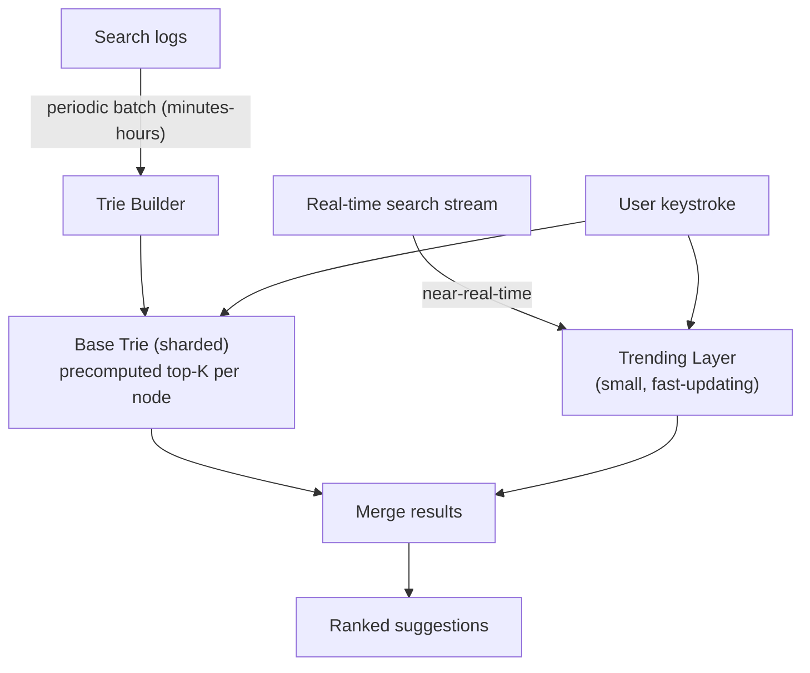

# Design Search Autocomplete / Typeahead

> [!abstract] What you'll be able to do after this chapter
> Explain precisely why precomputing top-K per trie node is the actual performance unlock (not the trie itself), and recognize this as the same "shift cost to the less time-sensitive operation" principle already seen in the News Feed chapter's fan-out-on-write.

---

## Step 1 — The interview question

> [!question] As an interviewer would ask it
> "Design a search autocomplete system — as a user types into a search box, show ranked suggestions in real time."

## Step 2 — Requirements

**Functional:** given a partial query prefix, return top-K ranked suggestions quickly. Rank by popularity/relevance, not alphabetically. Reflect emerging trends, not just historical popularity.

**Non-functional:** **extremely low latency** — must feel instant while typing, typically sub-100ms. Very high QPS — every keystroke can trigger a request. Suggestions should surface **recent trends** quickly (a breaking news event's related searches shouldn't take hours to appear).

## Step 3 — Back-of-envelope estimation

Assume 1B searches/day globally. Autocomplete fires roughly once per keystroke while typing (even with client-side debouncing reducing this somewhat, autocomplete request volume is still a large multiple — commonly 3-5x — of actual completed-search volume) → **several billion autocomplete requests/day**, tens of thousands of QPS sustained — an extremely high-throughput, latency-critical read path, arguably the tightest latency requirement of any case study in this book.

## Step 4 — Building it incrementally

**v0 — naive.** For each typed prefix, query a database with `WHERE term LIKE 'prefix%'` against a table of historical search terms. Breaks: even indexed, a prefix-match query at this QPS and this latency bar is too slow, and doesn't inherently return **ranked** top results without extra per-request sorting work.

**Fix — a Trie (prefix tree) with precomputed top-K per node.** Each node represents one character; a path from root to node spells out a prefix. Critically, each node **caches its own top-K most popular completions**, computed ahead of time — a lookup is `O(prefix length)` to reach the node, then `O(1)` to return the already-ready list.

> [!tip] The actual performance unlock — say this precisely
> It's not really "a trie is fast" — a trie alone still needs to find the best completions under a given prefix, which naively means examining every completion beneath that node. The real unlock is **precomputing and caching top-K per node ahead of time**, moving the expensive ranking work **off the read path entirely** and onto a periodic offline job. This is the exact same principle as [[HLD/06 - Design Twitter - News Feed/Design Twitter - News Feed|the News Feed chapter's fan-out-on-write]] — make the frequent, latency-critical operation (reading) cheap by shifting cost onto the rarer, less time-sensitive one (a periodic background rebuild) — the same idea, reapplied to a completely different problem.

**Trie construction is a periodic offline job**, not real-time — search logs are aggregated every few minutes to hours, and the trie's per-node top-K lists are rebuilt or incrementally updated from that aggregate. This introduces a deliberate, accepted **staleness window** — a brand-new trending term takes some minutes to propagate into suggestions.

---

## Step 5 — Deep dive: memory footprint, sharding, and closing the staleness gap

### Memory footprint at scale

A full trie over billions of distinct historical queries can be enormous. Mitigations: **prune** rarely-searched terms below a minimum frequency threshold, and **shard the trie itself** (e.g. by first character or first few characters) across multiple servers — no single machine's memory holds a trie for a truly massive query vocabulary.

### Handling real-time trending spikes

A purely periodic-rebuild trie misses breaking news for the entire staleness window. The practical fix: a **separate, small, fast-updating "trending" layer** — a lightweight, near-real-time structure (e.g. updated via a stream processor) — **merged with the base trie's suggestions at query time**. This gives fresh signal without needing the entire massive trie to update in real time — a hybrid, not an all-or-nothing choice.

---

## Step 6 — Full architecture

*(See the Step 5 diagram — the query path merges the periodically-rebuilt base trie with the near-real-time trending layer at request time, both served with sub-100ms latency requirements.)*

---

## Step 7 — Interviewer follow-ups, answered

> [!quote]- "How do you keep suggestions fresh without constantly rebuilding the whole trie?"
> The trending-layer hybrid from Step 5 — a small, fast-updating structure merged with the base trie at query time, rather than needing the entire trie to update in real time.

> [!quote]- "How would you personalize suggestions per user?"
> Blend the global popularity ranking with the user's own recent search history as an additional ranking signal on top of the base suggestion set — a real product feature, beyond this chapter's core scope but worth naming as a natural extension.

> [!quote]- "How do you handle a trie too large for one machine's memory?"
> Shard by prefix (e.g. first character or first few characters) across multiple servers — covered in Step 5.

> [!quote]- "How do you prevent offensive or inappropriate autocomplete suggestions?"
> A genuine, real production concern — autocomplete can inadvertently surface embarrassing or harmful content pulled directly from raw search logs. A blocklist filter applied at either trie-construction time or query time is the standard mitigation, not something to leave unaddressed.

## Step 8 — Production experience

> [!info] What to monitor
> **Autocomplete latency percentiles** specifically — arguably more critical here than in almost any other case study, since latency *is* the product. Trie rebuild job duration/freshness (how stale is the currently-serving trie right now). Suggestion click-through rate — a product-quality signal revealing ranking effectiveness, not just system health. Trending-layer update lag.

---
*Related: [[00 - Start Here/How This Handbook Works|Book Map]] · [[HLD/06 - Design Twitter - News Feed/Design Twitter - News Feed|Design Twitter / News Feed]]*
