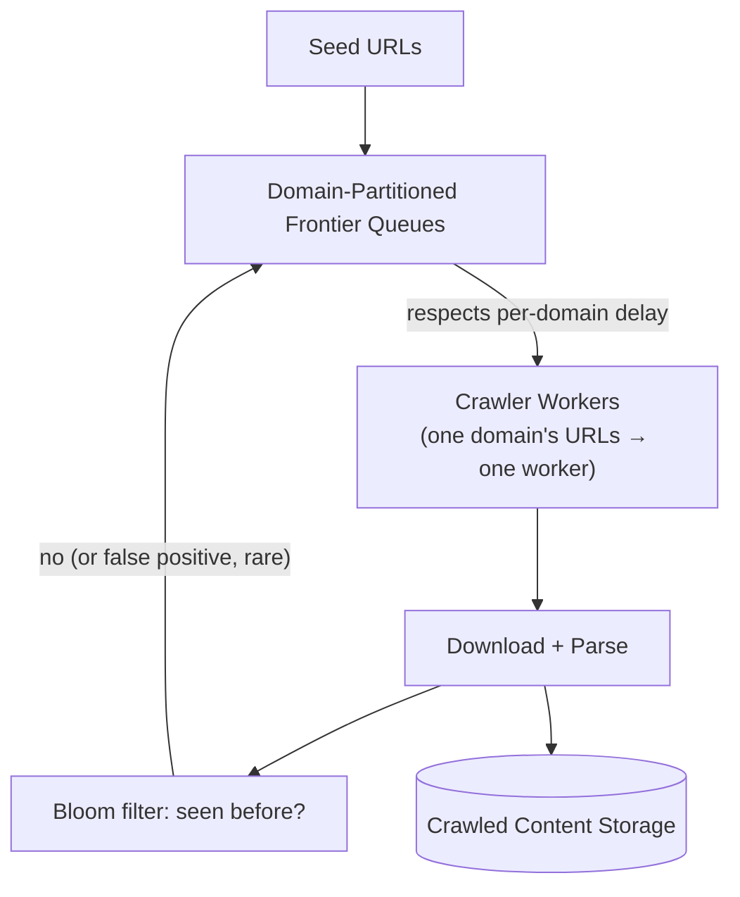

# Design a Web Crawler

> [!abstract] What you'll be able to do after this chapter
> Explain how partitioning crawl work by domain solves scaling AND politeness as one mechanism (not two), and use a Bloom filter's false-positive tradeoff correctly at billion-URL scale.

---

## Step 1 — The interview question

> [!question] As an interviewer would ask it
> "Design a web crawler that discovers and downloads pages at scale, avoiding duplicate crawling and respecting site politeness."

## Step 2 — Requirements

**Functional:** from seed URLs, discover linked pages, download content, extract new URLs, avoid re-crawling. **Non-functional:** billions of pages. **Politeness** — never overwhelm any single domain with concurrent requests. Avoid infinite crawler traps. Prioritize important/fresh pages. Fully distributed.

## Step 3 — Back-of-envelope estimation

Assume 1B pages, ~100KB average HTML → **~100TB** per full crawl pass. QPS framing matters here: aggregate throughput across many parallel workers is a lower bound — the **real constraint is per-domain politeness**, not raw aggregate QPS.

## Step 4 — Building it incrementally

**v0 — naive.** Single-threaded download → parse links → enqueue → repeat. Breaks: no dedup means the same URL enters the queue repeatedly from multiple linking pages, and a **crawler trap** (a page dynamically generating infinite unique URLs — a calendar's endless "next month" links) can loop the crawler forever on one low-value site.

**Fix — dedup via [[Glossary/Bloom Filter|Bloom filter]].** At billion-URL scale, an exact in-memory seen-set doesn't fit on one machine. A Bloom filter answers "have we possibly seen this?" cheaply — no false negatives (never re-crawl-skips a genuinely new URL), an acceptable, bounded false-positive rate (rarely, incorrectly skips a URL that was actually new) traded for massive space savings over an exact set.

**Politeness → per-domain queues, not one flat global queue.** A minimum delay between requests to the same domain (respecting `robots.txt` crawl-delay directives) requires domain-aware scheduling as a first-class architectural concern.

**Prioritization** — not every page deserves equal crawl frequency. A priority queue (or tiered queues) ranks URLs by estimated importance, so high-value pages get crawled sooner and more often than low-value ones.

---

## Step 5 — Deep dive: domain partitioning solves two problems at once

> [!tip] The single cleverest architectural decision in this chapter
> Partition crawl work across worker machines **by domain hash** — every URL from a given domain always routes to the same worker. This solves **scaling** (distributing load across many machines) **and politeness** (naturally rate-limiting one domain's requests, since they all funnel through one worker) as **one mechanism**, without needing any cross-worker coordination for per-domain rate limits at all.

**Crawler trap mitigation** is a combination of heuristics, not one fix: cap max URLs crawled per domain per time period, cap max crawl depth from a seed, detect suspiciously repetitive URL patterns (ever-growing query strings).

**Duplicate *content*, not just duplicate URLs** — a distinct problem from URL dedup: the same article mirrored at different URLs. Solved via content-hash-based similarity detection (hash a page's main text, check against previously-seen content hashes) — structurally the same idea as [[HLD/08 - Design Google Drive - Dropbox/Design Google Drive - Dropbox|Google Drive's chunk-hashing dedup]], applied here to page content instead of file chunks.

## Step 6 — Full architecture

---

## Step 7 — Interviewer follow-ups, answered

> [!quote]- "How do you avoid crawling the same URL twice at this scale?"
> A Bloom filter check before enqueueing — cheap, space-efficient, no false negatives.

> [!quote]- "How do you avoid overwhelming a single small website?"
> Domain-partitioned queues with per-domain minimum delay, enforced naturally by the domain-to-worker partitioning itself.

> [!quote]- "How do you handle crawler traps?"
> A combination: max depth from seed, max URLs per domain per period, and pattern detection on suspiciously repetitive URL structures.

## Step 8 — Production experience

> [!info] What to monitor
> Crawl rate per domain (confirming politeness limits are actually respected). Bloom filter false-positive rate **drift** — it rises as the filter fills, potentially requiring periodic resizing/rotation. Frontier queue depth per domain (an unusually deep backlog signals either a high-value site or an undetected crawler trap).

---
*Related: [[00 - Start Here/How This Handbook Works|Book Map]] · [[Glossary/Bloom Filter|Bloom Filter]] · [[HLD/08 - Design Google Drive - Dropbox/Design Google Drive - Dropbox|Design Google Drive / Dropbox]]*
