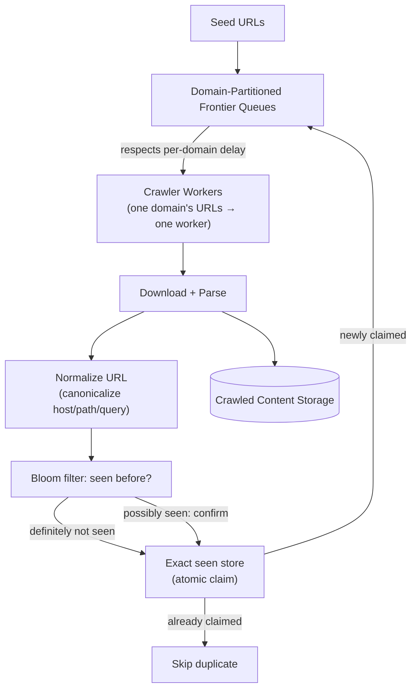

# Design a Web Crawler

> [!abstract] How to read this chapter
> Built phase by phase around one clever move — partitioning crawl work by domain solves scaling *and* politeness as one mechanism — plus using a Bloom filter's false-positive tradeoff correctly at billion-URL scale. Each phase adds one idea, exposes the next bottleneck, and fixes it.

> [!question] The interview question
> "Design a web crawler that discovers and downloads pages at scale, avoiding duplicate crawling and respecting site politeness."

---

## Requirements

**Functional**
- From **seed URLs**, discover linked pages.
- Download content, extract new URLs.
- **Avoid re-crawling** the same URL.

**Non-functional**

| Requirement | Why it matters here specifically |
|---|---|
| **Billions of pages** | An exact in-memory seen-set doesn't fit one machine — forces probabilistic dedup. |
| **Politeness** | Never overwhelm a single domain with concurrent requests — the *real* constraint, not aggregate QPS. |
| **Avoid crawler traps** | A page generating infinite unique URLs can loop the crawler forever on one low-value site. |
| **Prioritize + fully distributed** | Important/fresh pages first; work spread across many machines. |

---

## Phase 00 — Capacity math you can defend

| Quantity | Derivation | Result |
|---|---|---|
| Storage/pass | 1B pages × ~100 KB | ~100 TB per full crawl |
| The real constraint | per-domain politeness, not aggregate QPS | domain-aware scheduling is first-class |

> [!example] In plain words
> Aggregate throughput across many parallel workers is a lower bound — easy. The genuine constraint is **per-domain politeness**: you can crawl a million pages/sec across the web but only a handful/sec from any one site. The whole architecture is built around that.

---

## Phase 01 — The naive single-threaded loop

*Start with download → parse → enqueue → repeat so its failures name the fixes.*

Breaks two ways:
- **No dedup** — the same URL enters the queue repeatedly from every page that links it.
- **Crawler traps** — a page dynamically generating infinite unique URLs (a calendar's endless "next month") loops the crawler forever on one low-value site.

| 🔴 Bottleneck | 🟢 Next fix |
|---|---|
| Re-crawls the same URLs endlessly, and one trap can consume the whole crawler; single-threaded can't touch billions of pages. | Probabilistic dedup + distributed, domain-aware scheduling (Phase 2). |

---

## Phase 02 — Dedup via Bloom filter + per-domain queues

*At billion-URL scale, an exact seen-set won't fit — trade a bounded false-positive rate for massive space savings.*

A [[Glossary/Bloom Filter|Bloom filter]] answers "have we possibly seen this?" cheaply — **no false negatives** (never re-crawl-skips a genuinely new URL — wait, read the semantics carefully below), an acceptable bounded **false-positive** rate (rarely, incorrectly skips a URL that was actually new) traded for massive space savings over an exact set.

> [!tip] Bloom filter semantics in one sentence
> A Bloom filter may say "possibly seen" for a genuinely new URL, so it can cause a false-positive **skip** — it must never be the final authority when missing a page is unacceptable. Use an **exact store for the ambiguous case**, and rotate or resize the filter as it fills.

**Politeness → per-domain queues, not one flat global queue.** A minimum delay between requests to the same domain (respecting `robots.txt` crawl-delay) requires domain-aware scheduling as a first-class architectural concern.

| 🔴 Bottleneck | 🟢 Next fix |
|---|---|
| Per-domain rate limits across many workers would need cross-worker coordination — expensive — and traps still need bounding. | Partition by domain to solve scaling + politeness together (Phase 3). |

---

## Phase 03 — Deep dive: domain partitioning solves two problems at once

> [!tip] The single cleverest architectural decision here
> Partition crawl work across worker machines **by domain hash** — every URL from a given domain always routes to the same worker. This solves **scaling** (load spread across machines) *and* **politeness** (naturally rate-limiting one domain, since all its requests funnel through one worker) as **one mechanism**, with zero cross-worker coordination for per-domain rate limits.

**Crawler-trap mitigation** is a combination of heuristics, not one fix: cap max URLs per domain per period, cap max crawl depth from a seed, detect suspiciously repetitive URL patterns (ever-growing query strings).

**Duplicate *content*, not just URLs** — a distinct problem: the same article mirrored at different URLs. Solved via content-hash similarity (hash a page's main text, check against previously-seen hashes) — structurally the same idea as [[HLD/08 - Design Google Drive - Dropbox/Design Google Drive - Dropbox|Google Drive's chunk-hashing dedup]], applied to page content.

**Prioritization** — not every page deserves equal crawl frequency. A priority queue (or tiered queues) ranks URLs by estimated importance, so high-value pages get crawled sooner and more often.

| 🔴 Bottleneck | 🟢 Next fix |
|---|---|
| Individual pieces handled — assemble the frontier picture. | Final architecture (Phase 4). |

---

## Phase 04 — The final combined architecture

**Four principles to close with:**
1. Per-domain politeness, not aggregate QPS, is the real constraint — build scheduling around it.
2. Partition by domain hash: one mechanism gives both distribution *and* per-domain rate limiting, no coordination.
3. Bloom filter for cheap probabilistic dedup, exact store for the ambiguous case; rotate/resize as it fills.
4. Traps need layered heuristics (depth cap, per-domain cap, pattern detection); dedup content by hash, not just URLs.

---

## Interviewer follow-ups, answered

> [!quote]- "Avoid crawling the same URL twice at this scale?"
> A Bloom filter check before enqueueing — cheap, space-efficient, no false negatives; an exact store confirms the ambiguous "possibly seen" case.

> [!quote]- "Avoid overwhelming a single small website?"
> Domain-partitioned queues with per-domain minimum delay, enforced naturally by the domain-to-worker partitioning itself.

> [!quote]- "Handle crawler traps?"
> A combination: max depth from seed, max URLs per domain per period, and pattern detection on suspiciously repetitive URL structures.

> [!quote]- "Detect the same article mirrored at different URLs?"
> Content-hash similarity — hash the page's main text and compare against previously-seen hashes, the same chunk-hashing idea as Google Drive's dedup, applied to page content.

---

## Production experience

> [!info] What to monitor
> Crawl rate per domain (confirming politeness limits are actually respected). Bloom filter false-positive rate **drift** — it rises as the filter fills, requiring periodic resize/rotation. Frontier queue depth per domain (an unusually deep backlog signals either a high-value site or an undetected crawler trap).

---

## Cheat sheet — if you remember nothing else

1. Per-domain politeness is the real constraint — aggregate QPS is easy, hammering one site is the failure.
2. Partition by domain hash — scaling and per-domain rate limiting fall out of one mechanism, no cross-worker coordination.
3. Bloom filter for cheap dedup (bounded false-positive skips), exact store for ambiguous cases, rotate as it fills.
4. Traps → depth cap + per-domain cap + repetitive-pattern detection; dedup mirrored content by text hash.
5. Prioritize by estimated importance so valuable/fresh pages crawl sooner and more often.

---
*Related: [[00 - Start Here/How This Handbook Works|Book Map]] · [[Glossary/Bloom Filter|Bloom Filter]] · [[HLD/08 - Design Google Drive - Dropbox/Design Google Drive - Dropbox|Design Google Drive / Dropbox]]*
