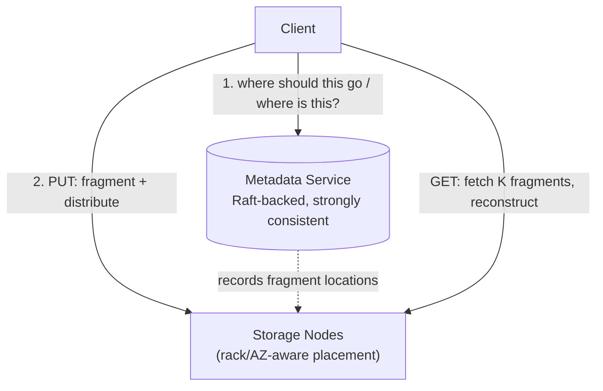

# Design Distributed File Storage (S3/GFS-style)

> [!abstract] What you'll be able to do after this chapter
> Reason quantitatively about durability (not just "we replicate it"), explain erasure coding as a real storage-cost tradeoff against replication, and explain why the metadata service deliberately uses different consistency machinery than the bulk data layer.

---

## Step 1 — The interview question

> [!question] As an interviewer would ask it
> "Design a distributed object/file storage system like S3 or GFS — store and retrieve objects reliably at massive scale, with extreme durability."

## Step 2 — Requirements

**Functional:** PUT, GET, DELETE, LIST objects. **Non-functional:** extreme durability (S3 advertises "11 nines" — data loss is essentially unacceptable). High availability. Objects from bytes to terabytes. Horizontal scalability. Cost efficiency.

## Step 3 — Back-of-envelope estimation — durability math, not just throughput

> [!info] The estimation exercise here is fundamentally different from most other chapters
> Instead of QPS/bandwidth, the key quantitative reasoning is: given a typical hard drive's annual failure rate (~1-2%), how much **redundancy** (replication factor, or erasure-coding parameters) is needed so the probability of losing **all** copies of a given piece of data in a year is astronomically small? This is a probability calculation, not a capacity-planning one — worth explicitly framing this way if the interviewer asks for "the math."

## Step 4 — Building it incrementally

**v0 — naive.** One copy, one disk. Breaks instantly — a single disk failure loses the data permanently, unacceptable for any real durability bar.

**Fix — replication across failure domains.** Store multiple copies (commonly 3x) spread across **independent failure domains** — different racks, different availability zones. Three copies all in the same rack still lose everything together if that rack loses power — the copies must be genuinely independent in their failure exposure, not just physically distinct disks.

**A better tradeoff for cost — erasure coding.** Instead of full replication (3x storage cost), split data into `K` data fragments + `M` parity fragments (Reed-Solomon codes are the standard real-world technique) such that **any `K` of the `K+M` total fragments** can reconstruct the original. A `10+4` scheme needs only **1.4x** storage overhead — far cheaper than 3x replication — while tolerating up to 4 simultaneous fragment losses.

> [!tip] The real tradeoff, stated precisely
> Erasure coding trades **lower storage cost** for **more expensive reconstruction** when fragments *are* lost (real computation is needed to rebuild data from surviving fragments, vs. replication's "just read another copy"). This is why hot, frequently-accessed data often favors full replication (fast reads, simple recovery), while cold/archival tiers (S3 Glacier-style) favor erasure coding for its dramatically lower steady-state storage cost.

## Step 5 — Deep dive: metadata durability is a *different* problem than bulk-data durability

The metadata service (tracking which physical nodes/fragments hold which object) is itself a smaller-scale distributed systems problem — and **losing metadata is just as bad as losing the data itself**: if you don't know *where* an object's fragments physically live, their safe existence on disk doesn't help you retrieve anything.

> [!bug] Why metadata deliberately uses different machinery than bulk data
> Bulk data is **huge in volume**, and different designs can tolerate eventual consistency for it. Metadata is **small in volume but needs strong consistency** — a query for "where is object X" must never return stale or conflicting answers. This is why metadata services typically run on a small, [[Glossary/Raft (Consensus)|Raft]]-backed strongly-consistent store, completely separate technology from whatever handles the actual petabyte-scale data placement — a deliberate architectural split for two sub-problems with genuinely different requirements, not an inconsistency in the design.

**Failure-domain-aware placement:** the placement algorithm must actively avoid putting multiple copies/fragments of the same object in the same rack/AZ — this requires topology awareness, not random distribution.

## Step 6 — Full architecture

---

## Step 7 — Interviewer follow-ups, answered

> [!quote]- "Why not just use simple replication instead of erasure coding?"
> Replication offers faster reads and simpler reconstruction (just read another full copy) — a real, genuine counter-tradeoff. Erasure coding wins on steady-state storage cost. Both are legitimate choices depending on access pattern and cost sensitivity, not one strictly better than the other.

> [!quote]- "How do you calculate the durability of a given scheme?"
> Compute the probability that *more* fragments/copies are simultaneously lost than the scheme tolerates, derived from individual disk annual failure rate and the replication/coding parameters — a real probability calculation, not a hand-wave.

> [!quote]- "What happens when a storage node fails?"
> A background **re-replication/healing** process reconstructs that node's fragments from surviving copies elsewhere and redistributes them to healthy nodes — a continuously-running system component, not a one-time reaction.

> [!quote]- "How do you ensure the metadata service itself doesn't become a single point of failure?"
> Raft-based replication for the metadata store itself — the same consensus mechanics covered generally elsewhere in this handbook, applied here specifically to protect the "where is everything" index.

## Step 8 — Production experience

> [!info] What to monitor
> Per-node disk health (predictive SMART monitoring, catching failures before they threaten durability). **Re-replication/healing queue depth** — a growing backlog after a node failure means *degraded* durability right now, a genuinely urgent metric. Storage cost efficiency by tier. Metadata service latency and availability, since every single operation depends on it.

---
*Related: [[00 - Start Here/How This Handbook Works|Book Map]] · [[Glossary/Raft (Consensus)|Raft]] · [[HLD/08 - Design Google Drive - Dropbox/Design Google Drive - Dropbox|Design Google Drive / Dropbox]]*
