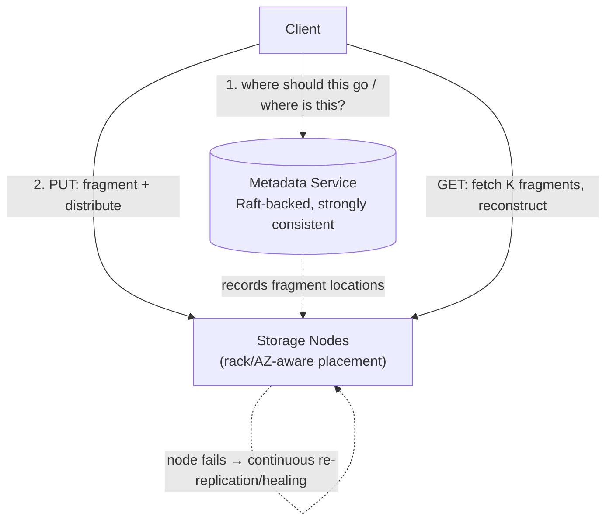

# Design Distributed File Storage (S3/GFS-style)

> [!abstract] How to read this chapter
> Built phase by phase around durability as *math* (not "we replicate it"), erasure coding as a real cost tradeoff against replication, and why the metadata service deliberately uses different consistency machinery than the bulk-data layer. Each phase adds one idea, exposes the next bottleneck, and fixes it.

> [!question] The interview question
> "Design a distributed object/file storage system like S3 or GFS — store and retrieve objects reliably at massive scale, with extreme durability."

---

## Requirements

**Functional**
- **PUT / GET / DELETE / LIST** objects.

**Non-functional**

| Requirement | Why it matters here specifically |
|---|---|
| **Extreme durability** | S3 advertises "11 nines" — data loss is essentially unacceptable, the defining requirement. |
| **High availability** | The store must serve even during node/rack/AZ failures. |
| **Objects from bytes to TBs** | One design spans tiny files and terabyte objects. |
| **Cost efficiency** | At petabyte-exabyte scale, the redundancy scheme's overhead *is* the cost. |

---

## Phase 00 — Capacity math: durability, not throughput

> [!info] The estimation here is fundamentally different
> Instead of QPS/bandwidth, the key reasoning is: given a drive's annual failure rate (~1–2%), how much **redundancy** (replication factor or erasure-coding parameters) makes the probability of losing **all** copies of a piece of data in a year astronomically small? A probability calculation, not capacity planning — frame it this way if asked for "the math."

For a simplified independent-failure illustration: if one copy has annual failure probability `p = 0.02`, three independent copies all failing in the same year is `p³ = 0.000008` — ~8 losses per million objects/year *before* repair. Real durability must also model correlated rack/AZ failures, latent corruption, repair time, bad disks, and continuous healing — which is why **placement across failure domains and fast repair matter as much as replication factor.**

---

## Phase 01 — The naive version: one copy, one disk

*Start with a single copy so its fragility names the fix.*

One copy on one disk. Breaks instantly — a single disk failure loses the data permanently, unacceptable for any real durability bar.

| 🔴 Bottleneck | 🟢 Next fix |
|---|---|
| One disk = one failure from total data loss. | Replicate across independent failure domains (Phase 2). |

---

## Phase 02 — Replication across failure domains

*Multiple copies — but "independent" is the load-bearing word.*

Store multiple copies (commonly 3×) spread across **independent failure domains** — different racks, different availability zones.

> [!danger] "3 copies" isn't enough if they share a failure domain
> Three copies all in the same rack still lose everything if that rack loses power. The copies must be genuinely independent in their failure exposure, not just physically distinct disks — placement must be **failure-domain-aware**, not random.

| 🔴 Bottleneck | 🟢 Next fix |
|---|---|
| 3× replication triples storage cost — brutal at exabyte scale, especially for cold data. | Erasure coding for a better cost/durability tradeoff (Phase 3). |

---

## Phase 03 — Erasure coding: a cheaper durability tradeoff

*Get comparable durability at a fraction of the storage overhead.*

Instead of full replication (3× cost), split data into `K` data fragments + `M` parity fragments (Reed-Solomon is the standard) such that **any `K` of the `K+M` fragments** reconstruct the original. A `10+4` scheme needs only **1.4× storage** — far cheaper than 3× — while tolerating up to 4 simultaneous fragment losses.

> [!tip] The real tradeoff, stated precisely
> Erasure coding trades **lower storage cost** for **more expensive reconstruction** when fragments are lost (real computation to rebuild from survivors, vs replication's "just read another copy"). So hot, frequently-accessed data often favors full replication (fast reads, simple recovery), while cold/archival tiers (Glacier-style) favor erasure coding for its dramatically lower steady-state cost.

| 🔴 Bottleneck | 🟢 Next fix |
|---|---|
| Fragments are safe on disk, but "where does object X's fragments live?" is its own problem — and losing *that* answer loses the object. | Metadata durability, a different problem (Phase 4). |

---

## Phase 04 — Deep dive: metadata durability is a *different* problem

The metadata service (which physical nodes/fragments hold which object) is itself a smaller distributed-systems problem — and **losing metadata is as bad as losing data**: if you don't know *where* an object's fragments live, their safe existence on disk retrieves nothing.

> [!bug] Why metadata deliberately uses different machinery than bulk data
> Bulk data is **huge in volume** and can often tolerate eventual consistency. Metadata is **small in volume but needs strong consistency** — "where is object X" must never return stale or conflicting answers. So metadata typically runs on a small, [[Glossary/Raft (Consensus)|Raft]]-backed strongly-consistent store — completely separate technology from the petabyte-scale data-placement layer. A deliberate architectural split for two sub-problems with genuinely different requirements, not an inconsistency.

**Failure-domain-aware placement:** the placement algorithm actively avoids putting multiple copies/fragments of the same object in the same rack/AZ — requiring topology awareness, not random distribution.

| 🔴 Bottleneck | 🟢 Next fix |
|---|---|
| Individual pieces handled — assemble, and account for continuous healing. | Final architecture (Phase 5). |

---

## Phase 05 — The final combined architecture

When a node fails, a background **re-replication/healing** process reconstructs its fragments from surviving copies and redistributes them to healthy nodes — a continuously-running component, not a one-time reaction.

**Five principles to close with:**
1. Durability is probability math — derive redundancy from disk failure rate, not "we replicate it."
2. Copies must span independent failure domains — 3 copies in one rack is one power cut from total loss.
3. Erasure coding (10+4 ≈ 1.4×) beats 3× replication on cost, at the price of expensive reconstruction — replicate hot data, code cold data.
4. Metadata is small but strongly-consistent (Raft); bulk data is huge and can be eventually consistent — split them deliberately.
5. Fast, continuous healing matters as much as the redundancy factor — a growing heal backlog *is* degraded durability now.

---

## Interviewer follow-ups, answered

> [!quote]- "Why not just simple replication instead of erasure coding?"
> Replication offers faster reads and simpler reconstruction (read another full copy) — a real counter-tradeoff. Erasure coding wins on steady-state storage cost. Both are legitimate depending on access pattern and cost sensitivity, not one strictly better.

> [!quote]- "Calculate the durability of a given scheme?"
> Compute the probability that *more* fragments/copies are simultaneously lost than the scheme tolerates, from individual disk annual failure rate and the replication/coding parameters — a real probability calculation, not a hand-wave.

> [!quote]- "What happens when a storage node fails?"
> A background re-replication/healing process reconstructs that node's fragments from surviving copies and redistributes them to healthy nodes — a continuously-running component, not a one-time reaction.

> [!quote]- "Ensure the metadata service isn't a single point of failure?"
> Raft-based replication for the metadata store — the same consensus mechanics covered generally, applied to protect the "where is everything" index.

---

## Production experience

> [!info] What to monitor
> Per-node disk health (predictive SMART monitoring, catching failures before they threaten durability). **Re-replication/healing queue depth** — a growing backlog after a node failure means *degraded durability right now*, a genuinely urgent metric. Storage cost efficiency by tier. Metadata service latency and availability, since every operation depends on it.

---

## Cheat sheet — if you remember nothing else

1. Durability is a probability calculation from disk failure rate — derive redundancy, don't assert it.
2. Copies/fragments must span independent failure domains (rack/AZ), with topology-aware placement.
3. Erasure coding (e.g. 10+4 ≈ 1.4×) beats 3× replication on cost, costs more to reconstruct — replicate hot, code cold.
4. Metadata is small + strongly-consistent (Raft), separate from huge + eventually-consistent bulk data.
5. Continuous healing matters as much as redundancy — a growing heal backlog is degraded durability, alert on it.

---
*Related: [[00 - Start Here/How This Handbook Works|Book Map]] · [[Glossary/Raft (Consensus)|Raft]] · [[HLD/08 - Design Google Drive - Dropbox/Design Google Drive - Dropbox|Design Google Drive / Dropbox]]*
