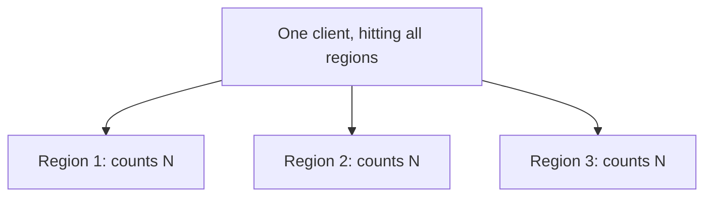
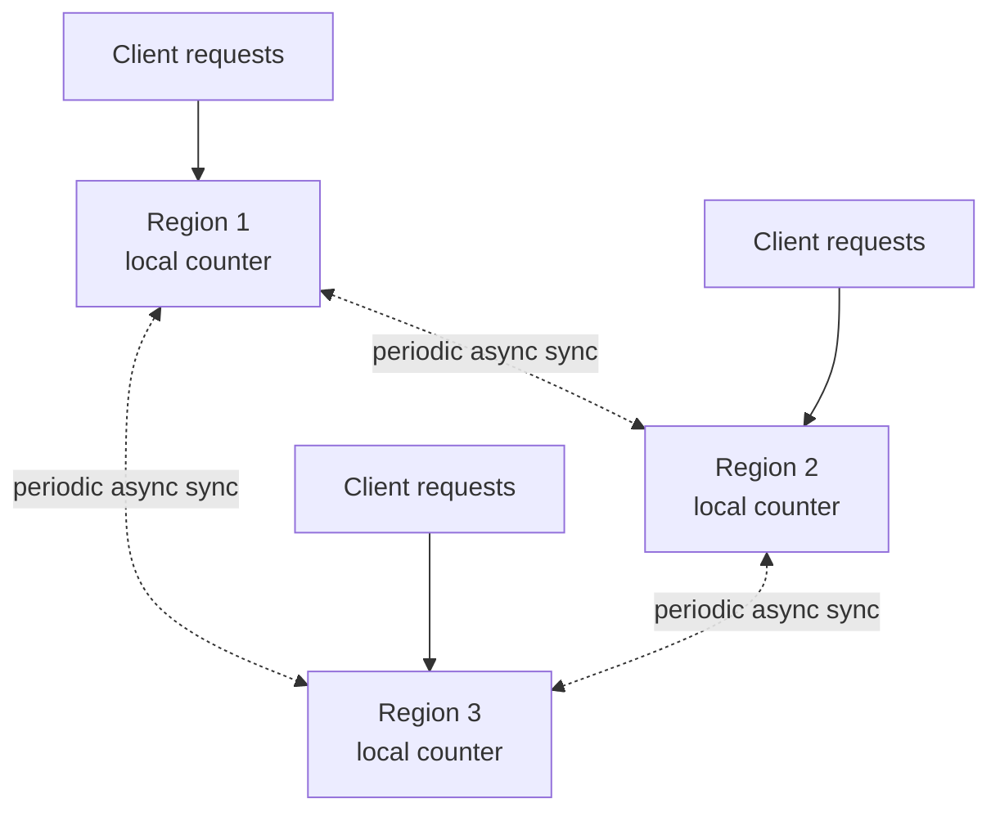

# Design a Multi-Region Rate Limiter

> [!abstract] How to read this chapter
> Built phase by phase around one unavoidable tension: correctness wants global coordination, latency wants local decisions. Each phase adds one idea, exposes the next bottleneck, and fixes it — ending with the *quantified* overshoot of the practical real-world choice.

> [!info] Builds directly on the single-region chapter
> [[HLD/02 - Design a Rate Limiter/Design a Rate Limiter|The original Rate Limiter chapter]] covers the algorithms (token bucket, sliding window) and the atomic-Lua fix. This chapter doesn't re-derive that — it's entirely about the **new** problem multi-region introduces.

> [!question] The interview question
> "Extend the rate limiter to work correctly across multiple geographic regions, where a single client's requests might hit different regional deployments."

---

## Requirements

**Functional**
- A client's rate limit is enforced correctly **regardless of which region** handles each request — no bypassing limits by spreading requests across regions.

**Non-functional — the tension this chapter exists to resolve**

| Requirement | Why it matters here specifically |
|---|---|
| **Local-latency checks** | A cross-region round-trip per check would defeat the entire purpose of a multi-region deployment. |
| **Global correctness** | Yet the limit is global — so correctness wants coordination that latency can't afford. |

> [!info] This is the whole chapter
> Correctness wants global coordination; latency wants local-only decisions. The design is about resolving that tension **explicitly**, not pretending it doesn't exist.

---

## Phase 00 — Capacity math you can defend

| Quantity | Derivation | Result |
|---|---|---|
| Traffic | same as single-region, split across 3–5 regions | throughput isn't the interesting number |
| **The number that matters** | cross-region sync latency | **50–200 ms** between distant regions |

> [!example] In plain words
> The number driving every decision isn't throughput — it's the 50–200 ms cross-region latency. That's exactly why synchronous global coordination on *every* check is a non-starter for latency-sensitive endpoints.

---

## Phase 01 — The naive version: independent per-region limiters

*Start with zero coordination so the bypass names the problem.*

Independent single-region rate limiters, zero coordination. A client gets up to `N×` their intended limit (`N` = number of regions) by hitting all regions at once, since no region knows what the others counted. A real correctness bug for strict limits (login attempts, password resets).

| 🔴 Bottleneck | 🟢 Next fix |
|---|---|
| No region knows the global count → a client bypasses the limit `N×` by fanning out across regions. | Choose a coordination strategy from a real tradeoff spectrum (Phase 2). |

---

## Phase 02 — The tradeoff spectrum: three real options

*Not one "correct" answer — a genuine spectrum with different latency/correctness points.*

| Approach | Mechanism | Latency | Correctness |
|---|---|---|---|
| **Strict global** | Every check synchronously queries a global coordinator / replicated store | Every request pays cross-region latency | Perfectly accurate |
| **Divided fixed budget** | Each region gets a fixed fraction upfront (`1000/min ÷ 5 = 200/min`), enforced locally | Zero cross-region latency | Inflexible — a client skewed to one region hits that cap while global budget sits unused |
| **Async eventual sync** | Each region enforces locally, periodically (every few seconds) shares its count and adjusts its local threshold | Low, local | Brief, **bounded** overshoot during the sync window |

> [!tip] Async eventual-sync is the standard real-world compromise — a live PACELC decision
> This is precisely [[CS Fundamentals/06 - Distributed Systems/CAP Theorem & PACELC|PACELC's "Else" branch]] — favoring **Latency** over **Consistency** during normal operation, applied to rate limiting instead of a database. State it as a deliberate, named tradeoff, not a compromise nobody consciously chose.

| 🔴 Bottleneck | 🟢 Next fix |
|---|---|
| "Bounded overshoot" is only credible if you can state the *actual bound*, not "approximately right." | Quantify the worst-case overshoot (Phase 3). |

---

## Phase 03 — Deep dive: quantifying the overshoot

Each region maintains a local counter, plus periodically fetches/pushes a "global estimate" via a lightweight inter-region exchange (or a periodic push to a central, off-hot-path aggregator). A region can proactively tighten its own local threshold once it learns global usage is near the limit — before being formally told "no."

> [!bug] The worst-case overshoot is quantifiable — say the actual bound
> With `R` regions, sync every `T` seconds, and a per-region max rate of `q` requests/sec for this client, a conservative bound is **`R × T × q` extra requests** before every region learns the global budget is exhausted. Example: 5 regions × 2 s × 100 req/s ≈ **1,000 requests** of overshoot in the worst synchronized burst. The bound is intentionally conservative; a tighter product-specific bound can use each region's actual traffic share.

| 🔴 Bottleneck | 🟢 Next fix |
|---|---|
| The steady-state design is set — but a region partition needs an explicit, per-endpoint policy. | Final architecture + partition policy (Phase 4). |

---

## Phase 04 — The final combined architecture

**Partition policy is per-endpoint.** A security-sensitive endpoint should **fail closed** (or use a conservative local budget) during a partition, accepting false rejections to avoid abuse; a less sensitive endpoint may **fail open** for availability. Blindly allowing `N` independent regional limits during a partition recreates the `N×` bypass.

**Four principles to close with:**
1. The tension is real: global correctness vs local latency — resolve it explicitly, don't hide it.
2. Three points on a spectrum — strict global (accurate, slow), divided budget (fast, inflexible), async sync (fast, bounded overshoot).
3. Async eventual sync is the standard compromise and a named PACELC latency-over-consistency choice.
4. Quantify the overshoot as `R × T × q`; choose `T` and the policy per endpoint from its abuse risk.

---

## Interviewer follow-ups, answered

> [!quote]- "How much can a client exceed the global limit under eventual sync?"
> With `R` regions, sync interval `T`, per-region rate `q`, the conservative bound is ~`R × T × q` extra requests. Choose `T` and the allowed overshoot from the endpoint's risk — a public feed tolerates more than a password-reset.

> [!quote]- "When is strict global coordination worth the latency despite this?"
> A security-critical limiter — login attempts, password resets — where even brief overshoot has real abuse risk. A genuine per-endpoint decision, not one global policy applied uniformly.

> [!quote]- "A region goes offline or is partitioned?"
> Security-sensitive endpoints fail closed or use a conservative local budget, accepting false rejections; less sensitive ones may fail open. The policy is per endpoint — blindly allowing `N` independent regional limits recreates the `N×` bypass.

---

## Production experience

> [!info] What to monitor
> Per-region actual usage vs its intended fair share (detecting skew). Sync lag between regions. Overshoot incidents specifically during partition events — a measurable signal of how the theoretical bound plays out in practice.

---

## Cheat sheet — if you remember nothing else

1. Independent per-region limiters let a client bypass the limit `N×` — coordination is required.
2. Cross-region latency (50–200 ms) makes strict global sync per check a non-starter for latency-sensitive endpoints.
3. Three options: strict global (accurate/slow), divided budget (fast/inflexible), async eventual sync (the real-world compromise).
4. Async sync is a named PACELC latency-over-consistency choice; worst-case overshoot ≈ `R × T × q`.
5. Partition policy is per-endpoint: fail closed for security-critical, fail open for tolerant — never `N` independent limits.

---
*Related: [[00 - Start Here/How This Handbook Works|Book Map]] · [[HLD/02 - Design a Rate Limiter/Design a Rate Limiter|Design a Rate Limiter]] · [[CS Fundamentals/06 - Distributed Systems/CAP Theorem & PACELC|CAP Theorem & PACELC]]*
