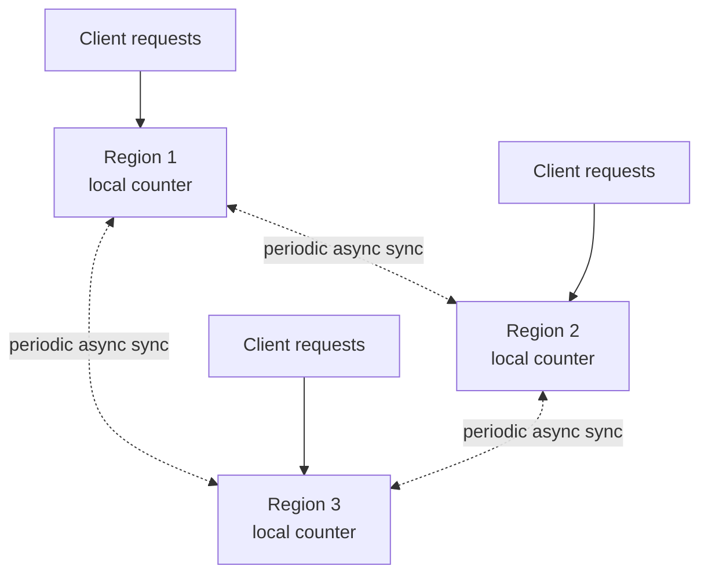

# Design a Multi-Region Rate Limiter

> [!abstract] What you'll be able to do after this chapter
> Present rate-limit synchronization as a genuine, unavoidable tradeoff spectrum instead of a single "correct" answer, and quantify the worst-case overshoot of the practical, real-world choice.

> [!info] Builds directly on the single-region chapter
> [[HLD/02 - Design a Rate Limiter/Design a Rate Limiter|The original Rate Limiter chapter]] already covers the algorithms (token bucket, sliding window) and the atomic-Lua-script fix. This chapter doesn't re-derive any of that — it's entirely about the **new** problem multi-region deployment introduces.

---

## Step 1 — The interview question

> [!question] As an interviewer would ask it
> "Extend the rate limiter to work correctly across multiple geographic regions, where a single client's requests might hit different regional deployments."

## Step 2 — Requirements

**Functional:** a client's rate limit must be enforced correctly regardless of which region handles each individual request — a client shouldn't be able to bypass limits by spreading requests across regions.

**Non-functional — the actual tension this whole chapter exists to resolve:** each region should ideally serve requests with **local** latency, not a cross-region round-trip for every single check (which would defeat the entire purpose of a multi-region deployment). Correctness wants global coordination; latency wants local-only decisions. This chapter is about resolving that tension explicitly, not pretending it doesn't exist.

## Step 3 — Back-of-envelope estimation

Overall traffic is the same as the single-region chapter, now split across (say) 3-5 regions. The number that actually matters here isn't throughput — it's **cross-region sync latency**, typically 50-200ms between distant regions — which is exactly why synchronous global coordination on every single check is a non-starter for latency-sensitive endpoints.

## Step 4 — Building it incrementally

**v0 — naive.** Independent single-region rate limiters, zero coordination. Breaks: a client can get up to `N×` their intended limit (`N` = number of regions) by hitting all regions simultaneously, since no region has any idea what the others have counted. A real correctness bug for strict limits (login attempts, password resets).

**Three real options — presented as a genuine spectrum, not one "correct" answer:**

| Approach | Mechanism | Latency | Correctness |
|---|---|---|---|
| **Strict global** | Every check synchronously queries a global coordinator/replicated store. | Every request pays cross-region latency. | Perfectly accurate. |
| **Divided fixed budget** | Each region gets a fixed fraction of the global limit upfront (e.g. `1000/min ÷ 5 regions = 200/min` per region), enforced purely locally. | Zero cross-region latency. | Inflexible — a client whose traffic skews to one region hits that region's cap even with plenty of global budget unused elsewhere. |
| **Async eventual sync** | Each region enforces locally, but periodically (e.g. every few seconds) shares its count with other regions, adjusting its own local threshold based on the latest known global picture. | Low, local latency. | Allows brief, bounded overshoot during the sync window. |

> [!tip] The async eventual-sync approach is the standard real-world compromise — and it's a live PACELC decision
> This is precisely [[CS Fundamentals/06 - Distributed Systems/CAP Theorem & PACELC|PACELC's "Else" branch]] — favoring **Latency** over **Consistency** during normal operation, applied concretely to rate limiting instead of a database. Worth stating it as a deliberate, named tradeoff, not a compromise nobody consciously chose.

---

## Step 5 — Deep dive: quantifying the overshoot

Each region maintains a local counter, plus periodically fetches/pushes a "global estimate" via a lightweight exchange between regions (or a periodic push to a central, off-hot-path aggregator). A region can proactively tighten its own local threshold once it learns global usage is near the limit, even before being formally told "no."

> [!bug] The worst-case overshoot is quantifiable — say the actual bound, not just "approximately right"
> The worst-case overshoot is bounded by roughly **`(number of regions) × (sync interval) × (request rate)`** — a genuinely computable number, not a hand-wave. Being able to state this bound precisely, rather than vaguely gesturing at "eventual consistency," is the real signal this chapter is testing for.

## Step 6 — Full architecture

---

## Step 7 — Interviewer follow-ups, answered

> [!quote]- "How much can a client actually exceed the intended global limit under eventual sync?"
> [State the quantifiable bound from Step 5 — this is the expected precise answer.]

> [!quote]- "When would strict global coordination be worth the latency cost despite this?"
> A security-critical limiter — login attempts, password resets — where even brief overshoot has real abuse risk. This is a genuine per-endpoint decision, not one global policy applied uniformly everywhere.

> [!quote]- "How do you handle a region going completely offline or partitioned from the others?"
> It falls back to its own local, pre-partition threshold — the same "fail open on the *limiter's own dependency*, not the whole protected system" principle from the original chapter, applied here specifically to cross-region sync failure.

## Step 8 — Production experience

> [!info] What to monitor
> Per-region actual usage vs. its intended fair share (detecting skew). Sync lag between regions. Overshoot incidents specifically during partition events — a real, measurable signal of how the theoretical bound plays out in practice.

---
*Related: [[00 - Start Here/How This Handbook Works|Book Map]] · [[HLD/02 - Design a Rate Limiter/Design a Rate Limiter|Design a Rate Limiter]] · [[CS Fundamentals/06 - Distributed Systems/CAP Theorem & PACELC|CAP Theorem & PACELC]]*
