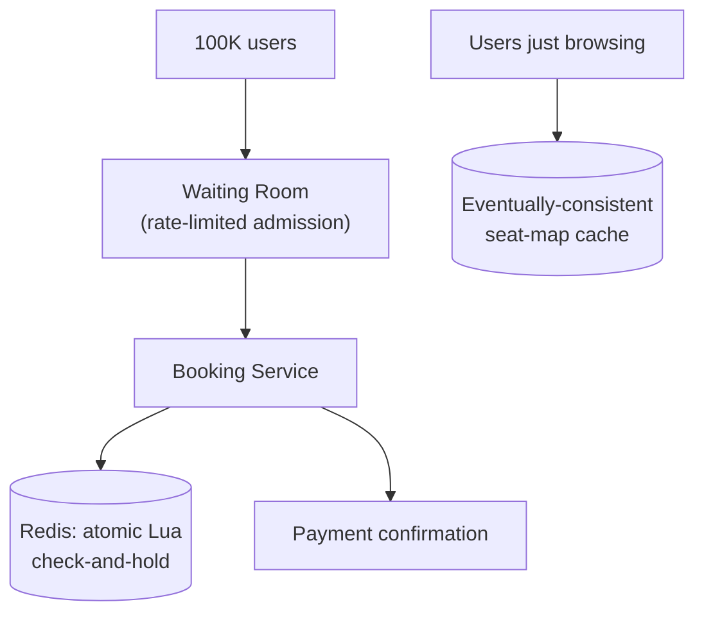

# Design a Ticket Booking System (BookMyShow, HLD-level)

> [!abstract] What you'll be able to do after this chapter
> Distinguish a "waiting room" from a rate limiter precisely (sequencing access to genuinely scarce inventory, not throttling excess load), and scale the LLD chapter's in-process seat lock to a real distributed fleet.

> [!info] Distinct from the LLD version
> [[LLD/06 - Design BookMyShow - Seat Booking/Design BookMyShow - Seat Booking|The LLD chapter]] solved seat double-booking within **one process** via `sync.Mutex`. This chapter solves it **across a distributed fleet of servers**, and adds the genuinely new problem: handling an extreme, short-lived demand spike for a fixed, scarce resource.

---

## Step 1 — The interview question

> [!question] As an interviewer would ask it
> "Design a ticket booking platform like BookMyShow — browse shows, view seat availability, hold and book seats, handle a blockbuster's opening-day sale going live without double-booking a single seat."

## Step 2 — Requirements

**Functional:** browse shows/venues, real-time seat availability, hold seats with expiry, confirm after payment.

**Non-functional:** **zero double-booking across the entire distributed fleet** — a direct escalation of the LLD chapter's single-process guarantee. Handle a massive demand spike at a specific moment — thousands of users hitting the same show's seat map the instant booking opens.

## Step 3 — Back-of-envelope estimation

A popular release can draw 100,000 concurrent users chasing a pool of, say, 500 seats within the first minute. This is an extreme, short-lived spike, fundamentally unlike steady-state average traffic. Average QPS for the whole system is unremarkable — the **peak-to-average ratio for a single hot show's release moment** is arguably the most extreme in this entire handbook, and that's the actual engineering challenge, not steady-state capacity.

## Step 4 — Building it incrementally

**v0 — direct extension of the LLD fix, distributed.** Seat-hold state must live in [[CS Fundamentals/Caching/Redis Internals|Redis]] (not an in-process mutex), since requests for the same show can land on **different** app servers. The atomic check-and-hold becomes a **Redis Lua script** — the identical atomicity mechanism from [[HLD/02 - Design a Rate Limiter/Design a Rate Limiter|the Rate Limiter chapter's]] Lua-script discussion, direct reuse, not a new technique.

**The real new problem: the thundering herd, even with correctness solved.** 100,000 requests for 500 seats — the vast majority are destined to fail. Naively, all 100,000 still hit the booking service and Redis simultaneously, causing a massive, wasteful load spike even though 99.5% of requests are guaranteed losers before they even start.

**Fix — a virtual waiting room.** For a high-demand release, users are admitted into the actual booking flow in a controlled, rate-limited trickle (direct reuse of [[HLD/02 - Design a Rate Limiter/Design a Rate Limiter|rate-limiter mechanics]], applied here as **admission control** rather than a per-client throttle) instead of all 100K hitting the seat-selection page at once. This dramatically smooths load on the booking/Redis layer, at the deliberate UX cost of most users seeing an explicit "you're in line" wait — the real, famous real-world example being Ticketmaster's queue system, built for exactly this reason.

---

## Step 5 — Deep dive: waiting room vs. rate limiter, and tiered read consistency

> [!warning] These solve genuinely different problems — say this precisely
> A rate limiter rejects or delays **excess** load, uniformly, across arbitrary demand. A waiting room specifically **sequences access to a genuinely scarce, fixed resource** — 500 seats can never satisfy 100,000 simultaneous wants, no amount of scaling changes that hard ceiling. Conflating "rate limiting" with "queueing for scarce inventory" is a common imprecision worth avoiding explicitly.

**Waiting room mechanics:** assign each waiting user a position/token, admit users in controlled batches as capacity allows, and inform users of their queue position via real-time push (the same connection-routing patterns already covered for chat/notification systems).

### Tiered consistency for the browsing path

Most of the 100,000 users are just **viewing** the seat map, not actively holding. This read-heavy path should be served from a fast, **eventually-consistent** cache — separate from the strongly-consistent hold/booking path. A seat shown as "available" that's actually just been taken a moment ago is an acceptable tradeoff for the *view*; the **actual hold/booking action** always goes through the strongly-consistent atomic Redis path regardless. A deliberate consistency split within one feature, not an oversight.

## Step 6 — Full architecture

---

## Step 7 — Interviewer follow-ups, answered

> [!quote]- "Why not just let everyone hit the booking flow directly and rely on the atomic Redis check to sort it out correctly?"
> Correctness would technically hold either way — no double-booking either way. But 100,000 simultaneous Lua-script executions against the same show's Redis keys creates a massive, wasteful hot-key load spike even though 99.5% fail immediately. The waiting room exists to avoid that wasted load — an efficiency/stability concern layered on top of an already-solved correctness concern, not a correctness fix itself.

> [!quote]- "How is a waiting room different from a rate limiter?"
> [The scarce-resource-sequencing vs. excess-load-throttling distinction from Step 5 — the expected precise answer.]

> [!quote]- "How do you show users a live seat map without every view hitting the strongly-consistent hold path?"
> A separate, eventually-consistent cached read path, covered in Step 5.

> [!quote]- "How would you prevent someone gaming the waiting room with multiple browser tabs for multiple queue positions?"
> A real, genuine anti-abuse concern — session or device-fingerprint based single-queue-position enforcement, or requiring authentication before queue entry, worth naming explicitly even without a fully solved answer here.

## Step 8 — Production experience

> [!info] What to monitor
> Waiting-room admission rate vs. actual seat-hold success rate (tuning admission aggressiveness). Redis hot-key load **specifically for the currently-releasing show** — a single show's key can become a genuine hot key even with the waiting room mitigating overall volume. Booking confirmation success rate — a low rate despite a controlled queue points to a downstream problem (payment capacity), not the seat-holding logic.

---
*Related: [[00 - Start Here/How This Handbook Works|Book Map]] · [[LLD/06 - Design BookMyShow - Seat Booking/Design BookMyShow - Seat Booking|LLD version]] · [[HLD/02 - Design a Rate Limiter/Design a Rate Limiter|Design a Rate Limiter]]*
