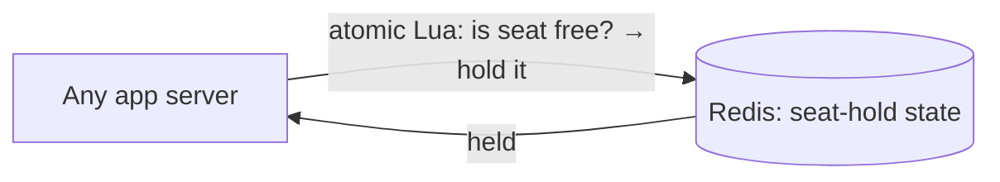
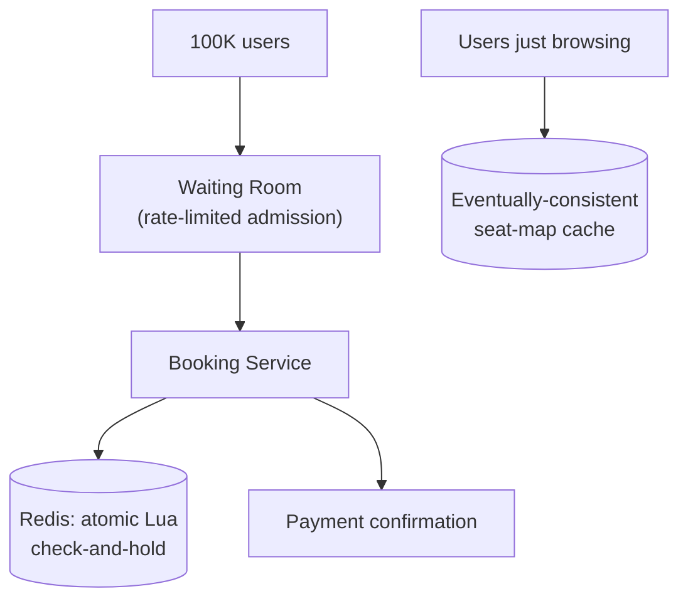

# Design a Ticket Booking System (BookMyShow, HLD-level)

> [!abstract] How to read this chapter
> Built phase by phase around one distinction — a waiting room *sequences access to genuinely scarce inventory*, it isn't a rate limiter throttling excess load — while scaling the LLD chapter's in-process seat lock to a distributed fleet. Each phase adds one idea, exposes the next bottleneck, and fixes it.

> [!info] Distinct from the LLD version
> [[LLD/06 - Design BookMyShow - Seat Booking/Design BookMyShow - Seat Booking|The LLD chapter]] solved seat double-booking within **one process** via `sync.Mutex`. This chapter solves it **across a distributed fleet**, and adds the genuinely new problem: an extreme, short-lived demand spike for a fixed, scarce resource.

> [!question] The interview question
> "Design a ticket booking platform like BookMyShow — browse shows, view seat availability, hold and book seats, handle a blockbuster's opening-day sale going live without double-booking a single seat."

---

## Requirements

**Functional**
- Browse shows/venues.
- Real-time **seat availability**.
- **Hold** seats with expiry.
- **Confirm** after payment.

**Non-functional**

| Requirement | Why it matters here specifically |
|---|---|
| **Zero double-booking across the fleet** | A direct escalation of the LLD chapter's single-process guarantee to many servers. |
| **Survive a demand spike at a moment** | Thousands hitting the same show's seat map the instant booking opens — the real challenge. |

---

## Phase 00 — Capacity math you can defend

| Quantity | Derivation | Result |
|---|---|---|
| Release spike | popular release, first minute | ~100,000 concurrent users |
| The scarce resource | seats for that show | ~500 seats |

> [!example] In plain words
> Average QPS is unremarkable. The **peak-to-average ratio for a single hot show's release moment** is arguably the most extreme in this handbook — 100,000 users chasing 500 seats. That spike, not steady-state capacity, is the engineering challenge.

---

## Phase 01 — Distributed correctness: seat holds in Redis

*Start by scaling the LLD fix across servers, since requests for one show land on different app servers.*

Seat-hold state must live in [[CS Fundamentals/04 - Caching/Redis Internals|Redis]] (not an in-process mutex), since requests for the same show land on **different** app servers. The atomic check-and-hold becomes a **Redis Lua script** — the identical atomicity mechanism from [[HLD/02 - Design a Rate Limiter/Design a Rate Limiter|the Rate Limiter chapter's]] Lua-script discussion, direct reuse, not a new technique.

| 🔴 Bottleneck | 🟢 Next fix |
|---|---|
| Correctness holds — but 100,000 requests for 500 seats all hit Redis at once, 99.5% guaranteed losers before they start. | Shed the doomed load with a waiting room (Phase 2). |

---

## Phase 02 — The thundering herd → a virtual waiting room

*Correctness is solved; the new problem is wasteful load from requests that cannot possibly succeed.*

100,000 requests for 500 seats — the vast majority are destined to fail, yet naively all 100,000 still hit the booking service and Redis simultaneously, a massive wasteful spike even though 99.5% are guaranteed losers.

**Fix — a virtual waiting room.** For a high-demand release, users are admitted into the actual booking flow in a controlled, rate-limited trickle — direct reuse of [[HLD/02 - Design a Rate Limiter/Design a Rate Limiter|rate-limiter mechanics]], applied as **admission control** rather than a per-client throttle — instead of all 100K hitting seat selection at once. This smooths load on the booking/Redis layer, at the deliberate UX cost of most users seeing an explicit "you're in line" wait. The famous real-world example: Ticketmaster's queue.

| 🔴 Bottleneck | 🟢 Next fix |
|---|---|
| "Waiting room" and "rate limiter" get conflated — and 100K users just *viewing* the seat map shouldn't hit the strongly-consistent path. | Sharpen the distinction + tier read consistency (Phase 3). |

---

## Phase 03 — Deep dive: waiting room vs rate limiter, and tiered reads

> [!warning] These solve genuinely different problems — say this precisely
> A rate limiter rejects or delays **excess** load, uniformly, across arbitrary demand. A waiting room specifically **sequences access to a genuinely scarce, fixed resource** — 500 seats can never satisfy 100,000 simultaneous wants, and no amount of scaling changes that hard ceiling. Conflating "rate limiting" with "queueing for scarce inventory" is a common imprecision worth avoiding explicitly.

**Waiting-room mechanics:** assign each waiting user a position/token, admit users in controlled batches as capacity allows, and inform them of their queue position via real-time push (the same connection-routing patterns from chat/notification systems).

**Tiered consistency for browsing.** Most of the 100,000 are just **viewing** the seat map, not holding. This read-heavy path is served from a fast, **eventually-consistent** cache — separate from the strongly-consistent hold/booking path. A seat shown "available" that was just taken is an acceptable tradeoff for the *view*; the **actual hold/booking action** always goes through the strongly-consistent atomic Redis path. A deliberate consistency split within one feature, not an oversight.

| 🔴 Bottleneck | 🟢 Next fix |
|---|---|
| Individual pieces handled — assemble the two-path picture. | Final architecture (Phase 4). |

---

## Phase 04 — The final combined architecture

**Four principles to close with:**
1. Distributed correctness is the LLD mutex escalated to a Redis atomic Lua script — same idea, shared state.
2. Even with correctness solved, 100K requests for 500 seats is wasteful load — shed the doomed majority with admission control.
3. A waiting room sequences access to scarce inventory; a rate limiter throttles excess load — different problems.
4. Split reads: eventually-consistent cache for viewing, strongly-consistent atomic path for the actual hold/book.

---

## Interviewer follow-ups, answered

> [!quote]- "Why not let everyone hit booking and rely on the atomic Redis check?"
> Correctness holds either way — no double-booking. But 100,000 simultaneous Lua executions against the same show's Redis keys is a massive wasteful hot-key spike even though 99.5% fail immediately. The waiting room avoids that wasted load — an efficiency/stability concern on top of already-solved correctness, not a correctness fix.

> [!quote]- "How is a waiting room different from a rate limiter?"
> A rate limiter throttles excess load uniformly; a waiting room sequences access to a genuinely scarce, fixed resource. 500 seats can't satisfy 100,000 wants no matter how you scale — that hard ceiling is what the queue manages.

> [!quote]- "Live seat map without every view hitting the strongly-consistent path?"
> A separate, eventually-consistent cached read path; the actual hold/book action still goes through the strongly-consistent atomic Redis path.

> [!quote]- "Prevent gaming the queue with multiple tabs for multiple positions?"
> A real anti-abuse concern — session/device-fingerprint single-position enforcement, or requiring auth before queue entry, worth naming even without a fully solved answer.

---

## Production experience

> [!info] What to monitor
> Waiting-room admission rate vs actual seat-hold success rate (tuning admission aggressiveness). Redis hot-key load **specifically for the currently-releasing show** — one show's key can become a genuine hot key even with the queue mitigating overall volume. Booking confirmation success rate — low despite a controlled queue points to a downstream problem (payment capacity), not seat-holding logic.

---

## Cheat sheet — if you remember nothing else

1. Distributed no-double-booking = the LLD mutex escalated to a Redis atomic Lua check-and-hold over shared state.
2. Correctness solved still leaves a thundering herd — 100K requests for 500 seats is 99.5% wasted load.
3. A waiting room (admission control) sheds the doomed majority; it sequences scarce inventory, unlike a rate limiter.
4. Split reads: eventually-consistent cache for browsing, strongly-consistent atomic path for holds/bookings.
5. Watch the single releasing show's hot key and admission-vs-success rate; guard the queue against multi-tab gaming.

---
*Related: [[00 - Start Here/How This Handbook Works|Book Map]] · [[LLD/06 - Design BookMyShow - Seat Booking/Design BookMyShow - Seat Booking|LLD version]] · [[HLD/02 - Design a Rate Limiter/Design a Rate Limiter|Design a Rate Limiter]]*
