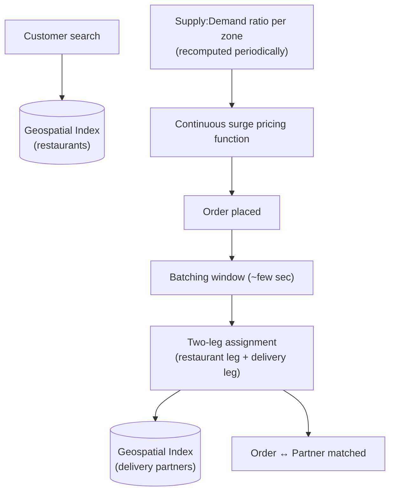

# Design a Food Delivery System (HLD)

> [!abstract] What you'll be able to do after this chapter
> Explain precisely why this is a harder matching problem than Uber's (two legs, not one), implement a real, quantifiable surge-pricing algorithm instead of "prices go up when busy," and reuse Uber's geospatial indexing without re-deriving it.

> [!info] Distinct from the LLD version
> [[LLD/13 - Design a Food Delivery System/Design a Food Delivery System|The LLD chapter]] covers the in-process order-lifecycle object model (State + Strategy). This chapter is the distributed system: geospatial restaurant discovery, two-leg delivery-partner matching, and surge pricing at scale.

---

## Step 1 — The interview question

> [!question] As an interviewer would ask it
> "Design a food delivery platform like Swiggy, Zomato, or DoorDash — customers browse restaurants, place orders, orders get matched with delivery partners, real-time tracking, dynamic pricing during high demand."

## Step 2 — Requirements

**Functional:** location-based restaurant search, place a (potentially multi-item) order, match with a nearby available delivery partner, real-time order status and live location tracking, dynamic/surge pricing, ratings.

**Non-functional:** low-latency search (discovery must feel instant). Accurate real-time ETA. Handle **predictable but intense demand spikes** (lunch/dinner rushes). Strict geographic locality — a **three-sided marketplace** (customer, restaurant, delivery partner), a genuinely more complex shape than Uber's two-sided (rider, driver) problem.

## Step 3 — Back-of-envelope estimation

Assume 50M orders/day → ~580/sec average, but with **strong time-of-day peaks** — lunch/dinner rushes can push peak QPS to 5-10x average within a 1-2 hour window → budget for ~3,000-5,000/sec peak order placement. Restaurant **search** volume (browsing) is much higher than actual orders (conversion is far from 100%) — likely 20-50x order QPS.

## Step 4 — Building it incrementally

**v0 — naive.** Flat SQL table of restaurants, searched via `WHERE city = ? AND area = ?`. Breaks the moment true "nearest restaurants to my exact location" queries are needed — the same fundamental limitation [[HLD/10 - Design Uber/Design Uber|Uber's chapter]] already solved.

**Fix — reuse geospatial indexing directly.** This is the identical geohash/quadtree technique from the Uber chapter, indexing **restaurants** instead of drivers — restaurant discovery becomes a geospatial lookup exactly like Uber's driver-matching first-pass filter. Worth stating explicitly as reuse, not re-deriving the mechanism.

**Order placement → delivery-partner matching — a harder problem than Uber's.** Once an order is placed, it needs a partner matched — structurally the same geospatial nearest-match problem as Uber, but with a genuine added wrinkle: matching must account for **two legs**, not one — the partner needs to reach the **restaurant** first, then travel from the restaurant to the **customer**. A partner very close to the restaurant might still be a worse overall choice than a slightly farther partner already heading in the right general direction. This two-leg routing complexity is real and worth naming as the specific way this problem differs from Uber's simpler point-to-point match.

**Dynamic/surge pricing.** During high demand (dinner rush, bad weather reducing partner supply), delivery fees increase to incentivize more partners online and mildly throttle demand. Computed via a real, quantifiable **supply:demand ratio per geographic zone** — periodically (e.g. every minute), compute `pending-orders-awaiting-match : available-partners` per zone, applying a pricing multiplier once that ratio crosses defined thresholds.

---

## Step 5 — Deep dive: batched matching and continuous surge pricing

### Batching beats greedy one-at-a-time matching

> [!tip] A real, more advanced technique beyond Uber's simpler framing
> Matching orders to partners one at a time, greedily, as each order arrives can produce a worse **global** outcome than considering multiple pending orders together. Real platforms batch orders within a short window (a few seconds) and solve a small optimization/assignment problem across multiple orders and multiple nearby partners simultaneously — accounting for both legs of each potential match — rather than committing to the first "good enough" pairing for each order independently.

### The surge-pricing zone-boundary problem

> [!bug] A real, interesting edge case
> A customer right at the boundary between a surging zone and a normal zone can see a sharply different price than a customer 100 meters away, if zones are discrete lookup regions. The fix: compute a **continuous pricing function** based on nearby supply/demand rather than a hard zone lookup — smoothing the pricing surface avoids sharp, arbitrary discontinuities at zone edges.

## Step 6 — Full architecture

---

## Step 7 — Interviewer follow-ups, answered

> [!quote]- "How is this matching problem different from Uber's?"
> Two-leg routing (restaurant pickup, then customer delivery) instead of Uber's single point-to-point match, plus real platforms batching multiple orders for joint assignment rather than matching one order at a time — the expected distinguishing answer.

> [!quote]- "How do you prevent a sharp, unfair price jump at an arbitrary zone boundary?"
> A continuous supply/demand-based pricing function rather than discrete zone lookups — covered in Step 5.

> [!quote]- "How do you handle a restaurant marking itself temporarily closed or at capacity?"
> A real-time operational toggle the geospatial search must respect immediately, filtering closed/at-capacity restaurants out of search results without delay.

> [!quote]- "How would you batch multiple orders for matching efficiency?"
> A short time-window collection of pending orders, then a small-scale assignment optimization across those orders and nearby available partners jointly — covered in Step 5.

## Step 8 — Production experience

> [!info] What to monitor
> Match latency (order-placed to partner-assigned). Search latency. Surge-multiplier distribution across zones — a persistently high multiplier in one zone signals a genuine, ongoing supply shortage worth addressing operationally, not just algorithmically. Partner utilization rate — both idle-too-often and overloaded are signals worth separate tracking.

---
*Related: [[00 - Start Here/How This Handbook Works|Book Map]] · [[HLD/10 - Design Uber/Design Uber|Design Uber]] · [[LLD/13 - Design a Food Delivery System/Design a Food Delivery System|LLD version]]*
