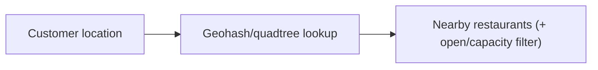
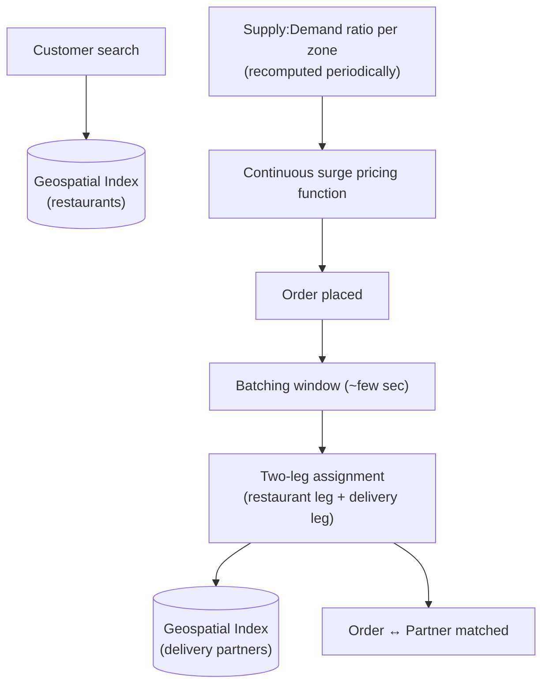

# Design a Food Delivery System (HLD)

> [!abstract] How to read this chapter
> Built phase by phase around what makes this *harder than Uber* — a three-sided marketplace with two-leg matching — plus a real, quantifiable surge-pricing algorithm. Each phase adds one idea, exposes the next bottleneck, and fixes it, reusing Uber's geospatial indexing rather than re-deriving it.

> [!info] Distinct from the LLD version
> [[LLD/13 - Design a Food Delivery System/Design a Food Delivery System|The LLD chapter]] covers the in-process order-lifecycle object model (State + Strategy). This chapter is the distributed system: geospatial restaurant discovery, two-leg partner matching, and surge pricing at scale.

> [!question] The interview question
> "Design a food delivery platform like Swiggy, Zomato, or DoorDash — customers browse restaurants, place orders, orders get matched with delivery partners, real-time tracking, dynamic pricing during high demand."

---

## Requirements

**Functional**
- Location-based **restaurant search**.
- Place a (multi-item) **order**.
- **Match** with a nearby available delivery partner.
- Real-time status + live **location tracking**.
- **Dynamic/surge pricing**; ratings.

**Non-functional**

| Requirement | Why it matters here specifically |
|---|---|
| **Low-latency search** | Discovery must feel instant — and browsing volume dwarfs order volume. |
| **Accurate real-time ETA** | Two legs (to restaurant, then to customer) make ETA harder than a point-to-point ride. |
| **Predictable intense spikes** | Lunch/dinner rushes push peak to 5–10× average within a 1–2 hour window. |
| **Three-sided marketplace** | Customer + restaurant + delivery partner — a genuinely more complex shape than Uber's two-sided problem. |

---

## Phase 00 — Capacity math you can defend

| Quantity | Derivation | Result |
|---|---|---|
| Orders/day | 50M | ~580/s average |
| Peak orders | lunch/dinner rush 5–10× | ~3,000–5,000/s peak |
| Search volume | conversion far below 100% | ~20–50× order QPS |

> [!example] In plain words
> Two things drive the design: strong **time-of-day peaks** (not steady state), and browsing volume ~20–50× actual orders. Search must be cheap and instant; matching must survive the rush.

---

## Phase 01 — The naive version: flat SQL restaurant search

*Start with `WHERE city = ? AND area = ?` so its limit names the fix.*

A flat SQL table of restaurants, searched by city/area. Breaks the moment true "nearest restaurants to my exact location" queries are needed — the same fundamental limitation [[HLD/10 - Design Uber/Design Uber|Uber's chapter]] already solved.

| 🔴 Bottleneck | 🟢 Next fix |
|---|---|
| City/area filters can't answer "nearest to my exact coordinates" and don't scale to real discovery. | Reuse geospatial indexing for restaurants (Phase 2). |

---

## Phase 02 — Geospatial discovery (reused from Uber)

*The identical geohash/quadtree technique, indexing restaurants instead of drivers.*

Restaurant discovery becomes a geospatial lookup exactly like Uber's driver-matching first-pass filter — a reuse, not a new mechanism. State it as reuse to avoid re-deriving.

| 🔴 Bottleneck | 🟢 Next fix |
|---|---|
| Once an order is placed, matching a partner isn't Uber's single point-to-point hop — it has two legs. | Two-leg partner matching (Phase 3). |

---

## Phase 03 — Order placement → two-leg partner matching

*Structurally Uber's nearest-match, but with a genuine added wrinkle.*

Once an order is placed, it needs a partner matched — the same geospatial nearest-match as Uber, but matching must account for **two legs**, not one: the partner reaches the **restaurant** first, then travels restaurant → **customer**. A partner very close to the restaurant might be a worse *overall* choice than a slightly farther partner already heading in the right direction. This two-leg routing is the specific way this problem differs from Uber's simpler point-to-point match.

| 🔴 Bottleneck | 🟢 Next fix |
|---|---|
| Greedy one-order-at-a-time matching produces a worse *global* outcome; and demand spikes need a supply-balancing lever. | Batched matching + surge pricing (Phase 4). |

---

## Phase 04 — Deep dive: batched matching & continuous surge pricing

> [!tip] Batching beats greedy one-at-a-time matching
> Matching each order greedily as it arrives can produce a worse **global** outcome than considering multiple pending orders together. Real platforms **batch** orders within a short window (a few seconds) and solve a small optimization/assignment problem across multiple orders and nearby partners simultaneously — accounting for both legs of each potential match — rather than committing to the first "good enough" pairing per order.

**Surge pricing, quantified.** During high demand (dinner rush, bad weather cutting partner supply), delivery fees rise to attract partners and mildly throttle demand. Computed via a real **supply:demand ratio per zone** — periodically (e.g. every minute), compute `pending-orders-awaiting-match : available-partners` per zone, applying a pricing multiplier once the ratio crosses defined thresholds.

> [!bug] The surge zone-boundary problem
> A customer right at the boundary between a surging zone and a normal zone can see a sharply different price than one 100 m away, if zones are discrete lookup regions. The fix: compute a **continuous pricing function** from nearby supply/demand rather than a hard zone lookup — smoothing the pricing surface avoids arbitrary discontinuities at zone edges.

| 🔴 Bottleneck | 🟢 Next fix |
|---|---|
| Individual pieces handled — assemble the three-sided picture. | Final architecture (Phase 5). |

---

## Phase 05 — The final combined architecture

**Five principles to close with:**
1. Three-sided marketplace — customer, restaurant, partner — genuinely more complex than Uber's two-sided problem.
2. Restaurant discovery reuses Uber's geospatial index wholesale — index restaurants instead of drivers.
3. Matching has two legs (to restaurant, then to customer) — the specific complexity beyond Uber's point-to-point hop.
4. Batch orders in a short window and solve joint assignment — greedy per-order matching is globally worse.
5. Surge = supply:demand ratio per zone, smoothed into a continuous function to avoid unfair boundary jumps.

---

## Interviewer follow-ups, answered

> [!quote]- "How is this matching problem different from Uber's?"
> Two-leg routing (restaurant pickup, then customer delivery) instead of Uber's single point-to-point match, plus real platforms batching multiple orders for joint assignment rather than matching one at a time.

> [!quote]- "Prevent a sharp, unfair price jump at an arbitrary zone boundary?"
> A continuous supply/demand-based pricing function rather than discrete zone lookups — smoothing the pricing surface.

> [!quote]- "Restaurant marks itself temporarily closed or at capacity?"
> A real-time operational toggle the geospatial search must respect immediately, filtering closed/at-capacity restaurants out of results without delay.

> [!quote]- "Batch multiple orders for matching efficiency?"
> A short time-window collection of pending orders, then a small-scale assignment optimization across those orders and nearby partners jointly.

---

## Production experience

> [!info] What to monitor
> Match latency (order-placed to partner-assigned). Search latency. Surge-multiplier distribution across zones — a persistently high multiplier in one zone signals an ongoing supply shortage worth addressing operationally, not just algorithmically. Partner utilization — both idle-too-often and overloaded are signals worth separate tracking.

---

## Cheat sheet — if you remember nothing else

1. Three-sided marketplace — harder than Uber's two sides; browsing volume ~20–50× orders.
2. Restaurant discovery reuses Uber's geohash/quadtree index directly — index restaurants.
3. Partner matching is two-leg (to restaurant, then to customer) — the key difference from Uber's point-to-point.
4. Batch orders in a few-second window and solve joint assignment — greedy per-order is globally worse.
5. Surge = per-zone supply:demand ratio, smoothed into a continuous function to avoid boundary price jumps.

---
*Related: [[00 - Start Here/How This Handbook Works|Book Map]] · [[HLD/10 - Design Uber/Design Uber|Design Uber]] · [[LLD/13 - Design a Food Delivery System/Design a Food Delivery System|LLD version]]*
