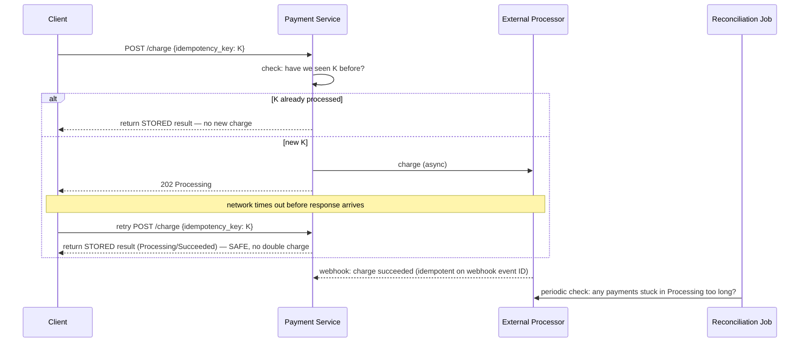

# Design a Payment System (Stripe-style)

> [!abstract] What you'll be able to do after this chapter
> Deliver the deepest possible treatment of idempotency in this handbook — including the subtle "reuse the same key across retries, never regenerate" rule — and design reconciliation as a real safety net for async webhook-based confirmation.

---

## Step 1 — The interview question

> [!question] As an interviewer would ask it
> "Design a payment processing system — charge customers, integrate with external processors, guarantee no duplicate charges, and reconcile with what actually happened."

## Step 2 — Requirements

**Functional:** initiate a charge, support multiple payment methods, handle asynchronous confirmation, refunds, reconciliation.

**Non-functional:** **the user must never be charged twice for one purchase, and never charged zero times when they should be** — arguably the single hardest, most safety-critical requirement in this entire handbook. Strong durability/auditability — every financial event immutably recorded. Graceful handling of slow, down, or ambiguous external systems.

## Step 3 — Back-of-envelope estimation

Assume 10M transactions/day → ~115/sec average — **far lower QPS than most chapters in this book.** The emphasis here is correctness, not throughput — worth stating this framing explicitly, since it's what distinguishes this chapter's design priorities from every high-QPS case study elsewhere.

## Step 4 — Building it incrementally

**v0 — naive.** Call the processor's API synchronously; on success, mark the order paid. Breaks on the universal distributed-systems failure mode: what if the network times out **after** the processor successfully charged the card, but **before** the success response reaches our server? A naive retry — assuming the first attempt failed — charges the card a **second time**. A real, costly double-charge bug, not a theoretical one.

**Fix — [[Glossary/Idempotency|idempotency keys]], the deepest treatment this handbook gives the concept.** Every charge request carries a client-generated unique idempotency key. Our system (and the processor) deduplicates on this key: a retried request with the same key returns the **stored result** of the original attempt, without charging again — regardless of *why* the retry happened (timeout, client crash-and-restart, anything else). This is precisely why Stripe's real API requires an `Idempotency-Key` header on every charge request.

> [!bug] The one detail that defeats this mechanism if missed
> Idempotency keys must be generated **once per logical operation and reused across every retry** — never freshly generated per attempt. If a client generates a new key on each retry, the entire mechanism is silently defeated, because the deduplication check never matches anything.

**A payment lifecycle state machine** — `Created → Processing → Succeeded/Failed → (optionally) Refunded` — the same [[LLD/02 - Design a Vending Machine/Design a Vending Machine|State pattern skeleton]] covered elsewhere, applied to a genuinely different, safety-critical problem. Combined with idempotency keys, this state machine is what allows safely reconciling "what actually happened" even after ambiguous failures — a payment stuck too long in `Processing` triggers an active reconciliation check, not a blind retry or a blind assumption of failure.

---

## Step 5 — Deep dive: exact deduplication mechanics and async webhook handling

### Idempotency key deduplication, precisely

Store `idempotency_key → {request_hash, response, status}` the **first** time a request is processed. Any subsequent request with the same key returns the stored response immediately, without re-executing the charge. Critically: **validate the request body matches** what was originally submitted for that key — a mismatched request reusing an old key is rejected as a client bug (or potential attack), never silently processed differently.

### Webhooks — asynchronous confirmation, and its own idempotency problem

Real payment flows are often asynchronous — the processor confirms success/failure via a **webhook** sometime after the initial request, not synchronously. Two failure modes need handling:

1. **The webhook arrives out of order or duplicated** — webhook handling needs its **own** idempotency, keyed by the webhook's own unique event ID — the exact same principle from Section 4, applied at a different integration point.
2. **The webhook never arrives at all** — a periodic **reconciliation job** proactively queries the processor for the status of any payment stuck too long in `Processing`, rather than passively waiting forever for a webhook that might never come.

> [!tip] Reconciliation-as-a-safety-net is a broadly reusable production pattern
> Any system integrating with an unreliable external async API benefits from this exact idea: don't just trust that a callback will eventually arrive — periodically, actively verify state against the source of truth for anything that's been "pending" longer than expected.

## Step 6 — Full architecture

---

## Step 7 — Interviewer follow-ups, answered

> [!quote]- "What happens if a client retries a charge after a network timeout, not knowing if the first attempt succeeded?"
> The idempotency key makes the retry unconditionally safe — the retried request returns the original attempt's stored result rather than executing a second charge. This is the exact scenario the entire idempotency-key mechanism exists to solve.

> [!quote]- "What if a webhook is delivered twice?"
> Idempotent webhook handling keyed by the webhook's own unique event ID — the same deduplication principle, applied at the webhook-ingestion layer instead of the original charge-request layer.

> [!quote]- "What if a webhook never arrives?"
> The reconciliation job actively queries the processor for any payment stuck in `Processing` beyond an expected threshold, rather than waiting indefinitely for a callback that might genuinely never come due to a processor-side issue.

> [!quote]- "How do you handle refunds with the same rigor as charges?"
> Refunds need their **own**, distinct idempotency keys — separate from the original charge's key — and the state machine must track that a refund was already issued, preventing double-refunding, which is exactly the double-charge problem mirrored in the opposite direction.

## Step 8 — Production experience

> [!info] What to monitor
> Payments stuck in `Processing` beyond the expected threshold — the direct alerting trigger for reconciliation to investigate. Idempotency key mismatch rate (a rising rate can signal a client bug, or a security concern). Webhook processing lag and failure rate. **Reconciliation discrepancy rate** — how often recorded state disagrees with the processor's actual state; ideally near zero, and a rising trend deserves urgent investigation given the financial stakes involved.

---
*Related: [[00 - Start Here/How This Handbook Works|Book Map]] · [[Glossary/Idempotency|Idempotency]] · [[LLD/02 - Design a Vending Machine/Design a Vending Machine|Design a Vending Machine]] (State pattern reference)*
