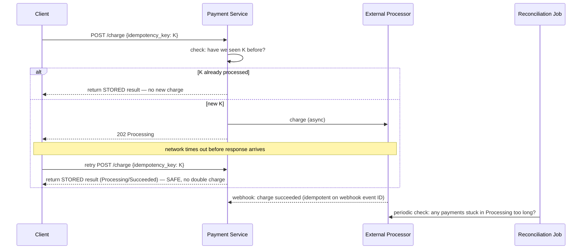

# Design a Payment System (Stripe-style)

> [!abstract] How to read this chapter
> Built phase by phase, but with the priorities inverted from every other case study: **correctness, not throughput.** Each phase adds one idea, exposes the next bottleneck, and fixes it — the deepest treatment of idempotency in this handbook, plus reconciliation as a real safety net for async confirmation.

> [!question] The interview question
> "Design a payment processing system — charge customers, integrate with external processors, guarantee no duplicate charges, and reconcile with what actually happened."

---

## Requirements

**Functional**
- Initiate a **charge**; support multiple payment methods.
- Handle **asynchronous confirmation**.
- **Refunds**.
- **Reconciliation**.

**Non-functional**

| Requirement | Why it matters here specifically |
|---|---|
| **Never charge twice, never charge zero times** | Arguably the single hardest, most safety-critical requirement in this entire handbook. |
| **Strong durability / auditability** | Every financial event immutably recorded. |
| **Graceful with slow/down/ambiguous externals** | The processor is an unreliable async dependency you don't control. |

---

## Phase 00 — Capacity math: correctness, not throughput

| Quantity | Derivation | Result |
|---|---|---|
| Transactions/day | 10M | ~115/s average — **far lower QPS than most chapters** |

> [!example] In plain words
> The QPS is trivial. The emphasis is entirely **correctness**, not throughput — worth stating explicitly, since it's what distinguishes this chapter's design priorities from every high-QPS case study elsewhere.

---

## Phase 01 — The naive version: synchronous charge

*Start with the obvious flow so the universal failure mode names the fix.*

Call the processor's API synchronously; on success, mark the order paid. Breaks on the universal distributed-systems failure mode:

> [!danger] The double-charge bug
> What if the network times out **after** the processor successfully charged the card, but **before** the success response reaches our server? A naive retry — assuming the first attempt failed — charges the card a **second time.** A real, costly double-charge, not a theoretical one.

| 🔴 Bottleneck | 🟢 Next fix |
|---|---|
| A timeout leaves the true outcome ambiguous; a blind retry double-charges, a blind failure under-charges. | Idempotency keys (Phase 2). |

---

## Phase 02 — Idempotency keys: the deepest treatment here

*Make a retry unconditionally safe regardless of *why* it happened.*

Every charge request carries a **client-generated unique idempotency key.** Our system (and the processor) deduplicates on this key: a retried request with the same key returns the **stored result** of the original attempt, without charging again — regardless of why the retry happened (timeout, client crash-and-restart, anything). This is exactly why Stripe's real API requires an `Idempotency-Key` header on every charge.

> [!bug] The one detail that defeats this mechanism if missed
> Idempotency keys must be generated **once per logical operation and reused across every retry** — never freshly generated per attempt. If a client generates a new key on each retry, the entire mechanism is silently defeated, because the deduplication check never matches anything.

| 🔴 Bottleneck | 🟢 Next fix |
|---|---|
| A key alone doesn't track a payment's lifecycle, or resolve one stuck ambiguously between attempt and confirmation. | A payment state machine (Phase 3). |

---

## Phase 03 — The payment lifecycle state machine

*Track exactly where a payment is, so ambiguity has a defined resolution.*

`Created → Processing → Succeeded/Failed → (optionally) Refunded` — the same [[LLD/02 - Design a Vending Machine/Design a Vending Machine|State pattern skeleton]] covered elsewhere, applied to a safety-critical problem. Combined with idempotency keys, this state machine is what allows safely reconciling "what actually happened" even after ambiguous failures — a payment stuck too long in `Processing` triggers an **active reconciliation check**, not a blind retry or a blind assumption of failure.

| 🔴 Bottleneck | 🟢 Next fix |
|---|---|
| Real confirmation is async (webhooks) — which arrive duplicated, out of order, or never. | Exact dedup mechanics + webhook/reconciliation handling (Phase 4). |

---

## Phase 04 — Deep dive: dedup mechanics & async webhooks

**Idempotency key deduplication, precisely.** Store `idempotency_key → {request_hash, response, status}` the **first** time a request is processed. Any subsequent request with the same key returns the stored response immediately, without re-executing. Critically: **validate the request body matches** what was originally submitted for that key — a mismatched request reusing an old key is rejected as a client bug (or attack), never silently processed differently.

**Webhooks — async confirmation, and its own idempotency problem.** Real flows are async — the processor confirms success/failure via a **webhook** sometime after the request. Two failure modes:
1. **Webhook arrives out of order or duplicated** — webhook handling needs its **own** idempotency, keyed by the webhook's unique event ID — the same principle, different integration point.
2. **Webhook never arrives** — a periodic **reconciliation job** proactively queries the processor for the status of any payment stuck too long in `Processing`, rather than waiting forever.

> [!tip] Reconciliation-as-a-safety-net is a broadly reusable pattern
> Any system integrating with an unreliable external async API benefits: don't just trust a callback will arrive — periodically, actively verify state against the source of truth for anything "pending" longer than expected.

| 🔴 Bottleneck | 🟢 Next fix |
|---|---|
| Individual pieces handled — assemble the safe end-to-end flow. | Final architecture (Phase 5). |

---

## Phase 05 — The final combined architecture

**Five principles to close with:**
1. Correctness dominates — QPS is trivial; never charge twice, never charge zero times.
2. Idempotency keys make retries unconditionally safe regardless of why the retry happened.
3. Generate the key **once per logical operation, reuse across retries** — regenerating per attempt silently defeats it.
4. A lifecycle state machine turns ambiguity into an actionable state (`Processing` too long → reconcile, don't guess).
5. Webhooks need their own idempotency (event ID); reconciliation actively verifies stuck payments against the processor.

---

## Interviewer follow-ups, answered

> [!quote]- "Client retries a charge after a timeout, not knowing if the first succeeded?"
> The idempotency key makes the retry unconditionally safe — the retried request returns the original attempt's stored result rather than executing a second charge. The exact scenario the whole mechanism exists to solve.

> [!quote]- "A webhook is delivered twice?"
> Idempotent webhook handling keyed by the webhook's own unique event ID — the same deduplication principle, applied at the webhook-ingestion layer.

> [!quote]- "A webhook never arrives?"
> The reconciliation job actively queries the processor for any payment stuck in `Processing` beyond a threshold, rather than waiting indefinitely for a callback that might never come.

> [!quote]- "Refunds with the same rigor as charges?"
> Refunds need their **own** idempotency keys — separate from the charge's key — and the state machine tracks that a refund was already issued, preventing double-refunding, the double-charge problem mirrored in reverse.

---

## Production experience

> [!info] What to monitor
> Payments stuck in `Processing` beyond the expected threshold — the direct trigger for reconciliation to investigate. Idempotency key mismatch rate (rising can signal a client bug or security concern). Webhook processing lag and failure rate. **Reconciliation discrepancy rate** — how often recorded state disagrees with the processor's actual state; ideally near zero, and a rising trend deserves urgent investigation given the financial stakes.

---

## Cheat sheet — if you remember nothing else

1. Correctness over throughput — QPS is ~115/s; the hard part is never charging twice or zero times.
2. Idempotency key per charge makes any retry safe — return the stored result, never re-charge.
3. Generate the key once per operation and reuse it across retries — regenerating per attempt defeats the whole thing.
4. Lifecycle state machine (`Created→Processing→Succeeded/Failed→Refunded`) turns ambiguity into a reconcilable state.
5. Webhooks are async and unreliable — dedup by event ID, and a reconciliation job verifies stuck payments against the source of truth.

---
*Related: [[00 - Start Here/How This Handbook Works|Book Map]] · [[Glossary/Idempotency|Idempotency]] · [[LLD/02 - Design a Vending Machine/Design a Vending Machine|Design a Vending Machine]] (State pattern reference)*
