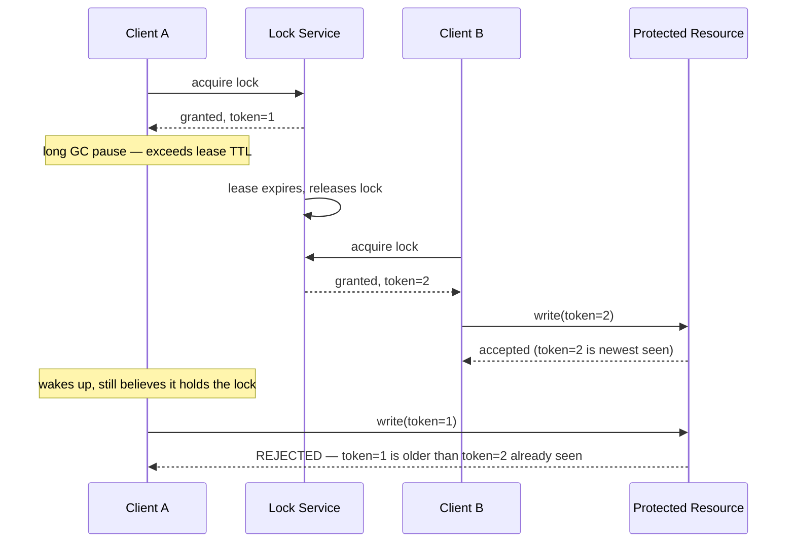

# Design a Distributed Lock Service (build ZooKeeper/etcd-lite)

> [!abstract] What you'll be able to do after this chapter
> Explain the fencing token problem precisely — the subtle, famous failure mode where a "correct" lock mechanism still allows a mutual-exclusion violation — and know exactly what fixes it.

---

## Step 1 — The interview question

> [!question] As an interviewer would ask it
> "Design a distributed lock service that multiple independent processes across different machines can use to coordinate exclusive access to a shared resource."

## Step 2 — Requirements

**Functional:** acquire (blocking or with timeout), release, automatic release if the holder crashes — no permanent deadlock from a dead holder.

**Non-functional:** **correctness is paramount** — two clients simultaneously believing they hold the same lock is a severe, system-wide bug, not an inconvenience. The lock service itself must survive individual node failures — it needs its own high availability, which itself requires consensus.

## Step 3 — Back-of-envelope estimation

Lock services coordinate, they don't move bulk data — QPS is typically modest (thousands/sec, not millions), but latency and **correctness** requirements are extremely strict. Worth framing explicitly: this chapter's estimation profile is correctness-critical, not throughput-critical, unlike most others in this handbook.

## Step 4 — Building it incrementally

**v0 — naive.** A single database row, acquired via `UPDATE ... WHERE locked_by IS NULL`. Breaks two ways: if the holder crashes without releasing, the lock is held **forever**; the database itself has no stated high-availability story.

**Fix — a lease-based lock with a heartbeat.** A lock is acquired with an associated lease/TTL; the holder must periodically [[Glossary/Heartbeat (Health Check)|heartbeat]] to renew it. If the holder crashes and stops heartbeating, the lease expires and the lock is automatically released — breaking the "holder crashed = permanent deadlock" failure mode.

**The lock service itself is a small, highly-available, strongly-consistent cluster.** This is exactly what ZooKeeper/etcd *are* — a small (commonly 3 or 5 node) cluster running [[Glossary/Raft (Consensus)|Raft]] internally. The same consensus mechanism that prevents split-brain leader election elsewhere in this handbook is what ensures no two clients can *both* be told "you hold the lock."

---

## Step 5 — Deep dive: the fencing token problem

> [!warning] This is the single most important thing to know for this chapter
> Even a correctly-implemented lease-based lock has a subtle, famous failure mode.

**The scenario:** Client A acquires the lock, then experiences a long pause — a GC pause, or simply being slow — that exceeds the lease TTL. The lock service, believing A crashed, expires A's lease and grants the lock to Client B. B starts doing work, correctly believing it exclusively holds the lock. Then **A wakes up** from its pause, still (incorrectly) believing it holds the lock, and *also* does work. **Both A and B are now concurrently acting as if they hold exclusive access** — a genuine mutual-exclusion violation, despite the lock mechanism itself working exactly as designed.

**The fix — fencing tokens.** Every time a lock is granted, the lock service issues a **monotonically increasing token** alongside it. Any operation performed using the lock must include this token — and critically, the **resource being protected** (not just the lock service) must reject any operation carrying a token **older** than one it's already seen. So even if stale Client A tries to act on its old token, the protected resource itself rejects the request, because it's already seen a newer token from B.

> [!tip] This pushes correctness enforcement to the resource, not the lock holder's belief
> The lock service alone can never fully solve this — a client's *belief* that it holds a lock can always be stale due to pauses no lock service can prevent. Fencing tokens work because the **resource itself** becomes the final arbiter, refusing to trust a stale token regardless of what the client believes.

## Step 6 — Full architecture

*(See the Step 5 sequence diagram — the lock service is a small Raft-backed cluster; the fencing token check happens at the protected resource, not the lock service itself.)*

---

## Step 7 — Interviewer follow-ups, answered

> [!quote]- "What happens if the lock holder crashes without releasing?"
> The lease expires after its TTL without renewal, and the lock is automatically released — covered in Step 4.

> [!quote]- "Why isn't a simple lease-based lock fully sufficient?"
> The fencing token problem — a paused-then-resumed client can act on a stale belief that it still holds the lock, even though the lease already expired and was reassigned. This is *the* expected deep-dive answer for this entire chapter.

> [!quote]- "Why does the lock service run on a small cluster (3-5 nodes) instead of many?"
> Consensus protocols like Raft require a quorum, and more nodes mean slower consensus (more participants to coordinate) with diminishing fault-tolerance benefit beyond a certain point — 3 nodes tolerate 1 failure, 5 tolerate 2, and going further trades meaningfully more latency for marginal additional safety most deployments don't need.

## Step 8 — Production experience

> [!info] What to monitor
> Lock service leader election frequency (frequent elections signal cluster instability). Lock contention/wait time (a spike can mean a client is misbehaving — holding locks longer than necessary). Lease renewal failure rate. **Fencing token adoption across downstream protected resources** — a resource that doesn't check tokens remains vulnerable to the GC-pause problem regardless of how correct the lock service itself is, a real rollout/deployment concern worth tracking explicitly.

---
*Related: [[00 - Start Here/How This Handbook Works|Book Map]] · [[Glossary/Raft (Consensus)|Raft]] · [[Glossary/Heartbeat (Health Check)|Heartbeat]]*
