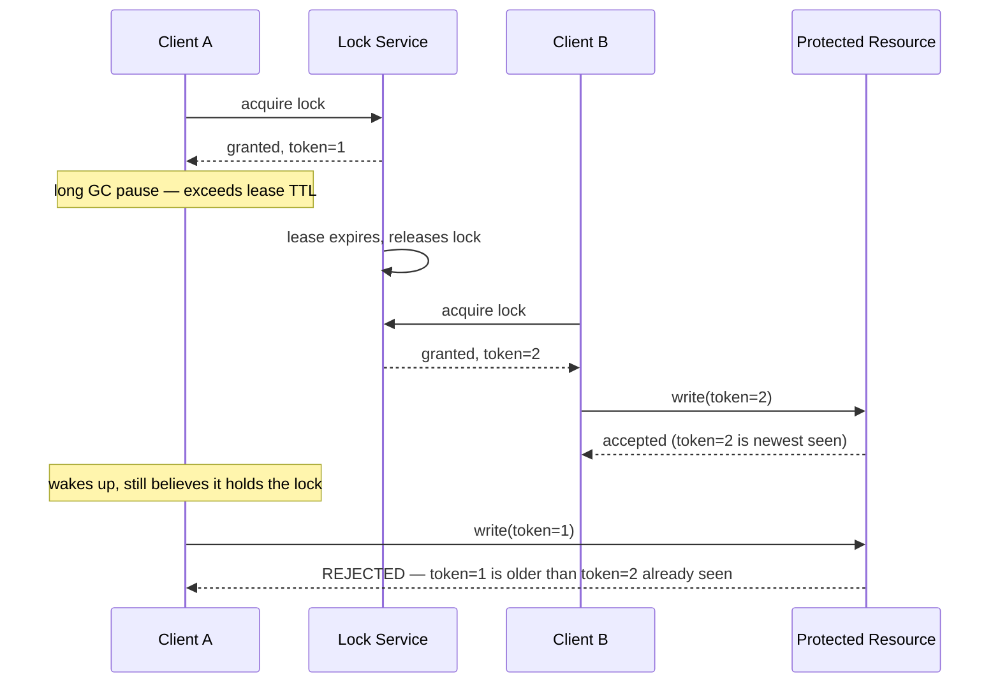
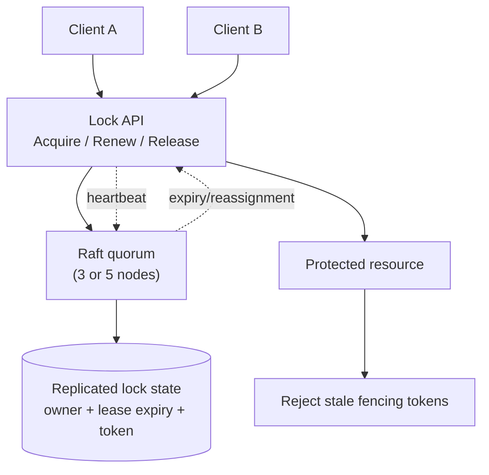

# Design a Distributed Lock Service (build ZooKeeper/etcd-lite)

> [!abstract] How to read this chapter
> Built phase by phase toward one famous failure mode: the **fencing token problem**, where a "correct" lock still allows a mutual-exclusion violation. Each phase adds one idea, exposes the next bottleneck, and fixes it — priorities are correctness-critical, not throughput-critical.

> [!question] The interview question
> "Design a distributed lock service that multiple independent processes across different machines can use to coordinate exclusive access to a shared resource."

---

## Requirements

**Functional**
- **Acquire** (blocking or with timeout).
- **Release**.
- **Automatic release** if the holder crashes — no permanent deadlock from a dead holder.

**Non-functional**

| Requirement | Why it matters here specifically |
|---|---|
| **Correctness is paramount** | Two clients simultaneously believing they hold the same lock is a severe, system-wide bug, not an inconvenience. |
| **The service survives node failures** | It needs its own high availability, which itself requires consensus. |

---

## Phase 00 — Capacity math: correctness, not throughput

| Quantity | Derivation | Result |
|---|---|---|
| QPS | coordination, not bulk data | thousands/s, not millions |
| The bar | latency + correctness | extremely strict |

> [!example] In plain words
> Lock services coordinate; they don't move bulk data. QPS is modest, but latency and **correctness** are extremely strict. Frame this explicitly — the estimation profile is correctness-critical, unlike most chapters.

---

## Phase 01 — The naive version: a single DB row lock

*Start with `UPDATE ... WHERE locked_by IS NULL` so its two failures name the fixes.*

Breaks two ways:
- If the holder crashes without releasing, the lock is held **forever** (permanent deadlock).
- The database itself has no stated high-availability story.

| 🔴 Bottleneck | 🟢 Next fix |
|---|---|
| A dead holder deadlocks the lock permanently, and the store isn't HA. | Lease-based locks with heartbeat + a consensus-backed cluster (Phase 2). |

---

## Phase 02 — Lease-based locks + a strongly-consistent cluster

*Auto-release on crash, and make the lock service itself fault-tolerant.*

A lock is acquired with an associated **lease/TTL**; the holder periodically [[Glossary/Heartbeat (Health Check)|heartbeats]] to renew it. If the holder crashes and stops heartbeating, the lease expires and the lock auto-releases — breaking the "holder crashed = permanent deadlock" mode.

The operations must be atomic and ownership-checked:
- `Acquire(resource, owner, lease)` — succeeds only if free; returns a lease ID plus fencing token.
- `Renew(resource, lease_id)` — extends only for the current owner; a stale client can't renew someone else's lease.
- `Release(resource, lease_id)` — deletes only if the lease ID matches; a delayed release from an old owner must not release a newer owner's lock.

Expiry uses a **monotonic server-side clock** — client wall clocks aren't safe for deciding lease validity.

**The lock service itself is a small, HA, strongly-consistent cluster** — exactly what ZooKeeper/etcd *are*: a small (3 or 5 node) cluster running [[Glossary/Raft (Consensus)|Raft]] internally. The same consensus that prevents split-brain leader election elsewhere ensures no two clients can *both* be told "you hold the lock."

| 🔴 Bottleneck | 🟢 Next fix |
|---|---|
| Even a correct lease-based lock has a famous hole: a paused-then-resumed client can act on a stale belief it still holds the lock. | Fencing tokens (Phase 3). |

---

## Phase 03 — Deep dive: the fencing token problem

> [!warning] The single most important thing in this chapter
> Even a correctly-implemented lease-based lock has a subtle, famous failure mode.

**The scenario:** Client A acquires the lock, then experiences a long pause — a GC pause, or simply being slow — exceeding the lease TTL. The lock service, believing A crashed, expires A's lease and grants the lock to Client B. B starts work, correctly believing it holds the lock exclusively. Then **A wakes up**, still (incorrectly) believing it holds the lock, and *also* does work. **Both A and B now act as if they hold exclusive access** — a genuine mutual-exclusion violation, despite the lock mechanism working exactly as designed.

**The fix — fencing tokens.** Every grant issues a **monotonically increasing token** alongside the lock. Any operation using the lock must include this token — and critically, the **protected resource** (not just the lock service) must reject any operation carrying a token **older** than one it has already seen. So even if stale A acts on its old token, the resource itself rejects it, having already seen a newer token from B.

> [!tip] Correctness moves to the resource, not the holder's belief
> The lock service alone can never fully solve this — a client's *belief* that it holds a lock can always be stale due to pauses no service can prevent. Fencing tokens work because the **resource itself** becomes the final arbiter, refusing to trust a stale token regardless of what the client believes.

| 🔴 Bottleneck | 🟢 Next fix |
|---|---|
| Individual pieces handled — assemble the authority picture. | Final architecture (Phase 4). |

---

## Phase 04 — The final combined architecture

The Raft cluster is the authority for lock ownership, lease expiry, and token allocation. Clients do the work *outside* the lock service and include the fencing token in each protected write. The **protected resource must persist the newest token it has accepted** — otherwise the lock service can't defend against a paused client.

**Five principles to close with:**
1. Correctness over throughput — two clients believing they hold one lock is catastrophic.
2. Lease + heartbeat auto-releases a crashed holder; a naive single-row DB lock deadlocks forever.
3. The lock service is a small Raft cluster (3/5 nodes) — consensus is what prevents "both told they hold it."
4. Even a correct lease has the fencing-token hole: a paused-then-resumed client acts on a stale belief.
5. Fencing tokens push final arbitration to the protected resource, which rejects any token older than one it's seen.

---

## Interviewer follow-ups, answered

> [!quote]- "Lock holder crashes without releasing?"
> The lease expires after its TTL without renewal, and the lock auto-releases.

> [!quote]- "Why isn't a simple lease-based lock fully sufficient?"
> The fencing token problem — a paused-then-resumed client can act on a stale belief it still holds the lock, even though the lease already expired and was reassigned. *The* expected deep-dive for this chapter.

> [!quote]- "Why a small cluster (3–5 nodes) instead of many?"
> Raft needs a quorum; more nodes mean slower consensus (more participants to coordinate) with diminishing fault-tolerance benefit — 3 tolerate 1 failure, 5 tolerate 2, and going further trades meaningfully more latency for marginal safety most deployments don't need.

---

## Production experience

> [!info] What to monitor
> Leader election frequency (frequent elections signal cluster instability). Lock contention/wait time (a spike can mean a client holding locks longer than necessary). Lease renewal failure rate. **Fencing token adoption across downstream protected resources** — a resource that doesn't check tokens stays vulnerable to the GC-pause problem regardless of how correct the lock service is, a real rollout concern.

---

## Cheat sheet — if you remember nothing else

1. Correctness is everything — two holders of one lock is a severe bug; QPS is modest.
2. Lease + heartbeat auto-releases a crashed holder; ownership-check every Renew/Release by lease ID; expire on a monotonic server clock.
3. The lock service is a small Raft cluster (3/5) — consensus prevents split-brain "both hold it."
4. The fencing-token problem: a GC-paused client resumes believing it still holds the lock and acts alongside the new holder.
5. Fix with monotonic fencing tokens the **protected resource** enforces — it rejects any token older than one already seen.

---
*Related: [[00 - Start Here/How This Handbook Works|Book Map]] · [[Glossary/Raft (Consensus)|Raft]] · [[Glossary/Heartbeat (Health Check)|Heartbeat]]*
