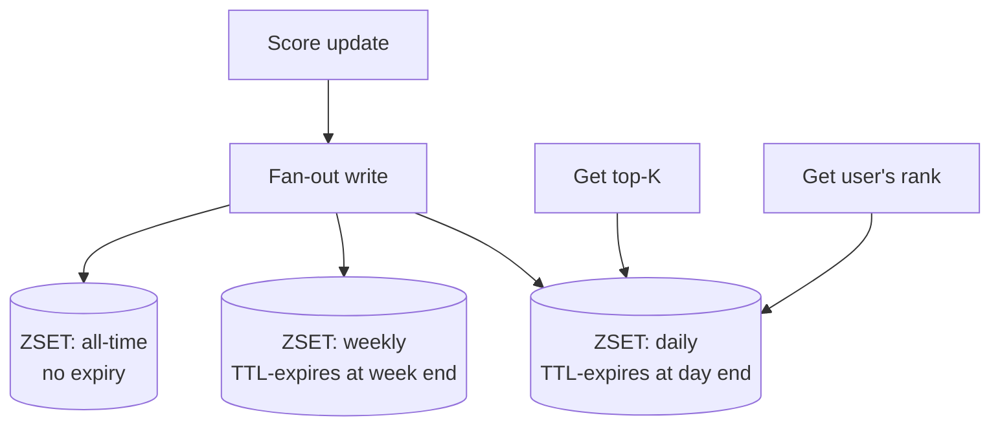

# Design a Real-Time Leaderboard

> [!abstract] What you'll be able to do after this chapter
> Explain precisely why Redis sorted sets solve the individual-rank-lookup bottleneck a SQL approach can't, tracing it back to the skip-list mechanics already covered — not just "Redis is fast."

---

## Step 1 — The interview question

> [!question] As an interviewer would ask it
> "Design a real-time leaderboard — track user scores, efficiently return the top-K users and a specific user's rank, updated live as scores change."

## Step 2 — Requirements

**Functional:** update a score, get top-K, get a specific user's rank/score, support multiple independent leaderboards (daily/weekly/all-time). **Non-functional:** low-latency reads (checked constantly), high-frequency writes during active play, accurate ranking under concurrent updates.

## Step 3 — Back-of-envelope estimation

Assume 10M active users, ~5 score updates/user/hour during active play — significant continuous write volume. Leaderboard **views** happen even more often, as players check standing — another read-heavy skew.

## Step 4 — Building it incrementally

**v0 — naive SQL.** `SELECT * ORDER BY score DESC LIMIT K` for top-K, and a `COUNT` query for a user's rank. Top-K is manageable with an index; the **rank query is the real problem** — "how many rows have a higher score" doesn't benefit from a simple B+Tree equality lookup the way point queries do, and at high QPS with millions of users this becomes a genuine bottleneck — especially since **individual rank checks are the more frequent, more latency-sensitive operation** (most players care about their own rank far more often than browsing the full top-K).

**Fix — Redis Sorted Set (ZSET).** The canonical ZSET use case, directly from [[CS Fundamentals/04 - Caching/Redis Internals|Redis Internals]]: `ZADD leaderboard score user_id` for updates (`O(log n)`), `ZREVRANGE` for top-K (`O(log n + K)`), and critically `ZREVRANK` for a specific user's rank in **`O(log n)`** — solving exactly the bottleneck the SQL approach couldn't.

---

## Step 5 — Deep dive: why ZSET rank lookup is actually O(log n)

> [!tip] Delivering on Redis Internals' promise, concretely
> A skip list's layered "express lane" structure lets it determine **how many elements come before a given one** during the *same* traversal used to locate that element — rank isn't a separate counting pass, it's a byproduct of the search itself. This is the concrete mechanical reason `ZRANK`/`ZREVRANK` is fast, not just "Redis is fast."

### Multiple leaderboards (daily/weekly/all-time)

Maintain **separate ZSETs per time window** (`leaderboard:daily:2026-07-15`, `leaderboard:weekly:2026-W29`, `leaderboard:alltime`). A single score update fans out to all relevant ZSETs. Daily/weekly ZSETs can simply **expire via Redis TTL** after their window closes — a natural, elegant way to keep memory bounded without an explicit reset operation.

### Scaling beyond one node

Most individual leaderboards fit comfortably on one Redis node given ZSET's efficiency — shard by leaderboard ID/game-mode across multiple instances only if a single leaderboard's scale or aggregate cross-leaderboard traffic genuinely exceeds one node's throughput.

## Step 6 — Full architecture

---

## Step 7 — Interviewer follow-ups, answered

> [!quote]- "Why not just use a SQL database with an index on score?"
> The rank-counting query doesn't benefit from a simple index the way an equality lookup does — it's effectively `O(n)`-ish at scale, exactly the bottleneck ZSET's skip-list structure avoids by tracking rank as an intrinsic structural property.

> [!quote]- "How do you handle a leaderboard with hundreds of millions of users?"
> Shard by leaderboard/game-mode if truly needed — but also worth naming the product-level question: does "your exact rank among 500M players" even need to be exact, or would an approximate/percentile-based rank serve the product just as well at far lower cost? A real engineering-vs-product tradeoff worth surfacing, not just an infra answer.

> [!quote]- "How do you reset a daily leaderboard at midnight without a race condition mid-update?"
> TTL-based natural expiry rather than an explicit bulk-delete "reset" operation — avoids ever needing to coordinate a risky deletion during active concurrent writes.

> [!quote]- "How is a tie broken when two users have the exact same score?"
> Redis ZSET breaks ties lexicographically by member name by default — or, for a real product wanting a specific tiebreak (e.g. earliest-achieved-timestamp wins), encode a composite value into the score itself, e.g. `score * 1_000_000 - timestamp_offset`, a real, commonly-used trick worth naming.

## Step 8 — Production experience

> [!info] What to monitor
> ZSET memory usage per leaderboard — a very large all-time leaderboard tracking every user forever can grow significant footprint; consider pruning long-inactive users from it. Score-update write latency. Top-K and individual-rank read latency **tracked separately**, since they're different access patterns that can have different latency profiles worth distinguishing.

---
*Related: [[00 - Start Here/How This Handbook Works|Book Map]] · [[CS Fundamentals/04 - Caching/Redis Internals|Redis Internals]] · [[HLD/06 - Design Twitter - News Feed/Design Twitter - News Feed|Design Twitter / News Feed]] (another ZSET use case)*
