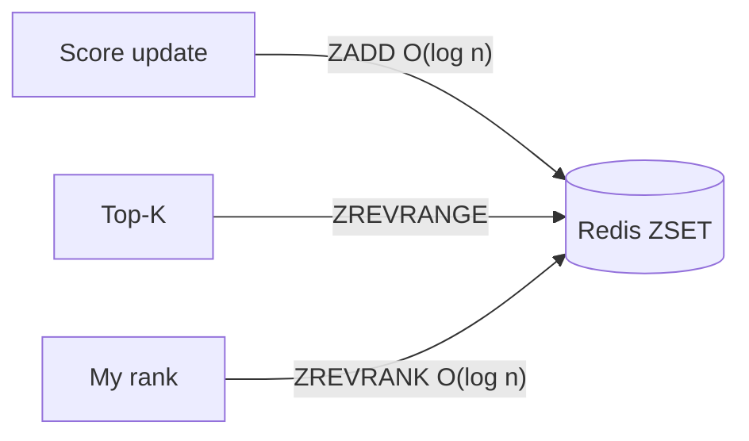
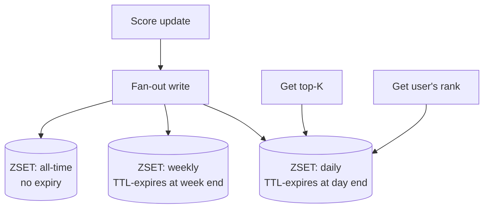

# Design a Real-Time Leaderboard

> [!abstract] How to read this chapter
> Built phase by phase around one bottleneck SQL can't solve cheaply — a *specific user's rank* — and why a Redis sorted set's skip-list structure makes it `O(log n)`. Each phase adds one idea, exposes the next bottleneck, and fixes it.

> [!question] The interview question
> "Design a real-time leaderboard — track user scores, efficiently return the top-K users and a specific user's rank, updated live as scores change."

---

## Requirements

**Functional**
- **Update** a score.
- Get **top-K**.
- Get a **specific user's rank/score**.
- Support **multiple independent leaderboards** (daily/weekly/all-time).

**Non-functional**

| Requirement | Why it matters here specifically |
|---|---|
| **Low-latency reads** | Players check standing constantly — and individual-rank checks are the most frequent read. |
| **High-frequency writes** | Scores change continuously during active play. |
| **Accurate ranking under concurrency** | Concurrent updates must not corrupt the ordering. |

---

## Phase 00 — Capacity math you can defend

| Quantity | Derivation | Result |
|---|---|---|
| Write volume | 10M active × ~5 updates/hr | significant continuous writes |
| Read volume | players check standing | even higher — read-heavy skew |

> [!example] In plain words
> Both a heavy write stream (score updates) and a heavier read stream (rank/standing checks). The single hardest read is **"what's my rank?"** — far more frequent than browsing the top-K.

---

## Phase 01 — The naive version: SQL `ORDER BY score`

*Start with SQL so the rank query names the bottleneck.*

`SELECT * ORDER BY score DESC LIMIT K` for top-K, and a `COUNT` query for a user's rank. Top-K is manageable with an index; the **rank query is the real problem** — "how many rows have a higher score" doesn't benefit from a simple B+Tree equality lookup the way point queries do, and at high QPS with millions of users this becomes a genuine bottleneck.

> [!bug] The individual rank query is the frequent one
> Most players care about *their own rank* far more often than browsing the full top-K — so the operation SQL is worst at is also the most latency-sensitive and most frequent.

| 🔴 Bottleneck | 🟢 Next fix |
|---|---|
| "How many users score higher than me" is effectively an `O(n)`-ish count in SQL — the most frequent, most latency-sensitive read. | A structure where rank is intrinsic: Redis ZSET (Phase 2). |

---

## Phase 02 — Redis Sorted Set (ZSET)

*The canonical ZSET use case — rank becomes a byproduct of the search, not a separate count.*

Directly from [[CS Fundamentals/04 - Caching/Redis Internals|Redis Internals]]:
- `ZADD leaderboard score user_id` — update, `O(log n)`.
- `ZREVRANGE` — top-K, `O(log n + K)`.
- `ZREVRANK` — a specific user's rank, **`O(log n)`** — solving exactly the bottleneck SQL couldn't.

| 🔴 Bottleneck | 🟢 Next fix |
|---|---|
| "Redis is fast" isn't an explanation — *why* is `ZREVRANK` `O(log n)`? And daily/weekly/all-time need separate handling. | Skip-list mechanics + multiple leaderboards (Phase 3). |

---

## Phase 03 — Deep dive: why rank lookup is O(log n), and multiple boards

> [!tip] Delivering on Redis Internals' promise, concretely
> A skip list's layered "express lane" structure lets it determine **how many elements come before a given one** during the *same* traversal used to locate that element — rank isn't a separate counting pass, it's a byproduct of the search itself. That's the concrete mechanical reason `ZRANK`/`ZREVRANK` is fast, not just "Redis is fast."

**Multiple leaderboards (daily/weekly/all-time).** Maintain **separate ZSETs per window** (`leaderboard:daily:2026-07-15`, `leaderboard:weekly:2026-W29`, `leaderboard:alltime`). A score update fans out to all relevant ZSETs. Daily/weekly ZSETs simply **expire via Redis TTL** after their window closes — bounding memory without an explicit reset operation.

**Scaling beyond one node.** Most individual leaderboards fit comfortably on one Redis node given ZSET's efficiency — shard by leaderboard ID/game-mode across instances only if a single leaderboard's scale or aggregate cross-leaderboard traffic genuinely exceeds one node.

| 🔴 Bottleneck | 🟢 Next fix |
|---|---|
| Individual pieces handled — assemble the fan-out picture. | Final architecture (Phase 4). |

---

## Phase 04 — The final combined architecture

**Four principles to close with:**
1. The hard, frequent operation is "my rank" — SQL is worst at exactly that.
2. ZSET makes update, top-K, and rank all `O(log n)` — the canonical sorted-set use case.
3. Rank is `O(log n)` because a skip list computes position *during* the search — not a separate count.
4. Separate ZSET per time window with TTL-based expiry bounds memory and avoids risky mid-write resets.

---

## Interviewer follow-ups, answered

> [!quote]- "Why not just SQL with an index on score?"
> The rank-counting query doesn't benefit from a simple index the way an equality lookup does — it's effectively `O(n)`-ish at scale, exactly the bottleneck ZSET's skip-list avoids by tracking rank as an intrinsic structural property.

> [!quote]- "Leaderboard with hundreds of millions of users?"
> Shard by leaderboard/game-mode if truly needed — but also surface the product question: does "your exact rank among 500M players" even need to be exact, or would approximate/percentile rank serve just as well at far lower cost? A real engineering-vs-product tradeoff.

> [!quote]- "Reset a daily leaderboard at midnight without a race condition?"
> TTL-based natural expiry rather than an explicit bulk-delete "reset" — avoids coordinating a risky deletion during active concurrent writes.

> [!quote]- "Tie-break when two users have the same score?"
> Redis ZSET breaks ties lexicographically by member name by default — or, for a specific tiebreak (earliest-achieved wins), encode a composite value into the score, e.g. `score * 1_000_000 - timestamp_offset`, a commonly-used trick.

---

## Production experience

> [!info] What to monitor
> ZSET memory per leaderboard — a very large all-time board tracking every user forever grows a significant footprint; consider pruning long-inactive users. Score-update write latency. Top-K and individual-rank read latency **tracked separately**, since they're different access patterns with potentially different latency profiles.

---

## Cheat sheet — if you remember nothing else

1. The frequent, latency-sensitive read is "my rank" — SQL's rank-count is its weakest query.
2. Redis ZSET makes update (`ZADD`), top-K (`ZREVRANGE`), and rank (`ZREVRANK`) all `O(log n)`.
3. Rank is `O(log n)` because a skip list computes position during the same traversal that locates the element.
4. Separate ZSET per window (daily/weekly/all-time), TTL-expire the time-boxed ones — bounded memory, no risky reset.
5. Most boards fit one node; shard by game-mode only if needed; encode composite scores for deterministic tiebreaks.

---
*Related: [[00 - Start Here/How This Handbook Works|Book Map]] · [[CS Fundamentals/04 - Caching/Redis Internals|Redis Internals]] · [[HLD/06 - Design Twitter - News Feed/Design Twitter - News Feed|Design Twitter / News Feed]] (another ZSET use case)*
