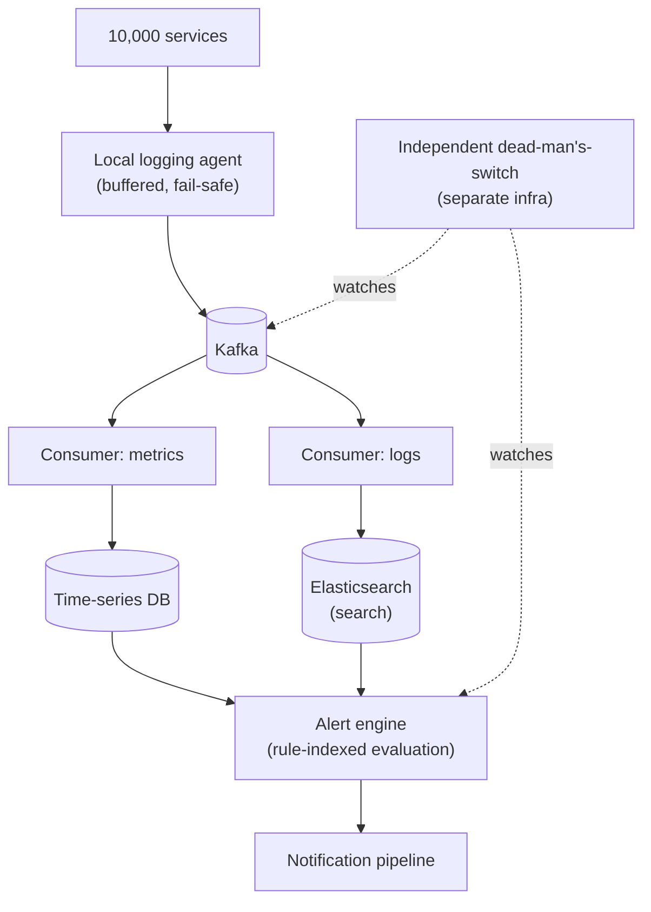

# Design a Log Aggregation / Monitoring System

> [!abstract] How to read this chapter
> Built phase by phase around one meta-requirement — the monitor must be *more reliable than what it monitors* — plus why logs and metrics belong in different stores, and an alert pipeline that scales to thousands of rules. Each phase adds one idea, exposes the next bottleneck, and fixes it.

> [!question] The interview question
> "Design a log aggregation and monitoring system (like Splunk/Datadog/ELK) that ingests logs and metrics from thousands of services, makes them searchable, and triggers alerts on defined conditions."

---

## Requirements

**Functional**
- Ingest **logs/metrics** from many source services.
- Full-text **search** over historical logs.
- **Dashboards** over metrics.
- Define **alert rules** that trigger notifications.

**Non-functional**

| Requirement | Why it matters here specifically |
|---|---|
| **Massive sustained ingestion** | Likely the highest sustained raw ingestion of any case study here. |
| **More reliable than what it monitors** | If it shares failure domains with what it watches, it goes blind exactly when visibility matters most. |
| **Low-latency alerting** | A critical alert firing minutes late defeats its purpose. |
| **Cost-reasonable retention** | Most logs are rarely queried after a short window; some must be kept much longer for compliance. |

---

## Phase 00 — Capacity math you can defend

| Quantity | Derivation | Result |
|---|---|---|
| Log lines/sec | 10,000 services × ~100/s | **1M lines/sec** aggregate |
| Log volume | 1M/s × ~200 B | ~200 MB/s ≈ **17 TB/day** (logs alone) |
| Metrics | smaller per point, huge count | very high datapoint volume on top |

> [!example] In plain words
> The highest sustained ingestion in this book. No traditional DB write path survives 1M lines/sec — and the system must stay up when everything else is down. Those two facts drive the whole design.

---

## Phase 01 — The naive version: services write to a shared DB

*Start with direct writes so both failures name the fixes.*

Each service writes logs directly to a shared database. Breaks immediately:
- No traditional DB write path survives 1M lines/sec.
- Worse — if the shared DB goes down, **every service's logging breaks too**, coupling monitoring availability to a single shared dependency. Exactly the failure-domain-sharing the requirements warned against.

| 🔴 Bottleneck | 🟢 Next fix |
|---|---|
| A shared DB can't take the volume and couples every service's logging to one dependency. | Decouple ingestion with a queue + a fail-safe local agent (Phase 2). |

---

## Phase 02 — Decouple ingestion via a queue

*Absorb the firehose and break the failure-domain coupling.*

Each service publishes to [[CS Fundamentals/05 - Messaging & Streaming/Kafka Internals|Kafka]] asynchronously — the identical decoupling from [[HLD/04 - Design a Notification Service/Design a Notification Service|the Notification Service chapter]], applied to logs. Kafka absorbs ingestion bursts and decouples producers (services) from consumers (the indexing pipeline).

> [!warning] The local logging agent must be fail-safe by design
> Each host runs a lightweight local agent that buffers logs and tolerates brief Kafka unavailability without blocking the service's own primary work. A logging problem must **never** take down the service being monitored — a hard design constraint, not an implementation detail. Under extreme pressure, drop logs rather than block.

| 🔴 Bottleneck | 🟢 Next fix |
|---|---|
| Consumers still need somewhere to write — and logs and metrics have fundamentally different query patterns. | Split storage by data shape (Phase 3). |

---

## Phase 03 — Split storage by data shape

*Logs and metrics are queried differently — don't force them into one store.*

- **Logs** → a search-optimized inverted-index store (Elasticsearch-style, reusing [[HLD/23 - Design an E-commerce System/Design an E-commerce System|the E-commerce chapter's search reasoning]]) for "search my logs for this error."
- **Metrics** → a **time-series database** (Prometheus/InfluxDB-style), built for high-cardinality, high-frequency numeric points indexed by time, optimized for range queries and aggregation, not full-text search.

> [!bug] Forcing logs and metrics into one store is a real, common mistake
> Fundamentally different query patterns — full-text search vs time-range aggregation. Name it explicitly as a real-world design error, not a hypothetical.

| 🔴 Bottleneck | 🟢 Next fix |
|---|---|
| Storage is solved, but "who watches the watcher", retention cost, and evaluating thousands of alert rules all remain. | Monitoring the monitor + retention + alert indexing (Phase 4). |

---

## Phase 04 — Deep dive: watching the watcher, retention, alert indexing

**The "who watches the watcher" problem, with teeth.** The meta-requirement needs an actual mechanism: a **separate, minimal, independently-hosted** health check — a dead-man's-switch ("has this pipeline reported healthy in the last N minutes") running on genuinely different infrastructure from the main ingestion path, so a total outage of the main system still triggers a page. Easy to overlook, one of the most important decisions here.

**Retention tiering.** Recent logs (say, last 7 days) live in fast, expensive storage for interactive search. Older logs move to cheaper, slower storage (or compressed/archived) for compliance — rarely queried, but kept for audit. Reuse of caching/storage-tiering ideas, applied to log retention.

**Alert evaluation at scale.** Evaluating thousands of rules continuously against a firehose is a real computational problem. Instead of scanning all incoming data against all rules, **index alert rules by the specific metric/log pattern they care about** — an incoming data point is evaluated only against the small subset of relevant rules, not all rules globally.

| 🔴 Bottleneck | 🟢 Next fix |
|---|---|
| Individual pieces handled — assemble, including the independent watcher. | Final architecture (Phase 5). |

---

## Phase 05 — The final combined architecture

**Five principles to close with:**
1. The monitor must not share failure domains with what it monitors — or it goes blind exactly when needed.
2. Decouple ingestion via Kafka; the local agent is fail-safe and drops rather than blocks the service.
3. Logs → inverted-index search store; metrics → time-series DB — different query shapes, different systems.
4. An independent dead-man's-switch on separate infra pages when the main system is entirely down.
5. Index alert rules by the pattern they watch so each datapoint hits only its relevant rules; tier retention by age.

---

## Interviewer follow-ups, answered

> [!quote]- "Why must monitoring avoid sharing failure domains with what it monitors?"
> Because it goes blind exactly when visibility matters most — the core principle this whole chapter tests.

> [!quote]- "Why store logs and metrics in different systems?"
> Fundamentally different query patterns — full-text search vs time-range aggregation.

> [!quote]- "Keep the logging agent from ever impacting the service?"
> Lightweight, local buffering, fail-safe/drop-rather-than-block under extreme pressure — better to lose some logs during an extreme event than have logging cause the outage being investigated.

> [!quote]- "Evaluate thousands of alert rules efficiently against a huge stream?"
> Rule-indexing by relevant metric/pattern — each datapoint is evaluated only against the small subset of rules that care about it, not all rules globally.

---

## Production experience

> [!info] What to monitor (recursively, about the monitor itself)
> Kafka consumer lag for the ingestion pipeline (standard practice, applied to the monitoring system's own pipeline). Alert evaluation latency — time from threshold breach to alert firing, the product-critical metric. The independent dead-man's-switch signal — this **is** the top-level "is our observability stack alive" metric. Storage cost by tier — a direct infrastructure lever.

---

## Cheat sheet — if you remember nothing else

1. The monitor must be more reliable than what it watches — never share failure domains, or it blinds itself.
2. No DB survives 1M lines/sec — decouple with Kafka; the local agent buffers and drops rather than blocking the service.
3. Logs → inverted-index search store; metrics → time-series DB — different query patterns, separate systems.
4. An independent dead-man's-switch on separate infra pages when the whole pipeline is down.
5. Index alert rules by the pattern they watch (evaluate only relevant rules); tier log retention hot → cheap by age.

---
*Related: [[00 - Start Here/How This Handbook Works|Book Map]] · [[CS Fundamentals/05 - Messaging & Streaming/Kafka Internals|Kafka Internals]] · [[HLD/04 - Design a Notification Service/Design a Notification Service|Design a Notification Service]]*
