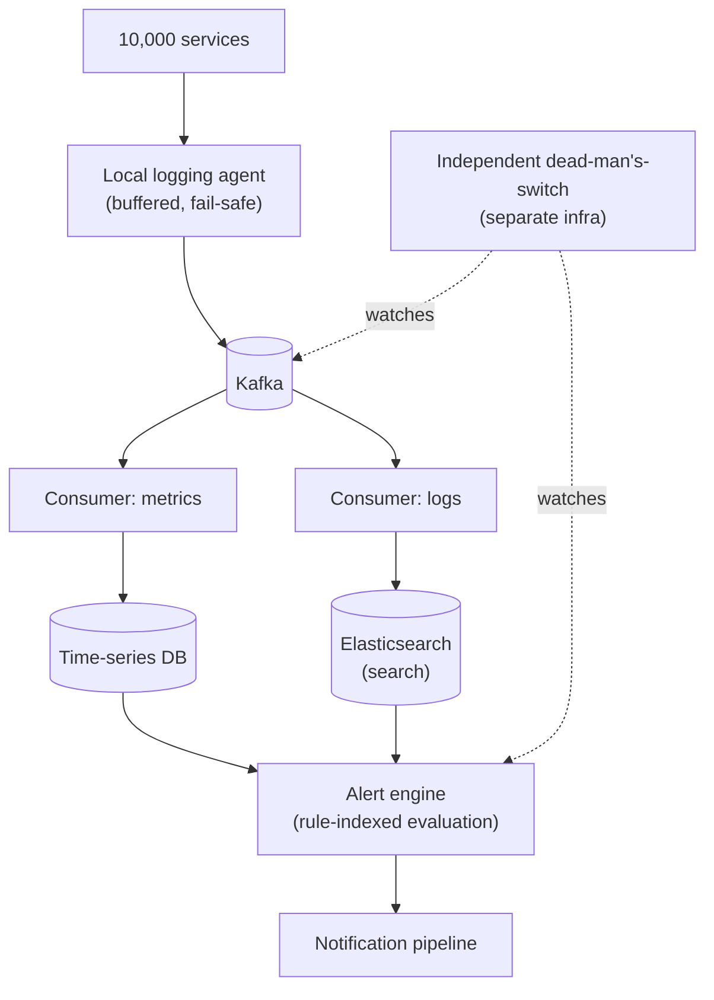

# Design a Log Aggregation / Monitoring System

> [!abstract] What you'll be able to do after this chapter
> Justify why a monitoring system must never share failure domains with what it monitors, explain precisely why logs and metrics belong in different storage systems, and design an alert-evaluation pipeline that scales to thousands of rules against a huge incoming stream.

---

## Step 1 — The interview question

> [!question] As an interviewer would ask it
> "Design a log aggregation and monitoring system (like Splunk/Datadog/ELK) that ingests logs and metrics from thousands of services, makes them searchable, and triggers alerts on defined conditions."

## Step 2 — Requirements

**Functional:** ingest logs/metrics from many source services, full-text search over historical logs, dashboards over metrics, define alert rules that trigger notifications.

**Non-functional:**
- Massive sustained ingestion volume.
- **The monitoring system must be *more* reliable than the systems it monitors** — a classic, important meta-requirement. If it shares failure domains with what it watches, it goes blind exactly when visibility matters most.
- Low-latency alerting — a critical alert firing minutes late defeats its purpose.
- Cost-reasonable long-term retention — most logs are rarely queried after a short window, but some must be retained much longer for compliance.

## Step 3 — Back-of-envelope estimation

10,000 services × ~100 log lines/sec average = **1M log lines/sec** aggregate — likely the highest sustained raw ingestion volume of any case study in this book. At ~200 bytes/line: `1M × 200B = 200MB/sec ≈ 17TB/day` for logs alone (before metrics, which are smaller per-datapoint but very high in total datapoint count given how many metric time-series a large infrastructure emits).

## Step 4 — Building it incrementally

**v0 — naive.** Each service writes logs directly to a shared database. Breaks immediately: no traditional DB write path survives 1M lines/sec, and worse — if the shared database goes down, **every service's logging breaks too**, coupling monitoring availability to a single shared dependency. Exactly the failure-domain-sharing the requirements warned against.

**Fix — decouple ingestion from processing via a queue.** Each service publishes to [[CS Fundamentals/05 - Messaging & Streaming/Kafka Internals|Kafka]] asynchronously — the identical decoupling reasoning from [[HLD/04 - Design a Notification Service/Design a Notification Service|the Notification Service chapter]], applied to logs instead of notifications. Kafka absorbs ingestion bursts and decouples producers (services) from consumers (the indexing pipeline).

> [!warning] The local logging agent must be fail-safe by design
> Each service host runs a lightweight local agent that buffers logs and tolerates brief Kafka unavailability without blocking the service's own primary work. A logging problem must **never** take down the service being monitored — worth stating as a hard design constraint, not an implementation detail.

**Split storage by data shape.** Consumers write logs to a search-optimized inverted-index store (Elasticsearch-style, direct reuse of [[HLD/23 - Design an E-commerce System/Design an E-commerce System|the E-commerce chapter's search-infrastructure reasoning]]) for "search my logs for this error." Metrics go to a **time-series database**, purpose-built for high-cardinality, high-frequency numeric points indexed by time (Prometheus/InfluxDB-style), optimized for range queries and aggregation rather than full-text search.

> [!bug] Forcing logs and metrics into one storage system is a real, common mistake
> Logs and metrics have fundamentally different query patterns — full-text search vs. time-range aggregation. Worth naming this explicitly as a real-world design error, not a hypothetical one.

---

## Step 5 — Deep dive: monitoring the monitor, retention tiering, alert-rule indexing

### The "who watches the watcher" problem, with real teeth

The Step 2 meta-requirement needs an actual mechanism: a **separate, minimal, independently-hosted** health check — a simple dead-man's-switch ("has this pipeline reported healthy in the last N minutes") running on genuinely different infrastructure from the main ingestion path, so a total outage of the main system still triggers a page. Easy to overlook, and one of the most important design decisions in this whole chapter.

### Retention tiering

Recent logs (say, last 7 days) live in fast, expensive storage for interactive search. Older logs move to cheaper, slower storage (or compressed/archived form) for compliance retention — rarely queried, but kept for audit. Direct conceptual reuse of caching/storage-tiering ideas already covered, applied here to log retention specifically.

### Alert evaluation at scale

Evaluating thousands of alert rules continuously against a firehose of incoming data is a real computational problem. Instead of scanning all incoming data against all rules, **index alert rules by the specific metric/log pattern they care about** — an incoming data point is only evaluated against the small subset of rules actually relevant to it, not all rules globally.

## Step 6 — Full architecture

---

## Step 7 — Interviewer follow-ups, answered

> [!quote]- "Why must the monitoring system avoid sharing failure domains with what it monitors?"
> Because it goes blind exactly when visibility matters most — the core-principle answer this whole chapter is testing for.

> [!quote]- "Why store logs and metrics in different systems instead of one?"
> Fundamentally different query patterns — full-text search vs. time-range aggregation. Step 4.

> [!quote]- "How do you keep the logging agent from ever impacting the service it monitors?"
> Lightweight, local buffering, fail-safe/drop-rather-than-block under extreme pressure — it's better to occasionally lose some logs during an extreme event than have logging itself cause the outage being investigated.

> [!quote]- "How would you evaluate thousands of alert rules efficiently against a huge stream?"
> Rule-indexing by relevant metric/pattern — Step 5.

## Step 8 — Production experience

> [!info] What to monitor (recursively, about the monitor itself)
> Kafka consumer lag for the ingestion pipeline (standard Kafka-lag practice, applied to the monitoring system's own pipeline). Alert evaluation latency — time from a threshold breach to an alert firing, the actual product-critical metric for this whole system. The independent dead-man's-switch signal itself — this **is** the top-level "is our observability stack alive" metric. Storage cost by tier — an ongoing, direct infrastructure lever.

---
*Related: [[00 - Start Here/How This Handbook Works|Book Map]] · [[CS Fundamentals/05 - Messaging & Streaming/Kafka Internals|Kafka Internals]] · [[HLD/04 - Design a Notification Service/Design a Notification Service|Design a Notification Service]]*
