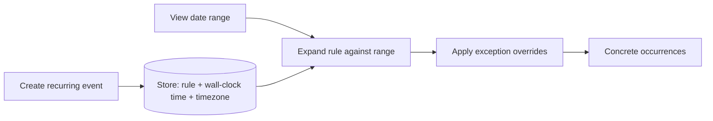
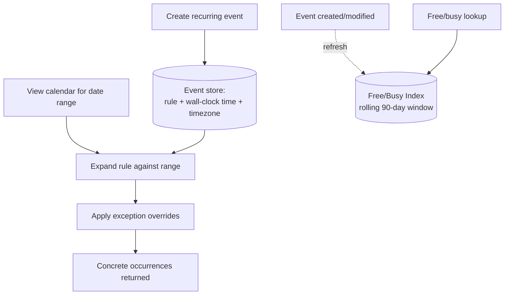

# Design Google Calendar

> [!abstract] How to read this chapter
> Built phase by phase around one rule you must never break — recurring events are never materialized as individual rows — plus the DST-safe way to store recurrence times, and a reused double-booking fix. Each phase adds one idea, exposes the next bottleneck, and fixes it.

> [!question] The interview question
> "Design a calendar system like Google Calendar — create events, invite attendees, recurring events, free/busy lookup, reminders, multi-timezone support."

---

## Requirements

**Functional**
- Create/edit/delete **events**; invite attendees (**RSVP**).
- **Recurring events** with custom rules.
- **Free/busy** lookup for scheduling.
- **Reminders**; multiple calendars per user; **timezone-aware** display.

**Non-functional**

| Requirement | Why it matters here specifically |
|---|---|
| **Heavily read-dominated** | Viewing far outnumbers creating — optimize the read/free-busy path. |
| **Low-latency free/busy** | Used interactively while scheduling — must feel instant. |
| **No recurrence storage blowup** | A 5-year daily standup must not become thousands of rows. |
| **Correctness under concurrent edits** | Including double-booking of shared resources (rooms). |
| **Timezone correctness** | A classic, famously hard problem — DST breaks naive storage. |

---

## Phase 00 — Capacity math you can defend

| Quantity | Derivation | Result |
|---|---|---|
| Writes | 500M users × ~5 events/week | ~2.5B/week → ~4,100/s avg (modest) |
| Reads | ~20× read:write | ~82,000/s peak |

> [!example] In plain words
> Writes are modest; reads (viewing, free/busy, reminders) dominate ~20:1. The design optimizes the read/free-busy path — and the recurrence model exists to keep that read cheap without exploding storage.

---

## Phase 01 — The naive version: one row per occurrence

*Start with materializing every occurrence so its blowup names the fix.*

Store every occurrence of a recurring event as its own row — a 5-year daily standup becomes ~1,825 rows. Breaks: massive storage blowup, and editing "all future occurrences" means updating potentially thousands of rows.

| 🔴 Bottleneck | 🟢 Next fix |
|---|---|
| Materializing occurrences explodes storage and makes series-wide edits a mass update. | Store the rule once, expand on demand (Phase 2). |

---

## Phase 02 — Recurrence rules, expanded on demand

*The single most important architectural decision in this chapter.*

Store a recurring event **once**, with a rule — the real-world standard is **RRULE** (iCalendar, RFC 5545 — e.g. "every Monday at 10am until December 2026"). Occurrences are **computed on demand** when a user views a date range, by expanding the rule against the requested window — never materialized in bulk.

**Exceptions to a series.** A user modifying or cancelling *one* instance ("move just this Tuesday's meeting," "cancel just the 25th") without touching the rest needs an **exception record** — parent event + specific date, overriding the computed occurrence for that date. Rule expansion checks for and applies exceptions when generating occurrences.

| 🔴 Bottleneck | 🟢 Next fix |
|---|---|
| "Is this person free at 2pm Tuesday" would expand every rule on every query — too slow interactively. | Precompute a free/busy index (Phase 3). |

---

## Phase 03 — Fast free/busy via a precomputed index

*Interactive scheduling can't expand rules on every query.*

At scale, maintain a **precomputed free-busy index** for a rolling near-term window (e.g. 90 days), refreshed when events change — the same "shift cost to a less-frequent background operation" principle as [[HLD/11 - Design Search Autocomplete - Typeahead/Design Search Autocomplete|Autocomplete's trie precomputation]] and [[HLD/06 - Design Twitter - News Feed/Design Twitter - News Feed|News Feed's fan-out-on-write]].

| 🔴 Bottleneck | 🟢 Next fix |
|---|---|
| Two events can double-book one conference room, and naive time storage silently breaks under DST. | Atomic room claim + DST-safe recurrence storage (Phase 4). |

---

## Phase 04 — Deep dive: double-booking and the DST bug

**Shared-resource conflict prevention.** Two events double-booking the same conference room is **structurally the identical race condition** as [[LLD/06 - Design BookMyShow - Seat Booking/Design BookMyShow - Seat Booking|BookMyShow's seat double-booking]] and [[HLD/10 - Design Uber/Design Uber|Uber's driver matching]] — the fix is the same: an **atomic check-and-claim** on the room's booking state, never a separate check-then-book.

**The DST bug — a genuine, famous gotcha.**

> [!bug] "My recurring 9am meeting shifted to 8am after daylight saving time"
> This happens when a system stores a recurring event's time as a **fixed UTC instant** rather than a **timezone-aware wall-clock rule.** If a recurring 9am meeting is stored as "14:00 UTC" (assuming a fixed UTC-5 offset), it renders at the wrong **local** time the moment DST shifts that offset. The correct storage: keep the rule in **wall-clock time plus the original IANA timezone** ("9:00 AM America/New_York, every Monday") — and resolve to a specific UTC instant only at occurrence-expansion time, using the correct offset **for that specific date**, not a fixed offset baked in at creation.

| 🔴 Bottleneck | 🟢 Next fix |
|---|---|
| Individual pieces handled — assemble the picture. | Final architecture (Phase 5). |

---

## Phase 05 — The final combined architecture

**Five principles to close with:**
1. Never materialize recurring occurrences — store the RRULE once, expand on demand against the viewed window.
2. Per-instance edits are exception records applied during expansion — the series stays untouched.
3. Precompute a rolling free/busy index so interactive scheduling never expands rules live.
4. Store recurrence as wall-clock time + IANA timezone; resolve to UTC per-occurrence using that date's DST offset.
5. Room double-booking is the same race as seats/drivers — fix with an atomic check-and-claim.

---

## Interviewer follow-ups, answered

> [!quote]- "Edit just one occurrence of a recurring event?"
> An exception record tied to the parent series + specific date, applied as an override during rule expansion — the rest of the series is untouched.

> [!quote]- "Prevent double-booking a shared conference room?"
> The same atomic check-and-claim discipline established for seats and drivers — never a separate check-then-book.

> [!quote]- "Why does storing a fixed UTC time for recurring events break under DST?"
> A recurring event is a local wall-clock rule plus its IANA timezone (e.g. "every Monday 9:00 AM America/New_York"). The service converts each occurrence to UTC when expanding for a specific date, using that date's DST offset. One fixed UTC instant would shift the meeting to 8:00 or 10:00 local when the offset changes.

> [!quote]- "Scale 'find a meeting time' checking 50 people's calendars?"
> Fetch each person's precomputed free-busy index in parallel, then merge — a fan-**in** read pattern (many lookups converging into one answer), the reverse of most fan-out patterns elsewhere.

---

## Production experience

> [!info] What to monitor
> RRULE expansion latency (a pathological long-running rule could be expensive — cap it). Free/busy index staleness. Reminder delivery lag relative to event start — a late reminder is a visible product failure. Extra vigilance/testing around DST transition windows specifically, given the known risk class.

---

## Cheat sheet — if you remember nothing else

1. Store recurring events once as an RRULE and expand on demand — never materialize occurrences as rows.
2. Per-instance changes are exception records applied during expansion; the series stays intact.
3. Precompute a rolling free/busy index so interactive scheduling is a fast lookup, not a live rule expansion.
4. Store wall-clock time + IANA timezone; resolve to UTC per occurrence with that date's DST offset — a fixed UTC instant breaks under DST.
5. Room double-booking = the seats/drivers race — atomic check-and-claim; multi-person availability is a fan-in merge.

---
*Related: [[00 - Start Here/How This Handbook Works|Book Map]] · [[LLD/06 - Design BookMyShow - Seat Booking/Design BookMyShow - Seat Booking|Design BookMyShow]] · [[HLD/10 - Design Uber/Design Uber|Design Uber]] · [[LLD/21 - Design Google Calendar/Design Google Calendar|LLD version]]*
