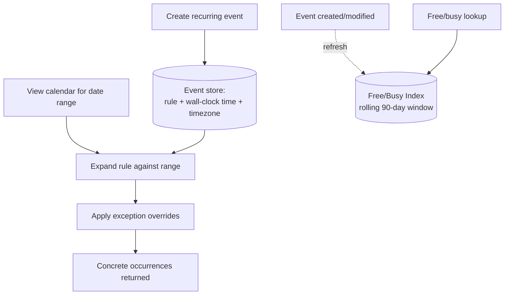

# Design Google Calendar

> [!abstract] What you'll be able to do after this chapter
> Explain why recurring events must never be materialized as individual rows, implement the DST-safe way to store recurrence times, and reuse the exact double-booking fix from BookMyShow/Uber for shared conference-room conflicts.

---

## Step 1 — The interview question

> [!question] As an interviewer would ask it
> "Design a calendar system like Google Calendar — create events, invite attendees, recurring events, free/busy lookup, reminders, multi-timezone support."

## Step 2 — Requirements

**Functional:** create/edit/delete events, invite attendees (RSVP), recurring events with custom rules, free/busy lookup for scheduling, reminders, multiple calendars per user, timezone-aware display.

**Non-functional:** heavily read-dominated (viewing far more common than creating). Low-latency free/busy lookups — used interactively while scheduling. Recurring events must not cause storage blowup. Correctness under concurrent edits, including double-booking of shared resources. **Timezone correctness** — a classic, famously hard problem.

## Step 3 — Back-of-envelope estimation

Assume 500M users, ~5 events/user/week → ~2.5B events/week created (~4,100/sec average write — modest). Reads dominate heavily — viewing, free/busy checks, notification lookups — assume a 20x read:write ratio → ~82,000/sec peak reads.

## Step 4 — Building it incrementally

**v0 — naive.** Store every single occurrence of a recurring event as its own row — a 5-year daily standup becomes ~1,825 rows. Breaks: massive storage blowup, and editing "all future occurrences" means updating potentially thousands of rows.

**Fix — recurrence rules, expanded on demand.** Store a recurring event **once**, with a rule (the real-world standard is **RRULE**, from the iCalendar spec, RFC 5545 — e.g. "every Monday at 10am until December 2026"). Occurrences are **computed on demand** when a user views a date range, by expanding the rule against the requested window — never materialized in bulk. This is the single most important architectural decision in this chapter.

**Exceptions to a series.** A user modifying or cancelling *one* instance ("move just this Tuesday's meeting," "cancel just the 25th") without touching the rest of the series needs an **exception record** — parent event + specific date, overriding the computed occurrence for that date. Rule expansion must check for and apply exceptions when generating occurrences.

**Free/busy lookup, made fast.** Computing "is this person free at 2pm Tuesday" naively means expanding every relevant rule for that window on every query. At scale, maintain a **precomputed free-busy index** for a rolling near-term window (e.g. 90 days), refreshed when events change — the same "shift cost to a less-frequent background operation" principle already used in [[HLD/11 - Design Search Autocomplete - Typeahead/Design Search Autocomplete|Autocomplete's trie precomputation]] and [[HLD/06 - Design Twitter - News Feed/Design Twitter - News Feed|News Feed's fan-out-on-write]].

---

## Step 5 — Deep dive: double-booking, and the DST bug that breaks naive recurrence storage

### Shared-resource conflict prevention

Two events double-booking the same conference room is **structurally the identical race condition** as [[LLD/06 - Design BookMyShow - Seat Booking/Design BookMyShow - Seat Booking|BookMyShow's seat double-booking]] and [[HLD/10 - Design Uber/Design Uber|Uber's driver matching]] — the fix is the same: an atomic check-and-claim on the room's booking state, never a separate check-then-book.

### The DST bug — a genuine, famous gotcha

> [!bug] "My recurring 9am meeting shifted to 8am after daylight saving time"
> This happens when a system stores a recurring event's time as a **fixed UTC instant** rather than a **timezone-aware wall-clock rule**. If a recurring 9am meeting is stored as "14:00 UTC" (assuming a fixed UTC-5 offset), it will render at the wrong **local** wall-clock time the moment DST shifts that offset. The correct storage: keep the recurrence rule in **wall-clock time plus the original timezone** the event was created in (e.g. "9:00 AM America/New_York, every Monday") — and resolve to a specific UTC instant only at occurrence-expansion time, using the correct offset **for that specific date**, not a fixed offset baked in at creation time.

## Step 6 — Full architecture

---

## Step 7 — Interviewer follow-ups, answered

> [!quote]- "How do you handle editing just one occurrence of a recurring event?"
> An exception record tied to the parent series + specific date, applied as a filter/override during rule expansion — the rest of the series is entirely untouched.

> [!quote]- "How do you prevent double-booking a shared conference room?"
> The same atomic check-and-claim discipline already established for seats and drivers elsewhere in this handbook — never a separate check-then-book sequence.

> [!quote]- "Why does storing a fixed UTC time for recurring events break under DST?"
> [Use the wall-clock-plus-original-timezone explanation from Step 5 — this is the expected, precise answer, not just "timezones are hard."]

> [!quote]- "How would you scale a 'find a meeting time' feature checking 50 people's calendars simultaneously?"
> Fetch each person's precomputed free-busy index in parallel, then merge — a fan-**in** read pattern (many independent lookups converging into one answer), the reverse shape of most fan-out patterns covered elsewhere.

## Step 8 — Production experience

> [!info] What to monitor
> RRULE expansion latency (a pathological long-running daily rule could be expensive — worth capping). Free/busy index staleness. Reminder delivery lag relative to event start time — a late reminder is a real, visible product failure. Extra vigilance/testing around DST transition windows specifically, given the known risk class above.

---
*Related: [[00 - Start Here/How This Handbook Works|Book Map]] · [[LLD/06 - Design BookMyShow - Seat Booking/Design BookMyShow - Seat Booking|Design BookMyShow]] · [[HLD/10 - Design Uber/Design Uber|Design Uber]] · [[LLD/21 - Design Google Calendar/Design Google Calendar|LLD version]]*
