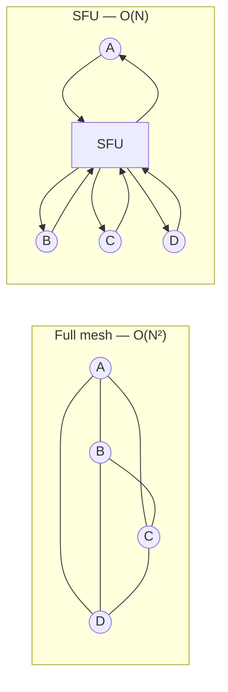
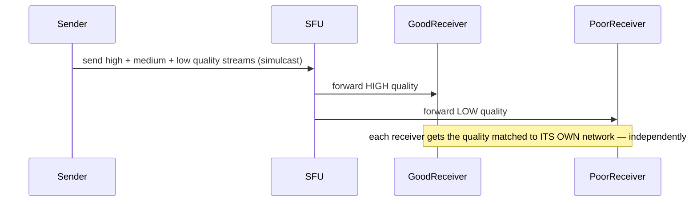

# Design Google Meet

> [!abstract] How to read this chapter
> Built phase by phase from full-mesh P2P (and why it breaks) to an SFU, with the real SFU-vs-MCU tradeoff and simulcast as the actual mechanism behind "one bad connection doesn't ruin the call for everyone." Each phase adds one idea, exposes the next bottleneck, and fixes it.

> [!question] The interview question
> "Design a video conferencing system like Google Meet — multiple participants join a call with real-time audio/video, screen sharing, and varying network conditions per participant."

---

## Requirements

**Functional**
- Create/join a meeting.
- Real-time audio/video for **multiple participants**.
- Screen sharing, mute/camera toggle, in-call chat.

**Non-functional**

| Requirement | Why it matters here specifically |
|---|---|
| **Genuinely low latency** | Unlike almost every other chapter, this cannot tolerate buffering or meaningful delay — no pre-buffering. |
| **Wildly varying networks in one call** | Different participants, different quality/device — simultaneously. |
| **Bimodal scale** | Small interactive calls *and* large webinars — genuinely two different architectures. |

> [!info] Split control plane from media plane
> **Control plane** (meeting creation, auth, permissions, signaling, room membership, recording metadata) uses ordinary HTTP/WebSocket services and a durable store. **Media plane** (audio/video packets) needs region-aware, low-latency routing and must not wait on a transactional database.

---

## Phase 00 — Capacity math you can defend

| Quantity | Derivation | Result |
|---|---|---|
| Typical call | interactive | 2–10 participants |
| Large meeting | webinar/broadcast | hundreds–thousands of viewers |

> [!example] In plain words
> The distribution is **bimodal** — small interactive vs large broadcast — which genuinely calls for two different architectural approaches, not one design forced to cover both. Bandwidth dominates even more than [[HLD/09 - Design YouTube - Netflix/Design YouTube - Netflix|YouTube]], because real-time streams can't be pre-buffered ahead of time.

---

## Phase 01 — The naive version: full peer-to-peer mesh

*Start with everyone connecting to everyone so the quadratic cost names the fix.*

Every participant connects directly to every other. Fine for 1:1. Breaks fast as count grows: with `N` participants, each needs `N-1` simultaneous **upload** streams *and* `N-1` **download** streams — bandwidth and encoding CPU grow **quadratically** (`O(N²)` connections) — unusable beyond ~4–6 participants.

| 🔴 Bottleneck | 🟢 Next fix |
|---|---|
| Each participant uploads `N-1` encoded streams — cost is `O(N²)`, dead beyond a handful. | Route through a central forwarding server: an SFU (Phase 2). |

---

## Phase 02 — SFU (Selective Forwarding Unit)

*Send your one stream once; let the server relay it to everyone.*

Every participant sends their **one** stream to a central server; the SFU relays it to every other participant who needs it. This drops each participant's **upload** from `O(N-1)` to `O(1)` — download stays `O(N-1)` (still receiving everyone), but the expensive side (sending, which requires local encoding) is now cheap. The standard real-world architecture for small-to-medium calls (Meet, Zoom).

**For very large meetings/webinars:** even SFU's per-viewer download matters at thousands. A hybrid: interactive participants (camera/mic on) go through the SFU for low latency; large numbers of **view-only** attendees are served via a more CDN-like fan-out path (like [[HLD/09 - Design YouTube - Netflix/Design YouTube - Netflix|YouTube's]] approach) — one-way broadcast tolerates slightly higher latency for massive scale, a tradeoff interactive participants can't accept.

| 🔴 Bottleneck | 🟢 Next fix |
|---|---|
| One participant on a bad network could drag quality for everyone if all receive the same stream — and the SFU-vs-MCU choice needs justifying. | SFU vs MCU + simulcast (Phase 3). |

---

## Phase 03 — Deep dive: SFU vs MCU, simulcast, NAT traversal

> [!tip] SFU vs MCU — know both and what each trades
> An **SFU** does **not** decode/re-encode — it relays encoded packets, keeping server compute and latency low, at the cost of each client decoding multiple incoming streams. An **MCU** (Multipoint Control Unit) **does** decode and mix all streams server-side into one composite — offloading client compute (decode one stream) at the cost of much higher server compute and the latency the decode/re-encode adds. SFU dominates because client devices got powerful enough to decode multiple streams, making the MCU's tradeoff less attractive for most cases.

> [!tip] Simulcast — the mechanism behind graceful degradation
> Each participant's client encodes and sends **multiple quality versions of their own video simultaneously** (high/medium/low) to the SFU. The SFU decides, **per receiving participant**, which quality to forward, based on *that receiver's* network. A participant on a poor connection automatically receives lower quality — without affecting what any *other* participant with a good connection receives, since the SFU forwards a genuinely different stream to each receiver.

**NAT traversal.** Most participants sit behind NATs/firewalls. **STUN** (discover your public IP/port) and **TURN** (relay through a public server when a direct connection can't be established) are standard — part of the **WebRTC** suite Meet is built on.

**Room placement and overload.** A meeting is assigned to an SFU region using participant geography, network measurements, and capacity. Keep a room's media state on one SFU (or an explicitly coordinated cluster); moving participants between arbitrary nodes mid-call causes packet loss and renegotiation. Near a bandwidth/CPU limit: reject or redirect new rooms, limit optional video layers, and **preserve audio before degrading everyone equally**.

**Recording** is a separate async path: the SFU forwards a selected stream to a recorder, which writes segments to object storage and produces a manifest after processing. Recording failure shouldn't terminate the live meeting unless it's a hard product requirement.

| 🔴 Bottleneck | 🟢 Next fix |
|---|---|
| Individual pieces handled — assemble the picture. | Final architecture (Phase 4). |

---

## Phase 04 — The final combined architecture

**Five principles to close with:**
1. Full mesh is `O(N²)` — dead beyond a handful; route through an SFU to make upload `O(1)`.
2. SFU relays encoded packets (low server cost, client decodes several); MCU mixes server-side (high server cost, client decodes one) — SFU wins on modern devices.
3. Simulcast: each sender emits multiple qualities; the SFU forwards a different one per receiver based on *their* network.
4. STUN/TURN (WebRTC) get participants behind NATs connected; keep a room on one SFU, preserve audio first under overload.
5. Bimodal scale needs two paths — SFU for interactive, CDN-like broadcast for view-only webinar attendees.

---

## Interviewer follow-ups, answered

> [!quote]- "Why not use a full mesh for all calls?"
> Bandwidth and CPU scale `O(N²)`, unusable beyond ~4–6 participants.

> [!quote]- "Difference between an SFU and an MCU?"
> SFU relays encoded packets (low server compute/latency, client decodes multiple streams); MCU decodes and mixes server-side (high server compute + latency, client decodes one). SFU dominates because clients got powerful enough to decode multiple streams.

> [!quote]- "One participant on a bad network without degrading the call for everyone?"
> Simulcast — the sender encodes multiple qualities, and the SFU forwards a different one per receiver based on that receiver's own conditions.

> [!quote]- "How do participants behind NATs/firewalls connect?"
> STUN for public-address discovery, TURN as a relay fallback when a direct path can't be established — standard WebRTC.

> [!quote]- "Scale to a 10,000-person webinar?"
> The hybrid — SFU for actively-participating attendees, CDN-like broadcast fan-out for view-only attendees who don't need the same latency guarantees.

---

## Production experience

> [!info] What to monitor
> Per-participant connection quality — packet loss, jitter, RTT (the real signals behind "why does this call feel bad", more informative than aggregate server health). SFU CPU/bandwidth utilization — a direct, significant cost driver. Call join success rate and time-to-first-frame. Simulcast quality-switch frequency — frequent flapping signals unstable network or overly aggressive switching logic worth tuning.

---

## Cheat sheet — if you remember nothing else

1. Full mesh is `O(N²)` — unusable past ~6; an SFU makes each participant's upload `O(1)`.
2. SFU relays packets (client decodes many); MCU mixes server-side (client decodes one) — SFU is the modern default.
3. Simulcast: senders emit multiple qualities; the SFU forwards a per-receiver quality matched to each receiver's network.
4. STUN/TURN (WebRTC) traverse NATs; keep a room on one SFU; under overload preserve audio before degrading everyone.
5. Bimodal scale → two paths: SFU for interactive, CDN-like broadcast for view-only webinar attendees.

---
*Related: [[00 - Start Here/How This Handbook Works|Book Map]] · [[HLD/09 - Design YouTube - Netflix/Design YouTube - Netflix|Design YouTube / Netflix]] · [[LLD/22 - Design Google Meet/Design Google Meet|LLD version]]*
