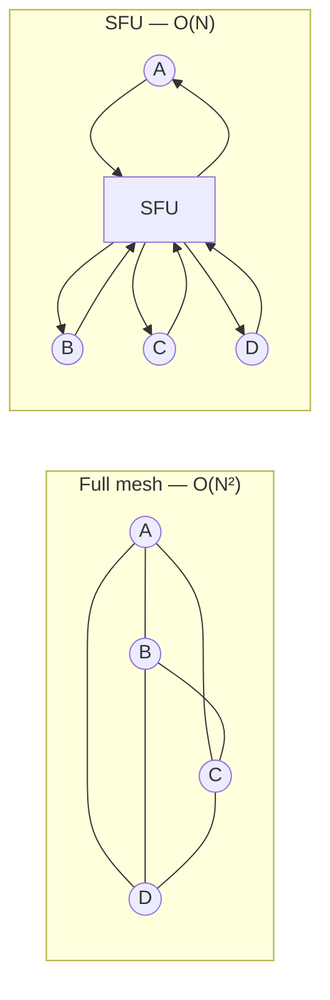
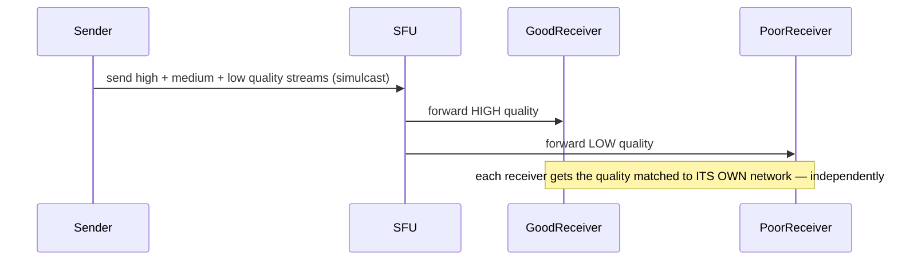

# Design Google Meet

> [!abstract] What you'll be able to do after this chapter
> Explain precisely why full-mesh peer-to-peer breaks beyond a handful of participants, the real SFU vs MCU tradeoff, and simulcast as the actual mechanism behind "one bad connection doesn't ruin the call for everyone."

---

## Step 1 — The interview question

> [!question] As an interviewer would ask it
> "Design a video conferencing system like Google Meet — multiple participants join a call with real-time audio/video, screen sharing, and varying network conditions per participant."

## Step 2 — Requirements

**Functional:** create/join a meeting, real-time audio/video for multiple participants, screen sharing, mute/camera toggle, in-call chat.

**Non-functional:** **genuinely low latency** — unlike almost every other chapter in this handbook, this system cannot tolerate buffering or meaningful delay. Must handle wildly varying network quality/device capability across participants **in the same call, simultaneously**. Must scale from small interactive calls to large meetings/webinars with hundreds of participants.

## Step 3 — Back-of-envelope estimation

Typical calls: 2-10 participants. The system must **also** support large meetings up to hundreds/thousands of viewers — this bimodal distribution (small interactive vs. large broadcast-style) genuinely calls for **two different architectural approaches**, worth naming explicitly rather than forcing one design to cover both. Bandwidth dominates even more than [[HLD/09 - Design YouTube - Netflix/Design YouTube - Netflix|YouTube]]'s estimation — real-time streams can't be pre-buffered ahead of time the way on-demand video can.

## Step 4 — Building it incrementally

**v0 — naive: full peer-to-peer mesh.** Every participant connects directly to every other participant. Fine for a 1:1 call. Breaks fast as participant count grows: with `N` participants, each one needs `N-1` simultaneous upload streams **and** `N-1` download streams — bandwidth and encoding CPU cost grow **quadratically** (`O(N²)` total connections across the mesh) — unusable beyond roughly 4-6 participants.

**Fix — SFU (Selective Forwarding Unit).** Every participant sends their **one** stream to a central server; the SFU relays each participant's stream to every other participant who needs it. This drops each participant's **upload** requirement from `O(N-1)` to `O(1)` — download remains `O(N-1)` (still receiving everyone else), but the expensive side (sending, which requires local encoding) is now cheap. This is the standard real-world architecture for small-to-medium calls (Google Meet, Zoom).

**For very large meetings/webinars:** even SFU's per-viewer download cost matters at hundreds/thousands of participants. A hybrid: interactive participants (camera/mic on) go through the SFU for low latency; large numbers of **view-only** attendees are served via a more CDN-like fan-out path (similar to [[HLD/09 - Design YouTube - Netflix/Design YouTube - Netflix|YouTube's]] approach) — one-way broadcast can tolerate slightly higher latency in exchange for massive scale, a tradeoff interactive participants can't accept.

---

## Step 5 — Deep dive: SFU vs MCU, and simulcast

### SFU vs MCU — a real, precise architectural tradeoff

> [!tip] Know both names and what each actually trades
> An **SFU** does **not** decode/re-encode media — it just relays encoded packets, keeping server compute and latency low, at the cost of each client needing to decode multiple incoming streams itself. An **MCU** (Multipoint Control Unit) **does** decode and mix all streams server-side into one composite stream — offloading client-side compute (a client only decodes one combined stream) at the cost of much higher server-side compute and the inherent latency the decode/re-encode step adds. SFU is the dominant modern approach specifically because client devices got powerful enough to handle multiple-stream decoding, making the MCU's server-cost/latency tradeoff less attractive for most cases.

### Simulcast — the actual mechanism behind graceful degradation

> [!tip] This is the expected deep answer for "how do you handle a participant on a bad connection"
> Each participant's client encodes and sends **multiple quality versions of their own video simultaneously** (e.g. high/medium/low resolution) to the SFU. The SFU then decides, **per receiving participant**, which quality version to forward, based on *that receiver's* current network conditions. A participant on a poor connection automatically receives lower-quality video — without affecting what any *other* participant with a good connection receives, since the SFU forwards a genuinely different quality stream to each different receiver.

### NAT traversal

Most participants sit behind home/corporate NATs and firewalls. **STUN** (discovering your own public IP/port) and **TURN** (relaying traffic through a public server when a direct connection genuinely can't be established) are the standard techniques — part of the broader **WebRTC** protocol suite Google Meet and similar systems are built on.

## Step 6 — Full architecture

*(See the Step 4 diagram for full-mesh vs SFU topology.)*

---

## Step 7 — Interviewer follow-ups, answered

> [!quote]- "Why not use a full mesh for all calls?"
> Bandwidth and CPU requirements scale `O(N²)`, unusable beyond roughly 4-6 participants — covered in Step 4.

> [!quote]- "What's the difference between an SFU and an MCU?"
> [Server compute/latency vs client compute tradeoff, from Step 5 — a genuinely common, expected follow-up.]

> [!quote]- "How do you handle one participant on a bad network without degrading the call for everyone else?"
> Simulcast — the sender encodes multiple quality versions, and the SFU forwards a different one per receiver based on that receiver's own conditions.

> [!quote]- "How do participants behind NATs/firewalls even connect to the SFU?"
> STUN for public-address discovery, TURN as a relay fallback when a direct path genuinely can't be established — standard WebRTC infrastructure.

> [!quote]- "How would you scale to a 10,000-person webinar?"
> The hybrid from Step 4 — SFU for actively-participating attendees, CDN-like broadcast fan-out for view-only attendees who don't need the same latency guarantees.

## Step 8 — Production experience

> [!info] What to monitor
> Per-participant connection quality — packet loss, jitter, round-trip time (the real signals behind "why does this call feel bad," more informative than aggregate server health). SFU server CPU/bandwidth utilization — a direct, significant infrastructure cost driver, more concretely tied to spend than most other chapters' storage-dominated cost profiles. Call join success rate and time-to-first-frame. Simulcast quality-switch frequency — a call flapping between quality levels frequently signals either genuinely unstable network or overly aggressive switching logic worth tuning.

---
*Related: [[00 - Start Here/How This Handbook Works|Book Map]] · [[HLD/09 - Design YouTube - Netflix/Design YouTube - Netflix|Design YouTube / Netflix]] · [[LLD/22 - Design Google Meet/Design Google Meet|LLD version]]*
