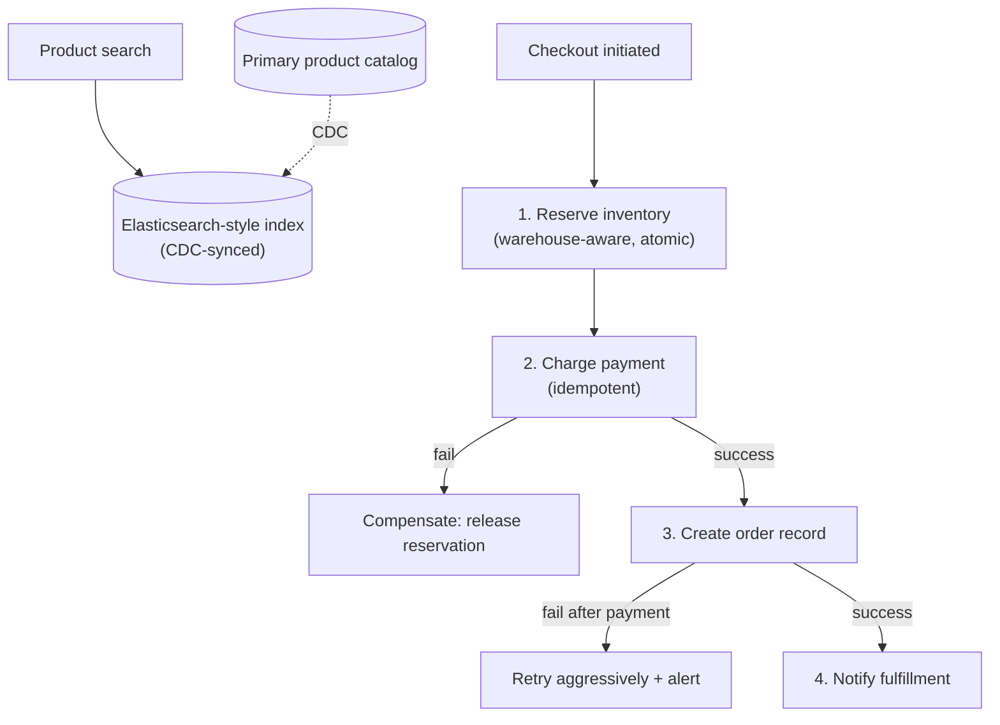

# Design an E-commerce System (Amazon-style)

> [!abstract] What you'll be able to do after this chapter
> Design a multi-step checkout saga with real compensating actions for each failure point, split search from the transactional store correctly, and extend atomic check-and-decrement to a warehouse-aware inventory model.

---

## Step 1 — The interview question

> [!question] As an interviewer would ask it
> "Design an e-commerce platform like Amazon — product catalog/search, cart, checkout, inventory across warehouses, order fulfillment tracking."

## Step 2 — Requirements

**Functional:** browse/search products, cart, checkout (payment + address), inventory tracking (no overselling), order status tracking, multi-warehouse fulfillment.

**Non-functional:** search must be fast and relevant — full-text/faceted, a genuinely different problem shape than most case studies in this book. Inventory accuracy is critical — overselling is a real, costly trust problem, similar severity to double-booking a seat. Handle massive spikes (Black Friday/flash sales). Checkout must stay correct under **partial failures** (payment succeeds but inventory reservation fails, or vice versa).

## Step 3 — Back-of-envelope estimation

300M active users, 10M orders/day → ~115/sec average orders (modest, similar order to [[HLD/17 - Design a Payment System/Design a Payment System|the Payment System chapter]]). But **product search/browse volume vastly dominates** — users browsing outnumber users buying by 100-1000x. This system's estimation profile is read-dominated, similar in spirit to YouTube's read-heaviness, but driven by search-relevance quality rather than bandwidth.

## Step 4 — Building it incrementally

**v0 — naive.** A SQL `products` table, search via `LIKE` on name/description, inventory as a plain integer column decremented on order. Breaks in **two independent ways**:

1. `LIKE` search doesn't scale to relevance-ranked, faceted (filter by price/brand/rating), typo-tolerant search at real catalog scale — needs a dedicated search engine (Elasticsearch-style), separate from the primary transactional store.
2. Naive integer-decrement inventory has the **exact same check-then-act race** already fixed in [[LLD/06 - Design BookMyShow - Seat Booking/Design BookMyShow - Seat Booking|BookMyShow's seat booking]] and [[HLD/10 - Design Uber/Design Uber|Uber's driver matching]] — direct reuse, not re-derived.

**Fix for search — a separate index.** Maintain a dedicated search index kept in sync with the primary catalog via an async pipeline (CDC, or explicit dual-write with accepted eventual consistency). Product searches never touch the transactional database directly — protecting it from search-driven load entirely, and giving search its own independently-scalable infrastructure.

**Fix for inventory — atomic, and warehouse-aware.** Atomic check-and-decrement (the same fix, direct cross-link), plus a genuinely new wrinkle beyond the single-resource-pool chapters already covered: the **same product may have stock in multiple warehouses**, and "in stock" really means "in stock at a warehouse that can reasonably fulfill *this* order." Reservation must pick a **specific warehouse**, not just decrement a global count — a real added dimension beyond BookMyShow's simpler single-pool model.

---

## Step 5 — Deep dive: the checkout saga

> [!tip] Direct, deep application of the Saga pattern
> Checkout involves multiple services that must all succeed together or roll back together: **reserve inventory** (at a chosen warehouse) → **charge payment** (reusing [[HLD/17 - Design a Payment System/Design a Payment System|the Payment System chapter's idempotency-key discipline]] directly) → **create the order record** → **notify fulfillment**.

Walk the failure cases explicitly — this is the real substance of a correct checkout flow, not just a list of steps:

- **Payment fails after inventory was already reserved** → release the reservation (a **compensating action**, the Saga pattern's core idea) — that inventory must not stay stuck in limbo.
- **Order record creation fails after payment already succeeded** → the more serious case. Payment already happened, so the system should retry order creation aggressively rather than silently accept a stuck "paid but no order" state — treat this as a high-priority alert, not a data-loss shrug.

**Warehouse selection:** given multiple warehouses with stock, pick the one minimizing shipping distance/cost. For this chapter's depth, the expected baseline answer is "nearest warehouse with sufficient stock" — conceptually reusing the geospatial-nearest reasoning from Uber/Food Delivery — with full logistics optimization named explicitly as a further real-world refinement beyond this scope.

## Step 6 — Full architecture

---

## Step 7 — Interviewer follow-ups, answered

> [!quote]- "Why not search directly against the primary product database?"
> Relevance ranking, faceted search, typo tolerance, and protecting the transactional DB from search load — the Elasticsearch reasoning from Step 4.

> [!quote]- "How do you prevent overselling a product with limited stock?"
> Atomic check-and-decrement, same fix as seats/drivers, now warehouse-aware — Step 4/5.

> [!quote]- "What happens if payment fails after inventory was already reserved?"
> Saga compensating action — release the reservation. Step 5.

> [!quote]- "What if the order record fails to create *after* payment succeeded?"
> The more serious case — aggressive retry plus alerting rather than accepting a stuck paid-but-orderless state. Step 5.

> [!quote]- "How do you pick which warehouse fulfills an order when several have stock?"
> Nearest-with-sufficient-stock as the baseline; full logistics optimization named as a real further refinement. Step 5.

## Step 8 — Production experience

> [!info] What to monitor
> Search index sync lag — a stale index showing a sold-out item as available, or a newly-listed item not yet searchable, are both real, visible product problems. Checkout saga failure/compensation rate **per step** — reveals exactly where to invest reliability effort. Inventory reservation-to-confirmation conversion rate — a low rate suggests carts holding reservations too long, wasting sellable capacity (conceptually the same idea as BookMyShow's seat-hold expiry, applied to carts).

---
*Related: [[00 - Start Here/How This Handbook Works|Book Map]] · [[HLD/17 - Design a Payment System/Design a Payment System|Design a Payment System]] · [[LLD/06 - Design BookMyShow - Seat Booking/Design BookMyShow - Seat Booking|BookMyShow LLD]] · [[Glossary/Saga Pattern|Saga Pattern]]*
