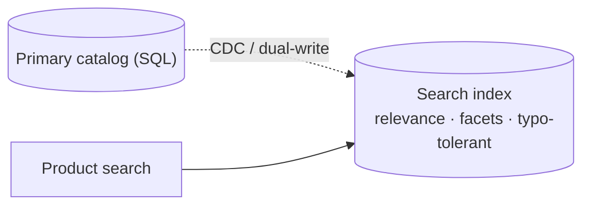
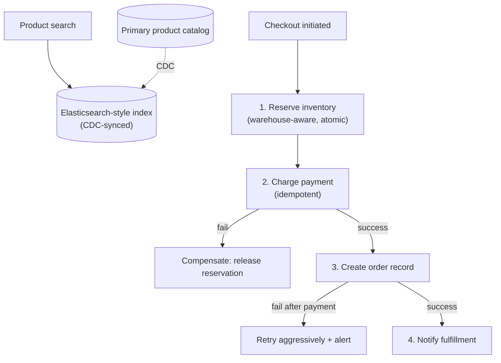

# Design an E-commerce System (Amazon-style)

> [!abstract] How to read this chapter
> Built phase by phase around a multi-step checkout saga with real compensating actions, splitting search from the transactional store, and extending atomic check-and-decrement to a warehouse-aware inventory model. Each phase adds one idea, exposes the next bottleneck, and fixes it.

> [!question] The interview question
> "Design an e-commerce platform like Amazon — product catalog/search, cart, checkout, inventory across warehouses, order fulfillment tracking."

---

## Requirements

**Functional**
- Browse/**search** products.
- **Cart**; **checkout** (payment + address).
- **Inventory** tracking (no overselling).
- **Order status** tracking; **multi-warehouse** fulfillment.

**Non-functional**

| Requirement | Why it matters here specifically |
|---|---|
| **Fast, relevant search** | Full-text/faceted — a genuinely different problem shape than most case studies. |
| **Inventory accuracy** | Overselling is a real, costly trust problem — similar severity to double-booking a seat. |
| **Massive spikes** | Black Friday / flash sales. |
| **Correct under partial failure** | Payment succeeds but inventory fails, or vice versa — the checkout must not corrupt. |

---

## Phase 00 — Capacity math you can defend

| Quantity | Derivation | Result |
|---|---|---|
| Orders | 10M/day | ~115/s average (modest, like the Payment chapter) |
| Search/browse | browsers ≫ buyers | 100–1000× order volume |

> [!example] In plain words
> Orders are modest; **search/browse volume dominates 100–1000×.** Read-dominated like YouTube, but driven by search-relevance quality rather than bandwidth. Two independent hard problems live here: search, and inventory correctness.

---

## Phase 01 — The naive version: one SQL table for everything

*Start with `LIKE` search + integer-column inventory so both failures name the fixes.*

A SQL `products` table, search via `LIKE` on name/description, inventory as a plain integer column decremented on order. Breaks in **two independent ways**:
1. `LIKE` search doesn't scale to relevance-ranked, faceted (price/brand/rating), typo-tolerant search at real catalog scale.
2. Naive integer-decrement inventory has the **exact same check-then-act race** already fixed in [[LLD/06 - Design BookMyShow - Seat Booking/Design BookMyShow - Seat Booking|BookMyShow's seat booking]] and [[HLD/10 - Design Uber/Design Uber|Uber's driver matching]].

| 🔴 Bottleneck | 🟢 Next fix |
|---|---|
| Two separate failures: `LIKE` can't do relevance/facets/typo at scale, and integer-decrement oversells under concurrency. | A dedicated search index + atomic warehouse-aware inventory (Phases 2–3). |

---

## Phase 02 — Split search into a dedicated index

*Search is a different problem shape — give it its own engine, off the transactional DB.*

Maintain a dedicated search index (Elasticsearch-style) kept in sync with the primary catalog via an async pipeline (CDC, or explicit dual-write with accepted eventual consistency). Product searches never touch the transactional database directly — protecting it from search-driven load, and giving search its own independently-scalable infrastructure.

| 🔴 Bottleneck | 🟢 Next fix |
|---|---|
| Inventory still oversells — and "in stock" is more than one number when stock lives in many warehouses. | Atomic, warehouse-aware inventory (Phase 3). |

---

## Phase 03 — Atomic, warehouse-aware inventory

*Fix the race, then add the dimension the single-pool chapters didn't have.*

Atomic check-and-decrement (the same fix as seats/drivers, direct cross-link), plus a genuinely new wrinkle: the **same product may have stock in multiple warehouses**, and "in stock" really means "in stock at a warehouse that can reasonably fulfill *this* order." Reservation must pick a **specific warehouse**, not just decrement a global count — a real added dimension beyond BookMyShow's single-pool model.

| 🔴 Bottleneck | 🟢 Next fix |
|---|---|
| Checkout chains reserve → pay → order → fulfill across services — any step can fail after an earlier one succeeded. | A checkout saga with compensating actions (Phase 4). |

---

## Phase 04 — Deep dive: the checkout saga

> [!tip] Direct, deep application of the Saga pattern
> Checkout involves multiple services that must all succeed together or roll back together: **reserve inventory** (at a chosen warehouse) → **charge payment** (reusing [[HLD/17 - Design a Payment System/Design a Payment System|the Payment System's idempotency-key discipline]]) → **create the order record** → **notify fulfillment**.

Walk the failure cases explicitly — this is the real substance of a correct checkout, not just a list of steps:
- **Payment fails after inventory was reserved** → release the reservation (a **compensating action**, the Saga pattern's core idea) — that inventory must not stay stuck in limbo.
- **Order record creation fails after payment succeeded** → the more serious case. Payment already happened, so retry order creation aggressively rather than silently accept a "paid but no order" state — a high-priority alert, not a data-loss shrug.

**Warehouse selection:** given multiple warehouses with stock, pick the one minimizing shipping distance/cost. Baseline: "nearest warehouse with sufficient stock" — reusing the geospatial-nearest reasoning from Uber/Food Delivery — with full logistics optimization named as a further real-world refinement beyond scope.

| 🔴 Bottleneck | 🟢 Next fix |
|---|---|
| Individual pieces handled — assemble the picture. | Final architecture (Phase 5). |

---

## Phase 05 — The final combined architecture

**Five principles to close with:**
1. Two independent hard problems — search relevance and inventory correctness — each solved separately.
2. Search lives in its own index (CDC-synced), never on the transactional DB — protecting it and scaling independently.
3. Inventory is atomic check-and-decrement, *and* warehouse-aware — reserve a specific warehouse, not a global count.
4. Checkout is a saga: reserve → pay → order → fulfill, with a compensating release if payment fails.
5. Paid-but-no-order is the serious failure — retry aggressively and alert, never silently accept it.

---

## Interviewer follow-ups, answered

> [!quote]- "Why not search directly against the primary product database?"
> Relevance ranking, faceted search, typo tolerance, and protecting the transactional DB from search load — hence a dedicated index.

> [!quote]- "Prevent overselling a product with limited stock?"
> Atomic check-and-decrement, the same fix as seats/drivers, now warehouse-aware.

> [!quote]- "Payment fails after inventory was reserved?"
> Saga compensating action — release the reservation so it doesn't stay stuck in limbo.

> [!quote]- "Order record fails to create *after* payment succeeded?"
> The more serious case — aggressive retry plus alerting rather than accepting a stuck paid-but-orderless state.

> [!quote]- "Pick which warehouse fulfills when several have stock?"
> Nearest-with-sufficient-stock as baseline (geospatial-nearest reasoning); full logistics optimization as a further refinement.

---

## Production experience

> [!info] What to monitor
> Search index sync lag — a stale index showing a sold-out item as available, or a new item not yet searchable, are both visible product problems. Checkout saga failure/compensation rate **per step** — reveals exactly where to invest reliability. Inventory reservation-to-confirmation conversion — low rate suggests carts holding reservations too long, wasting sellable capacity (the same idea as BookMyShow's seat-hold expiry, applied to carts).

---

## Cheat sheet — if you remember nothing else

1. Two independent hard problems: search relevance and inventory correctness — solve each separately.
2. Search index (Elasticsearch-style) synced from the catalog by CDC — never search the transactional DB directly.
3. Inventory = atomic check-and-decrement, warehouse-aware — reserve a specific warehouse, not a global integer.
4. Checkout is a saga (reserve → pay → order → fulfill); compensate by releasing the reservation if payment fails.
5. Paid-but-no-order → aggressive retry + alert; pick the nearest warehouse with sufficient stock.

---
*Related: [[00 - Start Here/How This Handbook Works|Book Map]] · [[HLD/17 - Design a Payment System/Design a Payment System|Design a Payment System]] · [[LLD/06 - Design BookMyShow - Seat Booking/Design BookMyShow - Seat Booking|BookMyShow LLD]] · [[Glossary/Saga Pattern|Saga Pattern]]*
