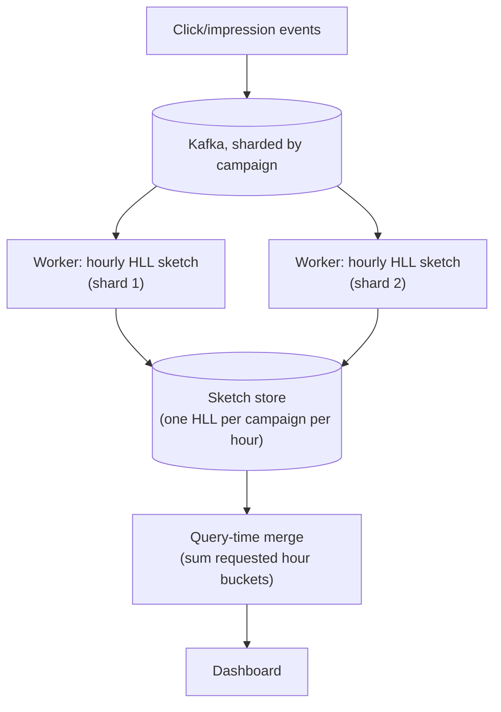

# Design an Analytics Aggregation System (Ad-Click / Unique-Visitor Counting)

> [!abstract] What you'll be able to do after this chapter
> Explain precisely why exact distinct-counting is infeasible at scale, implement the mental model of HyperLogLog well enough to state its error bound, and know exactly why it can't support "forget old data" without a real, named workaround.

---

## Step 1 — The interview question

> [!question] As an interviewer would ask it
> "Design a system that counts ad clicks/impressions and unique visitors, in near real-time, across billions of events per day — approximate results with a bounded, known error rate are acceptable."

## Step 2 — Requirements

**Functional:** ingest click/impression events, count total clicks per campaign, count **unique visitors** (distinct count) per campaign over a rolling time window, near-real-time dashboards.

**Non-functional:** handle billions of events/day. Exact unique counting is prohibitively expensive at this scale — storing every distinct visitor ID seen per campaign requires unbounded memory. **Approximate counting with a bounded, known error is a deliberate, acceptable tradeoff**, not a compromise nobody chose — say this explicitly, since it's the entire premise of the chapter.

## Step 3 — Back-of-envelope estimation

10B events/day → ~115,000 events/sec average, higher during campaign launches. The number that actually matters: how much memory would **exact** distinct counting need? A single campaign with 100M unique visitors, stored as a hash set of 8-byte IDs, needs ~800MB — for **one** campaign. Multiply by thousands of active campaigns and this is obviously untenable in memory, and querying it live is worse.

## Step 4 — Building it incrementally

**v0 — naive.** `SELECT COUNT(DISTINCT visitor_id)` per campaign, or a `HashSet` of every seen ID. Breaks exactly as estimated in Step 3 — unbounded memory growth per campaign, doesn't scale.

**Fix — HyperLogLog for approximate distinct counting.**

> [!tip] The core idea, precisely
> Hash every element to a uniform-random bit string. The **position of the leftmost 1-bit** in that hash is a probabilistic signal: seeing a hash with its leftmost 1-bit at position `k` is evidence that roughly `2^k` distinct elements have been hashed (rare patterns imply more elements were needed to produce them by chance). HyperLogLog splits incoming elements across many small **registers** (buckets, chosen by a few bits of the hash), each register tracking the *maximum* leftmost-1-bit-position seen for elements landing in it, then combines all registers via a harmonic mean to produce the final estimate — averaging across many registers is what suppresses the high variance any single register's estimate would have alone.

The genuinely remarkable practical property: this achieves **~2% error using a fixed, tiny memory footprint (a few KB)** — regardless of whether the true count is a thousand or a billion. Memory doesn't grow with cardinality at all.

**Mergeable across shards.** HLL registers from different servers can be combined via a simple **per-register max** to get a correct estimate for the *union* of what each server saw — without ever needing the raw underlying data. This is what makes it fit a sharded ingestion pipeline: each consuming shard maintains its own local sketch; a global count is just a cheap merge of sketches, not a recomputation from raw events.

**Count-Min Sketch — a different structure, for a different question.** HyperLogLog answers "how many *distinct* things." **Count-Min Sketch** answers "how many *times* did this specific thing happen" (approximate frequency counting) — the right structure for "top-K campaigns by click volume," a genuinely different question from unique-visitor counting, worth not conflating with HLL.

---

## Step 5 — Deep dive: error bounds, and the "can't delete" problem

> [!bug] HyperLogLog cannot forget data — a real, named limitation, not a footnote
> HLL only supports **merge/union** — it structurally cannot subtract or expire old data from an existing sketch, since a register only ever tracks a maximum, and there's no way to know if that maximum came from data that should now be excluded. A single, ever-growing HLL sketch can never answer "unique visitors in just the last 24 hours" — it can only answer "unique visitors ever."
>
> **The fix: time-bucketed sketches.** Maintain a separate HLL per fixed time bucket (e.g., one per hour). A "unique visitors in the last 24 hours" query merges the last 24 hourly sketches — merging is cheap and correct — while old buckets outside the window are simply dropped, not subtracted. This is the standard, real answer to windowed unique counting with HLL.

**Error bound, stated precisely (worth being able to say the actual formula):** the standard error is approximately `1.04/√m`, where `m` is the number of registers. More registers → better accuracy → (still small) more memory. This is a real, quantifiable, tunable tradeoff, exactly the kind of precision this book emphasizes over hand-waving "it's approximately right."

## Step 6 — Full architecture

---

## Step 7 — Interviewer follow-ups, answered

> [!quote]- "Why not exact counting?"
> Memory and cost — an exact hash set per campaign grows unboundedly with true cardinality; Step 3/4.

> [!quote]- "How accurate is this, precisely?"
> `~1.04/√m` standard error — a real, quotable formula, not "pretty close." Step 5.

> [!quote]- "How do you get a windowed (e.g. daily) unique count if HLL can't delete data?"
> Time-bucketed sketches, merged only over the requested window — Step 5.

> [!quote]- "What about counts that are billing-critical — would you still use this?"
> No — a real, deliberate exception worth naming explicitly. Anything where the count directly determines money changing hands (actual ad spend charged to an advertiser) needs **exact** counting despite the cost, because a 2% error translates directly into over- or under-charging. Approximate structures are for dashboards and trend visibility, not billing — recognizing exactly where the approximation stops being acceptable is the real signal of engineering judgment here, not applying HLL everywhere uniformly.

## Step 8 — Production experience

> [!info] What to monitor
> HLL estimate drift — periodically spot-check the approximate count against an **exact** count on a small sampled subset of campaigns, to catch implementation bugs (a bad hash function, register-count misconfiguration) that would otherwise silently skew every estimate. Ingestion lag (Kafka consumer lag, same practice as [[HLD/20 - Design a Log Aggregation and Monitoring System/Design a Log Aggregation and Monitoring System|the Log Aggregation chapter]]). Sketch-merge query latency as the number of time buckets requested grows.

---
*Related: [[00 - Start Here/How This Handbook Works|Book Map]] · [[CS Fundamentals/Messaging & Streaming/Kafka Internals|Kafka Internals]] · [[Glossary/Bloom Filter|Bloom Filter]] (a related but distinct probabilistic structure — membership testing, not counting)*
