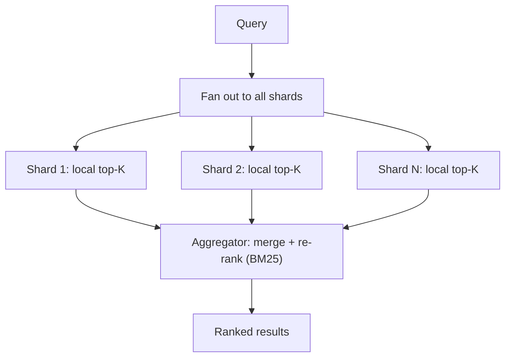
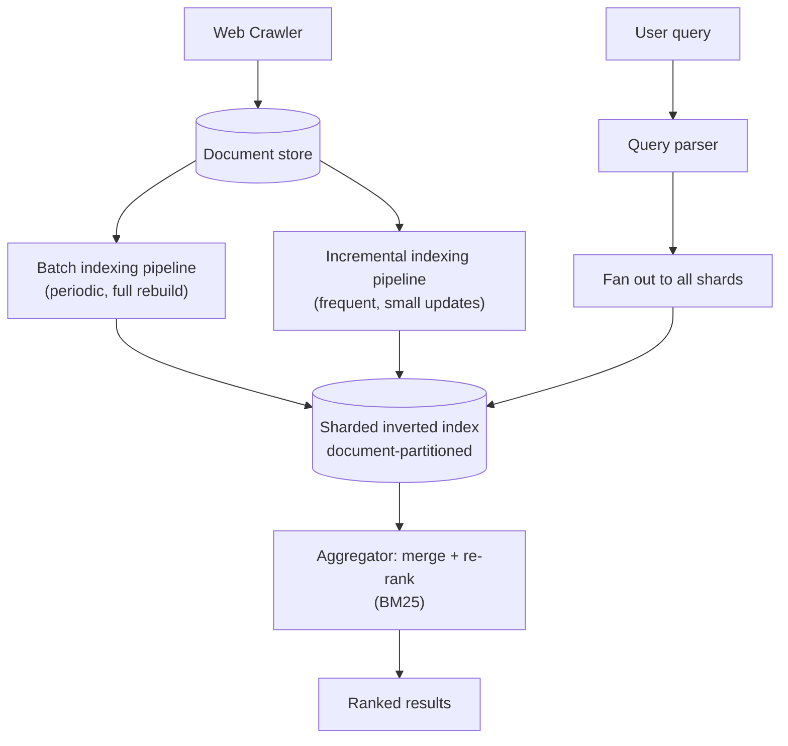

# Design a Search Engine (Google Search)

> [!abstract] How to read this chapter
> Built phase by phase from a naive full scan to a sharded, tiered inverted index. Each phase adds one idea, exposes the next bottleneck, and fixes it — the inverted index from first principles, BM25 ranking over naive term frequency, and how to shard an index too large for one machine.

> [!info] Distinct from the Web Crawler chapter
> [[HLD/12 - Design a Web Crawler/Design a Web Crawler|The Web Crawler chapter]] covers *fetching* the web. This chapter starts from "documents are already crawled and stored" and covers the genuinely different problem: indexing them for fast, ranked retrieval.

> [!question] The interview question
> "Design a web search engine — given a text query, return ranked relevant documents from a huge, crawled corpus, in well under a second."

---

## Requirements

**Functional**
- **Index** crawled documents (reusing the Web Crawler for fetching).
- Given a query, return **ranked** results.
- Support **phrase queries** and basic **typo tolerance**.

**Non-functional**

| Requirement | Why it matters here specifically |
|---|---|
| **Sub-second latency over billions of docs** | Rules out any per-query document scan immediately. |
| **Freshness vs build cost** | A real tradeoff between how current the index is and how expensive rebuilding it is. |
| **Ranking quality, not just correctness** | Returning *some* matching doc isn't the bar — returning the *most relevant* one is. |

---

## Phase 00 — Capacity math you can defend

| Quantity | Derivation | Result |
|---|---|---|
| Corpus | 50B pages × ~5 KB text | ~250 TB+ raw |
| Inverted index | a substantial fraction of raw | still far beyond one machine |

> [!example] In plain words
> The corpus doesn't fit on one machine by any reasonable margin — so sharding is a **hard requirement**, not an optimization. That fact frames the whole retrieval design.

---

## Phase 01 — The naive version: scan every document

*Start with the full scan so its impossibility names the fix.*

Scan every document's text for the query terms at query time. Breaks immediately and obviously — billions of documents, sub-second requirement, no further analysis needed to reject it.

| 🔴 Bottleneck | 🟢 Next fix |
|---|---|
| A per-query scan of billions of documents can't be sub-second. | Invert the data: index term → documents (Phase 2). |

---

## Phase 02 — The inverted index

*Precompute, for every term, the list of documents that contain it.*

For every term, store a sorted **posting list**: the IDs of every document containing that term (plus, for phrase support, the *positions* within each document). A query looks up the posting list for each term and **intersects** them (AND semantics for multi-term) — dramatically faster than scanning, and the foundational structure underlying every real search engine.

```text
Term "system"  → postings: [doc4, doc19, doc23, doc101, ...]
Term "design"  → postings: [doc4, doc7, doc23, doc55, ...]

Query "system design" → intersect both lists → [doc4, doc23, ...]
```

| 🔴 Bottleneck | 🟢 Next fix |
|---|---|
| Intersection returns *matches*, but naive term-frequency ranking over-weights common words and rewards keyword-stuffing. | Principled ranking: TF-IDF → BM25 (Phase 3). |

---

## Phase 03 — Ranking: TF-IDF → BM25

*Retrieval isn't ranking — return the most relevant, not just any match.*

- **Naive term frequency** over-weights common words and rewards keyword-stuffing.
- **TF-IDF** down-weights terms appearing in *many* documents (a term in every document carries no discriminating signal).
- **BM25** — the modern standard — refines further: it **saturates** term-frequency contribution (the 10th occurrence matters far less than the 2nd) and **normalizes by document length** (a term 3× in a 50-word doc is a much stronger signal than 3× in a 5,000-word doc).

| 🔴 Bottleneck | 🟢 Next fix |
|---|---|
| One server can't hold the inverted index for 50B docs. | Document-partitioned sharding with scatter-gather (Phase 4). |

---

## Phase 04 — Sharding: document-partitioned scatter-gather

*Required at this scale, not optional.*

Each shard holds the complete inverted index for a *subset* of documents. A query fans out to every shard, each shard independently returns its own top-K matches, and an **aggregator** merges and re-ranks the combined results — the same scatter-gather shape used elsewhere for distributed lookups, applied to search.



| 🔴 Bottleneck | 🟢 Next fix |
|---|---|
| Index storage is huge, and a full rebuild can't reflect a page that changed 10 minutes ago. | Posting-list compression + freshness tiering (Phase 5). |

---

## Phase 05 — Deep dive: compression, skip pointers, freshness tiering

> [!tip] Delta encoding — posting lists compress far better than they look
> Document IDs within a posting list are stored **sorted.** Instead of raw IDs (`4, 19, 23, 101, ...`), store the **gaps** (`4, 15, 4, 78, ...`) — gaps are much smaller on average, and small numbers compress far more efficiently (variable-byte or bit-packed) than arbitrary large IDs. Standard in every real implementation, and a major fraction of the storage savings.

**Skip pointers for faster intersection.** For very long posting lists, a plain merge walks every entry of both in lockstep. Embedding **skip pointers** (periodic "jump ahead" markers) lets the intersection skip runs of non-matching IDs — a genuine algorithmic speedup, worth naming rather than leaving intersection a black box.

> [!bug] A full rebuild is too slow for a page that changed 10 minutes ago
> Large engines maintain a big, periodically-rebuilt **batch index** for the bulk of the corpus, **plus** a smaller, far more frequently updated **incremental index** for recently changed content — a query checks both and merges. The same hot/cold tiering as [[HLD/20 - Design a Log Aggregation and Monitoring System/Design a Log Aggregation and Monitoring System|Log Aggregation]]'s retention, applied to index freshness rather than storage cost.

| 🔴 Bottleneck | 🟢 Next fix |
|---|---|
| Individual pieces handled — assemble the pipeline. | Final architecture (Phase 6). |

---

## Phase 06 — The final combined architecture



**Five principles to close with:**
1. Invert the data — term → document posting lists — so a query is an intersection, not a scan.
2. Retrieval isn't ranking — BM25 saturates term frequency and normalizes by length over naive TF.
3. Document-partitioned sharding with scatter-gather is mandatory at 50B docs — fan out, local top-K, merge.
4. Delta-encode posting lists and use skip pointers — a major fraction of storage and intersection savings.
5. Batch + incremental index tiering keeps results fresh without rebuilding everything on every crawl.

---

## Interviewer follow-ups, answered

> [!quote]- "Handle phrase queries — an exact multi-word match?"
> Store term **positions**, not just document IDs, in each posting. Intersecting two terms' postings then additionally checks their positions are adjacent (or within the required offset) within the same document, not just that both appear somewhere.

> [!quote]- "Handle typos?"
> A separate auxiliary structure for fuzzy matching — edit-distance lookup, or n-gram indexing (overlapping character sequences) — related to [[HLD/11 - Design Search Autocomplete - Typeahead/Design Search Autocomplete|Autocomplete's trie]], but built for typo tolerance rather than prefix completion.

> [!quote]- "Keep the index fresh without a full rebuild on every crawl?"
> The batch + incremental index tiering — a query checks both and merges.

> [!quote]- "Shard the index at this scale?"
> Document-partitioned sharding with scatter-gather query fan-out — each shard returns local top-K, an aggregator merges and re-ranks.

---

## Production experience

> [!info] What to monitor
> Query latency **per shard**, not just aggregate — a single slow shard drags the whole fanned-out query's tail latency, the tail-latency-amplification problem worth naming wherever a request fans out to many parallel backends. Index build lag (batch and incremental separately). **Click-through rate as an implicit relevance signal**, fed back into ranking — which results users actually click for a query is itself training data for improving future ranking, a real feedback loop, not a vanity metric.

---

## Cheat sheet — if you remember nothing else

1. Invert the data: term → sorted document posting lists, so a query intersects lists instead of scanning docs.
2. Rank with BM25 — saturate term frequency, normalize by document length — not raw term counts.
3. Document-partitioned sharding + scatter-gather is mandatory at 50B docs: fan out, local top-K, aggregate.
4. Delta-encode posting-list gaps and add skip pointers — huge storage and intersection wins.
5. Batch + incremental index tiers keep results fresh; watch per-shard tail latency and feed CTR back into ranking.

---
*Related: [[00 - Start Here/How This Handbook Works|Book Map]] · [[HLD/12 - Design a Web Crawler/Design a Web Crawler|Design a Web Crawler]] · [[HLD/11 - Design Search Autocomplete - Typeahead/Design Search Autocomplete|Design Search Autocomplete]]*
