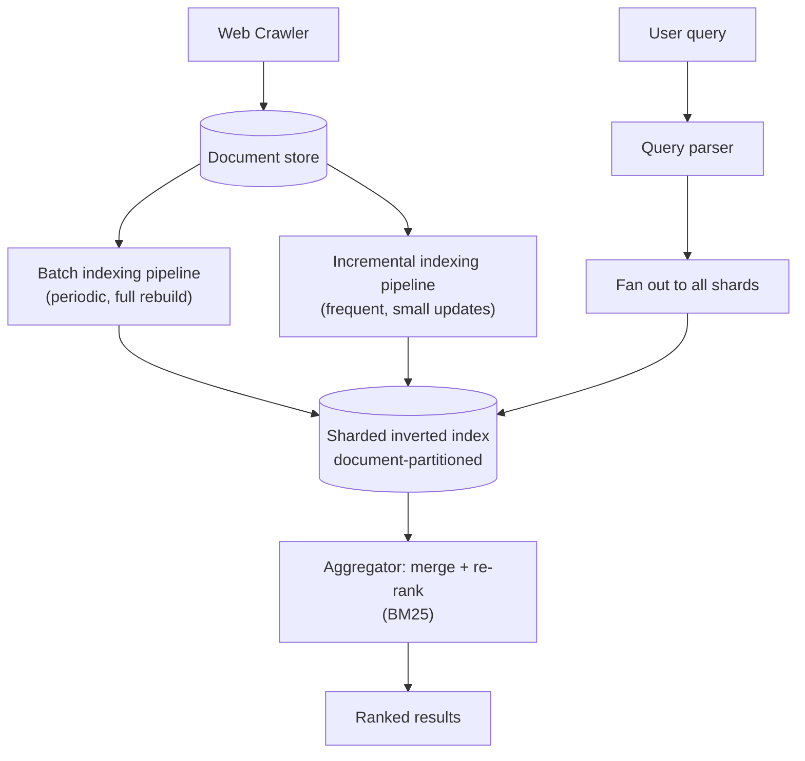

# Design a Search Engine (Google Search)

> [!abstract] What you'll be able to do after this chapter
> Explain the inverted index precisely enough to derive it from first principles, justify TF-IDF/BM25 ranking over naive term frequency, and describe how a search engine shards an index too large for one machine.

> [!info] Distinct from the Web Crawler chapter
> [[HLD/12 - Design a Web Crawler/Design a Web Crawler|The Web Crawler chapter]] covers *fetching* the web. This chapter starts from "documents are already crawled and stored" and covers the genuinely different problem: indexing them for fast, ranked retrieval.

---

## Step 1 — The interview question

> [!question] As an interviewer would ask it
> "Design a web search engine — given a text query, return ranked relevant documents from a huge, crawled corpus, in well under a second."

## Step 2 — Requirements

**Functional:** index crawled documents (reusing [[HLD/12 - Design a Web Crawler/Design a Web Crawler|the Web Crawler chapter]] for the fetching half, not re-derived here), given a query return ranked results, support phrase queries and basic typo tolerance.

**Non-functional:** sub-second query latency even over billions of documents. A real tradeoff between **index freshness** and **crawl/index-build cost**. Ranking **quality**, not just retrieval correctness — returning *some* matching document isn't the bar; returning the *most relevant* one is.

## Step 3 — Back-of-envelope estimation

Assume 50B indexed pages, ~5KB of extracted text per page → raw corpus ≈ 250TB+. The inverted index built from this (Step 4) will be a substantial fraction of that raw size — this is not a dataset that fits on one machine by any reasonable margin, which sets up the sharding discussion in Step 4/5 as a hard requirement, not an optimization.

## Step 4 — Building it incrementally

**v0 — naive.** Scan every document's text for the query terms at query time. Breaks immediately and obviously — billions of documents, sub-second requirement, no further analysis needed to reject this.

**Fix — the inverted index.** For every term, store a sorted **posting list**: the IDs of every document containing that term (plus, for phrase support, the *positions* within each document). A query becomes: look up the posting list for each query term, **intersect** them (AND semantics for a multi-term query) — this is dramatically faster than scanning documents, and it's the foundational data structure underlying every real search engine.

```
Term "system"  → postings: [doc4, doc19, doc23, doc101, ...]
Term "design"  → postings: [doc4, doc7, doc23, doc55, ...]

Query "system design" → intersect both lists → [doc4, doc23, ...]
```

**Ranking — naive term frequency breaks too.** Ranking purely by how many times a query term appears in a document over-weights common words and rewards keyword-stuffing. **TF-IDF** fixes the first problem by down-weighting terms that appear in *many* documents (a term appearing in every document carries no discriminating signal). **BM25** — the modern standard — refines this further: it **saturates** the contribution of term frequency (the 10th occurrence of a word matters far less than the 2nd) and **normalizes by document length** (a term appearing 3 times in a 50-word document is a much stronger signal than 3 times in a 5,000-word document).

**Sharding the index — required, not optional, at this scale.** One server cannot hold the full inverted index for 50B documents. Real systems use **document-partitioned** sharding: each shard holds the complete inverted index for a *subset* of documents. A query fans out to every shard, each shard independently returns its own top-K matches, and an **aggregator** merges and re-ranks the combined results — the same scatter-gather shape used elsewhere in this book for distributed lookups, applied here to search specifically.

---

## Step 5 — Deep dive: posting-list compression and freshness tiering

### Delta encoding — a real, standard compression technique

> [!tip] Posting lists compress far better than they look at first glance
> Document IDs within a posting list are stored **sorted**. Instead of storing raw IDs (`4, 19, 23, 101, ...`), store the **gaps** between consecutive IDs (`4, 15, 4, 78, ...`) — gaps are much smaller numbers on average, and small numbers compress far more efficiently (variable-byte or bit-packed encoding) than arbitrary large IDs. This is standard practice in every real inverted-index implementation, not a minor detail — it's a major fraction of the actual storage savings.

### Skip pointers for faster intersection

For very long posting lists, a plain merge-intersection walks every entry of both lists in lockstep. Embedding **skip pointers** (periodic "jump ahead" markers within a posting list) lets the intersection algorithm skip past runs of non-matching IDs rather than visiting every single entry — a genuine algorithmic speedup on long lists, worth naming precisely rather than leaving intersection as an unexamined black box.

### Freshness vs. batch rebuild

> [!bug] A full index rebuild is far too slow to reflect a page that changed 10 minutes ago
> Large search engines maintain a big, periodically-rebuilt **batch index** for the bulk of the corpus, **plus** a smaller, far more frequently updated **incremental index** for recently crawled/changed content — a query checks both and merges results. This is the same hot/cold or L1/L2 tiering idea already used elsewhere in this book (retention tiering in [[HLD/20 - Design a Log Aggregation and Monitoring System/Design a Log Aggregation and Monitoring System|Log Aggregation]], hot/cold storage in earlier chapters), applied here specifically to index freshness rather than storage cost.

## Step 6 — Full architecture



---

## Step 7 — Interviewer follow-ups, answered

> [!quote]- "How do you handle phrase queries — an exact multi-word match?"
> Store term **positions**, not just document IDs, in each posting. Intersecting two terms' postings then additionally checks that their positions are adjacent (or within the required offset) within the same document, not just that both terms appear somewhere in it.

> [!quote]- "How do you handle typos?"
> A separate auxiliary structure for fuzzy matching — edit-distance-based lookup, or n-gram indexing (breaking terms into overlapping character sequences and matching on those) — conceptually similar in spirit to [[HLD/11 - Design Search Autocomplete - Typeahead/Design Search Autocomplete - Typeahead|Autocomplete's trie]], but built for typo tolerance specifically rather than prefix completion.

> [!quote]- "How do you keep the index fresh without a full rebuild on every crawl?"
> The batch + incremental index tiering from Step 5.

> [!quote]- "How do you shard the index at this scale?"
> Document-partitioned sharding with scatter-gather query fan-out, covered in Step 4.

## Step 8 — Production experience

> [!info] What to monitor
> Query latency **per shard**, not just aggregate — a single slow shard drags down the whole fanned-out query's tail latency, the same tail-latency-amplification problem worth naming precisely wherever a request fans out to many parallel backends. Index build lag (batch and incremental separately). **Click-through rate as an implicit relevance signal**, fed back into ranking — a real, important production feedback loop: which results users actually click for a given query is itself training data for improving future ranking, not just a vanity metric.

---
*Related: [[00 - Start Here/How This Handbook Works|Book Map]] · [[HLD/12 - Design a Web Crawler/Design a Web Crawler|Design a Web Crawler]] · [[HLD/11 - Design Search Autocomplete - Typeahead/Design Search Autocomplete - Typeahead|Design Search Autocomplete]]*
