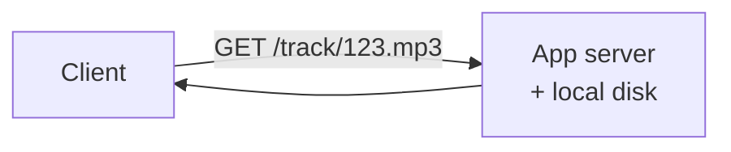
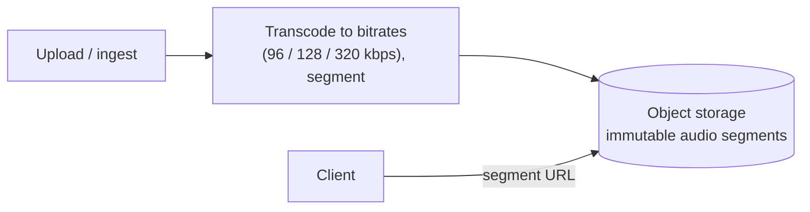
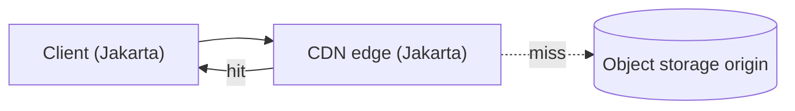
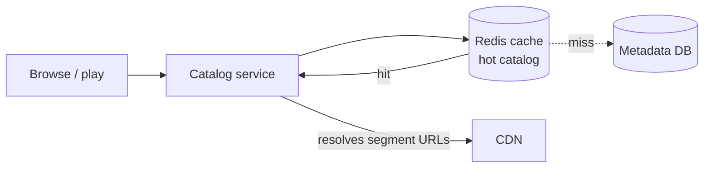
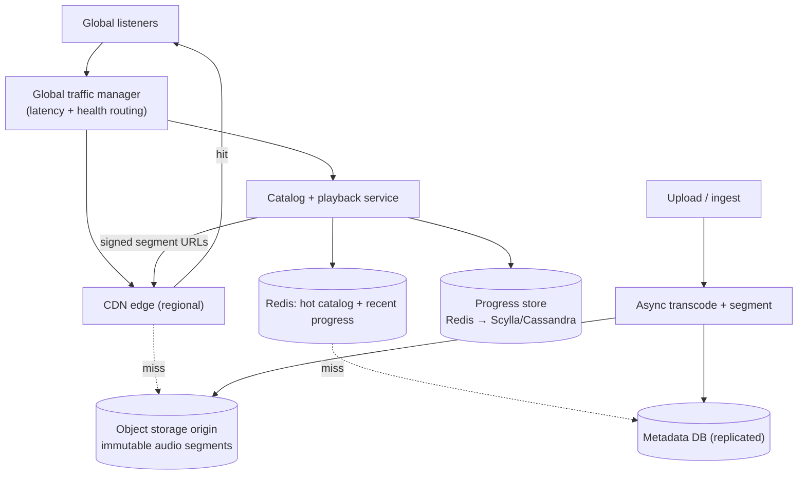

# Design an Audio Streaming Platform (Pocket FM / Spotify)

> [!abstract] How to read this chapter
> Built phase by phase from a single file server to a globally-distributed streaming platform. Each phase adds one idea, exposes the next bottleneck, and fixes it — CDN + object storage for the bytes, a metadata DB and caching for the catalog, playback-progress tracking that survives device switches, and global traffic routing.

> [!info] Related, but a different problem than YouTube
> [[HLD/09 - Design YouTube - Netflix/Design YouTube - Netflix|The YouTube chapter]] covers *video* transcoding + ABR. Audio is lighter (KB/s not MB/s), but adds its own hard problems: episodic/serial content, resume-anywhere playback progress, and offline downloads. This chapter focuses on those.

> [!question] The interview question
> "Design an audio streaming platform like Pocket FM or Spotify — users browse a catalog of songs/episodes, stream audio with instant start, resume where they left off across devices, and it works globally."

---

## Requirements

**Functional**
- Browse/search a **catalog** (songs, shows, episodes, playlists).
- **Stream** audio with instant start and seek.
- **Resume playback** from the last position, across devices.
- **Offline download** of licensed content.
- Personalized home feed / recommendations *(see the dedicated [[HLD/28 - Design a Recommendation and Home-Feed System/Design a Recommendation and Home-Feed System|Recommendation chapter]])*.

**Non-functional**

| Requirement | Why it matters here specifically |
|---|---|
| **Instant playback start** | A visible delay before audio plays reads as a broken app — time-to-first-byte is the core UX metric. |
| **Global low latency** | Listeners are worldwide; the audio bytes must come from nearby, not one origin. |
| **Read-dominated** | Listens vastly outnumber uploads — optimize the serving path, uploads can be slow. |
| **Durable catalog + progress** | Never lose an uploaded track or a user's place in a 40-episode series. |

---

## Phase 00 — Capacity math you can defend

| Quantity | Derivation | Result |
|---|---|---|
| Listening | 100M DAU × ~1.5 hr | ~150M hours/day streamed |
| Audio bitrate | AAC ~128 kbps | ~16 KB/s per stream → ~1 GB per ~17 hr |
| Catalog size | 100M tracks × ~5 MB | ~500 TB raw audio |
| Metadata | 100M tracks × ~2 KB | ~200 GB — small, cacheable |
| Progress writes | 100M DAU × frequent updates | high write rate, tiny records |

> [!example] In plain words
> Audio is ~100× lighter than video per second, but the catalog is huge and global. Two separate systems fall out: a **bytes plane** (object storage + CDN, huge but immutable) and a **metadata/state plane** (catalog + playback progress, small but read-hot and write-frequent). Keep them apart.

---

## Phase 01 — A client and one server serving files

*Start embarrassingly simple so every later box exists for a reason.*

One server holds audio files on local disk and streams them on request; a table maps track ID → file path + metadata. Works for a demo.

| 🔴 Bottleneck | 🟢 Next fix |
|---|---|
| Local disk can't hold 500 TB, one server can't serve global traffic, and a crash loses everything. | Move the bytes to durable object storage (Phase 2). |

> [!example] Layman
> One shopkeeper with every record stacked behind the counter, mailing each one personally. Fine for ten records and one town — hopeless for a global catalog.

---

## Phase 02 — Object storage for the audio bytes

*Audio files are large, immutable, and durability-critical — the native home is object storage.*

Store each track (chunked into short segments for seeking + adaptive bitrate) in **object storage** (S3-style) — cheap, effectively infinite, 11-nines durable. The app server no longer holds bytes; it holds only *references*.

Transcoding into a few bitrates (like [[HLD/09 - Design YouTube - Netflix/Design YouTube - Netflix|YouTube's]] pipeline, much cheaper for audio) lets the client pick quality by network — but it's off the hot path, done async at ingest.

| 🔴 Bottleneck | 🟢 Next fix |
|---|---|
| Object storage is durable but a single region's origin — a listener in Jakarta fetching from us-east pays 200 ms+ per segment, killing instant start. | Push bytes to the edge with a CDN (Phase 3). |

---

## Phase 03 — CDN for global, instant delivery

*Serve the bytes from a node near the listener, not from origin.*

Popular and recently-played segments are cached at **CDN edge** nodes close to users. Because audio segments are immutable and content-addressable, they cache perfectly — the origin (object storage) is only touched on a cold miss.

- **Time-to-first-byte** drops to edge-local latency — the instant-start requirement met.
- The client requests short segments and prefetches the next one or two, so playback never stalls at segment boundaries.
- Offline download = the client pulls all segments of a track through the same CDN path and stores them locally under a license/DRM key.

| 🔴 Bottleneck | 🟢 Next fix |
|---|---|
| The bytes are fast, but "which track, what's its title/artist/artwork, is it in this playlist" — the catalog — still needs a fast, queryable home. | A metadata DB + cache (Phase 4). |

---

## Phase 04 — Metadata DB + caching

*The catalog is small but read-hot: every browse, search, and playback start reads it.*

A **metadata database** stores tracks, shows, episodes, playlists, artists, licensing/region availability. It's relational-ish and small (~200 GB), so a partitioned SQL or a wide-column store both work — the access pattern is mostly key lookups (`track_id → metadata`) plus list queries (playlist → tracks).

Put a **Redis cache** in front: the hot catalog (trending tracks, popular playlists) is a tiny fraction of the data serving most reads — cache-aside, keyed by track/playlist ID.

> [!tip] The metadata → bytes handoff
> The catalog service returns **metadata + signed short-lived segment URLs**; the client then streams segments straight from the CDN. Auth and region/licensing checks happen once at the metadata layer — the CDN just serves bytes to holders of a valid signed URL.

| 🔴 Bottleneck | 🟢 Next fix |
|---|---|
| A user listening to episode 12 of a series on their phone, then opening a laptop, expects to resume *exactly* where they stopped — and progress updates are a high-frequency write stream. | A playback-progress store (Phase 5). |

---

## Phase 05 — Playback progress across devices

*Resume-anywhere is the signature audio feature — and its write pattern is unlike the catalog.*

Every few seconds of playback, the client reports position: `(user_id, track_id) → position_ms, updated_at`. This is **high-frequency, tiny, last-writer-wins** data — the exact opposite of the read-mostly catalog.

- Store it in a **fast key-value store** (Redis for the hot recent state, backed by a durable store like Cassandra/Scylla for history), keyed by `user_id:track_id`.
- **Throttle** writes: persist at most once per N seconds even if the client pings more often (same trick as WhatsApp's last-seen) — precision to the second isn't needed.
- **Last-writer-wins by timestamp** resolves the multi-device race: the laptop and phone both write, the newer position wins. Losing the last few seconds on a crash is acceptable (resume 5 seconds early), so async persistence is fine.

> [!example] Layman
> A bookmark that follows you between every copy of the book you own. Move it forward on your phone, and it's already moved when you open the laptop.

| 🔴 Bottleneck | 🟢 Next fix |
|---|---|
| Each region serves its own listeners well, but one origin/region for everything is a global single point of failure and a latency trap for writes. | Global traffic routing + multi-region (Phase 6). |

---

## Phase 06 — Global traffic & scaling

*Serve every listener from a nearby full stack; survive a region loss.*

- A **global traffic manager** (latency/health-based DNS or anycast) routes each listener to the nearest healthy region.
- Each region runs the full serving stack: CDN edge, catalog cache, catalog read-replicas, progress store.
- **Catalog** is largely read-only and replicated to every region (writes — new uploads — go through one primary path and fan out).
- **Playback progress** is written to the user's home region and asynchronously replicated; because it's last-writer-wins and loss-tolerant, this is safe.
- Stateless app tiers autoscale for daily peaks (evening commute, weekend spikes).

| 🔴 Bottleneck | 🟢 Next fix |
|---|---|
| Individual pieces handled — assemble the full picture. | Final architecture (Phase 7). |

---

## Phase 07 — The final combined architecture

**Six principles to close with:**
1. Split the bytes plane (object storage + CDN, huge/immutable) from the state plane (catalog + progress, small/hot).
2. Object storage is the durable origin; the CDN edge delivers instant-start bytes near the listener.
3. Metadata is small and read-hot — Redis cache-aside in front of a replicated DB; return signed segment URLs.
4. Playback progress is high-frequency last-writer-wins — throttle writes, tolerate a few seconds of loss, resolve device races by timestamp.
5. Auth/licensing checks at the metadata layer once; the CDN serves bytes to any valid signed URL.
6. Global traffic manager routes to the nearest full stack; catalog replicates everywhere, progress writes home and replicates async.

---

## Interviewer follow-ups, answered

> [!quote]- "Why not just serve audio from your app servers or the database?"
> Audio bytes are large and immutable — object storage gives cheap infinite durable capacity, and a CDN gives global instant delivery. The DB holds only small metadata; putting bytes there would blow up cost and latency and couple byte-serving to catalog availability.

> [!quote]- "How do you make playback start instantly?"
> Short segments served from a nearby CDN edge (edge-local TTFB), plus the client prefetching the next segment or two so it never stalls at boundaries. First segment can be a lower bitrate for the fastest possible start, then step up.

> [!quote]- "How does resume-across-devices work without a write storm?"
> Throttle progress updates to at most once per N seconds; store last-writer-wins by timestamp in a fast KV (Redis hot, Scylla/Cassandra durable). A few seconds of loss on crash is acceptable, so async persistence is fine.

> [!quote]- "How do you handle regional content licensing?"
> Region/licensing availability lives in the metadata layer and is checked when issuing the signed segment URL — an unlicensed track in a region simply never gets a URL, so the CDN never serves it there.

> [!quote]- "How would you support offline downloads?"
> The client pulls all of a track's segments through the CDN and stores them locally under a DRM/license key with an expiry; playback validates the license offline. Same byte path, just fully prefetched and persisted.

---

## Production experience

> [!info] What to monitor
> **Time-to-first-byte and rebuffer rate** — the real audio UX metrics, per region. CDN cache hit ratio by region (a drop means cold catalog or a shift in listening patterns). Progress-store write latency and replication lag. Metadata cache hit ratio. Transcoding/ingest backlog (delays new content going live).

> [!bug] A real production gotcha
> Serial/episodic content (Pocket FM shows) creates **binge patterns** — a user finishing episode 5 almost always starts 6, so prefetching the *next episode's* first segments while the current one plays dramatically cuts perceived start time. Missing this makes every episode transition feel slow even with a healthy CDN.

---

## Cheat sheet — if you remember nothing else

1. Two planes: bytes (object storage + CDN, huge/immutable) and state (metadata + progress, small/hot) — keep them separate.
2. Object storage is the durable origin; CDN edge delivers instant-start audio near the listener; segment + prefetch to avoid stalls.
3. Metadata DB is small and read-hot — Redis cache-aside, return signed segment URLs after auth/licensing checks.
4. Playback progress = high-frequency last-writer-wins — throttle writes, Redis hot + Scylla durable, resolve device races by timestamp.
5. Global traffic manager routes to the nearest full stack; catalog replicates everywhere, progress writes home + async-replicates.
6. Prefetch the next episode for binge/serial content — the single biggest perceived-latency win for Pocket-FM-style catalogs.

---
*Related: [[00 - Start Here/How This Handbook Works|Book Map]] · [[HLD/09 - Design YouTube - Netflix/Design YouTube - Netflix|Design YouTube / Netflix]] · [[HLD/28 - Design a Recommendation and Home-Feed System/Design a Recommendation and Home-Feed System|Recommendation & Home-Feed]] · [[CS Fundamentals/04 - Caching/Caching Strategies|Caching Strategies]]*
