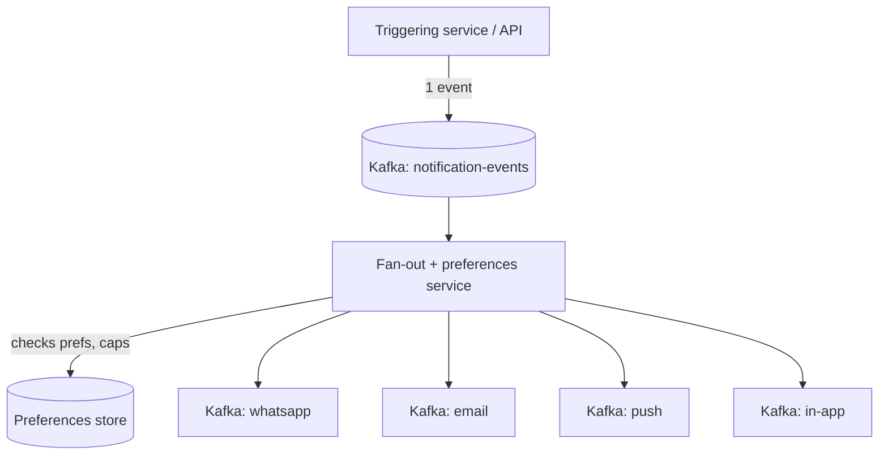
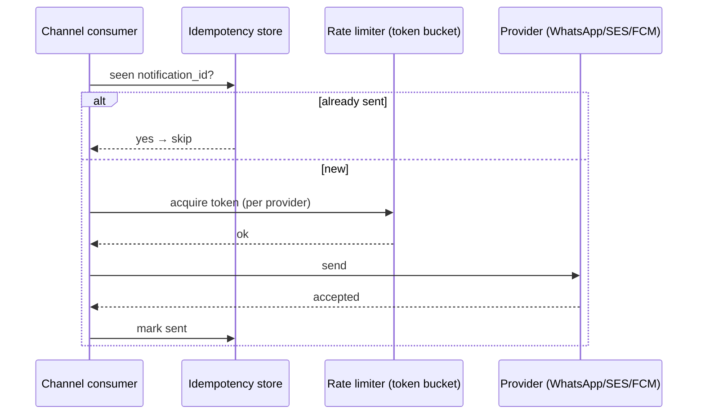
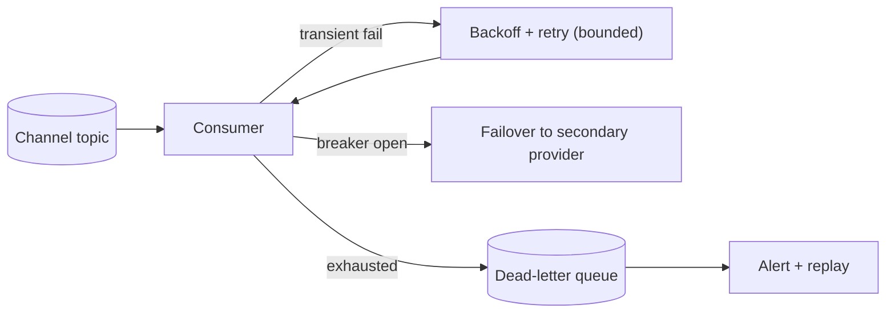
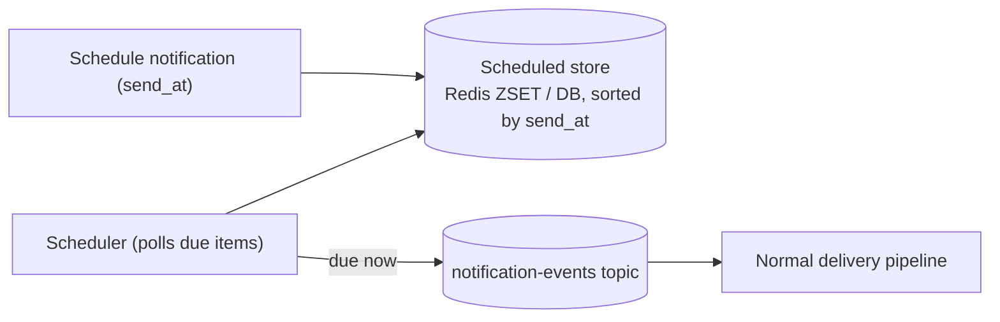
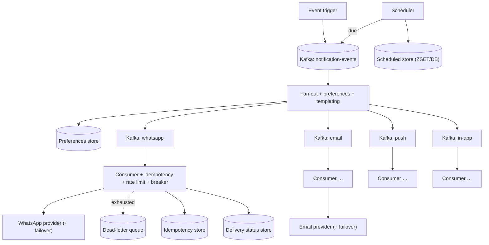

# Design a Multi-Channel Notification System (WhatsApp / Email / Push / In-App)

> [!abstract] How to read this chapter
> Built phase by phase from a synchronous send to a decoupled, per-channel, self-healing platform. Each phase adds one idea, exposes the next bottleneck, and fixes it — Kafka decoupling, per-channel rate limiting, idempotency, retries + DLQ, provider failover, and scheduled/future-dated delivery.

> [!info] Builds on the Notification Service chapter
> [[HLD/04 - Design a Notification Service/Design a Notification Service|The Notification Service chapter]] established async decoupling, per-channel topics, idempotency, and priority isolation. This chapter goes deeper on the operational edges the brief calls out: **provider failover, dead-letter handling, and scheduled delivery** across WhatsApp, email, push, and in-app.

> [!question] The interview question
> "Design a multi-channel notification system that sends WhatsApp, email, push, and in-app messages — event-triggered and scheduled — reliably, without duplicates, respecting each provider's limits, and surviving provider outages."

---

## Requirements

**Functional**
- Deliver over **WhatsApp, email, push, in-app** (and be extensible to more).
- **Event-triggered** and **scheduled/future-dated** notifications (e.g. "remind me at 9am", digests).
- Per-user, per-channel, per-type **preferences** + frequency caps.
- **Templating** with per-locale content.
- **Delivery status** tracking (queued / sent / delivered / read / failed).

**Non-functional**

| Requirement | Why it matters here specifically |
|---|---|
| **Bursty high throughput** | A campaign or product launch fans out to millions in minutes — Kafka must absorb it. |
| **No dup, no drop** | Never double-send, never silently lose a notification — idempotency + durable queue. |
| **Respect provider limits** | WhatsApp/SES/FCM each throttle — exceeding gets the whole account limited. |
| **Survive provider outages** | One provider going down must not stall the others or lose messages. |
| **Latency-differentiated** | An OTP is near-instant; a digest tolerates minutes; scheduled ones fire at an exact time. |

---

## Phase 00 — Capacity math you can defend

| Quantity | Derivation | Result |
|---|---|---|
| Volume | 50M users × ~5/day | 250M/day → ~2,900/s average |
| Burst | campaign fan-out ~50× | ~150,000/s peak |
| Scheduled | digests + reminders | large synchronized bursts at round times (9:00, midnight) |

> [!example] In plain words
> Two burst shapes: **event-driven** spikes (a launch) and **time-driven** spikes (everyone's 9am digest firing at once). The queue absorbs the first; a scheduler with jitter tames the second. Both must be dedup-safe and provider-limit-aware.

---

## Phase 01 — The naive version: synchronous per-channel send

*Start with inline provider calls so the failures name the design.*

The triggering service calls each provider's API synchronously. Breaks: a slow/down provider blocks the caller, bursts exceed provider limits, no retry story, and adding a channel means editing the caller. (Same failures as [[HLD/04 - Design a Notification Service/Design a Notification Service|the Notification Service chapter]] — the starting point here.)

| 🔴 Bottleneck | 🟢 Next fix |
|---|---|
| Delivery coupled to the request, unbuffered, unretried, provider-limit-blind. | Decouple with Kafka + per-channel fan-out (Phase 2). |

---

## Phase 02 — Decouple with Kafka + per-channel topics

*Publish intent once; deliver off the critical path, per channel.*

The trigger publishes one event and returns. A fan-out worker resolves recipients, checks preferences/frequency caps, renders the template, and routes to **per-channel topics**. Each channel scales its own consumers independently. Kafka buffers the burst.

| 🔴 Bottleneck | 🟢 Next fix |
|---|---|
| A crashed consumer that gets a message redelivered could double-send; each provider has its own hard rate limit. | Idempotency + per-channel outbound rate limiting (Phase 3). |

---

## Phase 03 — Idempotency + per-channel rate limiting

*Make redelivery safe, and never exceed a provider's ceiling.*

**Idempotency.** Every logical notification carries a unique `notification_id`. Before calling a provider, the consumer checks an [[Glossary/Idempotency|idempotency]] store ("already sent this ID?") and skips if so. This makes Kafka's at-least-once delivery *effectively* exactly-once at the provider.

**Rate limiting.** Each channel consumer holds a **token bucket** sized to *that provider's* limit (same mechanism as [[HLD/02 - Design a Rate Limiter/Design a Rate Limiter|the Rate Limiter chapter]], applied outbound). When the bucket is empty, the consumer slows its own consumption — Kafka backlog grows harmlessly rather than the provider throttling the account.

| 🔴 Bottleneck | 🟢 Next fix |
|---|---|
| A provider still fails transiently or goes fully down — retries against a dead provider pile up and poison the queue. | Retries, DLQ, and circuit-breaking (Phase 4). |

---

## Phase 04 — Retries, dead-letter queue, provider failover

*Handle the spectrum from a blip to a full outage without losing messages.*

- **Transient failure** → retry with **exponential backoff + jitter**, bounded attempts.
- **Repeated failure** → route the message to a **dead-letter queue (DLQ)** — a durable "failed notifications" topic for inspection, alerting, and manual/automated replay. Nothing is silently dropped.
- **Provider fully down** → a [[Glossary/Circuit Breaker|circuit breaker]] trips once the failure rate crosses a threshold: stop hammering the dead provider, fail fast.
- **Provider failover** → for a channel with multiple providers (e.g. two SMS/email vendors), the breaker tripping routes traffic to a **secondary provider**; messages that can't send anywhere yet wait in the queue/DLQ until recovery.

> [!warning] The DLQ is a signal, not a graveyard
> A *growing* DLQ means a systemic problem (a provider outage, a bad template), not one-off failures. Alert on DLQ growth rate and consumer lag trend — a degrading provider shows up as building lag *before* it shows up as errors.

| 🔴 Bottleneck | 🟢 Next fix |
|---|---|
| Everything so far fires *now* — but the brief needs "send at 9am tomorrow" and daily digests, which can't sit in a live topic for hours. | A scheduling layer (Phase 5). |

---

## Phase 05 — Scheduled & future-dated delivery

*Fire a notification at an exact future time — without holding it in a hot topic.*

Scheduled notifications are stored in a **time-indexed store** keyed by fire-time (a DB table sorted by `send_at`, or a Redis sorted set scored by timestamp). A **scheduler** polls for anything due in the next window and publishes it into the normal `notification-events` topic — after which it flows through the exact same pipeline (prefs → channel → idempotency → rate limit → send).

> [!bug] The 9am thundering herd
> Everyone's daily digest scheduled for exactly `09:00` fires at once — a self-inflicted spike. Mitigate by **jittering** scheduled times within a small window (e.g. 09:00–09:05) and letting Kafka + per-provider rate limiting smooth the rest. Scheduling precision to the second is rarely a real product need.

| 🔴 Bottleneck | 🟢 Next fix |
|---|---|
| Individual pieces handled — assemble the platform. | Final architecture (Phase 6). |

---

## Phase 06 — The final combined architecture

**Six principles to close with:**
1. Publish intent once to Kafka, return; deliver off the critical path via per-channel topics.
2. Idempotency key per notification makes at-least-once delivery effectively exactly-once at the provider.
3. Per-provider token buckets cap outbound; a full bucket grows the Kafka backlog, never throttles the account.
4. Retries → backoff+jitter → DLQ; nothing is silently dropped, and DLQ growth is a systemic-failure alarm.
5. Circuit breakers isolate a dead provider and trigger failover to a secondary; the queue holds what can't send yet.
6. Scheduled sends live in a time-indexed store, jittered to avoid round-time herds, then flow through the same pipeline.

---

## Interviewer follow-ups, answered

> [!quote]- "How do you avoid double-sending on consumer crash/redelivery?"
> A unique `notification_id` checked against an idempotency store before every provider call — a redelivered, already-sent message is skipped.

> [!quote]- "How do you avoid exceeding a provider's rate limit?"
> A per-provider token bucket on the channel consumer; when empty, the consumer slows consumption and the Kafka backlog absorbs the excess instead of the provider throttling the account.

> [!quote]- "What happens when a provider goes down entirely?"
> A circuit breaker trips, failing fast; traffic fails over to a secondary provider if configured; messages that can't send anywhere wait in the queue/DLQ and replay on recovery. A growing DLQ alerts.

> [!quote]- "How do you schedule a notification for a future time reliably?"
> Store it in a time-indexed store (Redis ZSET or DB sorted by `send_at`); a scheduler publishes due items into the normal topic. Jitter round times to avoid a synchronized 9am spike.

> [!quote]- "A user mutes push but keeps email — how?"
> Preferences keyed by `(type, channel)`, checked at fan-out before any per-channel message is queued; the muted combination simply never dispatches.

---

## Production experience

> [!info] What to monitor
> Delivery success rate **per channel and per provider** (a silent degradation on one shouldn't hide behind healthy aggregates). Consumer lag per channel — a degrading provider shows as building lag before errors. DLQ size and growth rate. Scheduler drift (are due items firing on time?). Idempotency hit rate (a spike can mean upstream is double-publishing).

> [!bug] A real production gotcha
> Templating and preference checks at fan-out can become the bottleneck under a mega-campaign — render once and cache per-locale template output, and batch preference lookups, so fan-out doesn't serialize millions of per-user DB reads.

---

## Cheat sheet — if you remember nothing else

1. Publish one event to Kafka and return; fan out to per-channel topics off the critical path.
2. Idempotency key per notification → at-least-once becomes effectively exactly-once at the provider.
3. Per-provider token buckets cap outbound; a full bucket backs up Kafka instead of throttling the account.
4. Retries (backoff+jitter) → DLQ → alert; circuit breakers isolate dead providers and fail over to a secondary.
5. Scheduled sends live in a time-indexed store (ZSET/DB), jittered to avoid round-time herds, then flow the same pipeline.
6. Watch per-provider success + consumer-lag trend + DLQ growth; render/cache templates to keep fan-out fast.

---
*Related: [[00 - Start Here/How This Handbook Works|Book Map]] · [[HLD/04 - Design a Notification Service/Design a Notification Service|Design a Notification Service]] · [[HLD/02 - Design a Rate Limiter/Design a Rate Limiter|Design a Rate Limiter]] · [[Glossary/Idempotency|Idempotency]] · [[Glossary/Circuit Breaker|Circuit Breaker]]*
