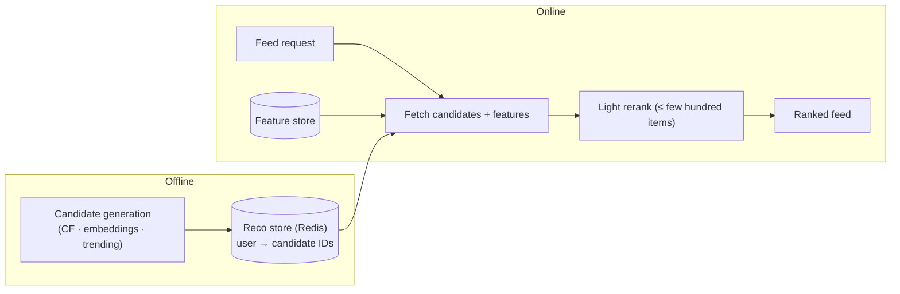
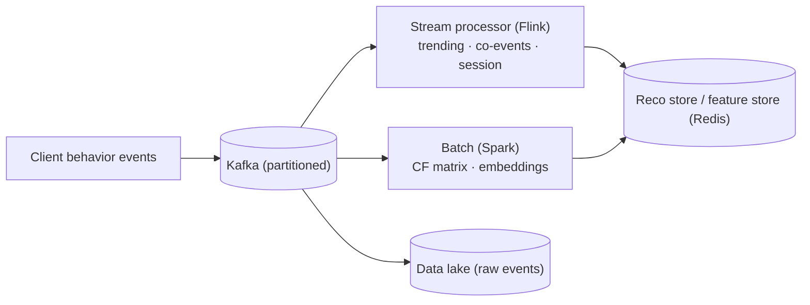
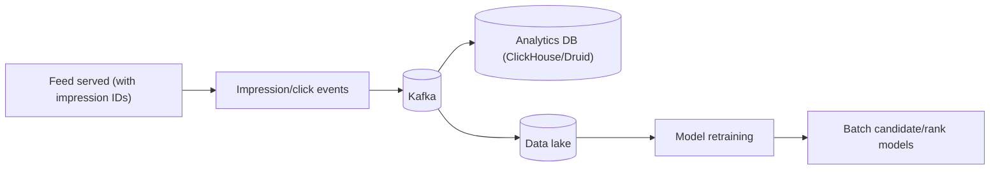
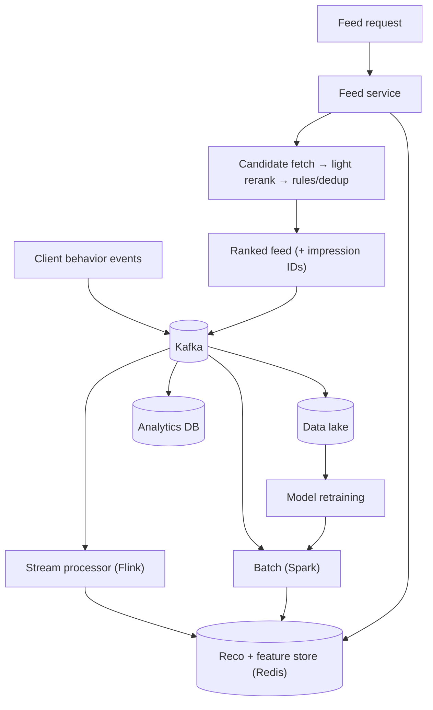

# Design a Personalized Recommendation & Home-Feed System

> [!abstract] How to read this chapter
> Built phase by phase around one golden rule — precompute the heavy math offline, do only a shallow lookup + light rerank online. Each phase adds one idea, exposes the next bottleneck, and fixes it: event ingestion, stream/batch processing, candidate generation, ranking, a Redis serving layer, cold start, and the analytics feedback loop.

> [!question] The interview question
> "Design a personalized recommendation and home-feed system — when a user opens the app, show a ranked feed of items (songs, shows, posts, products) tailored to them, updated as their behavior and the catalog change."

---

## Requirements

**Functional**
- Build a **personalized ranked feed** per user on app open.
- Reflect **recent behavior** (what they just played/liked) quickly.
- Surface **fresh/trending** content, not just historical favorites.
- Handle **cold start** — brand-new users and brand-new items.
- Support **A/B testing** of ranking variants.

**Non-functional**

| Requirement | Why it matters here specifically |
|---|---|
| **Low feed latency** | Feed build must be well under ~100–200 ms — nobody waits for a home screen. |
| **Freshness** | A play from 2 minutes ago should influence the feed soon, not tomorrow. |
| **Massive event volume** | Every impression/click/play is an event — the ingestion firehose. |
| **Scalable ranking** | Can't score a million-item catalog per request — candidate-then-rank. |

---

## Phase 00 — Capacity math you can defend

| Quantity | Derivation | Result |
|---|---|---|
| Behavior events | 100M DAU × ~50 events/day | ~5B events/day → ~58k/s avg, higher at peak |
| Feed requests | 100M DAU × ~10 opens | ~1B/day → the read hot path |
| Catalog | items to recommend | 1M–100M — far too many to score per request |

> [!example] In plain words
> Two firehoses meet: a huge **write** stream of behavior events, and a huge **read** stream of feed requests. The golden rule: **nothing that touches 5B events belongs anywhere near the 100 ms feed budget.** Precompute offline, look up online.

---

## Phase 01 — The naive version: score everything on request

*Start with ranking the whole catalog live so its cost names the fix.*

On each feed request, score every catalog item for the user with a model and sort. Breaks immediately — scoring millions of items per request per user can't be sub-200 ms, and recomputes the same expensive signals on every open.

| 🔴 Bottleneck | 🟢 Next fix |
|---|---|
| Live full-catalog scoring is `O(catalog)` per request — impossible at feed latency. | Split into offline candidate generation + light online rerank (Phase 2). |

> [!example] Layman
> Interviewing every candidate in the country each time you need to fill a seat. Instead, keep a short pre-vetted shortlist ready, and only do the final interview live.

---

## Phase 02 — The core split: precompute offline, rerank online

*Two stages: generate a small candidate set offline, rank that small set online.*

- **Candidate generation (offline/near-real-time):** for each user, precompute a few hundred candidate items from cheap sources — collaborative filtering ("users like you played X"), content similarity (embeddings/ANN), trending, recently-viewed follow-ups. Write results to a fast KV store: `user_id → [candidate item IDs]`.
- **Ranking (online):** on request, fetch the ~few-hundred candidates + the user's precomputed features, run a **lightweight in-process reranker** (linear model or small GBDT) over just that set, apply business rules, return top N.

| 🔴 Bottleneck | 🟢 Next fix |
|---|---|
| Candidate lists must come *from* behavior — and behavior arrives as a 5B/day event stream that needs ingesting and processing. | Event ingestion + stream/batch pipelines (Phase 3). |

---

## Phase 03 — Event ingestion + stream & batch processing

*Turn the behavior firehose into the signals that feed candidate generation.*

Every impression/click/play publishes to **Kafka** (partitioned by user or item). Two consumers with different freshness/cost profiles read the same stream (**Lambda-style** split):

- **Stream processing (Flink/Spark Streaming)** — near-real-time signals: trending counts (sliding window with decay), "recently played → next" co-events, session context. Latency: seconds. Updates the reco store quickly so a play from 2 minutes ago shows up.
- **Batch processing (Spark)** — heavy periodic jobs: the collaborative-filtering matrix, embedding training, co-play/co-purchase counts. Latency: hours. Higher quality, updates the same reco store.

> [!tip] Same stream, many destinations — for free
> Kafka's independent consumer groups let the stream job, the batch job, and the raw-archive sink all read the same events without extra cost. The raw archive in a **data lake** is what makes retraining models and backfilling new features possible later.

| 🔴 Bottleneck | 🟢 Next fix |
|---|---|
| A brand-new user has no behavior and a brand-new item has no co-events — both are invisible to CF-based candidates. | A cold-start fallback ladder (Phase 4). |

---

## Phase 04 — Cold start + ranking precedence

*New users and new items must still get a sensible feed.*

**Cold-start fallback ladder** (also the degradation path when anything upstream is missing):
1. **Known user, rich history** → full personalized candidates + rerank.
2. **Anonymous/thin user with session events** → session-based ("you just played X → similar/next").
3. **Nothing at all** → trending/popular for the user's segment (locale, entry point).

**New items** (no behavior yet) get in via **content-based** candidate sources (embeddings/attributes) and a deliberate **exploration** slot — inject some unproven fresh items so they can gather the signal they need, instead of being permanently starved.

**Ranking precedence** keeps rules and ML coexisting: hard eligibility (region/licensing/blocklist) filters first → ML score → business boosts (freshness, promoted) → dedup/diversity (don't show five songs by one artist). Rules never silently lose to the model because precedence is structural.

| 🔴 Bottleneck | 🟢 Next fix |
|---|---|
| The online path needs its stores fast and its results measurable — and A/B testing needs consistent bucketing. | Serving layer, A/B, analytics loop (Phase 5). |

---

## Phase 05 — Deep dive: serving, A/B, and the analytics loop

**Serving layer.** The online path does a handful of **Redis** lookups (candidates + user features + trending) and an in-process rerank — every expensive join already happened offline. Cache the *shared* parts (trending, popular) heavily; the personalized rerank runs per request but over a tiny set.

**A/B testing.** `variant = hash(experiment_id, user_id) % 100` → bucket → ranking config. Deterministic, stateless, sticky per user. Every impression logs `experiment_id · variant · request_id · item_id`.

**The analytics feedback loop.** Impressions and clicks flow back into Kafka → the data lake and an analytics DB. This is *training data*: which items users actually engaged with, per variant, becomes the label set for the next model. Attribution joins a play/click back to the feed impression that surfaced it, within a window — done offline in the analytics store, never online.

| 🔴 Bottleneck | 🟢 Next fix |
|---|---|
| Individual pieces handled — assemble the picture. | Final architecture (Phase 6). |

---

## Phase 06 — The final combined architecture

**Six principles to close with:**
1. Precompute the heavy math offline; the online path is shallow KV lookups + a light rerank of a few hundred candidates.
2. Two-stage: candidate generation (offline/near-real-time) then ranking (online, tiny set) — never score the whole catalog live.
3. Lambda split on one Kafka stream: Flink for seconds-fresh signals, Spark for high-quality hourly models.
4. Cold start is a fallback ladder (personalized → session → trending) + exploration slots for new items.
5. Ranking precedence keeps rules structural: eligibility → ML → boosts → dedup/diversity.
6. Impressions/clicks feed the data lake → training data → next model — the loop that makes it improve, plus deterministic A/B bucketing.

---

## Interviewer follow-ups, answered

> [!quote]- "How do you keep the feed under 100 ms if ranking is expensive?"
> The expensive work (candidate generation, feature computation, model training) is all offline. Online is a few Redis lookups plus an in-process rerank over a few hundred candidates — no catalog-wide scoring, no cross-service model RPC on the hot path.

> [!quote]- "How does a play from 2 minutes ago show up in the feed?"
> The Flink stream job updates trending/session/co-event signals in the reco store within seconds; the next feed request picks them up. Deep model updates (batch) lag by hours but aren't needed for near-term freshness.

> [!quote]- "What does a brand-new user see?"
> The fallback ladder: no history → session-based if they've done anything this session, else trending/popular for their segment. The feed always renders something.

> [!quote]- "How do new items ever get recommended if they have no engagement?"
> Content-based candidates (embeddings/attributes) plus deliberate exploration slots that inject unproven items so they can gather signal, instead of a rich-get-richer feedback loop starving them forever.

> [!quote]- "How do you run A/B tests on ranking without them colliding?"
> Deterministic `hash(experiment_id, user_id) % 100` bucketing, sticky per user; log the full (experiment, variant) vector on every impression. Independent experiment layers with their own salts keep assignments statistically independent.

---

## Production experience

> [!info] What to monitor
> Feed latency percentiles (p99). Reco-store hit rate and staleness. Kafka consumer lag on stream and batch pipelines. **Engagement metrics per variant** (CTR, play-through) — the real product signal, and the training feedback. Candidate coverage — fraction of users getting a personalized vs fallback feed (rising fallback rate signals a broken pipeline).

> [!bug] A real production gotcha
> A feedback loop can collapse diversity — the model recommends what it already recommends, engagement confirms it, and the feed narrows. Explicit diversity/dedup rules and exploration slots aren't optional polish; without them the feed degrades into a monotonous echo over weeks.

---

## Cheat sheet — if you remember nothing else

1. Precompute offline, look up online — nothing touching 5B events goes near the 100 ms feed budget.
2. Two stages: offline candidate generation → online light rerank of a few hundred candidates (never score the whole catalog).
3. One Kafka stream, Lambda split: Flink for seconds-fresh signals, Spark for hourly high-quality models, raw to a data lake.
4. Cold start = fallback ladder (personalized → session → trending) + exploration slots so new items get signal.
5. Ranking precedence is structural (eligibility → ML → boosts → dedup/diversity); A/B by deterministic user-hash bucketing.
6. Impressions/clicks → data lake → training data → next model; enforce diversity or the feed collapses into an echo.

---
*Related: [[00 - Start Here/How This Handbook Works|Book Map]] · [[HLD/06 - Design Twitter - News Feed/Design Twitter - News Feed|Design Twitter / News Feed]] · [[HLD/29 - Design a User Activity Event Analytics Pipeline/Design a User Activity Event Analytics Pipeline|Event Analytics Pipeline]] · [[CS Fundamentals/05 - Messaging & Streaming/Kafka Internals|Kafka Internals]]*
