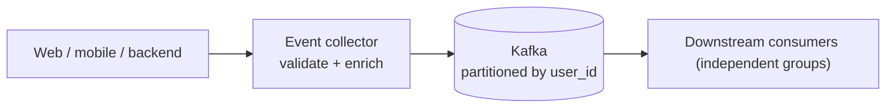
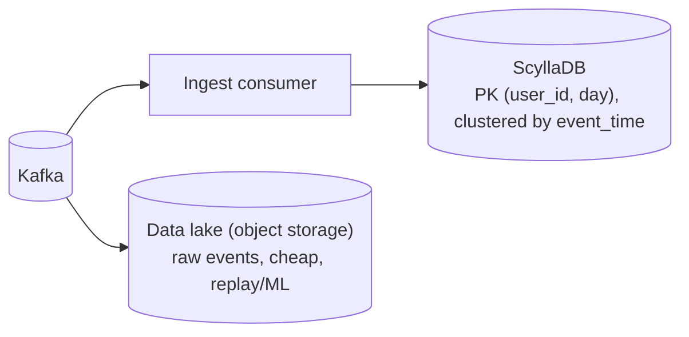
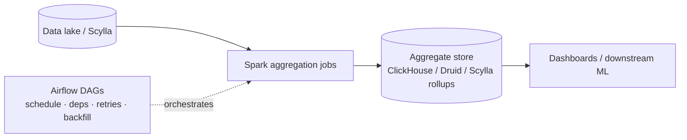
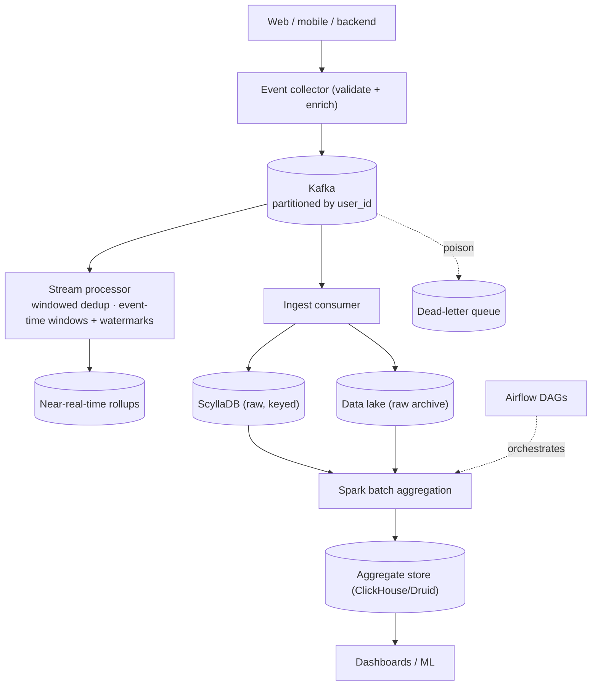

# Design a Large-Scale User Activity / Event Analytics Pipeline

> [!abstract] How to read this chapter
> Built phase by phase from "write events to a DB" to a partitioned, exactly-once-effect, late-tolerant pipeline. Each phase adds one idea, exposes the next bottleneck, and fixes it — Kafka partitioning, Scylla for raw storage, Spark + Airflow for aggregation, deduplication, late-event handling, and consumer-lag management.

> [!question] The interview question
> "Design a pipeline that ingests billions of user activity events per day, stores them durably, deduplicates and handles late-arriving events, and produces reliable aggregated analytics (DAU, funnels, per-feature usage) for dashboards and downstream ML."

---

## Requirements

**Functional**
- Ingest **user activity events** (views, clicks, plays, purchases) from web/mobile/backend.
- Store **raw events** durably and queryably.
- Produce **aggregations** (DAU/MAU, funnels, per-feature/per-cohort counts) on a schedule.
- **Deduplicate** events and correctly handle **late-arriving** ones.

**Non-functional**

| Requirement | Why it matters here specifically |
|---|---|
| **Billions of events/day** | Ingestion is a firehose — partitioning and horizontal scale from day one. |
| **No loss for accepted events** | Analytics that silently drop data are worse than useless — durability + replay. |
| **Correct despite dups + lateness** | Mobile clients retry and flush hours late; aggregates must not double-count or miss. |
| **Bounded lag** | Dashboards degrade if the pipeline falls hours behind — consumer lag is a first-class metric. |

---

## Phase 00 — Capacity math you can defend

| Quantity | Derivation | Result |
|---|---|---|
| Events | 10B/day | ~115,000/s average, higher at peak |
| Raw volume | 10B × ~500 B | ~5 TB/day raw |
| Kafka partitions | 115k/s ÷ ~10–20k/s per partition | ~30–60+ partitions, spread over brokers |

> [!example] In plain words
> A pure high-throughput **write + aggregate** problem. Ingestion must never block producers; storage must absorb 5 TB/day cheaply; aggregation is periodic and heavy. The correctness edges — dedup and late events — are where naive pipelines silently produce wrong numbers.

---

## Phase 01 — The naive version: apps write to a DB

*Start with direct writes so both failures name the fixes.*

Each app writes events straight to an analytics database, and dashboards query it directly. Breaks: no DB write path survives 115k/s cleanly, a burst overwhelms it, apps couple to DB availability, and dashboard aggregation queries scan the whole table.

| 🔴 Bottleneck | 🟢 Next fix |
|---|---|
| Direct DB writes can't take the firehose and couple producers to DB uptime; live aggregation scans everything. | Decouple ingestion behind a partitioned log (Phase 2). |

---

## Phase 02 — Kafka ingestion, partitioned

*Absorb the firehose; decouple producers from everything downstream.*

Events publish to **Kafka**, partitioned by a key that gives both parallelism and useful locality — commonly `user_id` (all of one user's events land in order on one partition, which helps sessionization and dedup). A lightweight collector validates + enriches and produces to Kafka; producers ack fast and move on.

> [!tip] Partition count is a one-way decision
> Kafka partition count can grow but never shrink, and it caps consumer parallelism. Size for peak throughput *and* desired max consumer parallelism with headroom (same reasoning as [[HLD/05 - Design a Distributed Message Queue (build Kafka)/Design a Distributed Message Queue|the Message Queue chapter]]).

| 🔴 Bottleneck | 🟢 Next fix |
|---|---|
| Kafka retains events for days, not forever — raw events need a durable, cheap, high-write home to store and query. | A scalable raw store: Scylla (Phase 3). |

---

## Phase 03 — Raw storage in Scylla

*Store every raw event durably at write-firehose scale.*

A consumer writes raw events to **ScyllaDB** (a Cassandra-compatible wide-column store built for exactly this: massive write throughput, linear horizontal scale, tunable consistency). Model the table for the query pattern — e.g. partition key `(user_id, day)`, clustering by `event_time` — so a user's day of activity is a contiguous, cheap read, and writes spread evenly across the cluster.

Also sink raw events to a **data lake** (object storage) — the cheapest durable copy, and the source of truth for reprocessing, backfills, and ML training. Kafka is the transport; Scylla serves point/range lookups; the lake is the permanent archive.

| 🔴 Bottleneck | 🟢 Next fix |
|---|---|
| Raw events aren't answers — dashboards need DAU, funnels, per-feature counts, computed reliably on a schedule. | Batch aggregation with Spark, orchestrated by Airflow (Phase 4). |

---

## Phase 04 — Aggregation with Spark, orchestrated by Airflow

*Turn raw events into scheduled, reliable aggregates.*

- **Spark** runs the heavy aggregation jobs — DAU/MAU, funnels, retention, per-cohort/per-feature counts — reading from the data lake (and/or Scylla), writing rollups to a serving store (a columnar analytics DB like ClickHouse/Druid, or back into Scylla for keyed lookups).
- **Airflow** orchestrates these as scheduled **DAGs** with dependencies, retries, and backfills: "wait until hour H's events are complete → run hourly rollup → run daily rollup that depends on the hourly ones." Idempotent, re-runnable jobs mean a failed run just re-runs safely.

| 🔴 Bottleneck | 🟢 Next fix |
|---|---|
| Aggregates are only as correct as the input — and raw events arrive duplicated and out of time order. | Deduplication + late-event handling (Phase 5). |

---

## Phase 05 — Deep dive: deduplication & late events

**Deduplication.** Clients retry; at-least-once delivery redelivers. Every event carries a unique `event_id` (client-generated UUID). Dedup by that key:
- **Stream-time:** a windowed dedup in the stream processor (keep seen `event_id`s for a bounded window) drops obvious duplicates cheaply.
- **Aggregation-time:** Spark jobs `COUNT(DISTINCT event_id)` / dedup on the key, so even duplicates that slipped past the window can't double-count. The `event_id` is the authoritative guard — the same "effect-idempotent, not delivery-exactly-once" principle as elsewhere in this handbook.

**Late events.** A mobile client offline for hours flushes events with old timestamps. The rule: **aggregate by event time, not arrival time.**
- Stream jobs use **event-time windows + watermarks** — a watermark says "no events older than T still expected"; events within an allowed-lateness window are folded into their correct (past) window, beyond it they're side-channeled.
- Batch jobs naturally handle lateness by **reprocessing**: a daily job re-reads the day (plus a grace tail) from the lake, so a late event that lands next hour is picked up on the next scheduled/backfill run. This is why the immutable data lake matters — you can always recompute a window.

> [!bug] Arrival-time aggregation silently corrupts every number
> Counting a play that *happened* at 11:58 PM but *arrived* at 12:03 AM in the wrong day is a real, invisible bug. Always key windows on event time; the watermark + reprocessing pair is what makes late data correct instead of lost or misattributed.

| 🔴 Bottleneck | 🟢 Next fix |
|---|---|
| Correctness handled — but the pipeline can silently fall behind, and stale dashboards are wrong dashboards. | Consumer lag management (Phase 6). |

---

## Phase 06 — Consumer lag & scaling

*A pipeline that falls hours behind is producing yesterday's numbers.*

- **Consumer lag** (how far behind the latest offset each group is) is the primary health metric. Alert on lag **trend**, not just an absolute threshold — a degrading consumer shows as building lag before it shows as errors.
- Scale by adding consumers up to the partition count; if that's not enough, the partition count is the ceiling (raise it — one-way).
- Keep consumers idempotent so a rebalance/restart replays safely (dedup guarantees correctness).
- Bound blast radius: isolate slow/poison events to a DLQ so one bad event batch doesn't stall a partition.

| 🔴 Bottleneck | 🟢 Next fix |
|---|---|
| Individual pieces handled — assemble the pipeline. | Final architecture (Phase 7). |

---

## Phase 07 — The final combined architecture

**Six principles to close with:**
1. Decouple with Kafka (partitioned by user_id) so producers never block and downstream scales independently.
2. Scylla stores raw events at write-firehose scale, modeled for the read pattern; the data lake is the permanent archive + replay source.
3. Spark aggregates on a schedule; Airflow orchestrates DAGs with dependencies, retries, and backfills.
4. Dedup on a client-generated `event_id` — windowed in-stream, authoritative at aggregation time.
5. Aggregate by **event time** with watermarks + reprocessing — arrival-time aggregation silently corrupts every number.
6. Consumer lag (trend, not threshold) is the top health metric; keep consumers idempotent so replay is safe.

---

## Interviewer follow-ups, answered

> [!quote]- "Why Kafka in front instead of writing straight to Scylla?"
> Kafka decouples producers from storage/consumers, absorbs bursts, and lets multiple independent consumers (raw sink, stream aggregation, lake archive) read the same stream. It's also the replay buffer that makes reprocessing possible.

> [!quote]- "How do you deduplicate events?"
> A client-generated `event_id` per event: windowed dedup in the stream processor for cheap early removal, and `COUNT(DISTINCT event_id)` / key-dedup in Spark as the authoritative guard so nothing double-counts.

> [!quote]- "How do you handle events that arrive hours late?"
> Aggregate by event time, not arrival time. Stream jobs use event-time windows + watermarks with an allowed-lateness grace; batch jobs reprocess the window (plus a tail) from the immutable data lake, so late events are folded into their correct period on the next run.

> [!quote]- "How do you keep the pipeline from falling behind?"
> Monitor consumer lag trend and alert early; scale consumers up to the partition count; keep jobs idempotent so restarts/rebalances replay safely; DLQ poison events so one bad batch doesn't stall a partition.

> [!quote]- "Why Scylla and not a relational DB for raw events?"
> Scylla is built for massive write throughput and linear horizontal scale with tunable consistency — exactly the firehose write pattern. Model the table by the query (partition by user+day) so reads stay cheap; a relational DB would bottleneck on write volume at this scale.

---

## Production experience

> [!info] What to monitor
> **Consumer lag per group (trend)** — the top-level pipeline-health signal. Airflow DAG success/duration and backfill queue depth. Dedup rate (a spike means upstream is double-emitting). Late-event rate and how much lands beyond the allowed-lateness window (data quietly missed). Scylla write latency and per-node load skew. Aggregate freshness (how stale is each dashboard number).

> [!bug] A real production gotcha
> A hot partition key (e.g. an anonymous/`null` user_id or a single mega-tenant) sends disproportionate traffic to one Kafka partition and one Scylla partition — the aggregate cluster looks healthy while one node melts. Detect key skew explicitly; salt or sub-partition hot keys.

---

## Cheat sheet — if you remember nothing else

1. Kafka (partitioned by user_id) decouples producers, absorbs bursts, and is the replay buffer for reprocessing.
2. Scylla stores raw events at firehose write scale (model by query pattern); the data lake is the permanent archive.
3. Spark does heavy aggregation; Airflow orchestrates DAGs with deps, retries, and backfills — keep jobs idempotent.
4. Dedup on a client `event_id` (windowed in-stream, `COUNT(DISTINCT)` authoritative at aggregation).
5. Aggregate by **event time** with watermarks + reprocessing — arrival-time counting silently corrupts every metric.
6. Consumer lag trend is the top health metric; watch for hot partition-key skew melting a single node.

---
*Related: [[00 - Start Here/How This Handbook Works|Book Map]] · [[HLD/05 - Design a Distributed Message Queue (build Kafka)/Design a Distributed Message Queue|Message Queue]] · [[HLD/24 - Design an Analytics Aggregation System/Design an Analytics Aggregation System|Analytics Aggregation (HyperLogLog)]] · [[HLD/20 - Design a Log Aggregation and Monitoring System/Design a Log Aggregation and Monitoring System|Log Aggregation]] · [[CS Fundamentals/05 - Messaging & Streaming/Kafka Internals|Kafka Internals]]*
