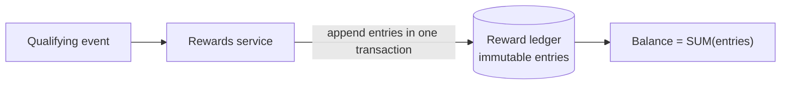
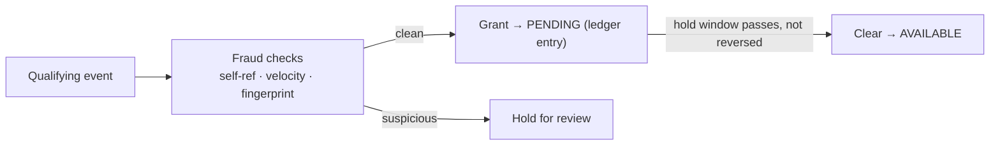
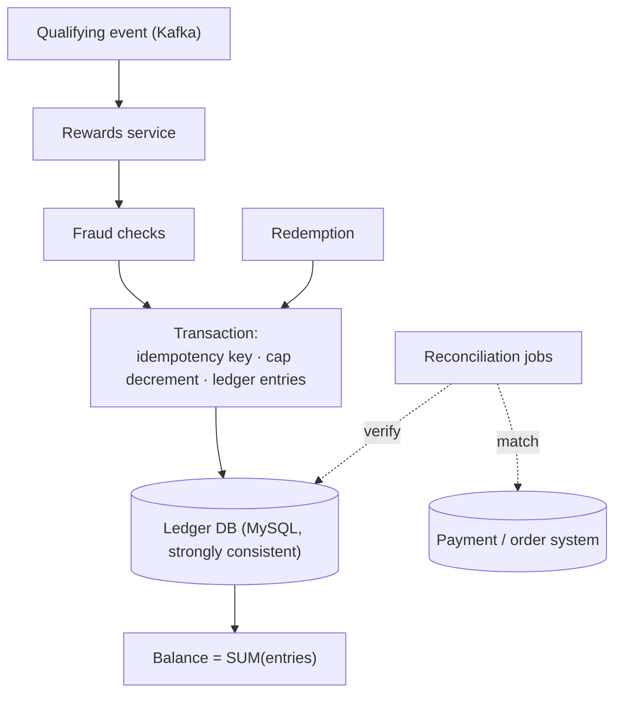

# Design a Referral & Rewards System

> [!abstract] How to read this chapter
> Built phase by phase around one non-negotiable: a reward is money-like, so the system must be a correct **ledger** — never double-credit, never lose a credit, always reconcilable. Each phase adds one idea, exposes the next bottleneck, and fixes it: transactions, an append-only reward ledger, concurrency control, duplicate prevention, fraud detection, and reconciliation.

> [!question] The interview question
> "Design a referral and rewards system — a user refers a friend, the friend signs up and completes a qualifying action, and both get a reward. Rewards must never be double-granted, must survive retries and races, and must be auditable and reconcilable."

---

## Requirements

**Functional**
- Generate/track **referral codes/links** per user.
- Attribute a new user to a referrer on signup.
- Grant **rewards** when a **qualifying event** completes (first purchase, KYC, etc.).
- Maintain a **reward balance** users can view and redeem.
- Support reward rules (amounts, caps, expiry, campaigns).

**Non-functional**

| Requirement | Why it matters here specifically |
|---|---|
| **Exactly-once reward** | Rewards are money-like — double-granting is a direct financial loss, never granting is a broken promise. |
| **Correct under concurrency** | Two events for the same referral racing must grant one reward, not two. |
| **Fraud-resistant** | Self-referral, fake accounts, and referral rings actively try to drain the budget. |
| **Auditable + reconcilable** | Every balance must trace to immutable entries; totals must reconcile to zero. |

---

## Phase 00 — Capacity math you can defend

| Quantity | Derivation | Result |
|---|---|---|
| Reward events | 10M users × occasional | modest QPS — hundreds/s peak, not millions |
| The real bar | correctness + audit | strong consistency, not throughput |

> [!example] In plain words
> Like the [[HLD/17 - Design a Payment System/Design a Payment System|Payment System]], this is a **correctness-critical, low-QPS** problem. The whole design is about never double-crediting, never losing a credit, and being able to prove every balance — not about scale.

---

## Phase 01 — The naive version: a mutable balance column

*Start with `UPDATE users SET balance = balance + 10` so its failures name the fixes.*

Referral attribution in a table; on a qualifying event, increment the referrer's balance column. Breaks badly:
- **Retries/redelivery double-credit** — the qualifying event fires twice, balance goes up twice.
- **Concurrent events race** — two workers read the same balance and both add, losing one (lost update).
- **No audit trail** — a balance is just a number; you can't answer "why is this 40?" or reconcile.

| 🔴 Bottleneck | 🟢 Next fix |
|---|---|
| A mutable balance double-credits on retry, loses updates under concurrency, and can't be audited. | Model rewards as an append-only ledger inside transactions (Phase 2). |

---

## Phase 02 — An append-only reward ledger

*Never store a balance you mutate — store immutable entries and derive the balance.*

The core of the system is a **double-entry-style ledger**: every reward is one or more immutable rows (`entry_id, account, referral_id, amount, type, campaign, created_at`). A user's balance is the **sum of their entries**, not a field you overwrite. Grants are `+` entries, redemptions/reversals are `-` entries; nothing is ever updated in place.



Wrap the grant in a **database transaction** so the referral-state change and the ledger entry commit atomically (a strongly-consistent store — MySQL/Postgres — is the right home; this is not a place for eventual consistency).

> [!tip] Why a ledger, not a balance
> An append-only ledger makes every balance *derivable and provable*, makes reversals first-class (a compensating entry, not a risky decrement), and makes reconciliation possible. This is the same discipline banks use, applied to rewards.

| 🔴 Bottleneck | 🟢 Next fix |
|---|---|
| A ledger still double-credits if the same qualifying event is processed twice (retry, redelivery, user clicks twice). | Idempotent, duplicate-proof grants (Phase 3). |

---

## Phase 03 — Duplicate prevention (idempotency)

*One qualifying event must produce exactly one grant, forever.*

Give every grant a **deterministic idempotency key** derived from the business event — e.g. `referral_id + reward_type` (or the source event's unique ID). Enforce it with a **unique constraint** on the ledger (or a dedicated `granted(referral_id, reward_type)` table). A second attempt to insert the same key fails the constraint → the grant is a no-op that returns the existing result.

```mermaid
sequenceDiagram
    participant W as Worker
    participant DB as Ledger DB
    W->>DB: BEGIN; INSERT grant(idempotency_key = referral_id+type)
    alt key already exists
        DB-->>W: UNIQUE violation → no-op (already granted)
    else new
        DB-->>W: inserted → append ledger entries; COMMIT
    end
```

> [!bug] The key must come from the business event, not the attempt
> If the idempotency key is generated per retry/request, dedup never matches and double-grants slip through — the exact same trap as [[HLD/17 - Design a Payment System/Design a Payment System|the Payment System]]. Derive it from the *logical* referral+reward, reused across every retry.

| 🔴 Bottleneck | 🟢 Next fix |
|---|---|
| Two concurrent workers can both pass the "should we grant?" check before either inserts — a race the unique constraint catches, but higher-level rules (caps, one-reward-per-referrer) need explicit concurrency control. | Concurrency control on rules (Phase 4). |

---

## Phase 04 — Concurrency control

*Correct not just per-grant, but across rules like caps and per-user limits.*

- The **unique constraint** is the last-line guard against duplicate grants (atomic check-and-claim — the same pattern as seat booking / inventory).
- **Campaign/user caps** ("max ₹500 rewards per referrer", "budget of ₹10M per campaign") are themselves shared counters that race. Enforce them atomically: a conditional update (`UPDATE ... WHERE remaining >= amount`) or a row-locked read-modify-write inside the same transaction as the grant, so a cap can never be exceeded by concurrent grants.
- Keep the grant + cap decrement + ledger entry in **one transaction** — all commit or none do.

> [!example] Layman
> A cashback jar with a fixed budget and one rule: you can only add to a person's jar if the campaign budget covers it, and only once per referral. Two clerks trying at once can't both spend the last of the budget — the jar is locked while one of them checks-and-spends.

| 🔴 Bottleneck | 🟢 Next fix |
|---|---|
| The mechanics are correct, but bad actors actively game referrals — self-referral, fake accounts, rings — draining the budget legitimately-looking. | Fraud detection (Phase 5). |

---

## Phase 05 — Fraud detection

*Referral programs are attacked the day they launch — assume adversaries.*

Fraud checks gate the grant (synchronously for hard rules, asynchronously for scoring):
- **Self-referral / same-identity** — match device fingerprint, payment instrument, address, phone; block referrer == referee by any strong signal.
- **Velocity limits** — one account referring dozens in minutes, or many signups from one IP/device, is throttled or held.
- **Qualifying-action integrity** — require a *real* qualifying event (a settled first purchase, passed KYC), not just signup, so fake accounts cost the fraudster real money to fake.
- **Delayed / held rewards** — grant into a **pending** state that only clears to **available** after a hold window (e.g. purchase not refunded within N days), so easily-reversed actions don't pay out instantly.
- **Ring detection** — offline graph analysis on the referral graph flags clusters of mutually-referring accounts for review.



| 🔴 Bottleneck | 🟢 Next fix |
|---|---|
| Even with all guards, discrepancies happen (a reversed purchase, a partial failure) — the ledger must be provably correct over time. | Reconciliation (Phase 6). |

---

## Phase 06 — Reconciliation & the final architecture

*Continuously prove the ledger is internally consistent and matches source truth.*

- **Internal reconciliation:** periodically verify each user's `balance == SUM(their ledger entries)`, and that campaign budgets consumed == sum of grants against them. In double-entry form, all entries for a transaction sum to zero — a non-zero sum is a bug to page on.
- **Source reconciliation:** rewards tied to purchases must reconcile against the payment/order system — a reward granted for a purchase later refunded gets a **compensating reversal entry** (never a deletion), keeping history intact.
- **Redemption** (spending rewards) is itself a ledger entry through the same idempotent, transactional path.



**Six principles to close with:**
1. Rewards are money-like — model an append-only ledger, never a mutable balance; balance is a derived sum.
2. Grants commit in a DB transaction on a strongly-consistent store — not a place for eventual consistency.
3. Idempotency key derived from the business event (referral+type) + unique constraint = exactly-once grant.
4. Caps and per-user limits are shared counters — enforce atomically in the same transaction (conditional update / row lock).
5. Assume adversaries: self-referral/fingerprint/velocity checks, real qualifying actions, and pending→available hold windows.
6. Reconcile continuously (balance == sum of entries; rewards vs payments); reverse with compensating entries, never deletes.

---

## Interviewer follow-ups, answered

> [!quote]- "How do you guarantee a referral is rewarded exactly once?"
> An idempotency key derived from the business event (referral_id + reward_type) enforced by a unique constraint on the ledger, all inside one transaction. A duplicate qualifying event hits the constraint and is a no-op.

> [!quote]- "Two qualifying events for the same referral arrive at the same instant — what happens?"
> The unique constraint is the atomic arbiter — one insert wins, the other fails and no-ops. Higher rules (caps) are enforced with conditional updates/row locks in the same transaction, so concurrency can't over-grant.

> [!quote]- "How do you prevent self-referral and fake-account farming?"
> Match strong identity signals (device fingerprint, payment instrument, address) to block self-referral; velocity-limit signups per IP/device; require a real qualifying action (settled purchase/KYC); and hold rewards in a pending state that clears only after a non-reversal window.

> [!quote]- "A purchase that earned a reward gets refunded — now what?"
> A compensating reversal entry in the ledger (never a deletion), moving the reward back out. Source reconciliation against the payment system catches it if the event was missed, keeping the ledger provably consistent.

> [!quote]- "How do you know the reward totals are correct?"
> Reconciliation jobs verify each balance equals the sum of its immutable entries, campaign budgets match granted totals, and rewards reconcile against the payment/order system — any mismatch pages, since it's a financial correctness bug.

---

## Production experience

> [!info] What to monitor
> Reconciliation discrepancy rate (ideally zero — any drift is urgent). Grant idempotency-conflict rate (a spike means upstream double-emitting). Fraud-hold rate and false-positive rate. Campaign budget burn vs cap. Pending→available conversion (a low rate can mean over-aggressive fraud holds). Ledger write latency.

> [!bug] A real production gotcha
> Reward rules change mid-campaign (amount bumps, new caps). Version the reward rules and stamp each grant with the rule version it was computed under — otherwise reconciliation can't explain why two grants for "the same" action differ, and disputes become unauditable.

---

## Cheat sheet — if you remember nothing else

1. Rewards are money — append-only ledger, balance = SUM(entries), never a mutable column.
2. Grants commit in a transaction on a strongly-consistent DB (MySQL/Postgres), not eventual consistency.
3. Exactly-once = idempotency key from the business event (referral+type) + unique constraint.
4. Caps/limits are shared counters — enforce atomically (conditional update / row lock) in the same transaction.
5. Fraud: fingerprint/self-referral/velocity checks + real qualifying action + pending→available hold window.
6. Reconcile continuously (balance vs entries, rewards vs payments); reverse with compensating entries, never deletes; version rules.

---
*Related: [[00 - Start Here/How This Handbook Works|Book Map]] · [[HLD/17 - Design a Payment System/Design a Payment System|Design a Payment System]] · [[HLD/31 - Design a Subscription and Payment System/Design a Subscription and Payment System|Subscription & Payment System]] · [[Glossary/Idempotency|Idempotency]]*
