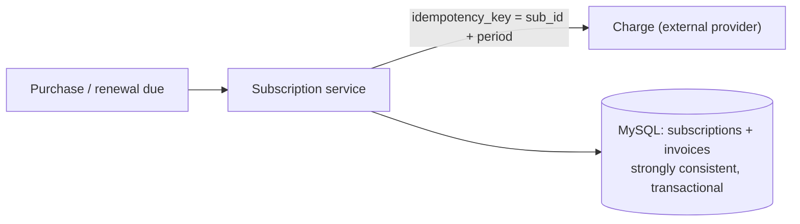
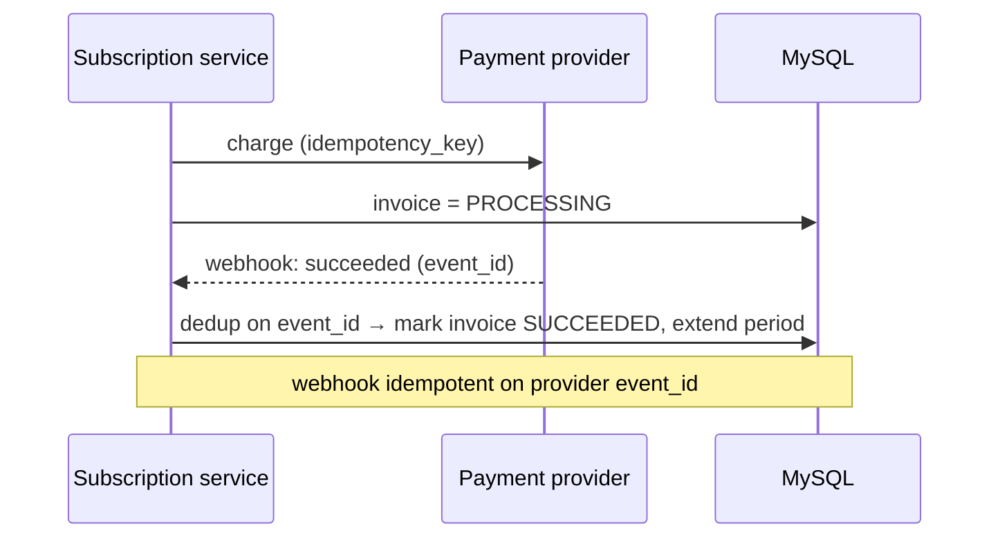
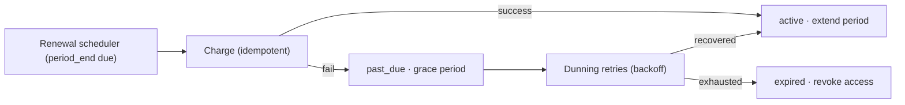
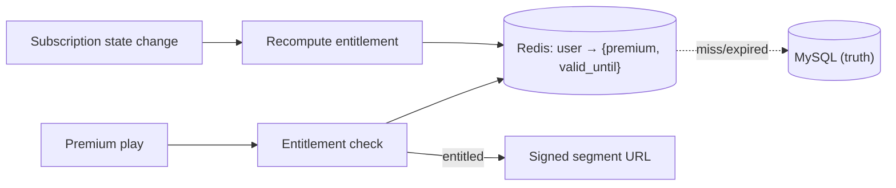

# Design a Subscription & Payment System for Premium Audio

> [!abstract] How to read this chapter
> Built phase by phase around two money-critical guarantees: charge correctly (never twice, never zero) and grant access correctly (entitlements match what was paid). Each phase adds one idea, exposes the next bottleneck, and fixes it — MySQL with strong consistency, idempotency, payment callbacks, renewals, entitlements, retries (dunning), and reconciliation.

> [!info] Builds on the Payment System chapter
> [[HLD/17 - Design a Payment System/Design a Payment System|The Payment System chapter]] covers the single-charge idempotency + reconciliation core. This chapter adds the *subscription* layer: recurring renewals, entitlements (what a paying user may access), and the plan lifecycle — on top of premium audio content ([[HLD/26 - Design an Audio Streaming Platform/Design an Audio Streaming Platform|Audio Streaming Platform]]).

> [!question] The interview question
> "Design a subscription and payment system for premium audio — users buy a plan, get access to premium content, are billed recurringly, and access is revoked when they stop paying. Charges must be exactly-once and access must always match what was paid for."

---

## Requirements

**Functional**
- Purchase a **subscription plan** (monthly/annual/tiers).
- Recurring **renewal billing** on schedule.
- Grant/revoke **entitlements** (premium access) based on subscription state.
- Handle **cancellation, upgrade/downgrade, refunds**.
- Process **payment provider callbacks** (async success/failure).

**Non-functional**

| Requirement | Why it matters here specifically |
|---|---|
| **Exactly-once charging** | Never double-charge, never charge zero when due — direct financial + trust impact. |
| **Strong consistency** | A user who paid must have access *now*; state can't be eventually-consistent when money is involved. |
| **Entitlement correctness** | Access must always match paid state — no free premium, no paid-but-locked-out. |
| **Resilient renewals** | Cards fail; the system must retry (dunning) without losing or double-charging. |
| **Auditable + reconcilable** | Every charge and access change must trace and reconcile against the provider. |

---

## Phase 00 — Capacity math you can defend

| Quantity | Derivation | Result |
|---|---|---|
| Active subs | 10M subscribers | modest steady QPS |
| Renewals | 10M ÷ 30 days | ~330k/day → ~4/s average, but **batchy** at cycle boundaries |
| Entitlement checks | every premium play | high read volume — must be cheap and cached |

> [!example] In plain words
> Billing is low-QPS and correctness-critical (like [[HLD/17 - Design a Payment System/Design a Payment System|Payments]]). But **entitlement checks are high-QPS** — every time a user hits play on premium content. So: strong-consistency + audit on the money path, fast cached reads on the access path.

---

## Phase 01 — The naive version: charge, then flip a boolean

*Start with a synchronous charge + `is_premium = true` so its failures name the fixes.*

Charge the card synchronously; on success set `user.is_premium = true`. Breaks:
- **Timeout after charge succeeds** → a retry double-charges (the universal payment failure mode).
- **A boolean can't express** trial, grace period, cancelled-but-active-until-period-end, or *why* access exists.
- **No renewal story, no audit** — you can't answer "what did this user pay and when."

| 🔴 Bottleneck | 🟢 Next fix |
|---|---|
| Synchronous charge double-charges on retry, and a boolean can't model the subscription lifecycle or be audited. | Strongly-consistent subscription state + idempotent charges (Phase 2). |

---

## Phase 02 — Subscription state in MySQL, idempotent charges

*Model the lifecycle in a strongly-consistent store; make every charge exactly-once.*

- **MySQL** (or Postgres) holds `subscriptions` (plan, status, `current_period_end`, `cancel_at_period_end`) and an append-only `payments`/`invoices` table. Strong consistency + transactions are the point — this is money.
- Subscription **status** is a state machine: `trialing → active → past_due → cancelled/expired` (plus `grace`). Not a boolean.
- Every charge carries an **idempotency key** derived from the business event (e.g. `subscription_id + billing_period`), enforced by a unique constraint — a retried charge for the same period returns the stored result, never a second charge (same discipline as [[HLD/17 - Design a Payment System/Design a Payment System|the Payment System]]).



| 🔴 Bottleneck | 🟢 Next fix |
|---|---|
| Real payment confirmation is async (provider callbacks/webhooks) — the charge result arrives later, duplicated, or out of order. | Payment callbacks + a payment state machine (Phase 3). |

---

## Phase 03 — Payment callbacks (webhooks)

*The provider confirms success/failure asynchronously — handle it idempotently.*

The charge is initiated, and the provider later sends a **webhook** with the outcome. The subscription's payment moves through `initiated → processing → succeeded/failed`.



- **Webhook idempotency:** keyed by the provider's unique `event_id` — a duplicated/out-of-order webhook is deduped, never applied twice.
- On `succeeded` → extend `current_period_end`, set/keep status `active`, and update entitlements (Phase 5).
- On `failed` → move to `past_due`, trigger the retry/dunning flow (Phase 4).

| 🔴 Bottleneck | 🟢 Next fix |
|---|---|
| Cards fail at renewal (expired, insufficient funds) — a single failed charge shouldn't instantly cut off a paying customer, nor retry forever. | Renewals + retry/dunning (Phase 4). |

---

## Phase 04 — Renewals & retry (dunning)

*Bill recurringly, and recover from transient card failures gracefully.*

- A **renewal scheduler** finds subscriptions whose `current_period_end` is due and initiates the next charge (idempotency key = `subscription_id + next_period`, so a scheduler double-run can't double-charge). Same time-indexed scheduling idea as [[HLD/27 - Design a Multi-Channel Notification System/Design a Multi-Channel Notification System|scheduled notifications]].
- On failure → **dunning**: retry with a backoff schedule (e.g. retry on day 1, 3, 5) while the sub sits in `past_due` with a **grace period** during which access continues. Notify the user to update their card.
- If all retries exhaust → transition to `cancelled/expired` and revoke entitlements.
- **Cancellation** sets `cancel_at_period_end` (access continues until the paid period ends — not instant revocation). **Upgrade/downgrade** adjusts the plan with prorated charge/credit.



> [!warning] Don't cut off a paying customer on the first blip
> A grace period + dunning retries is the difference between "your card expired, here's 5 days to fix it" and instantly locking out a happy subscriber over a transient decline. The grace window is a product+revenue decision, stated explicitly.

| 🔴 Bottleneck | 🟢 Next fix |
|---|---|
| Subscription state is correct — but every premium *play* needs a fast access check, and it must never let a lapsed user in or lock a paid user out. | Entitlements (Phase 5). |

---

## Phase 05 — Entitlements: fast, correct access checks

*Separate "what did they pay" (billing truth) from "what may they access right now" (serving).*

**Entitlements** are the derived, serving-side answer to "can this user play premium content?" Derived from subscription state, but read on the high-QPS play path — so cache them.

- On any subscription state change (activate, renew, grace-enter, expire), **recompute the entitlement** and write it to a fast store (Redis) keyed by `user_id → {premium: true/false, valid_until}`.
- The audio platform's play path checks this cached entitlement (cheap, ~ms) before issuing a signed segment URL ([[HLD/26 - Design an Audio Streaming Platform/Design an Audio Streaming Platform|Audio Streaming Platform]]).
- **MySQL is the source of truth; Redis is the fast derived copy** — on a cache miss or ambiguity, fall back to the DB. `valid_until` bounds staleness so a lapsed entitlement can't linger past its period.



> [!danger] The two dangerous entitlement bugs
> **Paid-but-locked-out** (entitlement not updated after a successful renewal) is a support nightmare and churn driver. **Free premium** (entitlement not revoked after expiry) is direct revenue leakage. Both come from entitlement drifting from billing truth — which is why reconciliation (Phase 6) audits exactly this.

| 🔴 Bottleneck | 🟢 Next fix |
|---|---|
| Individual pieces handled — but money + access can still drift from the provider's reality. | Reconciliation + final architecture (Phase 6). |

---

## Phase 06 — Reconciliation & the final architecture

*Continuously prove billing, entitlements, and the provider all agree.*

- **Payment reconciliation:** a job compares internal invoice records against the provider's ledger — catches missed webhooks (a charge succeeded but the callback was lost) and stuck `processing` invoices, actively querying the provider for anything pending too long.
- **Entitlement reconciliation:** verify every active subscription has a matching valid entitlement and every entitlement maps to a paid, in-period subscription — catches both dangerous drift bugs from Phase 5.
- **Refunds** are compensating records + entitlement revocation, never edits to history.

```mermaid
graph TD
    Buy["Purchase / renewal"] --> Svc["Subscription service"]
    Svc -->|idempotent charge| Prov["Payment provider"]
    Prov -->|webhook (event_id dedup)| Svc
    Svc --> DB[("MySQL: subscriptions + invoices (truth)")]
    DB --> Ent["Entitlement recompute"] --> Redis[("Redis: entitlements")]
    Sched["Renewal scheduler + dunning"] --> Svc
    Recon["Reconciliation jobs"] -.verify.-> DB
    Recon -.match.-> Prov
    Recon -.verify.-> Redis
    Play["Premium play"] --> Redis
```

**Six principles to close with:**
1. Two guarantees: charge exactly-once, and keep entitlements matching paid state — money path and access path are different.
2. MySQL holds strongly-consistent subscription state (a status state machine, not a boolean) + an append-only invoice trail.
3. Idempotency key from the business event (sub_id + period) makes charges and scheduler re-runs exactly-once.
4. Payment callbacks are async — dedup webhooks on provider `event_id`; drive status off them.
5. Renewals via a scheduler; failures enter dunning (backoff retries + grace period) before revoking — don't cut off on one blip.
6. Entitlements are a fast Redis-cached derivation of billing truth; reconcile continuously against the provider to kill drift.

---

## Interviewer follow-ups, answered

> [!quote]- "How do you avoid double-charging on a renewal if the scheduler runs twice?"
> The charge idempotency key is `subscription_id + billing_period`, enforced by a unique constraint. A second attempt for the same period returns the existing result — the scheduler running twice or a retry can't produce two charges.

> [!quote]- "A payment webhook is lost — the user paid but has no access. How is it caught?"
> Reconciliation actively queries the provider for invoices stuck in `processing` beyond a threshold and for any charge the provider recorded that we didn't, then applies the outcome idempotently. Webhooks are an optimization; reconciliation is the safety net.

> [!quote]- "How do entitlements stay correct and fast on every premium play?"
> Entitlements are recomputed from subscription state on every state change and cached in Redis (`user → {premium, valid_until}`), read in ~ms on the play path, with MySQL as the fallback source of truth. `valid_until` bounds staleness so expiry can't linger.

> [!quote]- "A renewal card fails — do you cut off access immediately?"
> No — the sub enters `past_due` with a grace period and dunning retries (backoff schedule); access continues during grace while the user is prompted to fix payment. Only after retries exhaust is the subscription expired and entitlements revoked.

> [!quote]- "How do upgrades/cancellations behave mid-period?"
> Cancellation sets `cancel_at_period_end` — access continues until the paid period ends. Upgrade/downgrade changes the plan with a prorated charge or credit, all as new invoice/ledger entries, never edits to history.

---

## Production experience

> [!info] What to monitor
> Charge success rate and involuntary-churn (dunning failures). Invoices stuck in `processing` (lost-webhook signal). **Entitlement-vs-billing discrepancy rate** — the direct measure of the two dangerous drift bugs. Renewal-scheduler drift (are due renewals firing on time?). Reconciliation discrepancy rate (near-zero; any drift is urgent). Redis entitlement cache hit rate.

> [!bug] A real production gotcha
> Timezone and period-boundary math around renewals and proration is a rich source of off-by-one bugs (charging a day early/late, double-granting a day of access). Compute periods in UTC against `current_period_end`, and make renewal jobs idempotent so a boundary re-run is a no-op — the same care as [[HLD/21 - Design Google Calendar/Design Google Calendar|Calendar's]] DST handling, applied to billing cycles.

---

## Cheat sheet — if you remember nothing else

1. Two guarantees: exactly-once charge + entitlements matching paid state — money path (strong/audited) vs access path (fast/cached).
2. MySQL holds strongly-consistent subscription state (status state machine, not a boolean) + append-only invoices.
3. Idempotency key = sub_id + period → charges and scheduler re-runs are exactly-once; webhooks dedup on provider event_id.
4. Renewals via scheduler; card failures enter dunning (backoff + grace) before revoking — never cut off on one blip.
5. Entitlements are a Redis-cached derivation of billing truth (`user → {premium, valid_until}`), MySQL as fallback.
6. Reconcile continuously (invoices vs provider, entitlements vs billing) to kill paid-but-locked-out and free-premium drift.

---
*Related: [[00 - Start Here/How This Handbook Works|Book Map]] · [[HLD/17 - Design a Payment System/Design a Payment System|Design a Payment System]] · [[HLD/26 - Design an Audio Streaming Platform/Design an Audio Streaming Platform|Audio Streaming Platform]] · [[HLD/30 - Design a Referral and Rewards System/Design a Referral and Rewards System|Referral & Rewards]] · [[Glossary/Idempotency|Idempotency]]*
