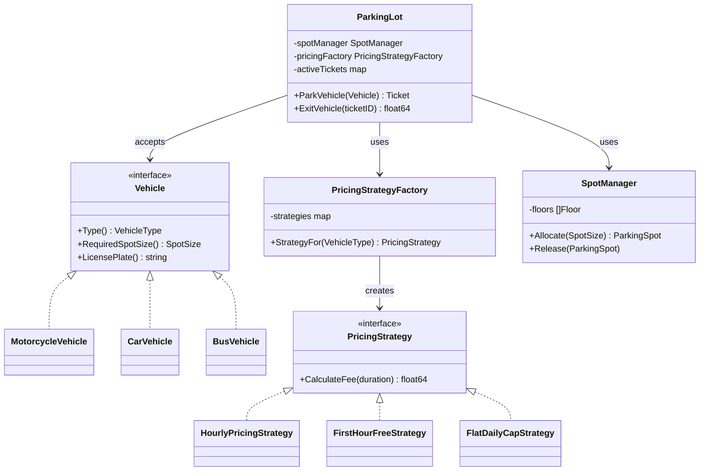
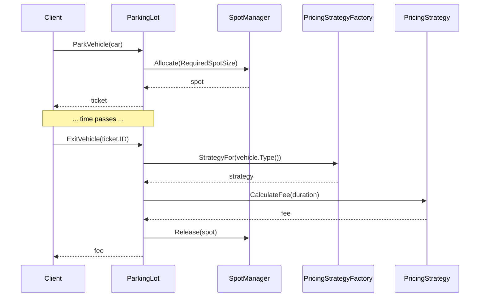

# Design a Parking Lot

> [!abstract] What you'll be able to do after this chapter
> Write a naive solution, feel exactly *why* it breaks under a new requirement, and derive Strategy + Factory as the fix — not memorize them as named patterns. Ship complete, compilable Go for the whole system. Name every SOLID principle the refactor actually satisfies, with the line of code that proves it.

---

## Step 1 — The interview question

> [!question] As an interviewer would ask it
> "Design a parking lot system. It should support multiple vehicle types, multiple floors, spot allocation on entry, and fee calculation on exit."

## Step 2 — Requirement clarification

**Functional**
- Multiple vehicle types (Motorcycle, Car, Bus), each requiring a specific spot size (Small/Medium/Large).
- Multiple floors, each holding spots of various sizes.
- On entry: find and assign an available spot matching the vehicle, issue a ticket.
- On exit: calculate the fee based on parked duration, release the spot, close the ticket.

**Non-functional — and why they matter**
- **Thread-safe.** Multiple entry/exit gates operate concurrently — two vehicles must never be assigned the *same* physical spot. This is a real [[Glossary/Race Condition|race condition]] risk, not a theoretical one.
- **Extensible pricing.** Different vehicle types (and potentially different lot operators) want fundamentally different fee structures — flat hourly, first-hour-free, daily cap. New pricing rules must be addable **without editing tested code.**

---

## Step 3 — The bad first draft

Here's the version most people write first — and it's not *wrong*, exactly. It works for the demo. It's what breaks under real requirements that matters.

```go
type ParkingLot struct {
	spots []*Spot
}

// CalculateFee — every vehicle type's pricing logic crammed into one
// function via a type-string comparison chain.
func (p *ParkingLot) CalculateFee(vehicleType string, hours int) float64 {
	if vehicleType == "motorcycle" {
		return float64(hours) * 10
	} else if vehicleType == "car" {
		return float64(hours) * 20
	} else if vehicleType == "bus" {
		return float64(hours) * 50
	}
	return 0
}

// ParkVehicle — spot-finding logic ALSO branches on vehicle type,
// inline, in the same struct that owns fee calculation, ticket
// issuance, and floor management.
func (p *ParkingLot) ParkVehicle(vehicleType string, plate string) *Spot {
	var requiredSize string
	if vehicleType == "motorcycle" {
		requiredSize = "small"
	} else if vehicleType == "car" {
		requiredSize = "medium"
	} else if vehicleType == "bus" {
		requiredSize = "large"
	}
	for _, spot := range p.spots {
		if spot.Size == requiredSize && !spot.Occupied {
			spot.Occupied = true
			return spot
		}
	}
	return nil
}
```

## Step 4 — Why it breaks (concretely, not theoretically)

> [!bug] Requirement change: "EV chargers need reduced pricing — first 2 hours free, then hourly."
> This means editing `CalculateFee` — a function that's already handling three other vehicle types' pricing, all of which now risk regression from a change meant for one new case. This is a textbook **Open/Closed Principle** violation: adding new behavior requires *modifying* existing, already-tested code instead of *extending* it.

> [!bug] Requirement change: "add a new vehicle type — Electric Scooter."
> Two more `if/else` branches, in two different functions, both already doing more than one job. `ParkingLot` is simultaneously responsible for spot allocation logic, fee calculation logic, *and* whatever else gets bolted on next (ticket printing? occupancy analytics?) — a **Single Responsibility Principle** violation that compounds with every new feature.

> [!bug] Requirement change: "monthly pass holders pay a flat fee regardless of duration."
> The `CalculateFee(vehicleType string, hours int) float64` signature *assumes* every pricing rule is a function of hours. A monthly pass isn't — it's a function of *whether a valid pass exists*, not duration at all. Forcing that into this signature means awkward special-casing (`if hours == -1, treat as pass-holder`) instead of a clean model — a sign the abstraction itself (a bare function, not an interface) is wrong.

> [!bug] Untestable in isolation.
> Testing "is the first-hour-free rule correct" requires going through the entire `ParkingLot` struct, its spot list, and every other pricing branch — you can't unit test one pricing rule without dragging in everything else.

---

## Step 5 — Refactor: Strategy for pricing, Factory for construction

The fix is to stop asking "what vehicle type is this" inside the fee-calculation code at all. Instead: define **what a pricing rule *is*** as an interface, write one small struct per rule, and let a **Factory** decide which one applies — `ParkingLot` never branches on vehicle type again, anywhere.

```go
// PricingStrategy is the abstraction that replaces the if/else chain.
// ParkingLot will depend on THIS, never on a concrete pricing struct —
// that's Dependency Inversion in one line.
type PricingStrategy interface {
	CalculateFee(duration time.Duration) float64
}
```

Each pricing rule becomes its own tiny, independently testable struct implementing that one method — shown in full in Step 9. Adding "EV chargers, first 2 hours free" from the bug report above is now: write one new struct implementing `PricingStrategy`, register it in the factory, done — **zero lines changed in `ParkingLot` itself.** That's the Open/Closed Principle, concretely satisfied, not just named.

Spot allocation gets the same treatment via a `SpotManager` — pulled out of `ParkingLot` entirely, because "where does this vehicle physically go" and "how much does this vehicle owe" are two different responsibilities that had no business sharing one struct (Single Responsibility Principle, restored).

---

## Step 6 — UML & sequence diagrams (the design, post-refactor)





---

## Step 7 — SOLID, applied line by line

| Principle | Where it's satisfied |
|---|---|
| **S**RP | `ParkingLot` orchestrates; `SpotManager` owns allocation; `PricingStrategyFactory` owns rule selection; each `PricingStrategy` owns exactly one fee formula. Four responsibilities, four types. |
| **O**CP | Adding a new pricing rule = new struct + one factory map entry. `ParkingLot.ExitVehicle` is never touched again. |
| **L**SP | Any `PricingStrategy` implementation is fully substitutable — `ParkingLot` calls only `CalculateFee(duration)` and never assumes anything about a specific implementation's internals. |
| **I**SP | `PricingStrategy` has exactly one method — no implementer is forced to satisfy behavior it doesn't need. |
| **D**IP | `ParkingLot` depends on the `PricingStrategy` **interface**, injected via `PricingStrategyFactory` — never imports or references a concrete pricing struct directly. |

## Step 8 — Alternatives considered, and why Strategy won

> [!tip] "Why not just a config-driven rate table — `map[VehicleType]float64`?"
> Works fine when every rule is *the same shape of computation with different numbers* (just an hourly rate). It breaks the moment rules differ **structurally** — "first hour free" and "daily cap" aren't different *rates*, they're different *formulas*. A data table can express different parameters; it can't express different computations. That structural difference is exactly what forces Strategy (behavior as a first-class, swappable thing) over plain configuration.

> [!tip] "How would this look in Java/C++ instead of Go?"
> Conceptually identical — `PricingStrategy` would be an abstract class or interface, each rule a subclass overriding one method. The *pattern* (swap the algorithm without the caller knowing which one) is language-agnostic; Go just expresses it via interfaces + composition instead of inheritance, per [[LLD/00 - Foundations/OOP in Go|OOP in Go]].

---

## Step 9 — Complete, compilable Go implementation

> [!info] Module layout
> One file per concern, all in package `parkinglot` except `main.go`. Adjust the import path in `main.go` to match your actual module name (`go mod init <your-module-name>`).

```go
// ============================================================
// FILE: vehicle.go
// ============================================================
package parkinglot

// VehicleType identifies the category of vehicle. A distinct type
// (not a bare string) so the compiler catches typos at every call site.
type VehicleType string

const (
	Motorcycle VehicleType = "MOTORCYCLE"
	Car        VehicleType = "CAR"
	Bus        VehicleType = "BUS"
)

// SpotSize identifies the physical size category a spot supports.
type SpotSize string

const (
	Small  SpotSize = "SMALL"
	Medium SpotSize = "MEDIUM"
	Large  SpotSize = "LARGE"
)

// Vehicle is the abstraction the rest of the system depends on.
// Adding a new vehicle type means implementing this interface —
// never editing existing spot-allocation or pricing code.
type Vehicle interface {
	Type() VehicleType
	RequiredSpotSize() SpotSize
	LicensePlate() string
}

// baseVehicle factors out the one behavior every vehicle shares
// (composition, not inheritance — see LLD/00 Foundations).
type baseVehicle struct {
	plate string
}

func (b baseVehicle) LicensePlate() string { return b.plate }

type MotorcycleVehicle struct{ baseVehicle }

func NewMotorcycle(plate string) *MotorcycleVehicle {
	return &MotorcycleVehicle{baseVehicle: baseVehicle{plate: plate}}
}
func (m *MotorcycleVehicle) Type() VehicleType          { return Motorcycle }
func (m *MotorcycleVehicle) RequiredSpotSize() SpotSize { return Small }

type CarVehicle struct{ baseVehicle }

func NewCar(plate string) *CarVehicle {
	return &CarVehicle{baseVehicle: baseVehicle{plate: plate}}
}
func (c *CarVehicle) Type() VehicleType          { return Car }
func (c *CarVehicle) RequiredSpotSize() SpotSize { return Medium }

type BusVehicle struct{ baseVehicle }

func NewBus(plate string) *BusVehicle {
	return &BusVehicle{baseVehicle: baseVehicle{plate: plate}}
}
func (b *BusVehicle) Type() VehicleType          { return Bus }
func (b *BusVehicle) RequiredSpotSize() SpotSize { return Large }
```

```go
// ============================================================
// FILE: spot.go
// ============================================================
package parkinglot

import "sync"

type SpotStatus int

const (
	Available SpotStatus = iota
	Occupied
)

// ParkingSpot is mutex-protected because multiple entry/exit gates
// can attempt to claim/release spots concurrently — see
// LLD/07 Concurrency in LLD for why a plain struct here would be a
// real, demonstrable bug under load, not a theoretical one.
type ParkingSpot struct {
	mu     sync.Mutex
	ID     string
	Size   SpotSize
	Status SpotStatus
	Floor  int
}

func NewParkingSpot(id string, floor int, size SpotSize) *ParkingSpot {
	return &ParkingSpot{ID: id, Floor: floor, Size: size, Status: Available}
}

// TryOccupy atomically claims the spot if free, returning false if
// it was already taken.
func (s *ParkingSpot) TryOccupy() bool {
	s.mu.Lock()
	defer s.mu.Unlock()
	if s.Status == Occupied {
		return false
	}
	s.Status = Occupied
	return true
}

func (s *ParkingSpot) Release() {
	s.mu.Lock()
	defer s.mu.Unlock()
	s.Status = Available
}

func (s *ParkingSpot) IsAvailable() bool {
	s.mu.Lock()
	defer s.mu.Unlock()
	return s.Status == Available
}
```

```go
// ============================================================
// FILE: floor.go
// ============================================================
package parkinglot

// Floor groups spots that are physically co-located.
type Floor struct {
	Number int
	Spots  []*ParkingSpot
}

func NewFloor(number int) *Floor {
	return &Floor{Number: number}
}

func (f *Floor) AddSpot(spot *ParkingSpot) {
	f.Spots = append(f.Spots, spot)
}

// FindAvailableSpot returns the first available spot of the
// requested size on this floor, or nil if none are free.
func (f *Floor) FindAvailableSpot(size SpotSize) *ParkingSpot {
	for _, spot := range f.Spots {
		if spot.Size == size && spot.IsAvailable() {
			return spot
		}
	}
	return nil
}
```

```go
// ============================================================
// FILE: errors.go
// ============================================================
package parkinglot

import "errors"

var (
	ErrNoSpotAvailable = errors.New("parkinglot: no available spot for this vehicle type")
	ErrTicketNotFound  = errors.New("parkinglot: ticket not found")
)
```

```go
// ============================================================
// FILE: ticket.go
// ============================================================
package parkinglot

import "time"

// Ticket is issued on entry and consumed on exit — the single
// source of truth for "which spot, which vehicle, since when."
type Ticket struct {
	ID        string
	Vehicle   Vehicle
	Spot      *ParkingSpot
	EntryTime time.Time
}

func NewTicket(id string, vehicle Vehicle, spot *ParkingSpot) *Ticket {
	return &Ticket{ID: id, Vehicle: vehicle, Spot: spot, EntryTime: time.Now()}
}

func (t *Ticket) Duration() time.Duration {
	return time.Since(t.EntryTime)
}
```

```go
// ============================================================
// FILE: pricing_strategy.go
// ============================================================
package parkinglot

import (
	"math"
	"time"
)

// PricingStrategy is the abstraction that replaced the if/else
// chain in the bad first draft — see Step 5.
type PricingStrategy interface {
	CalculateFee(duration time.Duration) float64
}

// HourlyPricingStrategy charges a flat rate per hour, rounded up —
// 61 minutes bills as 2 hours, matching real garage billing.
type HourlyPricingStrategy struct {
	RatePerHour float64
}

func (h HourlyPricingStrategy) CalculateFee(duration time.Duration) float64 {
	hours := math.Ceil(duration.Hours())
	if hours < 1 {
		hours = 1
	}
	return hours * h.RatePerHour
}

// FirstHourFreeStrategy waives the first hour, then bills hourly —
// a genuinely different SHAPE of computation from HourlyPricingStrategy,
// which is exactly why this needed to be a Strategy, not a config value.
type FirstHourFreeStrategy struct {
	RatePerHourAfterFirst float64
}

func (f FirstHourFreeStrategy) CalculateFee(duration time.Duration) float64 {
	if duration <= time.Hour {
		return 0
	}
	billableHours := math.Ceil((duration - time.Hour).Hours())
	return billableHours * f.RatePerHourAfterFirst
}

// FlatDailyCapStrategy never charges more than a fixed daily maximum.
type FlatDailyCapStrategy struct {
	RatePerHour float64
	DailyCap    float64
}

func (c FlatDailyCapStrategy) CalculateFee(duration time.Duration) float64 {
	hours := math.Ceil(duration.Hours())
	if hours < 1 {
		hours = 1
	}
	fee := hours * c.RatePerHour
	if fee > c.DailyCap {
		return c.DailyCap
	}
	return fee
}
```

```go
// ============================================================
// FILE: pricing_factory.go
// ============================================================
package parkinglot

// PricingStrategyFactory decouples ParkingLot from knowing which
// concrete PricingStrategy applies to which vehicle type — this is
// the Factory half of the refactor.
type PricingStrategyFactory struct {
	strategies map[VehicleType]PricingStrategy
}

func NewPricingStrategyFactory() *PricingStrategyFactory {
	return &PricingStrategyFactory{
		strategies: map[VehicleType]PricingStrategy{
			Motorcycle: HourlyPricingStrategy{RatePerHour: 10},
			Car:        FirstHourFreeStrategy{RatePerHourAfterFirst: 20},
			Bus:        FlatDailyCapStrategy{RatePerHour: 50, DailyCap: 300},
		},
	}
}

func (f *PricingStrategyFactory) StrategyFor(vehicleType VehicleType) PricingStrategy {
	if strategy, ok := f.strategies[vehicleType]; ok {
		return strategy
	}
	// A genuinely new, unregistered vehicle type still gets billed at
	// a conservative default rate instead of crashing checkout.
	return HourlyPricingStrategy{RatePerHour: 15}
}
```

```go
// ============================================================
// FILE: spot_manager.go
// ============================================================
package parkinglot

import "sync"

// SpotManager is the single place spot allocation/release is
// coordinated — pulling this out of ParkingLot is SRP in action.
type SpotManager struct {
	mu     sync.Mutex
	floors []*Floor
}

func NewSpotManager(floors []*Floor) *SpotManager {
	return &SpotManager{floors: floors}
}

// Allocate finds and atomically claims the first available spot of
// the requested size. The manager-level mutex serializes the whole
// find-then-claim sequence across floors; TryOccupy's own per-spot
// mutex remains as defense-in-depth for any future code path that
// might touch a ParkingSpot directly (e.g. an admin "block for
// maintenance" flow that bypasses SpotManager).
func (sm *SpotManager) Allocate(size SpotSize) (*ParkingSpot, error) {
	sm.mu.Lock()
	defer sm.mu.Unlock()

	for _, floor := range sm.floors {
		if spot := floor.FindAvailableSpot(size); spot != nil {
			if spot.TryOccupy() {
				return spot, nil
			}
		}
	}
	return nil, ErrNoSpotAvailable
}

func (sm *SpotManager) Release(spot *ParkingSpot) {
	spot.Release()
}
```

```go
// ============================================================
// FILE: parking_lot.go
// ============================================================
package parkinglot

import (
	"fmt"
	"sync"
)

// ParkingLot is the orchestrator — it composes SpotManager and
// PricingStrategyFactory (DIP: depends on their behavior, not their
// internals) and coordinates entry/exit. It does NOT know how spots
// are allocated or how fees are calculated.
type ParkingLot struct {
	mu             sync.Mutex
	spotManager    *SpotManager
	pricingFactory *PricingStrategyFactory
	activeTickets  map[string]*Ticket
	nextTicketID   int
}

func NewParkingLot(spotManager *SpotManager, pricingFactory *PricingStrategyFactory) *ParkingLot {
	return &ParkingLot{
		spotManager:    spotManager,
		pricingFactory: pricingFactory,
		activeTickets:  make(map[string]*Ticket),
	}
}

// ParkVehicle allocates a spot and issues a ticket.
func (p *ParkingLot) ParkVehicle(vehicle Vehicle) (*Ticket, error) {
	spot, err := p.spotManager.Allocate(vehicle.RequiredSpotSize())
	if err != nil {
		return nil, fmt.Errorf("parking %s: %w", vehicle.LicensePlate(), err)
	}

	p.mu.Lock()
	defer p.mu.Unlock()
	p.nextTicketID++
	ticketID := fmt.Sprintf("T-%06d", p.nextTicketID)
	ticket := NewTicket(ticketID, vehicle, spot)
	p.activeTickets[ticketID] = ticket
	return ticket, nil
}

// ExitVehicle calculates the fee, frees the spot, and closes the
// ticket. Fee calculation is entirely delegated to whichever
// PricingStrategy the factory returns — ParkingLot never branches
// on vehicle type, which is exactly what the bad first draft did
// and exactly what this refactor removed.
func (p *ParkingLot) ExitVehicle(ticketID string) (float64, error) {
	p.mu.Lock()
	ticket, ok := p.activeTickets[ticketID]
	if !ok {
		p.mu.Unlock()
		return 0, ErrTicketNotFound
	}
	delete(p.activeTickets, ticketID)
	p.mu.Unlock()

	duration := ticket.Duration()
	strategy := p.pricingFactory.StrategyFor(ticket.Vehicle.Type())
	fee := strategy.CalculateFee(duration)

	p.spotManager.Release(ticket.Spot)
	return fee, nil
}
```

```go
// ============================================================
// FILE: main.go  (package main — adjust the import path below to
// match your actual module name from `go mod init`)
// ============================================================
package main

import (
	"fmt"
	"log"

	parkinglot "example.com/parkinglot"
)

func main() {
	floor1 := parkinglot.NewFloor(1)
	floor1.AddSpot(parkinglot.NewParkingSpot("F1-S1", 1, parkinglot.Small))
	floor1.AddSpot(parkinglot.NewParkingSpot("F1-M1", 1, parkinglot.Medium))
	floor1.AddSpot(parkinglot.NewParkingSpot("F1-L1", 1, parkinglot.Large))

	spotManager := parkinglot.NewSpotManager([]*parkinglot.Floor{floor1})
	pricingFactory := parkinglot.NewPricingStrategyFactory()
	lot := parkinglot.NewParkingLot(spotManager, pricingFactory)

	car := parkinglot.NewCar("KA-01-HH-1234")
	ticket, err := lot.ParkVehicle(car)
	if err != nil {
		log.Fatal(err)
	}
	fmt.Printf("Issued ticket %s for spot %s\n", ticket.ID, ticket.Spot.ID)

	fee, err := lot.ExitVehicle(ticket.ID)
	if err != nil {
		log.Fatal(err)
	}
	fmt.Printf("Fee for ticket %s: $%.2f\n", ticket.ID, fee)
}
```

---

## 🎯 Interview follow-up Q&A

> [!quote]- "Two cars arrive at the exact same instant for the last available Medium spot — walk me through what happens."
> Both calls to `ParkVehicle` invoke `SpotManager.Allocate`, which takes `sm.mu.Lock()` at the very top — so the two calls are fully **serialized**, not actually concurrent inside `Allocate`. Whichever goroutine acquires the lock first finds the spot via `FindAvailableSpot`, calls `TryOccupy()` (which succeeds since nothing else could have touched it yet), and returns it. The second goroutine then acquires the lock, calls `FindAvailableSpot` again, finds nothing available, and returns `ErrNoSpotAvailable`. No double-booking, by construction.
>
> **Follow-up: "Isn't locking the entire `SpotManager` for every allocation a scalability bottleneck at high gate-throughput?"**
> Yes, at large enough scale — every entry gate across every floor contends for one lock. A real production fix shards the lock per floor (or per spot-size bucket) instead of one lock for the whole manager, so entries on Floor 3 never block entries on Floor 7. Worth naming this limitation directly rather than presenting the single-mutex version as the final production answer — it's the right *starting* design, not the ceiling.

> [!quote]- "How would you add support for reserved/VIP spots?"
> Add a `SpotType` (or reuse `SpotSize` conceptually alongside a new `Reserved bool` or `Tier` field) and extend `Floor.FindAvailableSpot` to accept both size and tier — or, cleaner, introduce a `SpotSelectionStrategy` interface (the same Strategy idea applied a second time) so "find me a spot" becomes swappable the same way "calculate the fee" already is.

> [!quote]- "What if the parking lot needs to support multiple pricing *policies* that change by time of day (e.g. surge pricing on weekends)?"
> `PricingStrategyFactory.StrategyFor` currently keys purely on `VehicleType` — extend its signature to also accept a timestamp (or inject a `Clock` interface for testability) and let it return a different `PricingStrategy` based on both vehicle type and time. The `PricingStrategy` interface itself doesn't need to change at all — only the factory's selection logic does, which is exactly where that kind of change *should* live.

---
*Related: [[00 - Start Here/How This Handbook Works|Book Map]] · [[Glossary/Race Condition|Race Condition]] · [[Glossary/Thread-Safety|Thread-Safety]]*
