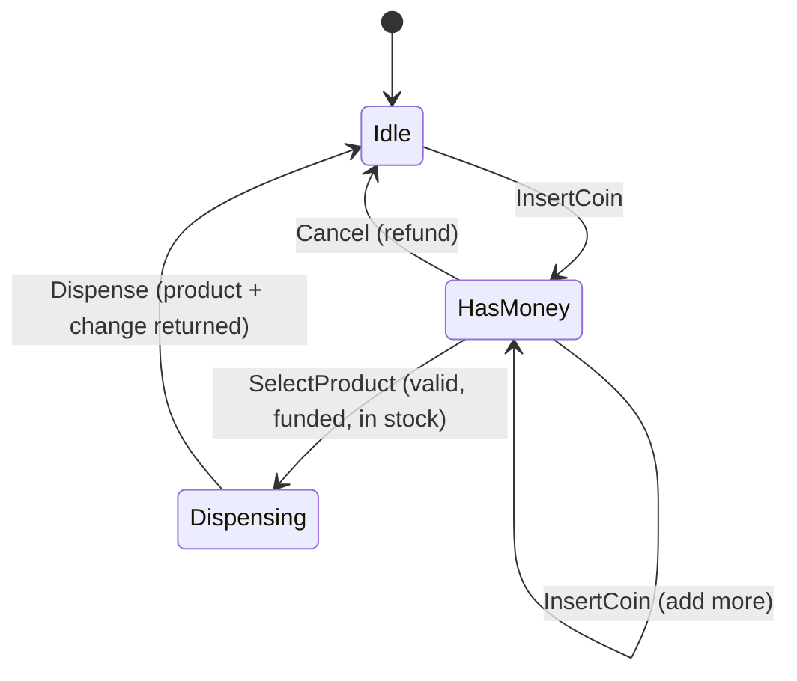
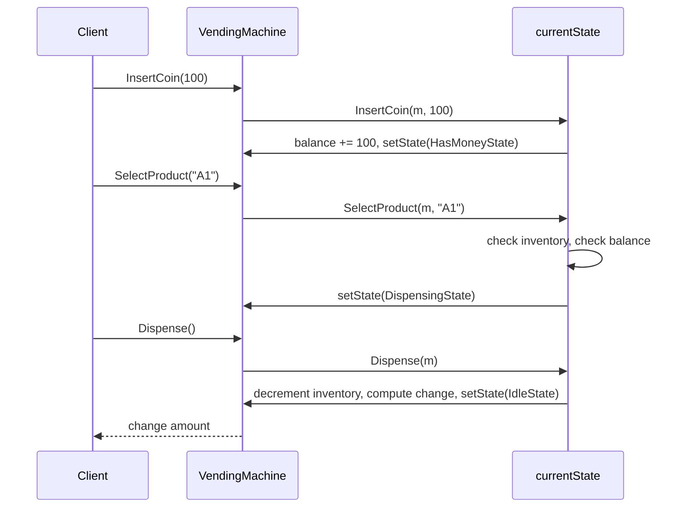

# Design a Vending Machine

> [!abstract] What you'll be able to do after this chapter
> Recognize "this is secretly a state machine" as a design signal, refactor scattered string-flag checks into the State pattern, and know precisely when a state-transition *table* is the better (simpler) answer instead.

---

## Step 1 — The interview question

> [!question] As an interviewer would ask it
> "Design a vending machine. It accepts coins, lets the user select a product, dispenses the product and any change, allows cancellation with a refund, and handles insufficient funds and out-of-stock products."

## Step 2 — Requirement clarification

**Functional:** insert coins, select a product, dispense product + change, cancel and refund, track per-product inventory.

**Non-functional — and the one that defines this whole problem:** the machine's **current state genuinely constrains which actions are valid.** You can't select a product before inserting money. You can't insert a coin while the machine is actively dispensing. You can't cancel once dispensing has started. This isn't incidental complexity — it *is* the problem.

> [!example]+ 🪜 How to build this live, step by step (interview execution order, with code)
> **Rule of thumb:** don't reach for State until you've felt string-flag checks get genuinely painful. Build the dumb version first, on purpose.
>
> **Checkpoint 1 (~8 min) — one product, no inventory, no real state machine.**
> ```go
> type VendingMachine struct {
>     hasMoney bool
>     balance  int
> }
>
> func (v *VendingMachine) InsertCoin(amount int) {
>     v.balance += amount
>     v.hasMoney = true
> }
>
> func (v *VendingMachine) SelectProduct() string {
>     if !v.hasMoney {
>         return "insert money first"
>     }
>     v.balance = 0
>     v.hasMoney = false
>     return "dispensed"
> }
> ```
> **Pattern used: none.** This runs end-to-end — insert a coin, select, get a result — in a handful of minutes. That's the point: a working toy beats a correct-looking `State` interface with nothing behind it.
>
> **Checkpoint 2 (~8-10 min) — real inventory, real states, still just string flags.**
> ```go
> type VendingMachine struct {
>     state           string // "idle", "hasMoney", "dispensing"
>     balance         int
>     selectedProduct string
>     inventory       map[string]int
> }
>
> func (v *VendingMachine) InsertCoin(amount int) error {
>     if v.state == "dispensing" {
>         return errors.New("cannot insert coin while dispensing")
>     }
>     v.balance += amount
>     if v.state == "idle" {
>         v.state = "hasMoney"
>     }
>     return nil
> }
>
> func (v *VendingMachine) SelectProduct(product string) error {
>     if v.state != "hasMoney" {
>         return errors.New("insert money first")
>     }
>     if v.inventory[product] <= 0 {
>         return errors.New("out of stock")
>     }
>     v.state = "dispensing"
>     return nil
> }
>
> func (v *VendingMachine) Cancel() error {
>     if v.state == "dispensing" {
>         return errors.New("cannot cancel while dispensing")
>     }
>     v.state = "idle"
>     v.balance = 0
>     return nil
> }
> ```
> **Pattern used: still none — write it this way deliberately.** You want to feel three methods each needing a new `if v.state == "maintenance"` branch when maintenance mode gets mentioned, which is the exact motivating pain for the refactor next.
>
> **Checkpoint 3 (~10-15 min) — refactor into State, all three states.**
> ```go
> // State — the State pattern. VendingMachine delegates every action
> // to currentState instead of branching on a string field.
> type State interface {
>     InsertCoin(m *VendingMachine, amount int) error
>     SelectProduct(m *VendingMachine, code string) error
>     Dispense(m *VendingMachine) error
>     Cancel(m *VendingMachine) error
> }
>
> type IdleState struct{}
>
> func (s *IdleState) InsertCoin(m *VendingMachine, amount int) error {
>     m.balance += amount
>     m.setState(&HasMoneyState{})
>     return nil
> }
> func (s *IdleState) SelectProduct(m *VendingMachine, code string) error { return ErrInvalidAction }
> func (s *IdleState) Dispense(m *VendingMachine) error                  { return ErrInvalidAction }
> func (s *IdleState) Cancel(m *VendingMachine) error                    { return ErrInvalidAction }
>
> type HasMoneyState struct{}
>
> func (s *HasMoneyState) InsertCoin(m *VendingMachine, amount int) error {
>     m.balance += amount
>     return nil
> }
> func (s *HasMoneyState) SelectProduct(m *VendingMachine, code string) error {
>     product, ok := m.inventory.Get(code)
>     if !ok {
>         return ErrUnknownProduct
>     }
>     if !m.inventory.InStock(code) {
>         return ErrOutOfStock
>     }
>     if m.balance < product.Price {
>         return ErrInsufficientFunds
>     }
>     m.selectedProduct = code
>     m.setState(&DispensingState{})
>     return nil
> }
> func (s *HasMoneyState) Dispense(m *VendingMachine) error { return ErrInvalidAction }
> func (s *HasMoneyState) Cancel(m *VendingMachine) error {
>     m.refund()
>     m.setState(&IdleState{})
>     return nil
> }
>
> type DispensingState struct{}
>
> func (s *DispensingState) InsertCoin(m *VendingMachine, amount int) error     { return ErrInvalidAction }
> func (s *DispensingState) SelectProduct(m *VendingMachine, code string) error { return ErrInvalidAction }
> func (s *DispensingState) Dispense(m *VendingMachine) error {
>     product, _ := m.inventory.Get(m.selectedProduct)
>     m.inventory.Decrement(m.selectedProduct)
>     m.lastChange = m.balance - product.Price
>     m.balance = 0
>     m.selectedProduct = ""
>     m.setState(&IdleState{})
>     return nil
> }
> func (s *DispensingState) Cancel(m *VendingMachine) error { return ErrInvalidAction }
> ```
> **Pattern used: State.** All three states, fully working — `VendingMachine` stops branching on state entirely; every method above just delegates to `m.currentState`.
>
> **Checkpoint 4 (remaining time, or if asked) — maintenance mode + concurrency, fully wired.**
> ```go
> // Every action rejected — proves the refactor's payoff: zero
> // changes to VendingMachine itself to add this.
> type MaintenanceState struct{}
>
> func (s *MaintenanceState) InsertCoin(m *VendingMachine, amount int) error     { return ErrUnderMaintenance }
> func (s *MaintenanceState) SelectProduct(m *VendingMachine, code string) error { return ErrUnderMaintenance }
> func (s *MaintenanceState) Dispense(m *VendingMachine) error                   { return ErrUnderMaintenance }
> func (s *MaintenanceState) Cancel(m *VendingMachine) error                     { return ErrUnderMaintenance }
>
> // A deliberate, privileged transition — bypasses the normal
> // user-triggered action flow entirely.
> func (m *VendingMachine) EnterMaintenance() { m.setState(&MaintenanceState{}) }
>
> // Concurrency: every public method acquires the same lock, so
> // InsertCoin/SelectProduct/Dispense/Cancel all serialize correctly.
> func (m *VendingMachine) InsertCoin(amount int) error {
>     m.mu.Lock()
>     defer m.mu.Unlock()
>     return m.currentState.InsertCoin(m, amount)
> }
> ```
> **No new pattern** — just one more `State` implementation, which is exactly the point to make out loud: this is what "closed for modification, open for extension" looks like in practice.
>
> **If you're short on time:** stop after Checkpoint 2. You'll have a fully working machine (coins, selection, dispense, cancel, inventory, change) with the string-based state visible — describe the State refactor verbally as the next step and why it's needed.

## Step 3 — The bad first draft

```go
type VendingMachine struct {
	state           string // "idle", "hasMoney", "dispensing"
	balance         int
	selectedProduct string
	inventory       map[string]int
}

func (v *VendingMachine) InsertCoin(amount int) error {
	if v.state == "dispensing" {
		return errors.New("cannot insert coin while dispensing")
	}
	v.balance += amount
	if v.state == "idle" {
		v.state = "hasMoney"
	}
	return nil
}

func (v *VendingMachine) SelectProduct(product string) error {
	if v.state != "hasMoney" {
		return errors.New("insert money first")
	}
	if v.inventory[product] <= 0 {
		return errors.New("out of stock")
	}
	v.state = "dispensing"
	return nil
}

func (v *VendingMachine) Cancel() error {
	if v.state == "dispensing" {
		return errors.New("cannot cancel while dispensing")
	}
	v.state = "idle"
	v.balance = 0
	return nil
}
```

## Step 4 — Why it breaks

> [!bug] Requirement change: "add a maintenance mode that rejects all coin/selection input."
> Every single method — `InsertCoin`, `SelectProduct`, `Cancel`, and `Dispense` (not shown, same shape) — needs a new `if v.state == "maintenance"` branch added. Four methods touched for one new state. That's an **Open/Closed Principle** violation repeated four times over.

> [!bug] String-based state has zero compile-time safety.
> `v.state = "Idle"` (capitalized, a typo) compiles perfectly fine and silently breaks every subsequent check against `"idle"`. This is a real, common bug class with string-flag state machines — nothing catches it until runtime, if ever.

> [!bug] Each method re-derives "what's valid right now" independently.
> The logic for "what can happen in state X" is smeared across every method's `if` chain instead of living in one place *per state* — reading "everything the machine can do while dispensing" means reading all four methods end to end, not one cohesive block.

## Step 5 — Refactor: the State pattern

Define a `State` interface with one method per action the machine supports. Each concrete state (`IdleState`, `HasMoneyState`, `DispensingState`) implements *all* of them — but only the actions that are actually valid in that state do something meaningful; the rest return a clean, uniform "not valid right now" error. `VendingMachine` stops branching on state entirely — it just **delegates** every call to `currentState`.

> [!tip] A deliberate design decision worth stating out loud: "out of stock" is NOT a machine-level state
> It's tempting to add an `OutOfStockState`, but out-of-stock is a property of **one product**, not the whole machine — the machine itself isn't "out of stock," `SelectProduct("A1")` might simply fail while `SelectProduct("B2")` succeeds. Modeling this as an **error returned from `SelectProduct`** rather than forcing it into a distinct machine-wide `State` is the correct call here — mechanically turning every noun into a `State` would be over-engineering, not fidelity to the pattern.

---

## Step 6 — UML & sequence diagrams





## Step 7 — SOLID, applied

| Principle | Where it's satisfied |
|---|---|
| **S**RP | Each state struct owns exactly its own transition logic — nothing else. |
| **O**CP | Adding "maintenance mode" = one new struct implementing `State`. `VendingMachine` is never touched. |
| **L**SP | Any `State` implementation is fully substitutable — `VendingMachine` only ever calls the interface's methods. |
| **D**IP | `VendingMachine` depends on the `State` interface, never a concrete state type. |

## Step 8 — Alternative considered, and when it actually wins

> [!tip] "Why not just a state-transition table — `map[State]map[Action]State`?"
> Genuinely simpler when every transition is *purely data* — no behavior differs per state beyond "what's the next state." It breaks down the moment a state needs different **behavior**, not just a different next-state, for the same action — `SelectProduct` in `DispensingState` doesn't just transition differently than in `HasMoneyState`, it does something completely different (rejects outright vs. validates and transitions). State pattern wins precisely when *behavior* varies per state, not merely the destination.

---

## Step 9 — Complete, compilable Go implementation

```go
// ============================================================
// FILE: errors.go
// ============================================================
package vendingmachine

import "errors"

var (
	ErrInvalidAction     = errors.New("vendingmachine: action not valid in current state")
	ErrOutOfStock        = errors.New("vendingmachine: product out of stock")
	ErrInsufficientFunds = errors.New("vendingmachine: insufficient funds inserted")
	ErrUnknownProduct    = errors.New("vendingmachine: unknown product code")
)
```

```go
// ============================================================
// FILE: product.go
// ============================================================
package vendingmachine

// Product price is stored in cents to avoid floating-point money bugs.
type Product struct {
	Code  string
	Name  string
	Price int
}
```

```go
// ============================================================
// FILE: inventory.go
// ============================================================
package vendingmachine

import "sync"

type Inventory struct {
	mu       sync.Mutex
	products map[string]Product
	stock    map[string]int
}

func NewInventory() *Inventory {
	return &Inventory{
		products: make(map[string]Product),
		stock:    make(map[string]int),
	}
}

func (i *Inventory) AddProduct(p Product, quantity int) {
	i.mu.Lock()
	defer i.mu.Unlock()
	i.products[p.Code] = p
	i.stock[p.Code] += quantity
}

func (i *Inventory) Get(code string) (Product, bool) {
	i.mu.Lock()
	defer i.mu.Unlock()
	p, ok := i.products[code]
	return p, ok
}

func (i *Inventory) InStock(code string) bool {
	i.mu.Lock()
	defer i.mu.Unlock()
	return i.stock[code] > 0
}

func (i *Inventory) Decrement(code string) {
	i.mu.Lock()
	defer i.mu.Unlock()
	if i.stock[code] > 0 {
		i.stock[code]--
	}
}
```

```go
// ============================================================
// FILE: state.go
// ============================================================
package vendingmachine

// State is the abstraction that replaced the string-flag if/else
// chains in the bad first draft. Every supported action becomes a
// method here — each concrete state decides for itself which
// actions are valid and what happens next.
type State interface {
	InsertCoin(m *VendingMachine, amount int) error
	SelectProduct(m *VendingMachine, code string) error
	Dispense(m *VendingMachine) error
	Cancel(m *VendingMachine) error
}
```

```go
// ============================================================
// FILE: states.go
// ============================================================
package vendingmachine

// ---- IdleState: waiting for the first coin ----

type IdleState struct{}

func (s *IdleState) InsertCoin(m *VendingMachine, amount int) error {
	m.balance += amount
	m.setState(&HasMoneyState{})
	return nil
}

func (s *IdleState) SelectProduct(m *VendingMachine, code string) error {
	return ErrInvalidAction
}

func (s *IdleState) Dispense(m *VendingMachine) error {
	return ErrInvalidAction
}

func (s *IdleState) Cancel(m *VendingMachine) error {
	return ErrInvalidAction
}

// ---- HasMoneyState: money inserted, waiting for a product selection ----

type HasMoneyState struct{}

func (s *HasMoneyState) InsertCoin(m *VendingMachine, amount int) error {
	m.balance += amount
	return nil
}

func (s *HasMoneyState) SelectProduct(m *VendingMachine, code string) error {
	product, ok := m.inventory.Get(code)
	if !ok {
		return ErrUnknownProduct
	}
	if !m.inventory.InStock(code) {
		return ErrOutOfStock
	}
	if m.balance < product.Price {
		return ErrInsufficientFunds
	}
	m.selectedProduct = code
	m.setState(&DispensingState{})
	return nil
}

func (s *HasMoneyState) Dispense(m *VendingMachine) error {
	return ErrInvalidAction
}

func (s *HasMoneyState) Cancel(m *VendingMachine) error {
	m.refund()
	m.setState(&IdleState{})
	return nil
}

// ---- DispensingState: product selected, actively dispensing ----

type DispensingState struct{}

func (s *DispensingState) InsertCoin(m *VendingMachine, amount int) error {
	return ErrInvalidAction
}

func (s *DispensingState) SelectProduct(m *VendingMachine, code string) error {
	return ErrInvalidAction
}

func (s *DispensingState) Dispense(m *VendingMachine) error {
	// Safe to ignore the ok here: selectedProduct was only ever set
	// after a successful Get+InStock check in HasMoneyState — this
	// is a maintained invariant, not an unchecked assumption.
	product, _ := m.inventory.Get(m.selectedProduct)
	m.inventory.Decrement(m.selectedProduct)

	m.lastChange = m.balance - product.Price
	m.balance = 0
	m.selectedProduct = ""
	m.setState(&IdleState{})
	return nil
}

func (s *DispensingState) Cancel(m *VendingMachine) error {
	return ErrInvalidAction
}
```

```go
// ============================================================
// FILE: machine.go
// ============================================================
package vendingmachine

import "sync"

// VendingMachine is the State pattern's "context" — it holds the
// current state and delegates every action to it. It never branches
// on state itself; that responsibility now lives entirely in the
// State implementations.
type VendingMachine struct {
	mu              sync.Mutex
	currentState    State
	inventory       *Inventory
	balance         int
	selectedProduct string
	lastChange      int
}

func NewVendingMachine(inventory *Inventory) *VendingMachine {
	return &VendingMachine{
		currentState: &IdleState{},
		inventory:    inventory,
	}
}

func (m *VendingMachine) setState(s State) {
	m.currentState = s
}

func (m *VendingMachine) refund() {
	m.balance = 0
}

func (m *VendingMachine) InsertCoin(amount int) error {
	m.mu.Lock()
	defer m.mu.Unlock()
	return m.currentState.InsertCoin(m, amount)
}

func (m *VendingMachine) SelectProduct(code string) error {
	m.mu.Lock()
	defer m.mu.Unlock()
	return m.currentState.SelectProduct(m, code)
}

func (m *VendingMachine) Dispense() (int, error) {
	m.mu.Lock()
	defer m.mu.Unlock()
	if err := m.currentState.Dispense(m); err != nil {
		return 0, err
	}
	return m.lastChange, nil
}

func (m *VendingMachine) Cancel() (int, error) {
	m.mu.Lock()
	defer m.mu.Unlock()
	refundAmount := m.balance
	if err := m.currentState.Cancel(m); err != nil {
		return 0, err
	}
	return refundAmount, nil
}
```

```go
// ============================================================
// FILE: main.go  (package main — adjust the import path to match
// your actual module name from `go mod init`)
// ============================================================
package main

import (
	"fmt"
	"log"

	vendingmachine "example.com/vendingmachine"
)

func main() {
	inventory := vendingmachine.NewInventory()
	inventory.AddProduct(vendingmachine.Product{Code: "A1", Name: "Cola", Price: 150}, 5)

	machine := vendingmachine.NewVendingMachine(inventory)

	if err := machine.InsertCoin(100); err != nil {
		log.Fatal(err)
	}
	if err := machine.InsertCoin(100); err != nil {
		log.Fatal(err)
	}
	if err := machine.SelectProduct("A1"); err != nil {
		log.Fatal(err)
	}
	change, err := machine.Dispense()
	if err != nil {
		log.Fatal(err)
	}
	fmt.Printf("Dispensed Cola. Change returned: %d cents\n", change)

	if err := machine.Dispense(); err != nil {
		fmt.Printf("Expected error dispensing again: %v\n", err)
	}
}
```

---

## 🎯 Interview follow-up Q&A

> [!quote]- "How would you add a 'maintenance mode' that rejects all input?"
> One new struct, `MaintenanceState`, implementing `State` with every method returning `ErrInvalidAction` (or a dedicated `ErrUnderMaintenance`). `VendingMachine`'s dispatch methods need zero changes — the entire point of the refactor in Step 5.
>
> **Follow-up: "How would an admin actually put the machine into maintenance mode from outside?"**
> Add an explicit `VendingMachine.EnterMaintenance()` method that calls `m.setState(&MaintenanceState{})` directly — a deliberate, privileged transition that bypasses the normal action-triggered flow, distinct from the user-facing `InsertCoin`/`SelectProduct`/etc. methods.

> [!quote]- "What if two users could somehow interact with the same machine instance concurrently?"
> The `sync.Mutex` in `VendingMachine` (Step 9) already serializes every action — `InsertCoin`, `SelectProduct`, `Dispense`, and `Cancel` all acquire the same lock, so concurrent calls are safe by construction, same underlying [[Glossary/Thread-Safety|thread-safety]] discipline as [[LLD/01 - Design a Parking Lot/Design a Parking Lot|the Parking Lot chapter's]] `SpotManager`.

---
*Related: [[00 - Start Here/How This Handbook Works|Book Map]] · [[LLD/01 - Design a Parking Lot/Design a Parking Lot|Design a Parking Lot]] · [[Glossary/Thread-Safety|Thread-Safety]]*
