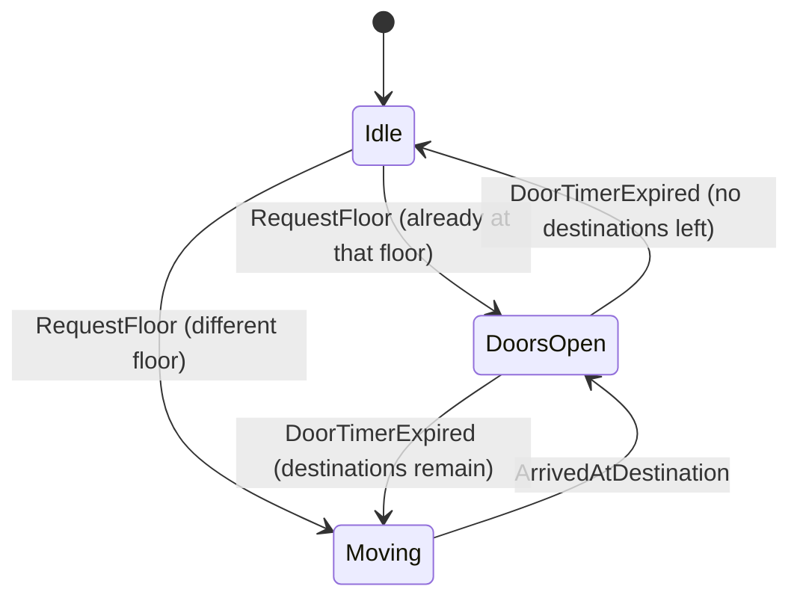
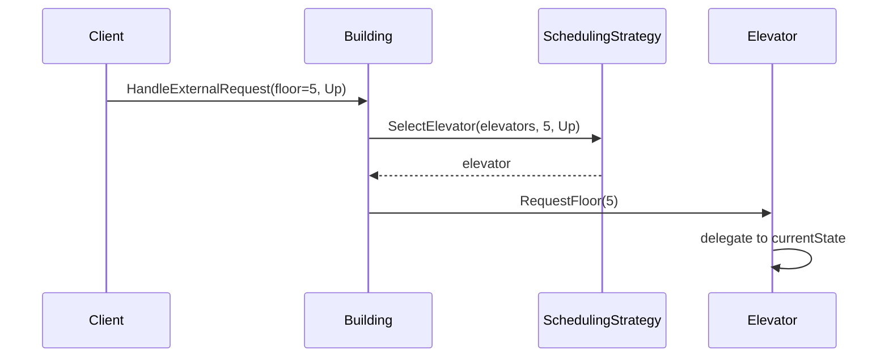

# Design an Elevator System

> [!abstract] What you'll be able to do after this chapter
> Combine State and Strategy in one design (each solving a genuinely different sub-problem), and make the same "is this really a separate state, or just data?" judgment call the Vending Machine chapter introduced — applied to "moving up" vs "moving down."

---

## Step 1 — The interview question

> [!question] As an interviewer would ask it
> "Design an elevator system for a building with multiple floors and multiple elevators — handle hallway calls, in-cab floor selection, door timing, and which elevator responds to a given call."

## Step 2 — Requirement clarification

**Functional:** request an elevator from a floor (hallway call, with direction). Select a destination from inside a cab. Multiple elevators, multiple simultaneous requests.

**Non-functional:** efficient dispatch (minimize wait time). Thread-safe (concurrent requests from multiple floors/cabs). **Extensible scheduling** — different buildings want different dispatch policies (nearest-elevator vs zone-based), and swapping that policy shouldn't touch elevator movement logic at all.

> [!example]+ 🪜 How to build this live, step by step (interview execution order, with code)
> This chapter needs **two** patterns solving two different sub-problems (movement, and dispatch) — build them one at a time, never both at once.
>
> **Checkpoint 1 (~6-8 min) — one elevator, teleporting, no patterns.**
> ```go
> type Elevator struct {
>     currentFloor int
> }
>
> func (e *Elevator) RequestFloor(floor int) {
>     e.currentFloor = floor // "teleports" for now — real movement/state comes next
> }
> ```
> **Pattern used: none.** This is intentionally almost too simple — the goal is a compiling, callable `RequestFloor` before anything else exists.
>
> **Checkpoint 2 (~8-10 min) — multiple elevators, naive dispatch, string state.** This is exactly the bad draft in Step 3 below: `state string` ("idle"/"movingUp"/"movingDown"/"doorsOpen") on `Elevator`, and `Building.HandleExternalRequest` hardcoded to `b.elevators[0]`. Write it that way on purpose — narrate *"dispatch is always picking elevator 0 right now, and floor requests get silently dropped while doors are open — both need fixing."*
>
> **Checkpoint 3 (~8-10 min) — refactor movement into State.**
> ```go
> // ElevatorState — the State pattern, applied to movement.
> type ElevatorState interface {
>     RequestFloor(e *Elevator, floor int)
>     ArrivedAtDestination(e *Elevator)
>     DoorTimerExpired(e *Elevator)
> }
>
> type DoorsOpenState struct{}
>
> func (s *DoorsOpenState) RequestFloor(e *Elevator, floor int) {
>     e.addDestination(floor) // queued now, not dropped — the bug from Step 3, fixed
> }
> ```
> **Pattern used: State.** Note the deliberate *non*-decision here too: "moving up" and "moving down" stay as a `direction` field inside one `MovingState`, not two separate states (Step 5) — everything valid in each is identical, only the field differs.
>
> **Checkpoint 4 (~8-10 min) — refactor dispatch into Strategy.**
> ```go
> // SchedulingStrategy — the Strategy pattern, applied to dispatch.
> // Solves a completely different problem than ElevatorState above:
> // "which elevator" vs. "what can this elevator do right now."
> type SchedulingStrategy interface {
>     SelectElevator(elevators []*Elevator, requestFloor int, direction Direction) *Elevator
> }
>
> type NearestElevatorStrategy struct{}
>
> func (n NearestElevatorStrategy) SelectElevator(elevators []*Elevator, requestFloor int, direction Direction) *Elevator {
>     // loop, track the smallest abs(currentFloor - requestFloor) — full version in Step 9
>     return nil
> }
> ```
> **Pattern used: Strategy.** `Building` now depends on the interface, never `elevators[0]` directly.
>
> **Checkpoint 5 (remaining time, or if asked) — concurrency + SCAN-style dispatch.** Each `Elevator` gets its own mutex (Step 9) — different elevators never contend. If asked for a smarter policy, describe SCAN/LOOK disk-scheduling-style dispatch (Step 8) as a *new* `SchedulingStrategy` implementation, not a new architecture.
>
> **If you're short on time:** stop after Checkpoint 3. You'll have real per-elevator movement working correctly (including the doors-open queueing fix), with naive single-elevator dispatch — describe the `SchedulingStrategy` extraction verbally as the next step.

## Step 3 — The bad first draft

```go
type Elevator struct {
	id           int
	currentFloor int
	state        string // "idle", "movingUp", "movingDown", "doorsOpen"
	destinations []int
}

func (e *Elevator) RequestFloor(floor int) {
	if e.state == "doorsOpen" {
		return // silently dropped — a real bug
	}
	e.destinations = append(e.destinations, floor)
	if floor > e.currentFloor {
		e.state = "movingUp"
	} else {
		e.state = "movingDown"
	}
}

type Building struct {
	elevators []*Elevator
}

func (b *Building) HandleExternalRequest(floor int) {
	b.elevators[0].RequestFloor(floor) // always elevator 0 — no scheduling at all
}
```

## Step 4 — Why it breaks

> [!bug] Dispatch is hardcoded to "always elevator 0."
> There's no scheduling logic at all — every call goes to the same elevator regardless of where the others are. Adding a "nearest elevator" policy, let alone a "zone-based" one, means rewriting `HandleExternalRequest` directly — and every future policy means rewriting it again. Open/Closed Principle, on the dispatch side this time.

> [!bug] String-based state, same failure class as the Vending Machine's bad draft.
> Scattered `if state == "..."` checks, no compile-time safety, logic for "what can happen in this state" smeared across methods instead of living in one place per state.

> [!bug] Requests are silently dropped while doors are open.
> A genuine correctness bug, not just a design smell — a rider's floor selection made at the wrong instant simply vanishes instead of being queued for after the doors close.

## Step 5 — Refactor: State (for movement) + Strategy (for dispatch) — two different patterns solving two different problems

**State** governs what a single elevator can do right now — `IdleState`, `MovingState`, `DoorsOpenState`. **Strategy** governs which elevator gets picked for a given hallway call — `SchedulingStrategy`, with `NearestElevatorStrategy` as one concrete policy. These are independent axes of the design; conflating them into one abstraction would be a mistake.

> [!tip] "Moving up" and "moving down" are DATA, not separate states — the same judgment call as the Vending Machine chapter's "out of stock isn't a state"
> It's tempting to model `MovingUpState` and `MovingDownState` separately. But every valid action in each — queue more requests, wait for arrival — is **identical**; only the physical direction differs. That's a `direction` **field**, not a behavioral distinction, so it lives as data inside one `MovingState`, not as two separate `State` implementations. Mechanically splitting every conceivable variant into its own `State` would be over-engineering, not fidelity to the pattern — recognizing *when not to* split is exactly the judgment this callout exists to reinforce.

---

## Step 6 — UML & sequence diagrams





## Step 7 — SOLID, applied

| Principle | Where it's satisfied |
|---|---|
| **S**RP | `Elevator` owns its own movement; `Building` owns dispatch; `SchedulingStrategy` owns the selection algorithm — three responsibilities, three types. |
| **O**CP | A new scheduling policy = a new struct implementing `SchedulingStrategy`. A new elevator behavior state = a new struct implementing `ElevatorState`. Neither touches the other. |
| **D**IP | `Building` depends on `SchedulingStrategy` the interface, never a concrete policy. |

## Step 8 — Alternative considered

> [!tip] "Wouldn't a real elevator use a smarter algorithm than 'nearest,' like SCAN/LOOK disk-scheduling-style logic?"
> Yes — real elevator controllers often use an algorithm structurally similar to disk-arm scheduling (continue in the current direction, picking up compatible requests along the way, before reversing) to minimize direction changes. That's a **more sophisticated `SchedulingStrategy` implementation**, not a different architecture — exactly the point of pulling this behind an interface: swapping `NearestElevatorStrategy` for a `ScanStrategy` later requires zero changes to `Building` or `Elevator`.

---

## Step 9 — Complete, compilable Go implementation

```go
// ============================================================
// FILE: types.go
// ============================================================
package elevatorsystem

type Direction int

const (
	Up Direction = iota
	Down
	Stationary
)
```

```go
// ============================================================
// FILE: state.go
// ============================================================
package elevatorsystem

type ElevatorState interface {
	RequestFloor(e *Elevator, floor int)
	ArrivedAtDestination(e *Elevator)
	DoorTimerExpired(e *Elevator)
}
```

```go
// ============================================================
// FILE: states.go
// ============================================================
package elevatorsystem

// ---- IdleState: stationary, no pending destinations ----

type IdleState struct{}

func (s *IdleState) RequestFloor(e *Elevator, floor int) {
	e.addDestination(floor)
	if floor == e.currentFloor {
		e.setState(&DoorsOpenState{})
		return
	}
	e.direction = e.directionToward(floor)
	e.setState(&MovingState{})
}

func (s *IdleState) ArrivedAtDestination(e *Elevator) {}
func (s *IdleState) DoorTimerExpired(e *Elevator)     {}

// ---- MovingState: in transit. "Up" vs "down" is the `direction`
// field, not a separate state — see Step 5. ----

type MovingState struct{}

func (s *MovingState) RequestFloor(e *Elevator, floor int) {
	e.addDestination(floor)
}

func (s *MovingState) ArrivedAtDestination(e *Elevator) {
	e.removeDestination(e.currentFloor)
	e.setState(&DoorsOpenState{})
}

func (s *MovingState) DoorTimerExpired(e *Elevator) {}

// ---- DoorsOpenState: stopped, doors open at currentFloor ----

type DoorsOpenState struct{}

func (s *DoorsOpenState) RequestFloor(e *Elevator, floor int) {
	// Queued, not dropped — the bug in the bad first draft, fixed.
	e.addDestination(floor)
}

func (s *DoorsOpenState) ArrivedAtDestination(e *Elevator) {}

func (s *DoorsOpenState) DoorTimerExpired(e *Elevator) {
	if len(e.destinations) == 0 {
		e.setState(&IdleState{})
		return
	}
	next := e.nextDestination()
	e.direction = e.directionToward(next)
	e.setState(&MovingState{})
}
```

```go
// ============================================================
// FILE: elevator.go
// ============================================================
package elevatorsystem

import (
	"sort"
	"sync"
)

type Elevator struct {
	mu           sync.Mutex
	ID           int
	currentFloor int
	direction    Direction
	destinations []int
	currentState ElevatorState
}

func NewElevator(id int) *Elevator {
	return &Elevator{
		ID:           id,
		currentFloor: 0,
		direction:    Stationary,
		currentState: &IdleState{},
	}
}

func (e *Elevator) setState(s ElevatorState) { e.currentState = s }

func (e *Elevator) addDestination(floor int) {
	for _, d := range e.destinations {
		if d == floor {
			return
		}
	}
	e.destinations = append(e.destinations, floor)
}

func (e *Elevator) removeDestination(floor int) {
	for i, d := range e.destinations {
		if d == floor {
			e.destinations = append(e.destinations[:i], e.destinations[i+1:]...)
			return
		}
	}
}

// nextDestination is deliberately the simplest correct policy —
// nearest queued floor by number. A real system would continue in
// the current direction where possible (SCAN-style), per Step 8.
func (e *Elevator) nextDestination() int {
	if len(e.destinations) == 0 {
		return e.currentFloor
	}
	sorted := append([]int{}, e.destinations...)
	sort.Ints(sorted)
	return sorted[0]
}

func (e *Elevator) directionToward(floor int) Direction {
	if floor > e.currentFloor {
		return Up
	}
	if floor < e.currentFloor {
		return Down
	}
	return Stationary
}

func (e *Elevator) CurrentFloor() int {
	e.mu.Lock()
	defer e.mu.Unlock()
	return e.currentFloor
}

// RequestFloor handles both hallway calls and in-cab selections —
// delegated straight to whichever state the elevator is in.
func (e *Elevator) RequestFloor(floor int) {
	e.mu.Lock()
	defer e.mu.Unlock()
	e.currentState.RequestFloor(e, floor)
}

// ArrivedAtDestination is invoked by the physical movement
// mechanism (or, here, the demo) once the car reaches a floor.
func (e *Elevator) ArrivedAtDestination(floor int) {
	e.mu.Lock()
	defer e.mu.Unlock()
	e.currentFloor = floor
	e.currentState.ArrivedAtDestination(e)
}

func (e *Elevator) DoorTimerExpired() {
	e.mu.Lock()
	defer e.mu.Unlock()
	e.currentState.DoorTimerExpired(e)
}
```

```go
// ============================================================
// FILE: scheduling_strategy.go
// ============================================================
package elevatorsystem

// SchedulingStrategy replaced the bad first draft's hardcoded
// "always elevator 0."
type SchedulingStrategy interface {
	SelectElevator(elevators []*Elevator, requestFloor int, direction Direction) *Elevator
}

// NearestElevatorStrategy picks whichever elevator is currently
// physically closest to the requesting floor.
type NearestElevatorStrategy struct{}

func (n NearestElevatorStrategy) SelectElevator(elevators []*Elevator, requestFloor int, direction Direction) *Elevator {
	var best *Elevator
	bestDistance := -1
	for _, e := range elevators {
		d := abs(e.CurrentFloor() - requestFloor)
		if bestDistance == -1 || d < bestDistance {
			bestDistance = d
			best = e
		}
	}
	return best
}

func abs(n int) int {
	if n < 0 {
		return -n
	}
	return n
}
```

```go
// ============================================================
// FILE: building.go
// ============================================================
package elevatorsystem

// Building is the dispatcher — owns the fleet, delegates selection
// entirely to its SchedulingStrategy.
type Building struct {
	elevators []*Elevator
	strategy  SchedulingStrategy
}

func NewBuilding(elevators []*Elevator, strategy SchedulingStrategy) *Building {
	return &Building{elevators: elevators, strategy: strategy}
}

func (b *Building) HandleExternalRequest(floor int, direction Direction) {
	chosen := b.strategy.SelectElevator(b.elevators, floor, direction)
	if chosen != nil {
		chosen.RequestFloor(floor)
	}
}
```

```go
// ============================================================
// FILE: main.go  (adjust import path to your module name)
// ============================================================
package main

import (
	"fmt"

	elevatorsystem "example.com/elevatorsystem"
)

func main() {
	e1 := elevatorsystem.NewElevator(1)
	e2 := elevatorsystem.NewElevator(2)

	building := elevatorsystem.NewBuilding(
		[]*elevatorsystem.Elevator{e1, e2},
		elevatorsystem.NearestElevatorStrategy{},
	)

	building.HandleExternalRequest(5, elevatorsystem.Up)
	fmt.Println("Elevator 1 dispatched, still in transit at floor:", e1.CurrentFloor())

	e1.ArrivedAtDestination(5) // simulated physical arrival
	fmt.Println("Elevator 1 arrived at floor:", e1.CurrentFloor())

	e1.RequestFloor(9) // rider inside selects floor 9
	e1.DoorTimerExpired()
	e1.ArrivedAtDestination(9)
	fmt.Println("Elevator 1 arrived at floor:", e1.CurrentFloor())
}
```

---

## 🎯 Interview follow-up Q&A

> [!quote]- "How would you add a zone-based scheduling policy — e.g. elevator 1 only serves floors 1-10?"
> A new struct, `ZoneBasedStrategy`, implementing `SchedulingStrategy`, filtering candidate elevators by configured zone before picking among them. `Building` and every `Elevator` remain completely untouched — the entire point of pulling scheduling behind an interface.

> [!quote]- "What happens if two hallway calls come in for two different elevators at the exact same instant?"
> Each elevator has its own `sync.Mutex` (in `Elevator`, Step 9) — `RequestFloor` calls on *different* elevator instances proceed fully in parallel with no contention at all, since they're protecting independent state. Only concurrent calls targeting the *same* elevator instance actually serialize against each other.

---
*Related: [[00 - Start Here/How This Handbook Works|Book Map]] · [[LLD/02 - Design a Vending Machine/Design a Vending Machine|Design a Vending Machine]] · [[LLD/01 - Design a Parking Lot/Design a Parking Lot|Design a Parking Lot]]*
