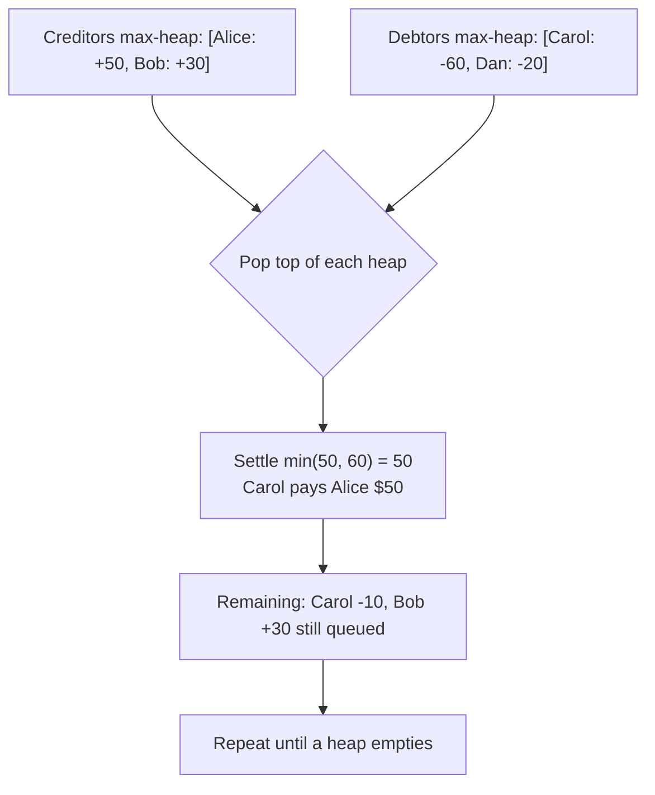

# Design Splitwise

> [!abstract] What you'll be able to do after this chapter
> Fix the classic floating-point money bug before it happens, implement a real heap-based greedy debt-simplification algorithm, and know precisely why it's not provably optimal — and why that's still the correct interview answer.

---

## Step 1 — The interview question

> [!question] As an interviewer would ask it
> "Design Splitwise — a system where a group of friends track shared expenses, supporting equal/exact/percentage splits, and can 'simplify' who owes whom to minimize the number of settling transactions."

## Step 2 — Requirement clarification

**Functional:** add an expense, split among participants (equal, exact amounts, or percentage). Track a running balance between every pair of users. **Simplify debts** — compute a minimal set of settling transactions. Show a user's net position.

**Non-functional:** money math must be **exact to the cent** — no drift. Split logic must be extensible (new split types shouldn't touch existing ones). Debt simplification should be efficient even for larger groups.

## Step 3 — The bad first draft

```go
func (s *Splitwise) AddExpense(paidBy string, amount float64, participants []string, splitType string, splitData map[string]float64) {
	if splitType == "equal" {
		share := amount / float64(len(participants))
		for _, p := range participants {
			if p != paidBy {
				s.balances[paidBy][p] += share
				s.balances[p][paidBy] -= share
			}
		}
	} else if splitType == "exact" {
		for p, amt := range splitData {
			// ... same shape repeated
		}
	} else if splitType == "percentage" {
		// ... same shape repeated again
	}
}
```

## Step 4 — Why it breaks (two separate problems, not one)

> [!bug] Problem 1: a new split type means editing `AddExpense` again.
> Same Open/Closed violation shape as every prior chapter — a "split by shares" type (weighted, not percentage) means another `else if` branch in an already-overloaded function.

> [!bug] Problem 2 — the real one that matters more: `float64` for money is a genuine, well-known correctness bug.
> `amount / float64(len(participants))` for a $10 expense split 3 ways gives `3.333...` repeating — an inherently imprecise binary floating-point representation. Across thousands of expenses, repeated float arithmetic **accumulates drift**, and balances that should sum to exactly zero across the whole group silently don't. For a financial ledger, this isn't a minor rounding quirk — it's a correctness violation. **The fix: represent money as integer cents (`int64`), never `float64`, anywhere in the system.**

## Step 5 — Refactor: Strategy for splitting, integer cents for correctness

`SplitStrategy` becomes the abstraction — `CalculateShares(totalAmount int64, participants []string, splitData map[string]float64) map[string]int64`, implemented independently per split type. Every amount in the system is now `int64` cents, eliminating the float-drift bug entirely, not just working around it.

> [!success] A deliberate detail worth highlighting: exact remainder distribution
> `$10 / 3` in integer cents is `1000 / 3 = 333` remainder `1` — if that leftover cent is silently dropped, the three shares (`333 + 333 + 333 = 999`) don't sum back to the original `1000`. `EqualSplitStrategy` (Step 9) distributes leftover cents **one at a time** to the first few participants, guaranteeing shares always sum *exactly* to the original amount. This is the kind of quiet correctness detail that separates production-quality code from code that merely looks right on a happy-path demo.

---

## Step 6 — The debt-simplification algorithm (the real centerpiece of this chapter)

Given each user's **net balance** (positive = owed money, negative = owes money), find a small set of transactions that settles everyone to zero.

> [!warning] Say this explicitly in the interview — it's a strong depth signal
> The **provably minimum** number of transactions is an NP-hard problem in general (it reduces to a set-partition-style problem). The standard, practical, interview-expected answer is a **greedy heuristic**: repeatedly match the biggest creditor with the biggest debtor, settle the smaller of the two amounts, and repeat. This greedy approach is **not guaranteed globally optimal**, but it's simple, fast, and good enough in practice — knowing *and stating* that distinction (rather than presenting the greedy answer as provably optimal) is exactly the kind of nuance that separates a strong answer from a merely correct one.

**The algorithm:** put every net creditor into a max-heap (by amount owed to them) and every net debtor into a max-heap (by magnitude of what they owe). Repeatedly pop the top of each, settle `min(credit, debt)` between them, push any remainder back, until one heap empties.



---

## Step 7 — SOLID, applied

| Principle | Where it's satisfied |
|---|---|
| **S**RP | `SplitStrategy` implementations own only their formula; `ExpenseManager` owns only the ledger; `SimplifyDebts` owns only settlement — three concerns, three places. |
| **O**CP | A new split type = a new `SplitStrategy` implementation, zero changes to `ExpenseManager`. |
| **D**IP | `ExpenseManager.AddExpense` depends on the `SplitStrategy` interface, never a concrete split formula. |

---

## Step 8 — Complete, compilable Go implementation

```go
// ============================================================
// FILE: split_strategy.go
// ============================================================
package splitwise

// SplitStrategy replaced the split-type if/else chain from the bad
// first draft. All amounts are integer cents throughout — see Step 4
// for why float64 is never acceptable here.
type SplitStrategy interface {
	CalculateShares(totalAmount int64, participants []string, splitData map[string]float64) map[string]int64
}

// EqualSplitStrategy divides evenly, distributing any leftover cents
// one at a time so shares always sum EXACTLY to totalAmount.
type EqualSplitStrategy struct{}

func (e EqualSplitStrategy) CalculateShares(totalAmount int64, participants []string, splitData map[string]float64) map[string]int64 {
	n := int64(len(participants))
	base := totalAmount / n
	remainder := totalAmount % n

	shares := make(map[string]int64)
	for i, p := range participants {
		share := base
		if int64(i) < remainder {
			share++
		}
		shares[p] = share
	}
	return shares
}

// ExactSplitStrategy uses caller-specified exact cent amounts.
type ExactSplitStrategy struct{}

func (e ExactSplitStrategy) CalculateShares(totalAmount int64, participants []string, splitData map[string]float64) map[string]int64 {
	shares := make(map[string]int64)
	for _, p := range participants {
		shares[p] = int64(splitData[p])
	}
	return shares
}

// PercentageSplitStrategy divides by caller-specified percentages.
type PercentageSplitStrategy struct{}

func (p PercentageSplitStrategy) CalculateShares(totalAmount int64, participants []string, splitData map[string]float64) map[string]int64 {
	shares := make(map[string]int64)
	for _, participant := range participants {
		pct := splitData[participant]
		shares[participant] = int64(float64(totalAmount) * pct / 100)
	}
	return shares
}
```

```go
// ============================================================
// FILE: expense_manager.go
// ============================================================
package splitwise

import "sync"

type ExpenseManager struct {
	mu       sync.Mutex
	balances map[string]map[string]int64 // balances[A][B] = net cents B owes A
}

func NewExpenseManager() *ExpenseManager {
	return &ExpenseManager{balances: make(map[string]map[string]int64)}
}

// AddExpense records that paidBy covered totalAmount, split per
// strategy. ExpenseManager never knows or cares HOW the split math
// works — that's entirely the strategy's job (Dependency Inversion).
func (m *ExpenseManager) AddExpense(paidBy string, totalAmount int64, participants []string, strategy SplitStrategy, splitData map[string]float64) {
	shares := strategy.CalculateShares(totalAmount, participants, splitData)

	m.mu.Lock()
	defer m.mu.Unlock()

	for participant, share := range shares {
		if participant == paidBy {
			continue
		}
		m.adjustBalance(paidBy, participant, share)
	}
}

func (m *ExpenseManager) adjustBalance(creditor, debtor string, amount int64) {
	if m.balances[creditor] == nil {
		m.balances[creditor] = make(map[string]int64)
	}
	if m.balances[debtor] == nil {
		m.balances[debtor] = make(map[string]int64)
	}
	m.balances[creditor][debtor] += amount
	m.balances[debtor][creditor] -= amount
}

// NetBalances collapses the full pairwise ledger into one net
// balance per user — the direct input SimplifyDebts needs.
func (m *ExpenseManager) NetBalances() map[string]int64 {
	m.mu.Lock()
	defer m.mu.Unlock()

	net := make(map[string]int64)
	for user, owedByOthers := range m.balances {
		var total int64
		for _, amount := range owedByOthers {
			total += amount
		}
		net[user] = total
	}
	return net
}
```

```go
// ============================================================
// FILE: heap_types.go
// ============================================================
package splitwise

type balanceEntry struct {
	user   string
	amount int64
}

// creditorHeap: max-heap by amount owed TO the user.
type creditorHeap []balanceEntry

func (h creditorHeap) Len() int            { return len(h) }
func (h creditorHeap) Less(i, j int) bool  { return h[i].amount > h[j].amount }
func (h creditorHeap) Swap(i, j int)       { h[i], h[j] = h[j], h[i] }
func (h *creditorHeap) Push(x interface{}) { *h = append(*h, x.(balanceEntry)) }
func (h *creditorHeap) Pop() interface{} {
	old := *h
	n := len(old)
	item := old[n-1]
	*h = old[:n-1]
	return item
}

// debtorHeap: max-heap by magnitude of debt (most-negative first).
type debtorHeap []balanceEntry

func (h debtorHeap) Len() int            { return len(h) }
func (h debtorHeap) Less(i, j int) bool  { return h[i].amount < h[j].amount }
func (h debtorHeap) Swap(i, j int)       { h[i], h[j] = h[j], h[i] }
func (h *debtorHeap) Push(x interface{}) { *h = append(*h, x.(balanceEntry)) }
func (h *debtorHeap) Pop() interface{} {
	old := *h
	n := len(old)
	item := old[n-1]
	*h = old[:n-1]
	return item
}
```

```go
// ============================================================
// FILE: simplify.go
// ============================================================
package splitwise

import "container/heap"

type Transaction struct {
	From   string
	To     string
	Amount int64
}

// SimplifyDebts computes a greedy (not provably globally minimal —
// see Step 6) settlement plan by repeatedly matching the biggest
// creditor with the biggest debtor.
func SimplifyDebts(netBalances map[string]int64) []Transaction {
	creditors := &creditorHeap{}
	debtors := &debtorHeap{}
	heap.Init(creditors)
	heap.Init(debtors)

	for user, amount := range netBalances {
		if amount > 0 {
			heap.Push(creditors, balanceEntry{user: user, amount: amount})
		} else if amount < 0 {
			heap.Push(debtors, balanceEntry{user: user, amount: amount})
		}
	}

	var transactions []Transaction

	for creditors.Len() > 0 && debtors.Len() > 0 {
		topCreditor := heap.Pop(creditors).(balanceEntry)
		topDebtor := heap.Pop(debtors).(balanceEntry)

		settleAmount := min64(topCreditor.amount, -topDebtor.amount)

		transactions = append(transactions, Transaction{
			From:   topDebtor.user,
			To:     topCreditor.user,
			Amount: settleAmount,
		})

		remainingCredit := topCreditor.amount - settleAmount
		remainingDebt := topDebtor.amount + settleAmount

		if remainingCredit > 0 {
			heap.Push(creditors, balanceEntry{user: topCreditor.user, amount: remainingCredit})
		}
		if remainingDebt < 0 {
			heap.Push(debtors, balanceEntry{user: topDebtor.user, amount: remainingDebt})
		}
	}

	return transactions
}

func min64(a, b int64) int64 {
	if a < b {
		return a
	}
	return b
}
```

```go
// ============================================================
// FILE: main.go  (adjust import path to your module name)
// ============================================================
package main

import (
	"fmt"

	splitwise "example.com/splitwise"
)

func main() {
	manager := splitwise.NewExpenseManager()

	// Alice pays $30 for dinner, split equally among all three.
	manager.AddExpense("alice", 3000, []string{"alice", "bob", "carol"}, splitwise.EqualSplitStrategy{}, nil)

	// Bob pays $20 for a cab covering Alice and Carol, split exactly.
	manager.AddExpense("bob", 2000, []string{"alice", "carol"}, splitwise.ExactSplitStrategy{}, map[string]float64{
		"alice": 1200,
		"carol": 800,
	})

	net := manager.NetBalances()
	for user, amount := range net {
		fmt.Printf("%s net balance: %d cents\n", user, amount)
	}

	transactions := splitwise.SimplifyDebts(net)
	fmt.Println("\nSimplified settlement:")
	for _, t := range transactions {
		fmt.Printf("%s pays %s: %d cents\n", t.From, t.To, t.Amount)
	}
}
```

---

## 🎯 Interview follow-up Q&A

> [!quote]- "Is the greedy debt-simplification algorithm guaranteed to produce the minimum possible number of transactions?"
> No — the provably minimum-transaction settlement is NP-hard in general. The greedy max-creditor/max-debtor matching is a practical heuristic that produces a small, reasonable number of transactions efficiently, not a mathematically optimal one. Stating this distinction explicitly is the expected answer, not a gap to paper over.

> [!quote]- "Why use `int64` cents instead of a `float64` or a dedicated decimal type?"
> `float64` has real, accumulating binary-representation drift across many operations — unacceptable for a financial ledger where balances must sum to exactly zero. Integer cents are exact under addition/subtraction; a dedicated arbitrary-precision decimal type is the other valid production answer, at the cost of more complex arithmetic than plain integers.

> [!quote]- "How would you add a 'split by shares' type (e.g. 2 shares vs 1 share, not a clean percentage)?"
> One new `SplitStrategy` implementation, computing each participant's proportion as `theirShares / totalShares`, then applying the same leftover-cent distribution discipline `EqualSplitStrategy` already uses to guarantee exact summation. Zero changes to `ExpenseManager` or any existing strategy.

---
*Related: [[00 - Start Here/How This Handbook Works|Book Map]] · [[LLD/01 - Design a Parking Lot/Design a Parking Lot|Design a Parking Lot]]*
