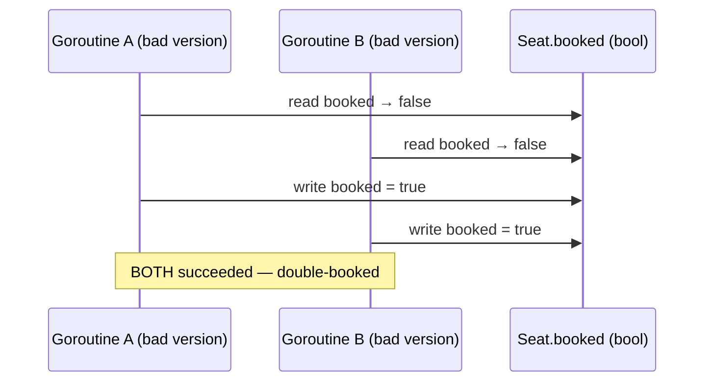
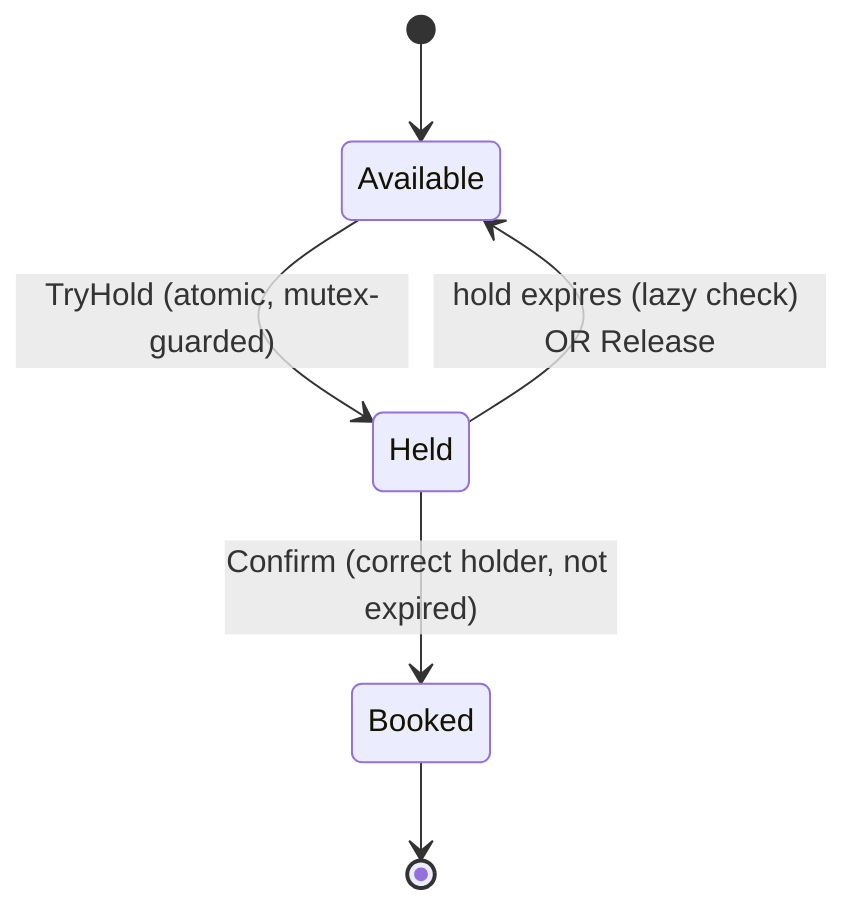

# Design BookMyShow / Seat Booking

> [!abstract] What you'll be able to do after this chapter
> Reproduce the exact race condition a naive seat-booking system has, fix it with proper atomic state transitions, and implement seat holds with expiry — including recognizing when the full State pattern is overkill and a simpler guarded enum is the *better* engineering choice.

---

## Step 1 — The interview question

> [!question] As an interviewer would ask it
> "Design a movie ticket booking system. Users browse shows, select seats, and book them. Two users must never be able to book the same seat."

## Step 2 — Requirement clarification

**Functional:** view a show's seat map. Select and hold seats during checkout. Confirm a booking (after payment). Cancel/release a held or booked seat.

**Non-functional — and the one that defines this entire problem:** **a seat can never be double-booked, under any concurrent access pattern.** Seats must be **temporarily held** during checkout (not locked forever if a user abandons the flow) — a hold-with-expiry requirement, not just a lock.

## Step 3 — The bad first draft

```go
type Seat struct {
	ID     string
	booked bool
}

func (s *Seat) BookSeat() bool {
	if !s.booked {
		// <-- another goroutine can interleave right here
		s.booked = true
		return true
	}
	return false
}
```

## Step 4 — Why it breaks: the exact race, traced

> [!bug] This is THE textbook [[Glossary/Race Condition|race condition]] — check-then-act without synchronization
> **Goroutine A** reads `s.booked` → `false`. Before A writes anything, the scheduler switches to **Goroutine B**, which *also* reads `s.booked` → still `false` (A hasn't written yet). Both goroutines now believe the seat is free. Both proceed to set `s.booked = true` and both `return true`. **The same seat just got sold twice** — a real, severe, business-costing bug, not a theoretical one.

> [!bug] There's also no concept of a temporary hold.
> A permanent lock with no expiry means a user who selects a seat and then closes their browser tab **locks that seat forever** — a real product problem on top of the concurrency bug.

## Step 5 — Refactor: atomic state transitions, hold-with-expiry, and a deliberate non-use of the State pattern

The fix for the race is straightforward: guard the check-and-transition with a mutex, as **one atomic operation** instead of two separate steps. The fix for the hold-forever problem: every hold carries an **expiry timestamp**, lazily reclaimed the next time anything touches that seat.

> [!tip] Why this ISN'T modeled with the full State pattern from earlier chapters
> `Available → Held → Booked` looks like a natural fit for the [[LLD/02 - Design a Vending Machine/Design a Vending Machine|State pattern]] used earlier — but the *actions* here don't have meaningfully different **behavior** per state, just a simple legality check ("is this transition allowed right now?"). There's no rich, state-specific logic the way `DispensingState.Dispense` differed structurally from `IdleState.Dispense`. A plain enum guarded by a mutex is simpler, equally correct, and the right call here — reaching for a full pattern when a guarded enum suffices would be over-engineering, the same judgment already exercised in [[LLD/01 - Design a Parking Lot/Design a Parking Lot|the Parking Lot chapter's]] alternatives discussion.

---

## Step 6 — Diagrams





## Step 7 — Alternative considered: this is a single-process design

> [!warning] Worth stating explicitly if the interview pushes toward "multiple app servers"
> This chapter's `sync.Mutex`-per-seat only guarantees correctness **within one process**. A real, multi-server BookMyShow deployment needs the seat-hold state to live in a **shared, distributed store** (Redis, with the check-and-hold done as one atomic Lua script — the exact same atomicity requirement and fix already covered in [[HLD/02 - Design a Rate Limiter/Design a Rate Limiter|the Rate Limiter HLD chapter]]) rather than an in-process mutex, since two different app servers can't share a Go-level `sync.Mutex` at all. Naming this boundary explicitly — "this works within one process; a distributed deployment needs a [[Glossary/Distributed Locks|distributed lock]] instead" — is a strong senior-level signal.

---

## Step 8 — Complete, compilable Go implementation

```go
// ============================================================
// FILE: seat.go
// ============================================================
package bookmyshow

import (
	"sync"
	"time"
)

type SeatStatus int

const (
	Available SeatStatus = iota
	Held
	Booked
)

type Seat struct {
	mu         sync.Mutex
	ID         string
	Status     SeatStatus
	heldBy     string
	holdExpiry time.Time
}

func NewSeat(id string) *Seat {
	return &Seat{ID: id, Status: Available}
}

// TryHold is the single atomic check-and-transition that replaces
// the bad first draft's separate check-then-act — this is the fix.
func (s *Seat) TryHold(holderID string, expiry time.Time) bool {
	s.mu.Lock()
	defer s.mu.Unlock()

	s.expireIfNeeded()

	if s.Status != Available {
		return false
	}
	s.Status = Held
	s.heldBy = holderID
	s.holdExpiry = expiry
	return true
}

// Confirm converts a hold into a permanent booking — only succeeds
// for the current holder, before expiry.
func (s *Seat) Confirm(holderID string) bool {
	s.mu.Lock()
	defer s.mu.Unlock()

	s.expireIfNeeded()

	if s.Status != Held || s.heldBy != holderID {
		return false
	}
	s.Status = Booked
	return true
}

// Release explicitly gives up a hold (e.g. user navigates away).
func (s *Seat) Release(holderID string) {
	s.mu.Lock()
	defer s.mu.Unlock()

	if s.Status == Held && s.heldBy == holderID {
		s.Status = Available
		s.heldBy = ""
	}
}

// expireIfNeeded lazily reclaims an expired hold on next access —
// no dedicated background timer goroutine per seat is required for
// correctness. An optional periodic sweep could still run for pure
// memory/bookkeeping hygiene on seats nobody touches again, but it's
// not load-bearing for correctness the way this lazy check is.
func (s *Seat) expireIfNeeded() {
	if s.Status == Held && time.Now().After(s.holdExpiry) {
		s.Status = Available
		s.heldBy = ""
	}
}
```

```go
// ============================================================
// FILE: show.go
// ============================================================
package bookmyshow

type Show struct {
	ID    string
	Seats map[string]*Seat
}

func NewShow(id string, seatIDs []string) *Show {
	seats := make(map[string]*Seat)
	for _, sid := range seatIDs {
		seats[sid] = NewSeat(sid)
	}
	return &Show{ID: id, Seats: seats}
}
```

```go
// ============================================================
// FILE: booking_service.go
// ============================================================
package bookmyshow

import (
	"errors"
	"time"
)

var (
	ErrSeatUnavailable      = errors.New("bookmyshow: seat not available")
	ErrHoldExpiredOrInvalid = errors.New("bookmyshow: hold expired or invalid")
	ErrShowNotFound         = errors.New("bookmyshow: show not found")
)

const holdDuration = 5 * time.Minute

type BookingService struct {
	shows map[string]*Show
}

func NewBookingService(shows map[string]*Show) *BookingService {
	return &BookingService{shows: shows}
}

// HoldSeats places a hold on every requested seat, all-or-nothing —
// if any seat fails, everything successfully held in THIS request
// is rolled back, so a user never ends up stuck holding a partial,
// unusable selection (e.g. wanted 4 seats together, got 2).
func (b *BookingService) HoldSeats(showID, userID string, seatIDs []string) error {
	show, ok := b.shows[showID]
	if !ok {
		return ErrShowNotFound
	}

	expiry := time.Now().Add(holdDuration)
	var held []string

	for _, seatID := range seatIDs {
		seat, ok := show.Seats[seatID]
		if !ok || !seat.TryHold(userID, expiry) {
			for _, heldID := range held {
				show.Seats[heldID].Release(userID)
			}
			return ErrSeatUnavailable
		}
		held = append(held, seatID)
	}
	return nil
}

// ConfirmBooking converts held seats into permanent bookings —
// called after successful payment.
func (b *BookingService) ConfirmBooking(showID, userID string, seatIDs []string) error {
	show, ok := b.shows[showID]
	if !ok {
		return ErrShowNotFound
	}

	for _, seatID := range seatIDs {
		seat, ok := show.Seats[seatID]
		if !ok || !seat.Confirm(userID) {
			return ErrHoldExpiredOrInvalid
		}
	}
	return nil
}
```

```go
// ============================================================
// FILE: main.go  (adjust import path to your module name)
// Demonstrates the exact race from Step 4 — now resolved.
// ============================================================
package main

import (
	"fmt"
	"sync"

	bookmyshow "example.com/bookmyshow"
)

func main() {
	show := bookmyshow.NewShow("show-1", []string{"A1", "A2", "A3"})
	service := bookmyshow.NewBookingService(map[string]*bookmyshow.Show{"show-1": show})

	var wg sync.WaitGroup
	results := make([]error, 2)

	// Two users race for the exact same seat, concurrently.
	wg.Add(2)
	go func() {
		defer wg.Done()
		results[0] = service.HoldSeats("show-1", "user-A", []string{"A1"})
	}()
	go func() {
		defer wg.Done()
		results[1] = service.HoldSeats("show-1", "user-B", []string{"A1"})
	}()
	wg.Wait()

	fmt.Println("user-A result:", results[0])
	fmt.Println("user-B result:", results[1])
	fmt.Println("Exactly one of the above is nil (success) — never both.")
}
```

---

## 🎯 Interview follow-up Q&A

> [!quote]- "Why does `TryHold` check-and-transition inside one locked section instead of a separate 'check if available' call followed by a 'mark as held' call?"
> That's precisely reintroducing the bad first draft's bug — two separate calls, even both individually mutex-protected, leave a gap between them where another goroutine's `TryHold` could interleave. The check and the transition must happen as **one atomic critical section**, which is exactly what a single locked method guarantees and two separate calls cannot.

> [!quote]- "How would this need to change for a real, multi-server deployment?"
> The in-process `sync.Mutex` per seat only works because everything runs in one Go process sharing memory. Across multiple app servers, seat state needs to live in a shared store (Redis), with the hold-check-and-set done as one atomic operation there too — the same Lua-script atomicity requirement covered in the Rate Limiter HLD chapter, applied to seat holds instead of rate-limit counters.

> [!quote]- "What happens if a user's payment fails after successfully holding seats?"
> The hold simply expires naturally after `holdDuration` if `Release` isn't called explicitly — `expireIfNeeded` reclaims it lazily the next time any operation touches that seat, making it available again without needing an explicit failure-handling code path at all.

---
*Related: [[00 - Start Here/How This Handbook Works|Book Map]] · [[LLD/01 - Design a Parking Lot/Design a Parking Lot|Design a Parking Lot]] · [[HLD/02 - Design a Rate Limiter/Design a Rate Limiter|Design a Rate Limiter (HLD)]] · [[Glossary/Race Condition|Race Condition]] · [[Glossary/Thread-Safety|Thread-Safety]]*
