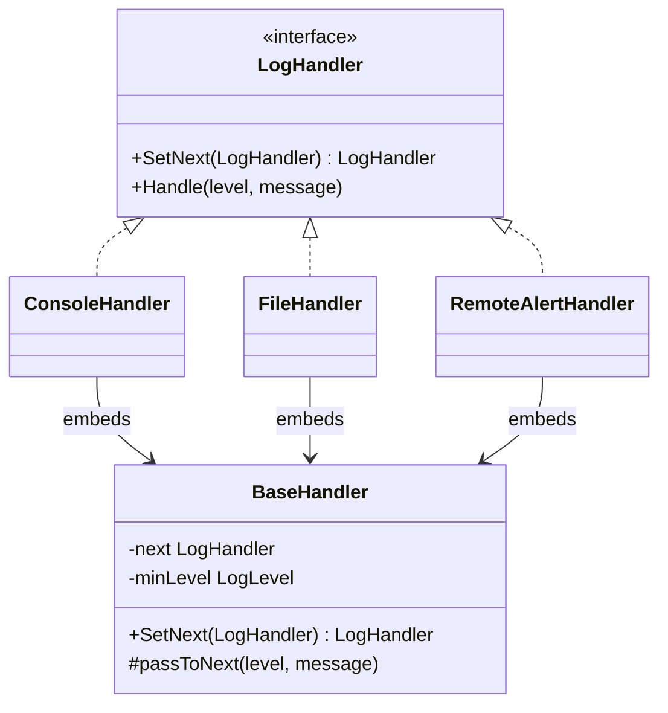
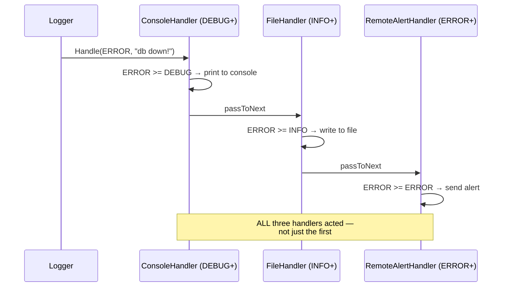

# Design a Logger Framework

> [!abstract] What you'll be able to do after this chapter
> Implement Chain of Responsibility correctly for logging specifically — including the one detail that differs from the textbook version of the pattern, which is exactly the kind of nuance interviewers probe for.

---

## Step 1 — The interview question

> [!question] As an interviewer would ask it
> "Design a logging framework supporting multiple log levels (DEBUG/INFO/WARN/ERROR) and multiple output destinations (console, file, remote alerting), where each destination only cares about messages at or above its own configured level."

## Step 2 — Requirement clarification

Different destinations need **independent** level thresholds — console might show everything from `DEBUG`, a log file might only persist `INFO`+, remote alerting should only fire on `ERROR`. Adding a new destination (a Slack alert on `ERROR`, a metrics counter increment) must not require touching existing destinations' code.

## Step 3 — The bad first draft

```go
type Logger struct {
	consoleEnabled bool
	fileEnabled    bool
	remoteEnabled  bool
	minLevel       int
}

func (l *Logger) Log(level int, message string) {
	if level < l.minLevel {
		return
	}
	if l.consoleEnabled {
		fmt.Println(message)
	}
	if l.fileEnabled {
		// write to file, inline
	}
	if l.remoteEnabled && level >= 3 { // magic number for ERROR
		// send alert, inline
	}
}
```

## Step 4 — Why it breaks

> [!bug] Every new destination means editing `Log` again.
> A Slack alert, a metrics counter — each one is another field, another `if`, another block of destination-specific logic crammed into one growing method. **Open/Closed Principle**, violated the same way every prior "bad first draft" in this book violates it.

> [!bug] There's only ONE `minLevel`, but destinations genuinely need different thresholds.
> The code fakes a per-destination threshold with a hardcoded, magic-numbered special case (`level >= 3` for remote) instead of a real, consistent per-handler policy — a modeling smell, not just an extensibility problem.

## Step 5 — Refactor: Chain of Responsibility — with one deliberate deviation from the textbook version

> [!warning] The nuance that matters here
> The textbook description of Chain of Responsibility often says the **first** handler in the chain that can process a request handles it, and the chain stops. **That's wrong for logging.** An `ERROR` message should hit console **and** file **and** remote alerting **simultaneously** — not just whichever handler happens to sit first in the chain. Here, the chain is used purely for **composing and ordering** a sequence of independent handlers, each deciding for itself whether it cares, and **always** passing along to the next regardless of whether it acted. Naming this deviation explicitly — rather than applying the pattern by rote — is exactly the kind of judgment interviewers are checking for.

---

## Step 6 — UML & sequence diagrams





## Step 7 — SOLID, applied

| Principle | Where it's satisfied |
|---|---|
| **S**RP | Each handler owns exactly one destination's logic. |
| **O**CP | A new destination = a new struct implementing `LogHandler`, spliced into the chain — zero changes to `Logger` or existing handlers. |
| **D**IP | `Logger` depends on the `LogHandler` interface, knowing nothing about which concrete destinations exist. |

## Step 8 — Alternative considered

> [!tip] "Why not just a list of handlers Logger iterates directly, instead of a linked chain?"
> Genuinely simpler if handler *ordering* never matters and there's no need to build/reconfigure the pipeline dynamically. Chain of Responsibility earns its keep when handlers need to be **composed and reordered independently** of the code that triggers them — e.g. building different chains for different environments (dev: console only; production: file + remote alert, no console) without `Logger` itself knowing or caring how many handlers exist.

---

## Step 9 — Complete, compilable Go implementation

```go
// ============================================================
// FILE: level.go
// ============================================================
package logger

type LogLevel int

const (
	DEBUG LogLevel = iota
	INFO
	WARN
	ERROR
)

func (l LogLevel) String() string {
	switch l {
	case DEBUG:
		return "DEBUG"
	case INFO:
		return "INFO"
	case WARN:
		return "WARN"
	case ERROR:
		return "ERROR"
	default:
		return "UNKNOWN"
	}
}
```

```go
// ============================================================
// FILE: handler.go
// ============================================================
package logger

// LogHandler is the Chain of Responsibility link. See Step 5 for why
// EVERY eligible handler processes a message here, unlike the
// textbook "first handler wins" version of this pattern.
type LogHandler interface {
	SetNext(handler LogHandler) LogHandler
	Handle(level LogLevel, message string)
}

// BaseHandler factors out the shared "hold the next link, expose a
// way to pass along" skeleton every concrete handler needs.
type BaseHandler struct {
	next     LogHandler
	minLevel LogLevel
}

func (b *BaseHandler) SetNext(handler LogHandler) LogHandler {
	b.next = handler
	return handler
}

func (b *BaseHandler) passToNext(level LogLevel, message string) {
	if b.next != nil {
		b.next.Handle(level, message)
	}
}
```

```go
// ============================================================
// FILE: console_handler.go
// ============================================================
package logger

import "fmt"

type ConsoleHandler struct {
	BaseHandler
}

func NewConsoleHandler(minLevel LogLevel) *ConsoleHandler {
	return &ConsoleHandler{BaseHandler: BaseHandler{minLevel: minLevel}}
}

func (c *ConsoleHandler) Handle(level LogLevel, message string) {
	if level >= c.minLevel {
		fmt.Printf("[%s] %s\n", level, message)
	}
	c.passToNext(level, message)
}
```

```go
// ============================================================
// FILE: file_handler.go
// ============================================================
package logger

import (
	"fmt"
	"os"
)

type FileHandler struct {
	BaseHandler
	file *os.File
}

func NewFileHandler(minLevel LogLevel, file *os.File) *FileHandler {
	return &FileHandler{BaseHandler: BaseHandler{minLevel: minLevel}, file: file}
}

func (f *FileHandler) Handle(level LogLevel, message string) {
	if level >= f.minLevel {
		fmt.Fprintf(f.file, "[%s] %s\n", level, message)
	}
	f.passToNext(level, message)
}
```

```go
// ============================================================
// FILE: remote_alert_handler.go
// ============================================================
package logger

import "fmt"

// AlertSender abstracts away WHERE alerts actually go (Slack,
// PagerDuty, etc.) — same Dependency Inversion move as
// PricingStrategy in the Parking Lot chapter, applied here to an
// outbound side effect instead of a calculation.
type AlertSender interface {
	SendAlert(message string) error
}

type RemoteAlertHandler struct {
	BaseHandler
	sender AlertSender
}

func NewRemoteAlertHandler(minLevel LogLevel, sender AlertSender) *RemoteAlertHandler {
	return &RemoteAlertHandler{BaseHandler: BaseHandler{minLevel: minLevel}, sender: sender}
}

func (r *RemoteAlertHandler) Handle(level LogLevel, message string) {
	if level >= r.minLevel {
		if err := r.sender.SendAlert(message); err != nil {
			fmt.Printf("failed to send alert: %v\n", err)
		}
	}
	r.passToNext(level, message)
}
```

```go
// ============================================================
// FILE: console_alert_sender.go
// (a simple demo implementation of AlertSender)
// ============================================================
package logger

import "fmt"

type ConsoleAlertSender struct{}

func (c *ConsoleAlertSender) SendAlert(message string) error {
	fmt.Printf("🚨 ALERT: %s\n", message)
	return nil
}
```

```go
// ============================================================
// FILE: logger.go
// ============================================================
package logger

// Logger is the entry point client code calls. It owns the head of
// the chain and knows nothing about which handlers exist downstream.
type Logger struct {
	head LogHandler
}

func NewLogger(head LogHandler) *Logger {
	return &Logger{head: head}
}

func (l *Logger) Log(level LogLevel, message string) {
	if l.head != nil {
		l.head.Handle(level, message)
	}
}
```

```go
// ============================================================
// FILE: main.go  (adjust import path to your module name)
// ============================================================
package main

import (
	"os"

	logger "example.com/logger"
)

func main() {
	file, err := os.OpenFile("app.log", os.O_APPEND|os.O_CREATE|os.O_WRONLY, 0644)
	if err != nil {
		panic(err)
	}
	defer file.Close()

	console := logger.NewConsoleHandler(logger.DEBUG)
	fileHandler := logger.NewFileHandler(logger.INFO, file)
	alertHandler := logger.NewRemoteAlertHandler(logger.ERROR, &logger.ConsoleAlertSender{})

	console.SetNext(fileHandler)
	fileHandler.SetNext(alertHandler)

	log := logger.NewLogger(console)

	log.Log(logger.DEBUG, "starting up")     // console only
	log.Log(logger.INFO, "server listening") // console + file
	log.Log(logger.ERROR, "database down!")  // console + file + alert
}
```

---

## 🎯 Interview follow-up Q&A

> [!quote]- "How would you add a metrics counter that increments on every ERROR, without touching existing handlers?"
> One new struct, `MetricsHandler`, implementing `LogHandler` — checks `level >= ERROR`, increments a counter if so, then calls `passToNext` exactly like every other handler. Spliced into the chain with one `SetNext` call. Nothing else in the codebase changes.

> [!quote]- "Why does every handler call `passToNext` even when it didn't act on the message?"
> Because the chain's job here is pure **composition and ordering**, not exclusive handling — every handler needs the opportunity to independently decide whether it cares, and the only way later handlers in the chain get that opportunity is if earlier ones always forward, regardless of whether they personally acted.

> [!quote]- "What if you wanted DIFFERENT chains for different environments — say, no remote alerting in a local dev environment?"
> Build a different chain at startup based on environment config — e.g. `console.SetNext(fileHandler)` only, skipping `alertHandler` entirely in dev. `Logger` itself needs zero changes; it just receives whatever `head` handler it's constructed with, oblivious to how long or short the chain behind it actually is.

---
*Related: [[00 - Start Here/How This Handbook Works|Book Map]] · [[LLD/01 - Design a Parking Lot/Design a Parking Lot|Design a Parking Lot]]*
