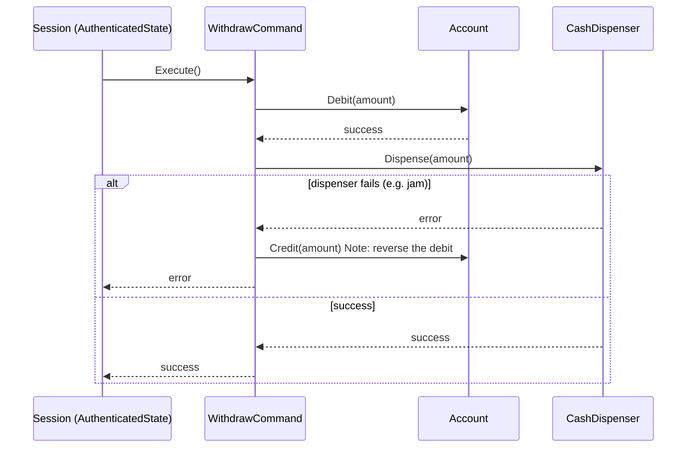

# Design an ATM

> [!abstract] What you'll be able to do after this chapter
> Combine State (session lifecycle) with Command (banking operations), and understand precisely why Command's `Undo()` is the *real-world* mechanism ATMs need for reversing a debit when cash dispensing fails after the account was already charged.

---

## Step 1 — The interview question

> [!question] As an interviewer would ask it
> "Design an ATM — a user inserts a card, enters a PIN, selects an operation (withdraw/deposit/check balance), and the machine completes the transaction."

## Step 2 — Requirement clarification

**Functional:** card insertion, PIN authentication (limited attempts), withdraw/deposit/balance-inquiry, cash dispensing.

**Non-functional — the one that defines this problem:** transactions must be **atomic between account state and physical cash state** — never dispense cash without debiting the account, and critically, never leave the account debited if cash dispensing then fails. Support cancel/undo before a transaction fully commits.

## Step 3 — The bad first draft (kept brief)

A single `ATM` struct with string/boolean flags for session state, and one monolithic `ProcessTransaction` method branching on an operation string, directly mutating account balance and dispenser state together inline — same Open/Closed and correctness-risk shape as every prior chapter, now compounded by having **no undo capability at all** if something fails partway through.

## Step 4 — Refactor: State for the session, Command for the operations

**State** governs the session lifecycle — `NoCardState → AwaitingPINState → AuthenticatedState` — the exact same skeleton already established in [[LLD/02 - Design a Vending Machine/Design a Vending Machine|the Vending Machine]] and [[LLD/03 - Design an Elevator System/Design an Elevator System|Elevator]] chapters, kept brief here since the pattern itself isn't new.

**Command** is the genuinely new idea this chapter introduces: each banking operation (`Withdraw`, `Deposit`) becomes its own object with `Execute()` **and** `Undo()`.

> [!tip] Why `Undo()` matters here specifically — not just pattern-completeness
> If cash dispensing hardware fails **after** the account was already debited, the system needs to reverse that debit. A plain function call gives you no natural hook for this; a `Command` object that tracked "did I actually apply my effect" **does** — `Undo()` is the direct, real-world mechanism for exactly this failure mode, not decorative pattern completeness.

---

## Step 5 — UML & sequence diagrams



## Step 6 — SOLID, applied

| Principle | Where it's satisfied |
|---|---|
| **S**RP | `Account` owns balance; `CashDispenser` owns physical inventory; each `Command` owns exactly one operation's logic + its own reversal. |
| **O**CP | A new operation (e.g. `TransferCommand`) = a new struct implementing `Command`, zero changes to `Session`. |
| **D**IP | `Session.ExecuteCommand` depends on the `Command` interface, never a concrete operation. |

---

## Step 7 — Complete, compilable Go implementation

```go
// ============================================================
// FILE: account.go
// ============================================================
package atm

import (
	"errors"
	"sync"
)

var ErrInsufficientFunds = errors.New("atm: insufficient funds")

type Account struct {
	mu      sync.Mutex
	ID      string
	Balance int64 // cents
}

func NewAccount(id string, initialBalance int64) *Account {
	return &Account{ID: id, Balance: initialBalance}
}

func (a *Account) Debit(amount int64) error {
	a.mu.Lock()
	defer a.mu.Unlock()
	if a.Balance < amount {
		return ErrInsufficientFunds
	}
	a.Balance -= amount
	return nil
}

func (a *Account) Credit(amount int64) {
	a.mu.Lock()
	defer a.mu.Unlock()
	a.Balance += amount
}

func (a *Account) GetBalance() int64 {
	a.mu.Lock()
	defer a.mu.Unlock()
	return a.Balance
}
```

```go
// ============================================================
// FILE: cash_dispenser.go
// ============================================================
package atm

import "errors"

var ErrInsufficientCash = errors.New("atm: dispenser has insufficient cash")

// CashDispenser tracks physical bill inventory as a single running
// total for this chapter. A real ATM also needs to solve "which
// specific denominations to dispense" — a bounded-coin-change
// problem — deliberately out of scope here.
type CashDispenser struct {
	availableCash int64
}

func NewCashDispenser(initialCash int64) *CashDispenser {
	return &CashDispenser{availableCash: initialCash}
}

func (d *CashDispenser) Dispense(amount int64) error {
	if d.availableCash < amount {
		return ErrInsufficientCash
	}
	d.availableCash -= amount
	return nil
}

func (d *CashDispenser) Refill(amount int64) {
	d.availableCash += amount
}
```

```go
// ============================================================
// FILE: command.go
// ============================================================
package atm

// Command replaced the bad first draft's if/else-on-operation-string
// chain. Each operation knows how to Execute AND Undo itself.
type Command interface {
	Execute() error
	Undo() error
}

// WithdrawCommand debits the account, then dispenses cash. If
// dispensing fails AFTER the debit succeeded, Undo (called
// automatically inline here, or later via Session.UndoLast)
// reverses the debit — see Step 4 for why this matters.
type WithdrawCommand struct {
	account   *Account
	dispenser *CashDispenser
	amount    int64
	debited   bool
}

func NewWithdrawCommand(account *Account, dispenser *CashDispenser, amount int64) *WithdrawCommand {
	return &WithdrawCommand{account: account, dispenser: dispenser, amount: amount}
}

func (c *WithdrawCommand) Execute() error {
	if err := c.account.Debit(c.amount); err != nil {
		return err
	}
	c.debited = true

	if err := c.dispenser.Dispense(c.amount); err != nil {
		// Dispensing failed after the debit succeeded — reverse it
		// immediately rather than leaving the account short with no
		// cash actually dispensed.
		c.account.Credit(c.amount)
		c.debited = false
		return err
	}
	return nil
}

func (c *WithdrawCommand) Undo() error {
	if c.debited {
		c.account.Credit(c.amount)
		c.dispenser.Refill(c.amount)
		c.debited = false
	}
	return nil
}

// DepositCommand credits the account.
type DepositCommand struct {
	account *Account
	amount  int64
	applied bool
}

func NewDepositCommand(account *Account, amount int64) *DepositCommand {
	return &DepositCommand{account: account, amount: amount}
}

func (c *DepositCommand) Execute() error {
	c.account.Credit(c.amount)
	c.applied = true
	return nil
}

func (c *DepositCommand) Undo() error {
	if c.applied {
		return c.account.Debit(c.amount)
	}
	return nil
}
```

```go
// ============================================================
// FILE: session_state.go
// ============================================================
package atm

type SessionState interface {
	InsertCard(s *Session, cardID string)
	EnterPIN(s *Session, pin string)
	ExecuteCommand(s *Session, cmd Command) error
	EjectCard(s *Session)
}

type NoCardState struct{}

func (st *NoCardState) InsertCard(s *Session, cardID string) {
	s.cardID = cardID
	s.setState(&AwaitingPINState{})
}
func (st *NoCardState) EnterPIN(s *Session, pin string)              {}
func (st *NoCardState) ExecuteCommand(s *Session, cmd Command) error { return ErrNoCard }
func (st *NoCardState) EjectCard(s *Session)                         {}

type AwaitingPINState struct{}

func (st *AwaitingPINState) InsertCard(s *Session, cardID string) {}
func (st *AwaitingPINState) EnterPIN(s *Session, pin string) {
	if s.verifyPIN(pin) {
		s.setState(&AuthenticatedState{})
	} else {
		s.pinAttempts++
		if s.pinAttempts >= maxPINAttempts {
			s.setState(&NoCardState{})
		}
	}
}
func (st *AwaitingPINState) ExecuteCommand(s *Session, cmd Command) error {
	return ErrNotAuthenticated
}
func (st *AwaitingPINState) EjectCard(s *Session) { s.setState(&NoCardState{}) }

type AuthenticatedState struct{}

func (st *AuthenticatedState) InsertCard(s *Session, cardID string) {}
func (st *AuthenticatedState) EnterPIN(s *Session, pin string)      {}
func (st *AuthenticatedState) ExecuteCommand(s *Session, cmd Command) error {
	err := cmd.Execute()
	s.commandHistory = append(s.commandHistory, cmd)
	return err
}
func (st *AuthenticatedState) EjectCard(s *Session) { s.setState(&NoCardState{}) }
```

```go
// ============================================================
// FILE: session.go
// ============================================================
package atm

import "errors"

var (
	ErrNoCard           = errors.New("atm: no card inserted")
	ErrNotAuthenticated = errors.New("atm: not authenticated")
)

const maxPINAttempts = 3

type Session struct {
	cardID         string
	correctPIN     string
	pinAttempts    int
	currentState   SessionState
	commandHistory []Command
}

func NewSession(correctPIN string) *Session {
	return &Session{correctPIN: correctPIN, currentState: &NoCardState{}}
}

func (s *Session) setState(state SessionState) { s.currentState = state }
func (s *Session) verifyPIN(pin string) bool    { return pin == s.correctPIN }

func (s *Session) InsertCard(cardID string)         { s.currentState.InsertCard(s, cardID) }
func (s *Session) EnterPIN(pin string)               { s.currentState.EnterPIN(s, pin) }
func (s *Session) ExecuteCommand(cmd Command) error  { return s.currentState.ExecuteCommand(s, cmd) }
func (s *Session) EjectCard()                        { s.currentState.EjectCard(s) }

// UndoLast reverses the most recently executed command — e.g. a
// technician manually rolling back after a hardware failure.
func (s *Session) UndoLast() error {
	if len(s.commandHistory) == 0 {
		return nil
	}
	last := s.commandHistory[len(s.commandHistory)-1]
	s.commandHistory = s.commandHistory[:len(s.commandHistory)-1]
	return last.Undo()
}
```

```go
// ============================================================
// FILE: main.go  (adjust import path to your module name)
// ============================================================
package main

import (
	"fmt"

	atm "example.com/atm"
)

func main() {
	account := atm.NewAccount("acc-1", 10000)      // $100.00
	dispenser := atm.NewCashDispenser(500000)       // $5000.00 in the machine

	session := atm.NewSession("1234")
	session.InsertCard("card-1")
	session.EnterPIN("1234")

	withdraw := atm.NewWithdrawCommand(account, dispenser, 5000) // $50.00
	if err := session.ExecuteCommand(withdraw); err != nil {
		fmt.Println("withdrawal failed:", err)
	} else {
		fmt.Println("withdrawal succeeded, new balance:", account.GetBalance())
	}

	session.EjectCard()
}
```

---

## 🎯 Interview follow-up Q&A

> [!quote]- "What happens if cash dispensing fails after the account has already been debited?"
> `WithdrawCommand.Execute` explicitly checks for this — if `Dispense` returns an error after `Debit` already succeeded, it immediately calls `Credit` to reverse the debit before returning the error, so the account is never left short with no cash actually delivered.

> [!quote]- "Why track `commandHistory` on the `Session` at all?"
> It's what makes `UndoLast` possible — a real operational need (a technician manually reversing the most recent transaction after a hardware fault) requires knowing what the most recent command *was*, not just that something happened.

> [!quote]- "How would you add a transfer-between-accounts operation?"
> A new `TransferCommand` implementing `Command` — `Execute` debits the source account and credits the destination; `Undo` reverses both in the opposite order. Zero changes to `Session` or any existing command.

---
*Related: [[00 - Start Here/How This Handbook Works|Book Map]] · [[LLD/02 - Design a Vending Machine/Design a Vending Machine|Design a Vending Machine]] · [[LLD/06 - Design BookMyShow - Seat Booking/Design BookMyShow - Seat Booking|Design BookMyShow / Seat Booking]]*
