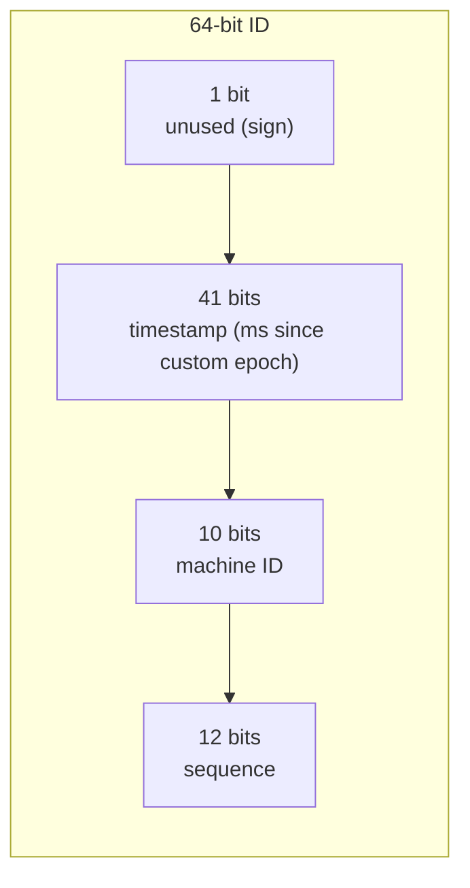

# Design a Distributed ID Generator (Snowflake-style)

> [!abstract] What you'll be able to do after this chapter
> Implement the actual Twitter Snowflake bit-layout — not just describe it — closing the loop on the ID-generation problem [[HLD/01 - Design TinyURL (URL Shortener)/Design TinyURL|the TinyURL chapter]] named but only partially solved.

---

## Step 1 — The interview question

> [!question] As an interviewer would ask it
> "Design a distributed unique ID generator producing roughly time-ordered, globally unique 64-bit IDs across many machines, with no coordination needed per ID."

## Step 2 — Requirement clarification

No central coordination per ID generated. IDs roughly sortable by generation time. Many machines generating concurrently, IDs still guaranteed globally unique.

> [!example]+ 🪜 How to build this live, step by step (interview execution order, with code)
> **Checkpoint 1 (~3-5 min) — name the naive approach, don't implement it.**
> ```go
> // A shared counter (Redis INCR / DB sequence) — mention this,
> // don't build it. It works, but costs a network round-trip PER ID.
> ```
> **Pattern used: none.** This checkpoint is verbal — state the naive approach and its cost quickly, then move straight to the real design. Building the bad version isn't worth the time here the way it was in other chapters, since the fix is a completely different mechanism, not a refactor of this one.
>
> **Checkpoint 2 (~10 min) — the bit layout + happy-path `NextID`, no wraparound handling yet.**
> ```go
> const (
>     timestampBits = 41
>     machineIDBits = 10
>     sequenceBits  = 12
>     machineIDShift = sequenceBits
>     timestampShift = sequenceBits + machineIDBits
> )
>
> func (g *SnowflakeGenerator) NextID() int64 {
>     now := time.Now().UnixMilli() - customEpoch
>     return (now << timestampShift) | (g.machineID << machineIDShift) | g.sequence
> }
> ```
> **Pattern used: none — this is a bit-packing scheme, not a GoF pattern.** Get the shift/mask arithmetic correct and demo a couple of IDs decoding sensibly before touching concurrency at all.
>
> **Checkpoint 3 (~10 min) — same-millisecond sequence handling. This is the actual correctness-critical part.**
> ```go
> if now == g.lastTimestamp {
>     g.sequence = (g.sequence + 1) & maxSequence
>     if g.sequence == 0 {
>         for now <= g.lastTimestamp { // sequence exhausted — spin to next ms
>             now = time.Now().UnixMilli() - customEpoch
>         }
>     }
> } else {
>     g.sequence = 0
> }
> g.lastTimestamp = now
> ```
> Trace it out loud: two calls in the same millisecond get different sequence numbers; a call in a new millisecond resets to 0. This is what actually guarantees no two IDs from one machine collide.
>
> **Checkpoint 4 (remaining time, or if asked) — the clock-regression edge case, verbally.** A real, known Snowflake weakness (Step 8's Q&A) — if the system clock moves backward (NTP adjustment), this implementation doesn't detect it. Naming this unprompted, rather than waiting to be caught, is a strong signal.
>
> **If you're short on time:** stop after Checkpoint 2 with the mutex added. A correct bit-packing scheme without full sequence-wraparound handling still demonstrates the entire mechanism — describe the same-millisecond collision case verbally as the remaining correctness gap.

## Step 3 — The bad first draft, and why TinyURL's fix was only partial

A single shared counter (Redis `INCR` or a DB sequence) works, but requires a network round-trip **per ID generated** — the exact bottleneck [[HLD/01 - Design TinyURL (URL Shortener)/Design TinyURL|the TinyURL chapter]] named and partially mitigated via **range allocation** (handing each server a pre-fetched block of IDs). Range allocation reduces round-trips but doesn't eliminate the shared-counter dependency entirely — this chapter builds the fully-local alternative that dependency was pointing toward.

## Step 4 — Refactor: the Snowflake bit layout

A 64-bit ID composed of: 1 unused sign bit + **41 bits timestamp** (milliseconds since a custom epoch, ~69 years of range) + **10 bits machine ID** (up to 1,024 distinct machines) + **12 bits sequence number** (up to 4,096 IDs per machine per millisecond).

> [!tip] Every ID is generated ENTIRELY locally — no network call, ever
> The machine-ID segment makes collisions between *different* machines structurally impossible — two machines can never produce the same ID, since their machine-ID bits differ. The sequence number handles multiple IDs generated on the *same* machine within the *same* millisecond. No coordination, no shared state, no network round-trip per ID — a genuinely different approach from both the naive counter and TinyURL's range-allocation mitigation.



---

## Step 5 — Complete, compilable Go implementation

```go
// ============================================================
// FILE: snowflake.go
// ============================================================
package idgen

import (
	"errors"
	"sync"
	"time"
)

const (
	timestampBits = 41
	machineIDBits = 10
	sequenceBits  = 12

	maxMachineID = -1 ^ (-1 << machineIDBits) // 1023
	maxSequence  = -1 ^ (-1 << sequenceBits)  // 4095

	machineIDShift = sequenceBits
	timestampShift = sequenceBits + machineIDBits
)

// customEpoch is an arbitrary reference point (not Unix epoch) that
// maximizes the useful range of the 41-bit timestamp field, since
// dates before this system existed never need representing.
var customEpoch = time.Date(2024, 1, 1, 0, 0, 0, 0, time.UTC).UnixMilli()

var ErrInvalidMachineID = errors.New("idgen: machine ID out of range")

// SnowflakeGenerator produces IDs entirely locally — no network
// round-trip per ID, unlike a shared counter — while still
// guaranteeing global uniqueness via the embedded machine ID.
type SnowflakeGenerator struct {
	mu            sync.Mutex
	machineID     int64
	lastTimestamp int64
	sequence      int64
}

func NewSnowflakeGenerator(machineID int64) (*SnowflakeGenerator, error) {
	if machineID < 0 || machineID > maxMachineID {
		return nil, ErrInvalidMachineID
	}
	return &SnowflakeGenerator{machineID: machineID, lastTimestamp: -1}, nil
}

// NextID generates one ID. Only concurrent calls on THIS SAME
// generator instance serialize against each other — a call on a
// different machine's generator never contends with this one at all,
// since there's no shared state between machines to begin with.
func (g *SnowflakeGenerator) NextID() int64 {
	g.mu.Lock()
	defer g.mu.Unlock()

	now := time.Now().UnixMilli() - customEpoch

	if now == g.lastTimestamp {
		// Same millisecond as the last ID — increment the sequence,
		// wrapping and waiting for the next millisecond if exhausted.
		g.sequence = (g.sequence + 1) & maxSequence
		if g.sequence == 0 {
			for now <= g.lastTimestamp {
				now = time.Now().UnixMilli() - customEpoch
			}
		}
	} else {
		g.sequence = 0
	}

	g.lastTimestamp = now

	return (now << timestampShift) | (g.machineID << machineIDShift) | g.sequence
}
```

```go
// ============================================================
// FILE: main.go  (adjust import path to your module name)
// ============================================================
package main

import (
	"fmt"

	idgen "example.com/idgen"
)

func main() {
	gen, err := idgen.NewSnowflakeGenerator(5) // this machine is worker #5
	if err != nil {
		panic(err)
	}

	for i := 0; i < 5; i++ {
		fmt.Println(gen.NextID())
	}
}
```

---

## 🎯 Interview follow-up Q&A

> [!quote]- "What happens if the same machine generates more than 4,096 IDs within one millisecond?"
> The sequence counter wraps to 0, and `NextID` busy-waits (spinning `time.Now()` calls) until the clock actually advances to the next millisecond — guaranteeing no two IDs from this machine ever share both the same timestamp and sequence value, at the cost of a brief spin under extreme burst load.

> [!quote]- "What happens if the system clock moves backward (NTP adjustment, VM migration)?"
> This is a genuine, known Snowflake weakness — if `now` is ever less than `lastTimestamp`, the current implementation doesn't detect it, which could theoretically produce a duplicate or out-of-order ID. A production-hardened version would explicitly check for clock regression and either refuse to generate IDs until the clock catches up, or maintain a small buffer of "borrowed" future time — worth naming as a real edge case this simplified version doesn't handle, rather than claiming false completeness.

> [!quote]- "Why 41 bits for timestamp specifically, not more or fewer?"
> It's a deliberate three-way tradeoff against machine-ID bits and sequence bits, all sharing a fixed 63-bit budget — 41 bits gives ~69 years of range (more than enough for any realistic system lifetime), while leaving enough remaining bits to support a meaningful number of machines (1,024) and a meaningful per-machine-per-millisecond throughput (4,096) simultaneously.

---
*Related: [[00 - Start Here/How This Handbook Works|Book Map]] · [[HLD/01 - Design TinyURL (URL Shortener)/Design TinyURL|Design TinyURL]]*
